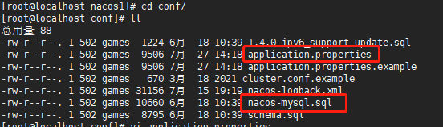

#  部署文档

## 安装Java

​	[下载链接](http://www.oracle.com/technetwork/java/javase/downloads/jdk8-downloads-2133151.html)

 

1. 上传到linux上，解压压缩包

   ```
   tar -zxvf jdk-8u301-linux-x64.tar.gz -C /usr/local/java/
   ```

2. 设置环境变量

   ```
   1. 打开文件： vi /etc/profile
   2. 在末尾加上： 
       export JAVA_HOME=/usr/local/java/jdk1.8.0_301
       export JRE_HOME=${JAVA_HOME}/jre
       export CLASSPATH=.:${JAVA_HOME}/lib:${JRE_HOME}/lib
       export PATH=${JAVA_HOME}/bin:$PATH
   3. 刷新环境变量：source /etc/profile
   4. 添加软链接： ln -s /usr/local/java/jdk1.8.0_301/bin/java /usr/bin/java
   ```

3. 查看是否安装好：`java -version`

    

   

## 安装Mysql

1. 执行命令

   ```
   wget http://dev.mysql.com/get/mysql80-community-release-el7-3.noarch.rpm
   rpm -ivh mysql80-community-release-el7-3.noarch.rpm
   yum install mysql-community-server
   （安装错误可以执行如下语句：rpm --import https://repo.mysql.com/RPM-GPG-KEY-mysql-2022）
   ```

2. 重启Mysql并且设置密码

   ```
   systemctl restart mysqld
   // 查看默认密码
   grep 'temporary password' /var/log/mysqld.log
   mysql -u root -p登录
   // 先修改密码为
   mysql> ALTER USER 'root'@'localhost' IDENTIFIED BY 'Aa1459608577/';
   // 查看密码验证规则
   mysql> SHOW VARIABLES LIKE 'validate_password%';
   // 修改密码校验规则为LOW，修改密码校验长度为4
   mysql> set global validate_password.policy=LOW;
   mysql> set global validate_password.length=4; 
   mysql> ALTER USER 'root'@'localhost' IDENTIFIED BY '1234';
   ```

3.  

4. 配置Mysql

   ```
   配置编码：mysql的配置文件在/etc/my.cnf，修改配置文件，在最后加入
   
   [mysql]
   default-character-set =utf8
   ```

5. 远程连接设置

   ```
   // 修改加密规则
   ALTER USER 'root'@'localhost' IDENTIFIED BY '1234' PASSWORD EXPIRE NEVER;
   ALTER USER 'root'@'localhost' IDENTIFIED WITH mysql_native_password BY '1234';
   // 设置新密码
   ALTER USER 'root'@'%' IDENTIFIED WITH mysql_native_password BY '1234';
   // 修改权限
   use mysql;
   // 查看user表的root用户Host字段是localhost，说明root用户只能本地登录
   select host, user, authentication_string, plugin from user;
   update user set host='%' where user='root';
   // 刷新权限即可
   FLUSH PRIVILEGES;
   ```


## 安装Redis

1. 首先查看gcc是否安装, 没有安装则执行：`yum -y install gcc`

   

2. 下载并解压安装包

   ```
   wget http://download.redis.io/releases/redis-5.0.3.tar.gz
   tar -zxvf redis-5.0.3.tar.gz -C /usr/local/redis
   ```

3. 切换到解压目录执行编译

   ```
   cd redis-5.0.3/
   make
   make install PREFIX=/usr/local/redis
   ```

4. 启动

   ```
   cd /usr/local/redis/bin
   ```

   * 前台启动：./redis-server
   * 后台启动需要修改配置文件，no修改成yes。然后指定配置文件启动`./redis-server ../redis-5.0.3/redis.conf`
     *  

5. 设置远程访问

   * 修改配置文件，把bind注释掉

      

6. 设置密码

    

## 安装Minio

1. 下载安装包(本地有下载，路径：F:\tool)

   ```
   wget https://dl.min.io/server/minio/release/linux-amd64/minio(慢)
   ```

2. 创建存储数据目录并赋予权限

   ```
   cd /usr/local/minio
   mkdir data
   chmod +x minio
   ```

3. 防火墙开放端口

   ```
   firewall-cmd --zone=public --add-port=9000/tcp --permanent
   firewall-cmd --zone=public --add-port=9999/tcp --permanent(开放静态ip)
   systemctl restart firewalld
   ```

4. 启动服务

   ```
   前台启动： ./minio server --console-address '0.0.0.0:9999' ./data/
   后台服务启动： ./nohup  minio server --console-address '0.0.0.0:9999' ./data/  &
   自定义端口启动：./nohup  minio server --console-address '0.0.0.0:9999' 节点ip:指定端口 ./data/  &
   ```

5. 然后根据启动提示访问即可

6. 设置永久访问链接

   * 下载客户端并赋予权限

     ```
     wget https://dl.minio.io/client/mc/release/linux-amd64/mc(下载很慢，可以在windows上下载好再上传)
     chmod 777 mc
     ```

   * 添加server

     ```
     ./mc config host add minio http://192.168.2.3 minioadmin minioadmin --api s3v4
     ```

   * 设置需要开放下载的bucket, 注意需要带minio

     ```
     ./mc  policy set download  minio/test(test是桶的名字)
     ```

   * 发大水

   

7. 阿斯蒂芬

8. 发送到

9. 

## 安装Nginx

1. 首先查看gcc是否安装, 没有安装则执行：`yum -y install gcc`

    

2. 安装插件：pcre，pcre-devel，zlib，openssl

   ```
   yum install -y pcre pcre-devel openssl openssl-devel gd gd-deve zlib zlib-devel
   ```

3. 下载Nginx并解压编译

   ```
   wget http://nginx.org/download/nginx-1.18.0.tar.gz
   tar -zxvf  nginx-1.18.0.tar.gz -C /usr/local/nginx
   
   cd /usr/local/nginx/nginx-1.18.0/
   ./configure
   make && make install
   ```

4. 启动Nginx

   ```
   cd /usr/local/nginx/sbin
   ./nginx -c /usr/local/nginx/conf/nginx.conf
   ```

5. 配置文件

   ```nginx
   61.144.34.226#user  nobody;
   worker_processes  1; #工作进程：数目。根据硬件调整，通常等于cpu数量或者2倍cpu数量。
    
   #错误日志存放路径
   #error_log  logs/error.log;
   #error_log  logs/error.log  notice;
   #error_log  logs/error.log  info;
    
   #pid        logs/nginx.pid; # nginx进程pid存放路径
    
    
   events {
       worker_connections  1024; # 工作进程的最大连接数量
   }
    
    
   http {
       include       mime.types; #指定mime类型，由mime.type来定义
       default_type  application/octet-stream;
    
       # 日志格式设置
       #log_format  main  '$remote_addr - $remote_user [$time_local] "$request" '
       #                  '$status $body_bytes_sent "$http_referer" '
       #                  '"$http_user_agent" "$http_x_forwarded_for"';
    
       #access_log  logs/access.log  main; #用log_format指令设置日志格式后，需要用access_log来指定日志文件存放路径
             
       sendfile        on; #指定nginx是否调用sendfile函数来输出文件，对于普通应用，必须设置on。
         如果用来进行下载等应用磁盘io重负载应用，可设着off，以平衡磁盘与网络io处理速度，降低系统uptime。
       #tcp_nopush     on; #此选项允许或禁止使用socket的TCP_CORK的选项，此选项仅在sendfile的时候使用
    
       #keepalive_timeout  0;  #keepalive超时时间
       #keepalive_timeout  65;
    
       #gzip  on; #开启gzip压缩服务
    
       #虚拟主机
       server {
           listen       80;  #配置监听端口号
           server_name  localhost; #配置访问域名，域名可以有多个，用空格隔开
    
           #charset koi8-r; #字符集设置
    
           #access_log  logs/host.access.log  main;
    
           location / {
               root   html;
               index  index.html index.htm;
           }
           #错误跳转页
           #error_page  404              /404.html; 
    
           # redirect server error pages to the static page /50x.html
           #
           error_page   500 502 503 504  /50x.html;
           location = /50x.html {
               root   html;
           }
    
           # proxy the PHP scripts to Apache listening on 127.0.0.1:80
           #
           #location ~ \.php$ {
           #    proxy_pass   http://127.0.0.1;
           #}
    
           # pass the PHP scripts to FastCGI server listening on 127.0.0.1:9000
           #
           #location ~ \.php$ { #请求的url过滤，正则匹配，~为区分大小写，~*为不区分大小写。
           #    root           html; #根目录
           #    fastcgi_pass   127.0.0.1:9000; #请求转向定义的服务器列表
           #    fastcgi_index  index.php; # 如果请求的Fastcgi_index URI是以 / 结束的, 该指令设置的文件会被附加到URI的后面并保存在变量$fastcig_script_name中
           #    fastcgi_param  SCRIPT_FILENAME  /scripts$fastcgi_script_name;
           #    include        fastcgi_params;
           #}
    
           # deny access to .htaccess files, if Apache's document root
           # concurs with nginx's one
           #
           #location ~ /\.ht {
           #    deny  all;
           #}
       }
    
    
       # another virtual host using mix of IP-, name-, and port-based configuration
       #
       #server {
       #    listen       8000;
       #    listen       somename:8080;
       #    server_name  somename  alias  another.alias;
    
       #    location / {
       #        root   html;
       #        index  index.html index.htm;
       #    }
       #}
    
    
       # HTTPS server
       #
       #server {
       #    listen       443 ssl;  #监听端口
       #    server_name  localhost; #域名
    
       #    ssl_certificate      cert.pem; #证书位置
       #    ssl_certificate_key  cert.key; #私钥位置
    
       #    ssl_session_cache    shared:SSL:1m;
       #    ssl_session_timeout  5m; 
    
       #    ssl_ciphers  HIGH:!aNULL:!MD5; #密码加密方式
       #    ssl_prefer_server_ciphers  on; # ssl_prefer_server_ciphers  on; #
    
    
       #    location / {
       #        root   html;
       #        index  index.html index.htm;
       #    }
       #}
    
   }
   ```

   

## 安装Maven

1. 下载包并解压

   ```
   wget https://mirrors.tuna.tsinghua.edu.cn/apache/maven/maven-3/3.6.3/binaries/apache-maven-3.6.3-bin.tar.gz
   tar -zxvf apache-maven-3.6.3-bin.tar.gz -C /usr/local/
   ```

2. 配置环境变量

   ```
   vi /etc/profile
   export MAVEN_HOME=/usr/local/apache-maven-3.6.3
   export PATH=$PATH:$MAVEN_HOME/bin
   刷新配置： source /etc/profile
   ```

3. 查看是否安装好，执行`which mvn`出现如下图即安装成功

    

## 安装Git

1. 首先下载好，[下载链接](https://github.com/git/git/tags?after=v2.33.0-rc1)， 然后上传上服务器上并且解压

   ```
   tar -zxvf git-2.9.3.tar.gz -C /usr/local/
   ```

2. 安装前置依赖

   ```
   yum install curl-devel expat-devel gettext-devel openssl-devel zlib-devel gcc perl-ExtUtils-MakeMaker
   yum -y remove git // 上面安装前置依赖的时候会重新下载git，所以需要卸载
   ```

3. 编译源码

   ```shell
   make all
   make install
   ```

4. 配置环境变量并刷新

   ```shell
   vi /etc/profile
   export PATH=$PATH:/usr/local/git-2.34.1/bin-wrappers
   source /etc/profile
   ```

    

##  安装Nacos集群

 1. 安装Nacos解压即可

    ```
    tar -zxvf nacos-server-2.0.3.tar.gz
    ```

 2. nacos如果想要单机模式就要修改application.properties文件，默认是集群模式  （win10环境）

     

 3. 新建nacos_config数据库，导入nacos脚本

     

 4. 修改nacos数据源配置

     

 5. 修改集群文件

    ```
    cp cluster.conf.example cluster.conf
    配置ip
    	192.168.2.189:8848
    	192.168.2.1:8848
    	192.168.2.128:8848
    ```

 6. 每台nacos都做如上配置再开放端口（每台nacos的端口，以及nginx的端口）

 7. 配置并启动nginx

    ```nginx
        upstream nacos-cluster {
            server 192.168.2.128:8848;
            server 192.168.2.1:8848;
            server 192.168.2.189:8848;
        }
    
        server {
            listen       8748;
            server_name  192.168.2.189;
    
            location / {
                proxy_pass    http://nacos-cluster;
            }
        }
    ```

 8. springboot项目配置

    ```yaml
    spring:
      application:
        name: ksn-gateway
      cloud:
        nacos:
          discovery:
            server-addr: 192.168.2.189:8748 # nginx地址
            namespace: ksn
          config:
            server-addr: 192.168.2.189:8748 # nginx地址
            file-extension: yaml # 指定格式
            group: DEFAULT_GROUP #指定分组
            namespace: ksn
    ```

    

## 安装单机Seata

1. 下载解压包

   ```
   wget https://github.com/seata/seata/releases/download/v1.4.2/seata-server-1.4.2.tar.gz
   tar -zxvf seata-server-1.4.2.tar.gz
   ```

2. 使用db的方式记录日志，初始化数据库，新建seata库，然后数据库脚本在`https://github.com/seata/seata/tree/1.2.0/script/server/db`, 初始化即可。

3. 配置seata，修改file.conf文件如下：

    

4. 修改registry.conf文件改成nacos配置以及配置nacos==(application改成serverAddr的详细解释看bug.md)==

     

5. 初始化配置信息，config.txt文件在[github](https://github.com/seata/seata/blob/1.2.0/script/config-center/config.txt)上有，下面是做的修改的

   > file.conf为配置文件。此处将file.conf的信息配置入nacos中，所有file.conf文件可以不做配置。但是如果需要将file中的信息配置入nacos，还需两个文件config.txt，和nacos-config.sh。

   ```
   cd /usr/local/seata/seata-server-1.4.2/
   vim config.txt
   ```

   ```
   transport.type=TCP
   transport.server=NIO
   transport.heartbeat=true
   transport.enableClientBatchSendRequest=false
   transport.threadFactory.bossThreadPrefix=NettyBoss
   transport.threadFactory.workerThreadPrefix=NettyServerNIOWorker
   transport.threadFactory.serverExecutorThreadPrefix=NettyServerBizHandler
   transport.threadFactory.shareBossWorker=false
   transport.threadFactory.clientSelectorThreadPrefix=NettyClientSelector
   transport.threadFactory.clientSelectorThreadSize=1
   transport.threadFactory.clientWorkerThreadPrefix=NettyClientWorkerThread
   transport.threadFactory.bossThreadSize=1
   transport.threadFactory.workerThreadSize=default
   transport.shutdown.wait=3
   ## 这里需要修改为对应自己的事物的名ksn_group
   service.vgroupMapping.ksn_group=default
   # 这里需要修改为 Seata的网络访问地址
   service.default.grouplist=192.168.2.189:8091
   service.enableDegrade=false
   service.disableGlobalTransaction=false
   client.rm.asyncCommitBufferLimit=10000
   client.rm.lock.retryInterval=10
   client.rm.lock.retryTimes=30
   client.rm.lock.retryPolicyBranchRollbackOnConflict=true
   client.rm.reportRetryCount=5
   client.rm.tableMetaCheckEnable=false
   client.rm.sqlParserType=druid
   client.rm.reportSuccessEnable=false
   client.rm.sagaBranchRegisterEnable=false
   client.tm.commitRetryCount=5
   client.tm.rollbackRetryCount=5
   # 这里需要修改成db
   store.mode=db
   store.file.dir=file_store/data
   store.file.maxBranchSessionSize=16384
   store.file.maxGlobalSessionSize=512
   store.file.fileWriteBufferCacheSize=16384
   store.file.flushDiskMode=async
   store.file.sessionReloadReadSize=100
   ## 修改数据库配置
   store.db.datasource=druid
   store.db.dbType=mysql
   store.db.driverClassName=com.mysql.cj.jdbc.Driver
   store.db.url=jdbc:mysql://192.168.2.189:3306/seata?useUnicode=true
   store.db.user=root
   store.db.password=1234
   store.db.minConn=5
   store.db.maxConn=30
   store.db.globalTable=global_table
   store.db.branchTable=branch_table
   store.db.queryLimit=100
   store.db.lockTable=lock_table
   store.db.maxWait=5000
   server.recovery.committingRetryPeriod=1000
   server.recovery.asynCommittingRetryPeriod=1000
   server.recovery.rollbackingRetryPeriod=1000
   server.recovery.timeoutRetryPeriod=1000
   server.maxCommitRetryTimeout=-1
   server.maxRollbackRetryTimeout=-1
   server.rollbackRetryTimeoutUnlockEnable=false
   client.undo.dataValidation=true
   client.undo.logSerialization=jackson
   server.undo.logSaveDays=7
   server.undo.logDeletePeriod=86400000
   client.undo.logTable=undo_log
   client.log.exceptionRate=100
   transport.serialization=seata
   transport.compressor=none
   metrics.enabled=false
   metrics.registryType=compact
   metrics.exporterList=prometheus
   metrics.exporterPrometheusPort=9898
   ```

6. 切换到bin目录创建导入脚本，[链接](https://github.com/seata/seata/blob/1.2.0/script/config-center/nacos/nacos-config.sh)，然后授权并执行

   ```
   chmod +x nacos-config.sh
   ./nacos-config.sh
   ```

7. 如果因为内存不足启动不了，使用top命令查看是nacos内存太高，修改nacos的startup.sh文件，把启动参数2g改成512m即可

   ```
   ./seata-server.sh -p 8091 -h 192.168.2.189 -m file &> seata.log &
   ```

   * -p 指定启动seata server的端口号。
   * -h 指定seata server所绑定的主机。
   * -m 事务日志、事务执行信息存储的方式，目前支持file（文件方式）、db（数据库方式，建表语句请查看config/db_store.sql、config/db_undo_log.sql）

    

8. 集群启动

   ```
   ./seata-server.sh -p 8092 -h 192.168.2.189 -n 1 -m file &> seata.log & 启动第一台seata
   ./seata-server.sh -p 8092 -h 192.168.2.189 -n 2 -m file &> seata.log & 启动第二台seata
   
   -n：Server node。在多个 TC Server 时，需区分各自节点，用于生成不同区间的 transactionId 事务编号，以免冲突
   ```

## 安装Jenkins

1. 安装之前首先安装好jdk，maven， git，还有下载jenkins：jenkins-2.174-1.1.noarch.rpm

2. 解压安装包

   ```
   rpm -ivh jenkins-2.174-1.1.noarch.rpm
   jenkins就安装到/usr/lib/jenkins下了
   ```

3. 启动jenkins

   ```
   cd /usr/lib/jenkins
   service jenkins start
   ```

   访问ip:8080即可看到jenkins安装成功，默认8080端口，可以通过修改配置文件改变（位置：/etc/sysconfig/jenkins）

4. 登录jenkins，获取初始化密码

   ```
   cd /var/lib/jenkins/secrets
   cat initialAdminPassword
   ```

    

5. 然后点左边的按钮安装插件，安装失败就跳过。然后创建用户。如果出现白屏则刷新jenkins`http://54.179.88.51:8080/restart`即可

6. 插件安装失败，更换下载源。步骤：找到插件管理 => Advanced => 更换url为：`http://mirrors.tuna.tsinghua.edu.cn/jenkins/updates/update-center.json`，然后submit， 还要check now就能安装成功了

7. 然后配置jdk，maven，git的环境。找到Global Tool Configuration，在这里面配置

    


