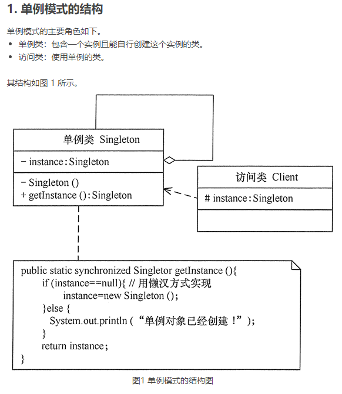
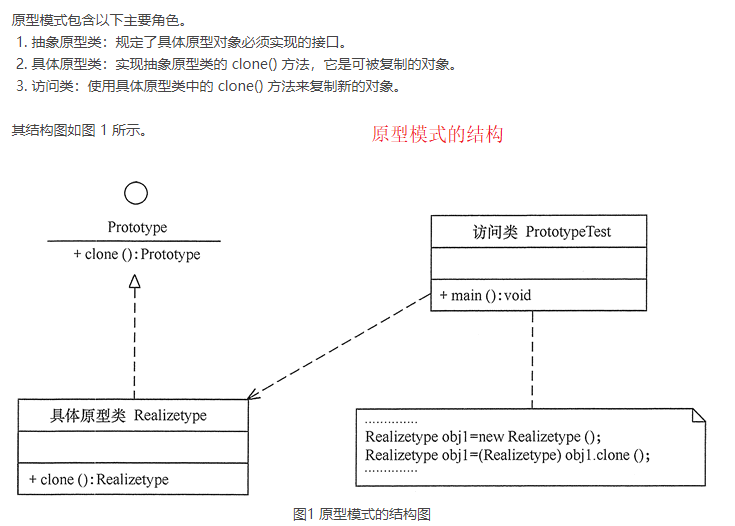
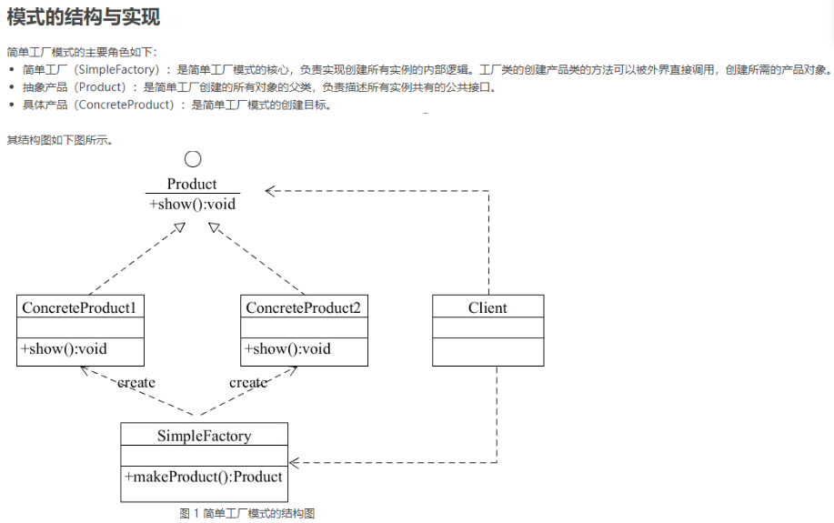
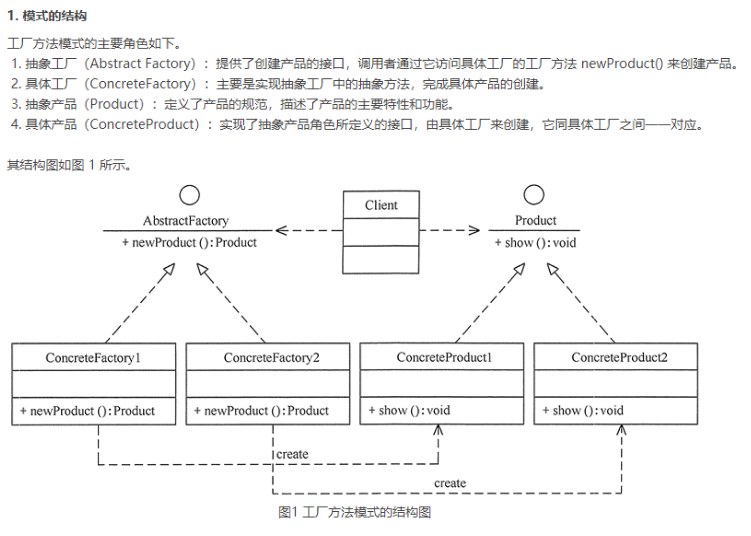

# 设计模式

## 创建型模式的特点和分类

1. #### 单例模式（Singleton）

   ##### 某个类只能生成一个实例，该类提供了一个全局访问点供外部获取该实例，其拓展是有限多例模式。

* **定义**： 指一个类只有一个实例，且该类能自行创建这个实例的一种模式。例如，Windows 中只能打开一个任务管理器，这样可以避免因打开多个任务管理器窗口而造成内存资源的浪费，或出现各个窗口显示内容的不一致等错误。
* **特点**： 
  1. 单例类只有一个实例对象；
  2. 该单例对象必须由单例类自行创建；
  3. 单例类对外提供一个访问该单例的全局访问点。



##### 单例模式的实现

* 懒汉式

  	/**
  	 * 单例模式
  	 * @author ksn
  	 * @version 1.0
  	 * @date 2021/5/17 14:49
  	 */
  	public class LazySingleton {
  	
  	    private static volatile LazySingleton singleton = null;
  	
  	    /**
  	     * private 避免类在外部被实例化 J就不能在外部new LazySingleton()来创建对象了
  	     */
  	    private LazySingleton() {
  	
  	    }
  	
  	    /**
  	     * 懒汉式,多线程下可能会不安全，所以加synchronized， 和volatile
  	     */
  	    public static synchronized LazySingleton getInstance() {
  	        if (singleton == null) {
  	            singleton = new LazySingleton();
  	        }
  	        return singleton;
  	    }
  	}

* 饿汉式

  	public class HungrySingleton {
  	
  	    private static volatile HungrySingleton singleton = new HungrySingleton();
  	
  	    private HungrySingleton() {}
  	
  	    public static HungrySingleton getInstance() {
  	        return singleton;
  	    }
  	}

2. ### 原型模式（Prototype）

   ##### 将一个对象作为原型，通过对其进行复制而克隆出多个和原型类似的新实例。

* **定义：**用一个已经创建的实例作为原型，通过复制该原型对象来创建一个和原型相同或相似的新对象。在这里，原型实例指定了要创建的对象的种类。用这种方式创建对象非常高效，根本无须知道对象创建的细节。例如，Windows 操作系统的安装通常较耗时，如果复制就快了很多。



##### 单原型模式的实现

* **浅克隆：**创建一个新的对象，属性与原来的对象相同，对于非基本类型属性还是指向原来的对象

* **深克隆：**创建一个新对象，属性中的对象全部克隆，不在指向原来的对象

  	Java 中的 Object 类提供了浅克隆的 clone() 方法，具体原型类只要实现 Cloneable 接口就可实现对象的浅克隆，
  	这里的 Cloneable 接口就是抽象原型类。
  	public class RealizeType implements Cloneable{
  	
  	    RealizeType() {
  	        System.out.println("具体原型创建成功！");
  	    }
  	
  	    @Override
  	    public Object clone() throws CloneNotSupportedException {
  	        System.out.println("具体原型复制成功！");
  	        return (RealizeType) super.clone();
  	    }
  	}
  	//  测试类
  	public class PrototypeTest {
  	
  	    public static void main(String[] args) throws CloneNotSupportedException {
  	        RealizeType realizeType = new RealizeType();
  	        RealizeType clone = (RealizeType)realizeType.clone();
  	        // false
  	        System.out.println(realizeType == clone);
  	    }
  	}

3. #### 工厂方法模式（Factory Method）

   ##### 定义一个用于创建产品的接口，由子类决定生产什么产品。

* **定义：**定义一个创建产品对象的工厂接口，将产品对象的实际创建工作推迟到具体子工厂类当中。这满足创建型模式中所要求的“创建与使用相分离”的特点。

  #### 3.1 简单工厂模式

  

  ```java
  public class SimpleFactory {
      public static void main(String[] args) {
          Product product = SimpleFactory.getProduct();
          product.show();
      }
      
      interface Product {
          void show();
      }
  
      static class Product1 implements Product {
  
          @Override
          public void show() {
              System.out.println("产品1显示show");
          }
      }
  
      public static Product getProduct() {
          return new Product1();
      }
  }
  ```

  

  #### 3.2 工厂方法模式

  

  ```java
  public class AbstractFactoryTest {
      public static void main(String[] args) {
          try {
              Product a;
              AbstractFactory af;
              af = (AbstractFactory) ReadXML1.getObject();
              a = af.newProduct();
              a.show();
          } catch (Exception e) {
              System.out.println(e.getMessage());
          }
      }
  }
  
  //抽象产品：提供了产品的接口
  interface Product {
      public void show();
  }
  
  //具体产品1：实现抽象产品中的抽象方法
  class ConcreteProduct1 implements Product {
      public void show() {
          System.out.println("具体产品1显示...");
      }
  }
  
  //具体产品2：实现抽象产品中的抽象方法
  class ConcreteProduct2 implements Product {
      public void show() {
          System.out.println("具体产品2显示...");
      }
  }
  
  //抽象工厂：提供了厂品的生成方法
  interface AbstractFactory {
      public Product newProduct();
  }
  
  //具体工厂1：实现了厂品的生成方法
  class ConcreteFactory1 implements AbstractFactory {
      public Product newProduct() {
          System.out.println("具体工厂1生成-->具体产品1...");
          return new ConcreteProduct1();
      }
  }
  
  //具体工厂2：实现了厂品的生成方法
  class ConcreteFactory2 implements AbstractFactory {
      public Product newProduct() {
          System.out.println("具体工厂2生成-->具体产品2...");
          return new ConcreteProduct2();
      }
  }
  ```

  4. #### 抽象工厂模式（AbstractFactory）