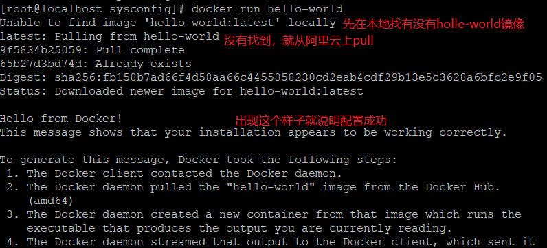
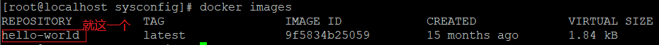
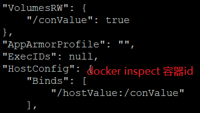
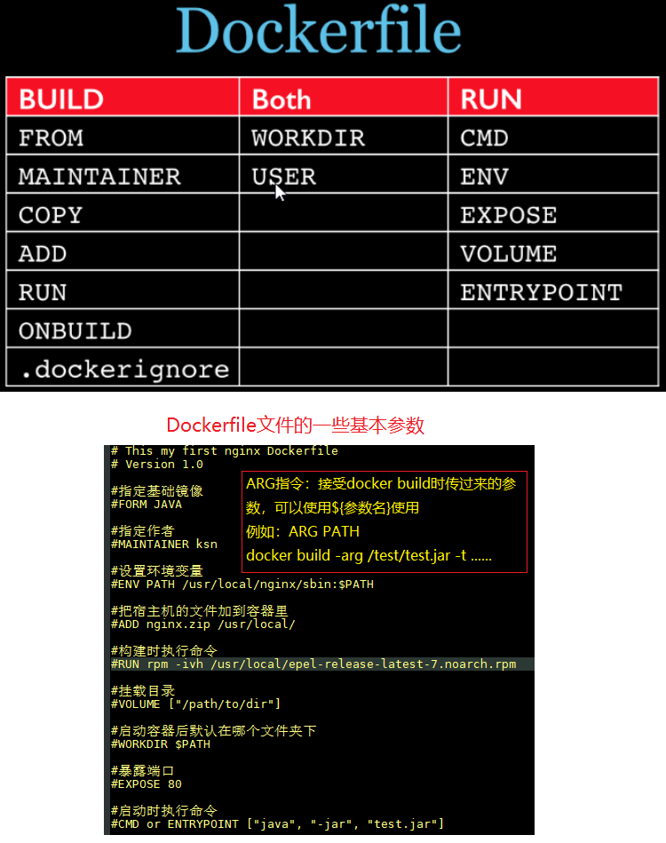
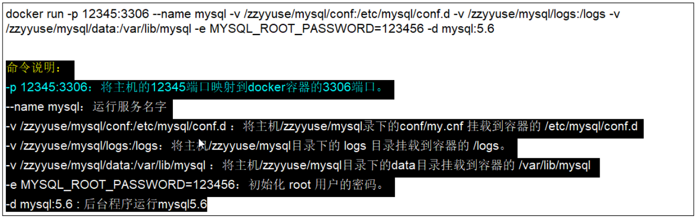
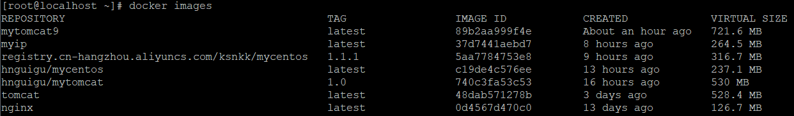
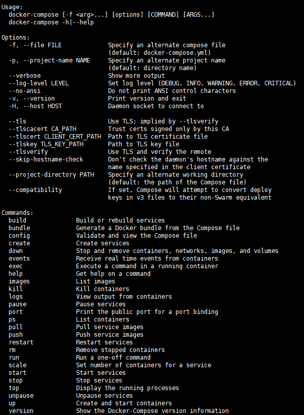
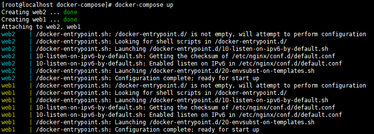

# Docker笔记

##  1.CentOS6.5安装Docker

### 步骤

* 安装epel库：**yum install -y epel-release**

* 安装Docker：**yum install -y docker-io**
	* 安装时报错：No package docker-io available
	* 解决办法： 

			yum install https://get.docker.com/rpm/1.7.1/centos-6/RPMS/x86_64/docker-engine-1.7.1-1.el6.x86_64.rpm
	
* 执行**docker version**查看版本

* 配置文件路径： **/etc/sysconfig/docker**

* 启动docker： **service docker start/stop/restart**

  

  ## 2.配置阿里云镜像加速器

  ### 1. [阿里云镜像地址](https://cr.console.aliyun.com/cn-qingdao/instances/mirrors)

  ### 2. 点击镜像加速器： https://3he6t1p2.mirror.aliyuncs.com(专属加速器地址)

  ```
  sudo mkdir -p /etc/docker
  sudo tee /etc/docker/daemon.json <<-'EOF'
  {
    "registry-mirrors": ["https://3he6t1p2.mirror.aliyuncs.com"]
  }
  EOF
  sudo systemctl daemon-reload
  sudo systemctl restart docker
  ```

  ### 3. 配置本机Docker运行镜像加速器

* 打开配置文件： **vim /etc/sysconfig/docker**， 配置下面这个，后面的网址就是专属镜像加速器地址

		other_args="--registry-mirror=https://3he6t1p2.mirror.aliyuncs.com"
		DOCKER_CERT_PATH=/etc/docker
		DOCKER_NOWARN_KERNEL_VERSION=1

### 4. 保存退出，然后重启docker，检查是否生效

###  5. 启动Docker后台容器

* 运行**docker run hello-world**

* 

* 

  ## CentOS7安装Docker

  #### 安装Docker的依赖库。

  ```
  yum install -y yum-utils device-mapper-persistent-data lvm2
  ```

  ### 添加Docker CE的软件源信息。

  ```
  yum-config-manager --add-repo http://mirrors.aliyun.com/docker-ce/linux/centos/docker-ce.repo
  ```

  #### 安装Docker CE。

  ```
  yum makecache fast
  yum -y install docker-ce
  ```

  

  #### 启动Docker服务。

  ```
  systemctl start docker
  ```

  

  #### 配置阿里云镜像加速器，[阿里云镜像地址](https://cr.console.aliyun.com/cn-qingdao/instances/mirrors)

  ```
  tee /etc/docker/daemon.json <<-'EOF'
  {
    "registry-mirrors": ["https://kqh8****.mirror.aliyuncs.com"]
  }
  EOF
  ```

  

  #### 重新加载服务配置文件。

  ```
  systemctl daemon-reload
  ```

  

  #### 重启Docker服务。

  ```
  systemctl restart docker
  ```

  

## 2. Docker常用命令

### 帮助命令

* **docker version：**查看版本
* **docker info：**比version更详细的信息
* **docker --help：**类似linux的man命令，查看各种命令的解释
* **docker system df:**查看镜像，容器，挂载目录，缓存的大小。
* **docker system prune:**清理镜像，容器，挂载目录，缓存的大小。

### 镜像命令

* **docker images：**查看本地仓库中的镜像
	* 
		* REPOSITORY: 镜像的仓库源
		* TAG: 镜像版本标签，这个就是ubuntu:latest，可以指定，如果不指定就是:latest
		* IMAGE ID: 镜像ID
		* CREATED: 镜像创建时间
		* VIRTUAL SIZE: 镜像大小
	* 选项：
		* **-a：**all的意思，显示所有镜像，包括中间镜像
		* **-q：**显示当前所有镜像id(不包括中间镜像)
		* **-qa：**显示所有镜像id(包括中间镜像)
		* **--digests：**显示镜像的摘要信息
		* **--no-trunc：**显示完整的镜像信息
* **docker search 某个镜像名称：**查找某个镜像，例如 docker search tomcat
	* 选项：
		* **--no-trunc：**显示完整的镜像信息
		* **-s：** 例如：docker search -s 30 tomcat，只显示stars在30以上的镜像
		* **--automated：**只列出automated类型的镜像
* **docker pull 镜像名称：**下载镜像
* **docker rmi 镜像名称id：**删除镜像
	* 选项： **-f：**强制删除
	* 删除单个： **docker rmi -f 镜像名称**
	* 删除多个： **docker rmi -f 镜像名称1 镜像名称2**
	* 删除全部： **docker rmi -f $(docker images -qa)**
###容器命令
* 下载centos镜像： **docker pull centos**
* 新建并启动容器： **docker run [option] 镜像id/镜像名**
	* **--name：**为容器指定一个新名字
	* **-d：**后台运行容器，并返回容器id，就是启动守护式容器
	* **-i：**以交互模式运行容器，通常与-t一起使用
	* **-t：**为容器重新分配一个伪终端，与-i一起使用
	* **-P：**随机端口映射
	* **-p：**指定端口映射，有四种格式
		* ip:hostPort:containerPort
		* ip::containerPort
		* hostPort:containerPort
		* containerPort
* 列出当前所有正在运行的容器： **docker ps**
	* **-a：**列出当前所有正在运行的容器 + 历史上运行过的
	* **-l：**显示最近创建的容器
	* **-n：**显示最经创建的n个容器
	* **-q：**静默模式，只显示容器编号
	* **--no-trunc：**不截断输出
* 退出容器： 
	* **exit:**容器停止退出
	* **ctrl + P + Q:**容器不停止退出
* 启动容器： **docker start 容器id/容器名**
* 重启容器： **docker restart 容器id**
* 停止容器： **docker stop 容器id**
* 强制停止： **docker kill 容器id**
* 删除已经停止的容器：docker rm 容器id
* 一次删除多个容器： 
	* docker rm -f $(docker ps -qa): rm是删除，-f是强制，-qa是显示所有的容器id
	* docker ps -qa | xargs docker rm：先把 所有容器id查出来，然后通过管道输入符传给后面的然后删掉
* 重点：
	* 启动守护式容器： **docker run -d 容器id**
	* 查看容器日志： **docker logs -f -t --tail 容器id**
		* -f： 动态更新最新日志信息
		* -t： 加入时间戳
		* --tail n：显示最后n条 
	* 查看容器内运行的进程： **docker top 容器id**
	* 查看容器内部细节(以json字符串的形式)： **docker inspect 容器id**
	* 进入正在运行的 容器并以命令行交互：
		* **docker exec -it 容器id linux命令：**在容器中打开新的终端，并启动新的进程，就直接执行命令了
		* 
		* **docker attach 容器id：**直接进入容器启动的命令终端，不启动新的进程
	* 从容器内拷贝文件到主机上： **docker cp 容器id：容器内路径 主机路径**

## 3. Docker镜像

### commit操作补充

* docker commit提交容器副本使之成为一个新的镜像
* 命令： **docker commit -m="提交的描述信息" -a="作者" 容器id 要创建的目标镜像名：[标签名]**
* 案例演示：
	* 从docker hub上下载tomcat并运行： 
		* 命令： **docker run -it -p 8080:8080 tomcat**
			* -i： 交互
			* -t： 终端
			* -p： 主机端口:docker容器端口
			* -P： 随机分配端口
		* 如果访问出现404，[参考文章](https://blog.csdn.net/qq_29752857/article/details/104996514)
	* 故意删除上一步镜像生产tomcat容器的文档
	* 
	* 以这个为模板commit一个新的镜像tomcat2
		* 命令： **docker commit -m "ksn的tomcat" -a="ksn" fe0a652e0c2d hnguigu/mytomcat:1.0**
		* -m: 描述信息
		* -a： 作者信息
		* ：1.0是版本信息
		* hnguigu/mytomcat： 命令空间/镜像名
	* 启动新镜像和原来的做对比，新镜像访问文档显示404，原镜像正常显示

## 4. Docker容器数据卷

### 作用

* 容器的持久化和容器之间继承 + 共享数据
### 添加数据卷

#### 用命令添加
* 命令： **docker run -it -v /宿主机绝对路径目录:/容器内目录 镜像名**
* 查看数据卷是否挂载成功，使用inspect命令如下即绑定成功
* 
* 容器和宿主机之间的数据共享，两边修改文件会直接同步
* 容器停止退出后，主机修改数据是否同步，容器停止后主机做的修改，容器依旧同步
* 命令(带权限)： **docker run -it -v /宿主机绝对目录:/容器目录:ro 镜像名**(readonly,只读)
#### 用DockerFile添加
* 根目录下新建myDocker目录并进入
* 可在DockerFile中使用**VOLUME**给镜像添加一个或者多个镜像卷：VOLUME ["/conValue1", "/conValue2"]
* File构建

		# volume test
		FROM centos
		VOLUME ["/conValue1", "/conValue2"]
		CMD echo "success"
		CMD /bin/bash
* build后生成镜像： **docker build -f /mydocker/Dockerfile -t hnguigu/mycentos .**
* run容器： **docker run -it 新建的镜像**
* 主机默认对应地址
* 

### 数据卷容器

* 概念： 命名的容器挂载数据卷，其他其他容器通过挂载这个容器实现数据共享，这个被挂载的容器就叫数据卷容器
* 案例： 
	* 先启动一个父容器dc01
	* dc02/dc03继承dc01：**docker run -it --name "dc02" --volumes-from dc01 hnguigu/mycentos**
	* 回到dc01看到dc02/dc03各自添加的都可以共享了
	* 删除dc01，dc02修改后dc03可以访问
	* 删除dc02后dc03是否可以访问
	* 结论： **容器之间配置信息的传递，数据卷的生命周期一直维持到没有容器使用它为止**

## 5. DockerFile解析

### 简介

* 概念： Dockerfile是用来构建Docker镜像的构建文件，时有一系列的命令和参数构成的脚本
* 构建三步骤：
	1. 编写Dockerfiler文件
	2. docker build
	3. docker run

### Dockerfile构建过程解析

#### 1. Docker内容基础知识

* 每条保留字指令都必须为大写字母，且后面至少跟随一个参数
* 指令按照从上往下，顺序执行
* #表示注释
* 每条指令都会创建一个新的镜像层，并对镜像进行提交

#### 2. Docker执行Dockerfile的大致流程

* docker基础镜像运行一个容器
* 执行一条指令并对容器作出修改
* 执行类似docker commit的操作提交一个新的镜像层
* docker在提交基于刚提交的镜像运行一个新容器
* 执行 dockerfile中的下一条指令直到所有指令执行完成 

### Dockerfile体系结构(保留字指令)

* **FROM:** 基础镜像，当前新镜像是基于哪个镜像的
* **MAINTAINER:** 镜像维护者的姓名和邮箱地址
* **RUN:** 容器构建时需要运行的命令
* **EXPOSE:** 当前容器对外暴露的端口
* **WORKDIR:** 指定在创建容器后，终端默认登陆进来的工作目录
* **ENV:** 用来构建镜像过程中设置 环境变量
* **ADD:** 将宿主机目录下的文件拷贝进镜像且add命令会自动处理url和解压tar包
* **COPY:** 类似add，但是只是拷贝，不会做处理
* **VOLUME:** 容器数据卷，用于数据保存和持久化工作
* **CMD:** 指定一个容器启动时要运行的命令
	
	* 注意： dockerfile中可以有多个CMD命令，但是只有最后一个生效，CMD会被docker run之后的参数替换
* **ENTRYPOINT:** 和CMD作用一样，都是在指定容器启动程序和参数
* **ONBUILD:** 当构建一个被继承的Dockerfile时运行命令，父镜像在被子镜像继承后父镜像的onbuild被触发
* 

### 案例
#### Base镜像(scratch)

* Docker Hub上99%的镜像都是通过在base镜像中安装和配置需要的软件构件出来的

  #### 自定义镜像mycentos
1. 编写
	* Hub默认的centos镜像时什么情况(WORKDIR是/，没有vim，ifconfig等命令)
	* 准备编写Dockerfile文件
	* 
	* mycentos内容DockerFile
2. 构建: **docker build -f DockerFile路径 -t 镜像名称:版本号 .**
3. 运行: **docker run -it 新镜像名字:版本号**

列出镜像的变更历史： **docker history 镜像名**

#### CMD/ENTRYPOINT镜像案例

* CMD命令是会覆盖的 ，只执行最后一个，带参数的话就会执行参数;ENTRYPOINT是追加，不会覆盖
* 
* CMD方式
* 
* ENTRYPOINT方式
* 

#### 自定义tomcat9

* 创建一个目录，在里面创建c.txt
* 将jdk和tomcat的压缩包拷贝进上一层目录
* 在创建的目录下新建DockerFIle文件
* 构建： **docker build -t Dockerfile文件路径**
* run，验证： docker run -it -p 7777:8080 镜像名
* 结合前面说的容器卷将测试web服务test发布

## 6.Docker安装常用软件
### 安装mysql

* 拉取：**docker pull mysql:5.6**
* 运行：
	
	* 
* 交互： **docker exec -it mysql容器id /bin/bash**

### 安装redis

* 拉取： docker pull redis

* 运行： 

	```
	docker run -p 6379:6379 
	-v /zzyyuse/myredis/data:/data 
	-v /zzyyusG/myredis/conf/reclis.conf:/usr/local/Gtc/redis/redis.conf 
	-d redis:3.2 redis-server /usr/local/etc/redis/redis.conf 
	--appendonly yes
	```
	
	
	
* 在/zzyyusG/myredis/conf/reclis.conf这个 目录下新建redis.conf文件，编写配置文件

* 测试： docker exec -it 运行redis的容器id  redis-cli

## 7.本地镜像发布到阿里云

* 

* 然后登录进去创建镜像仓库什么的 

* 回到本地准备执行命令

  	$ sudo docker login --username=帅气的小kkk registry.cn-hangzhou.aliyuncs.com
  	$ sudo docker tag [ImageId] registry.cn-hangzhou.aliyuncs.com/ksnkk/mycentos:[镜像版本号]
  	$ sudo docker push registry.cn-hangzhou.aliyuncs.com/ksnkk/mycentos:[镜像版本号]
  ###从阿里云下载上传的镜像

* docker pull registry.cn-hangzhou.aliyuncs.com/ksnkk/mycentos:1.1.1(这个网址是阿里云上搜索仓库搜到的公网地址)

* 

* 然后运行即可

# Docker-compose

#### [Docker-compose官方文档](https://docs.docker.com/compose/compose-file/)

## 1. 安装componse

```shell
安装到/usr/local/bin/docker-compose目录下，地址不能变
curl -L https://github.com/docker/compose/releases/download/1.22.0-rc1/docker-compose-`uname -s`-`uname -m` -o /usr/local/bin/docker-compose

chmod +x /usr/local/bin/docker-compose

查看版本： docker-compose -version
```

## 2. 卸载

```shell
rm /usr/local/docker-compose/docker-compose
```

## 3.常用命令

可以使用`docker-compose -h` 查看



#### 命令模板：`docker-compose [-f <arg>...] [options] [COMMAND] [ARGS...]`

#### 命令选项：

* -f ：-file，指定要使用的docker-compose文件，默认是docker-compose.yml(后缀可以是yaml)
* -p:   -project-name，指定项目名称，默认将所在目录作为项目名
* -x-network-driver： 使用docker的可插拔网络后端特性(需要docker1.9后)，有三种，bridge(默认)，host，overlay
* -verbose： 输出更多调试信息
* -v ： 查看版本号

#### 常用命令列表：

##### up： 自动完成包括构建镜像，创建服务，启动服务并关闭关联容器的一系列操作

* 格式： `docker-compose up [options] [--scale SERVICE=NUM...] [SERVICE...]`
* 选项：
  * -d： 在后台运行服务容器
  * –no-color： 不使用颜色来区分不同的服务的控制输出
  * –no-deps ：不启动服务所链接的容器
  * –force-recreate： 强制重新创建容器，不能与–no-recreate同时使用
  * –no-recreate： 如果容器已经存在，则不重新创建，不能与–force-recreate同时使用
  * –no-build： 不自动构建缺失的服务镜像
  * –build ：在启动容器前构建服务镜像
  * –abort-on-container-exit： 停止所有容器，如果任何一个容器被停止，不能与-d同时使用
  * -t： --timeout TIMEOUT 停止容器时候的超时（默认为10秒）
  * –remove-orphans： 删除服务中没有在compose文件中定义的容器
  * –scale SERVICE=NUM： 服务名=启动个数。设置服务运行容器的个数，将覆盖在compose中通过scale指定的参数

##### build：构建项目中的服务容器

* 格式：`docker-compose build [options] [--build-arg key=val...] [SERVICE...]`
* 选项：
  * –compress：通过gzip压缩构建上下环境
  * –force-rm: 删除构建过程中的临时容器
  * -no-cache：构建过程中不使用缓存
  * -pull：始终通过拉取操作来获取更新的镜像
  * -m：– –memory为构建的容器设置内存大小
  * -build-arg：设置build-time变量

##### logs： 查看日志输出

* 格式： `docker-compose logs [options] [SERVICE...]`

* ```
  `docker-compose logs -f 容器名
  ```

* 选项：

  * -no-color： 关闭颜色
  * -f： 类似tail -500f a.txt中的f

##### ps： 列出项目中所有容器

* 格式： `docker-compose ps [options]`

  ```shell
  docker-compose ps -q     -q表示只显示id
  ```

##### start： 启动已经存在的容器

```shell
docker-compose start [SERVICE...]
```

##### stop： 停止容器

```shell
docker-compose stop [SERVICE...]
```

##### restart： 重启容器

* 格式： `docker-compose restart [options] [SERVICE...]`

  ```shell
  docker-compose restart -t 10 容器id			-t是超时时间（默认10s）		
  ```

##### rm： 删除所有停止状态的容器

* 格式：`docker-compose rm [options] [SERVICE...]`
* 选项：
  * -f： – –force，强制直接删除
  * -v：删除容器所挂载的数据卷

##### down： 停止并删除容器，网络，镜像和数据卷

* 格式： `docker-compose down [options]`

* 选项：

  * -rmi type： type为all或者local。all：删除compose中定义的所有镜像，local：删除镜像名为空的镜像。

    ```shell
    docker-compose down -rmi all   or 		docker-compose down
    ```

  * -v： 删除已经在compose中定义的和匿名的附着在容器上的数据卷

  * -remove-orphans：删除服务中没有在compose中定义的容器

##### kill： 通过发送SIGKILL命令强制停止服务容器

* 格式：`docker-compose kill [options] [SERVICE...]`

* 选项：

  * -s：通过-s来指定发送信号，如：

    ```shell
    docker-compose kill -s SIGINT
    docker-compose kill -s SIGKILL
    ```

##### top：显示运行的进程

```shell
docker-compose stop [options] [SERVICE...]
```

##### config： 验证和查看docker-compose文件配置

* 格式：`docker-compose config [options]`

##### create： 为服务创建容器，只是单纯的创建还需要使用start启动

* 格式：`docker-compose create [options] [SERVICE...]`
* 选项：
  * –force-recreate： 重新创建容器，即使它的配置和镜像没有改变，不兼容–no-recreate参数
  * –no-recreate：如果容器已经存在，不需要重新创建. 不兼容–force-recreate参数
  * -no-build：不创建镜像，即使缺失
  * -build：创建容器前生成镜像

##### exec： 在运行的容器中执行命令，相当于docker的exec

* 格式： `docker exec [options] SERVICE COMMAND [ARGS...]`

  ```
  docker-compose exec web1 /bin/bash
  ```

* 选项：

  * -d: 分离模式，后台运行命令

##### run： 在指定服务上执行一个命令

* 格式：`docker-compose run [options] [-v VOLUME...] [-p PORT...] [-e KEY=VAL...] SERVICE [COMMAND] [ARGS...]`

* 选项：

  * -d：在后台运行服务容器

  * –name NAME： 为容器指定一个名字

  * –entrypoint CMD： 覆盖默认的容器启动指令

  * -e KEY=VAL： 设置环境变量值，可多次使用选项来设置多个环境变量

  * -u, --user=""： 指定运行容器的用户名或者uid

  * –no-deps： 不自动启动管理的服务容器

  * –rm ：运行命令后自动删除容器，d模式下将忽略

  * -p： --publish=[] 映射容器端口到本地主机

  * –service-ports： 配置服务端口并映射到本地主机

  * -v：--volume=[] 绑定一个数据卷，默认为空

  * -T：不分配伪tty，意味着依赖tty的指令将无法运行

  * -w：--workdir="" 为容器指定默认工作目录

    ```shell
    docker-compose run --no-deps web
    ```

##### pause： 暂停一个容器

```shell
docker-compose pause 容器id	
```

##### unpause：恢复暂停的容器

```shell
docker-compose unpause 容器id
```

##### pull： 拉取服务所需的镜像

* 格式： `docker-compose pull [options] [SERVICE...]`
* 选项：
  * –ignore-pull-failures： 忽略拉取镜像过程中的错误
  * –parallel： 多个镜像同时拉取
  * –quiet： 拉取镜像过程中不打印进度信息

##### push： 推送服务镜像

* 格式： `docker-compose push [options] [SERVICE...]`
* 选项：
  * –ignore-push-failures： 忽略推送镜像过程中的错误

##### port： 打印某个容器端口所映射的公共端口

* 格式： `docker-compose port [options] SERVICE PRIVATE_PORT`
* 选项：
  * –protocol=proto： 指定端口协议，TCP（默认值）或者UDP
  * –index=index：  如果同意服务存在多个容器，指定命令对象容器的序号（默认为1）

##### scale： 设置指定服务运行的容器个数

* 格式：`docker-compose scale [options] [SERVICE=NUM...]`

  ```shell
  docker-compose scale -t 10 web=3 db=2	
  ```

  * -t ：超时时间，默认10s，web=3启动三个容器运行web服务，启动两个容器运行db服务

##### help： 获得一个命令帮助 

## 4.Compose模板文件

### 例子：

```yaml
version: '3'
services:
  nacos:
    image: nacos/nacos-server:2.0.1
    hostname: "nacos-standalone"
    environment:
      - MODE=standalone
      - TZ=Asia/Shanghai
    volumes:
      - /docker/nacos/standalone-logs/:/home/nacos/logs
      - /docker/nacos/init.d/custom.properties:/home/nacos/init.d/custom.properties
    ports:
      - 8848:8848
      - 9848:9848
      - 9849:9849
    networks:
      blade_net:
        ipv4_address: 192.168.1.168
networks:
  blade_net:
    driver: bridge
    ipam:
      config:
        - subnet: 172.30.0.0/16
```

### 常用模板文件语法

##### build: 指定dockerFile文件的路径，加载dockerFile文件，用这个来构建镜像

```shell
build: /usr/local/build/dir
```

##### command：覆盖容器启动后执行的默认命令

```
command: echo "hello world"
```

##### container_name：指定容器名称，默认是 	“项目名称_服务名称_序号” 的格式

```
container_name: docker-web-container
```

##### dns： 自定义DNS服务器，可以是一个值也可以是列表

```yaml
dns：8.8.8.8
dns：
	- 8.8.8.8
	- 9.9.9.9
```

##### dockerfile：指定额外的编译镜像的DockerFile文件，不能和images同时使用

```
dockerfile: Dockerfile-alternate
```

##### env_file：从文件中获取环境变量如果有变量名和environment指定冲突，以后者为准

```
env_file: ./common.env

env_file:
	- ./common.env
	- ./apps/web.env
	- /opt/secrets.env
```

##### environment：设置环境变量

```
environment: 					or					environment: 
	RACK_ENV: development								- RACK_ENV=development
	SESSION_SECRET:									    - SESSION_SECRET
```

##### expose： 暴露端口但是不映射到宿主机，只允许能被连接的服务访问。仅可以指定内部端口为参数

```
expose:
	- "3000"
	- "8000"
```

##### extends：基于其他模板文件进行扩展，例如：

```yaml
# common.yml，已有这个基本的模板文件，在其他的模板文件中引用这个
webapp:
	build: ./webapp
	environment:
		- DEBUG=false
		- SEND_EMAILS=false
```

```yaml
# development.yml，引用common.yml模板文件
web:
	extends:
		file: common.yml
		service: webapp
	ports:
		- "8000:8000"
	links:
		- db
	environment:
		- DEBUG=true
```

##### image：指定镜像名或id，如果本地不存在则会去拉取

```
image: nginx
```

##### net： 设置网络模式，类似于docker client的–net参数

```
net: "bridge"
net: "none"
net: "host"
```

##### ports：暴露端口信息，格式：（HOST:CONTAINER）

```
ports：
	- “3000”
	- “8000:8000”
	- "8080:22"
```

##### volumes： 数据卷所在路径

```
volumes:
	- /var/lib/mysql
	- cache/:/tmp/cache
```

##### volumes_from： 从另一个容器挂载数据卷

```
volumes_from:
	- service_name
	- container_name
```

##### 读取环境变量，从系统环境变量中读取MONGO_VERSION

```
db:
	image: "mongo:${MONGO_VERSION}"
```


### 不常用模板文件语法

##### external_links：链接到docker-compose.yml外部的容器，甚至可以是非Compose管理的外部容器。参数格式跟links类似

```
external_links:
	- redis_1
	- project_db_1:mysql
	- project_db_1:postgresql
```

##### links：链接到其他服务中的容器。使用服务名称（同时作为别名），或者“服务名称:服务别名”（如 SERVICE:ALIAS）

```yaml
links:
	- db
	- db:database
	- redis
使用别名将会自动在服务容器中的/etc/hosts里创建
172.17.2.186  db
172.17.2.186  database
172.17.2.187  redis
```

##### log_driver：类似于Docker中的–log-driver参数，指定日志驱动类型。目前支持三种日志驱动类型

```
log_driver: "json-file"
log_driver: "syslog"
log_driver: "none"
```

##### log_opt：日志驱动的相关参数

```
log_driver: "syslog"
log_opt: 
	syslog-address: "tcp://192.168.0.42:123"
```

##### pid：跟主机系统共享进程命名空间。打开该选项的容器之间，以及容器和宿主机系统之间可以通过进程ID来相互访问和操作

```
pid: "host"
```

##### security_opt：指定容器模板标签（label）机制的默认属性（用户、角色、类型、级别等）。例如，配置标签的用户名和角色名

```
security_opt:
	- label:user:USER
	- label:role:ROLE
```

##### ulimits：指定容器的ulimits值限制值。例如，指定最大进程数为65535，指定文件句柄数为2000（软限制，应用可以随时修改，不能超过硬限制）和 4000（系统硬限制，只能root用户提高）

```
ulimits:
	nproc: 65535
	nofile:
		soft: 20000
		hard: 40000
```

##### extra_hosts：类似于Docker中的–add-host参数，指定额外的host名称映射信息

```
extra_hosts:
	- “googledns:8.8.8.8”
	- "dockerhub:52.1.157.61"
	
会在启动后的服务容器中/etc/hosts文件中添加如下两条条目
8.8.8.8  googledns
52.1.157.61 dockerhub
```

##### labels: 为容器添加元数据信息，添加辅助说明等

```
labels：
	com.startupteam.description: "webapp for a strtup team"
```

## 5.Compose实战

##### 新建docker-compose.yml文件，文件内容如下：

```yaml
version: '2'
services: 
	web1:
		image: nginx
		ports:
			- "8880:80"
		container_name: "web1"
	web2:
		image: nginx
		ports:
			- "8890:80"
		container_name: "web2"
#volumes:
#networks:
```

##### 使用`docker-compose up`运行容器




#### 修改docker-compose.yml

```yaml
version: '2'
services:
	web1:
		image: nginx
		ports: 
			- "8080:80"
		container_name: "web1"
		networks:
			- dev
		volumes:
			- ntfs:/data
	web2:
		image:: nginx
		ports:
			- "8081:80"
		container_name: "web2"
		networks:
			- dev
			- pro
		volumes:
			- ./web2:/usr/share/nginx/html
	web3:
		image: nginx
		ports:
			- "8082:80"
		container_name: "web3"
		networks:
			- pro
		volumes:
			- ./web3:/usr/share/nginx/html
networks:
	dev:
		driver:	bridge
	pro:
		driver: bridge
volumes:
	ntfs:
		driver: ./web1
```

##### 我们指定了dev、pro网络，同时给web1指定了dev网络，web2指定了dev、pro网络，web3指定了pro网络，因此web1和web2可以互相访问到，web2和web3可以互相访问到，而web1与web3就无法访问。这就可以通过配置来实现容器直接的互通和隔离。同时指定volumes挂载到本地。