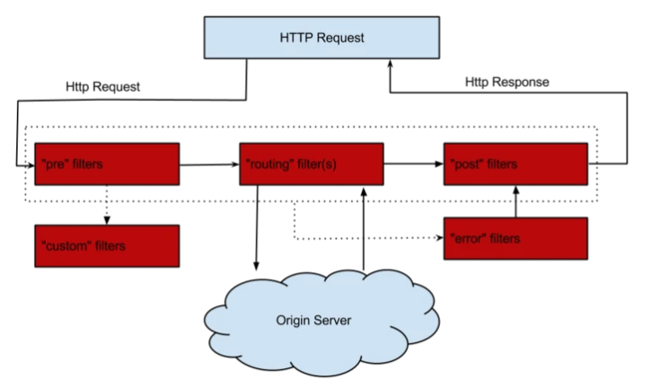
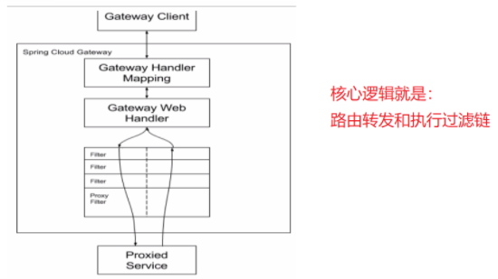

##
##*1. 描述JVM加载CLASS文件的机制*
####首先JVM中类的加载是通过类加载器完成的，分别是，根加载器(Bootstrap)， 扩展加载器(Extention)， 系统加载器(System)， 自定义类加载器，B 负责加载基础核心类库，E负责加载系统属性所指定的目录, S加载环境变量或系统属性指定的类。类的加载是创建一个字节数组将.class文件中的数据读取到内存中，然后会产生所加载类的Class对象。当类被加载后进入连接阶段，包括验证，准备(为静态变量分配内存并且设置初始值)，解析(将符号引用变成直接引用)，最后JVM对类进行初始化。类的加载使用父亲委托机制(PDM),更好的保证了安全性。类的加载首先请求父亲加载器，父亲加载器不行了子类加载器自行加载。

##2. Java开发中抽象类和接口都有什么区别？

> 1. 抽象类用abstract关键字修饰，接口用interface修饰
> 
> 2. 抽象类可以有抽象方法和具体方法，接口只能有抽象方法(jdk8之前)
> 
> 3. 一个类只能继承一个抽象类，但是可以实现多个接口

##3. 静态嵌套类（Static Nested Class）和内部类（Inner Class）的不同
####在一个类的内部定义一个类就是嵌套类，嵌套类分两种，静态嵌套类和内部类。内部类分三种：
1. 在外部类中直接定义的内部类
2. 在一个外部类的方法中定义的内部类
3. 匿名内部类
####在静态嵌套类中不能访问外部类的非静态成员，外部类不能直接访问内部类的变量，定义在方法内部的内部类不能访问本方法的成员变量，只能访问本方法的final变量，除了这个，其他关键字都不能用。

##4. 什么情况下会发生堆内存溢出，栈内存溢出，结合实例说明
####一、 栈溢出(StackOverflowError)
######栈内存溢出就是栈帧的数量太多超过了系统预先设定的值，方法执行是创建的栈帧超过了栈的深度,所以导致内存溢出,可以使用参数 -Xss 去调整JVM栈的大小
####二、 堆溢出(OutOfMemoryError:java heap space)
######堆中主要存储的是对象。如果不断的new对象则会导致堆中的空间溢出

##5. 静态变量和实例变量的区别
####静态变量是用static修饰的，不属于任何一个对象，只属于类。一个类不管创建多少个对象，静态变量在内存中有且仅有一个拷贝，实例变量必须依存于某一实例，要先创建对象，然后才能通过对象访问他。静态变量可以实现让多个对象共享内存

##6. GC是什么？为什么要有GC？
####GC是垃圾收集的意思，Java提供的GC功能可以自动监测对象是可以回收而达到自动回收内存的目的，垃圾回收可以有效的防止内存泄露，有效的使用可以使用的内存。垃圾回收器通常是作为一个单独的低优先级的线程运行，不可预知的情况下对内存堆中已经死亡的或者长时间没有使用的对象进行清除和回收，程序员不能实时的调用垃圾回收器对某个对象或所有对象进行垃圾回收。采用的是“分代式垃圾收集”，这种方法会根据java对象的生命周期划分为不同区域，在收集过程中，可能会把对象移动到不同区域：
- 伊甸园（Eden）：这是对象最初诞生的区域，并且对大多数对象来说，这里是它们唯一存在过的区域。 
- 幸存者乐园（Survivor）：从伊甸园幸存下来的对象会被挪到这里。 
- 终身颐养园（Tenured）：这是足够老的幸存对象的归宿。年轻代收集（Minor-GC）过程是不会触及这个地方的。当年轻代收集不能把对象放进终身颐养园时，就会触发一次完全收集（Major-GC），这里可能还会牵扯到压缩，以便为大对象腾出足够的空间。

##7. 解释内存中的栈(stack)、堆(heap)和方法区(method area)的用法

* 栈的使用：通常我们定义一个基本数据类型的变量，一个对象的引用，还有就是函数调用的现场保存都使用JVM中的栈空间。

* 堆的使用：通过new关键字和构造器创建的对象则放在堆空间，堆是垃圾收集器管理的主要区域。

* 方法区的使用：方法区和堆都是各个线程共享的内存区域，用于存储已经被JVM加载的类信息、常量、静态变量、JIT编译器编译后的代码等数据；程序中的字面量（literal）如直接书写的100、"hello"和常量都是放在常量池中，常量池是方法区的一部分。

* 栈空间操作起来最快但是栈很小，通常大量的对象都是放在堆空间，栈和堆的大小都可以通过JVM的启动参数来进行调整，栈空间用光了会引发StackOverflowError，而堆和常量池空间不足则会引发OutOfMemoryError。

>例子：
>
> String str = new String("hello");
>
>上面的语句中变量str放在栈上，用new创建出来的字符串对象放在堆上，而"hello"这个字面量是放在方法区的。
##8. 为什么不能根据返回类型来区分重载
####打个比方float max(int a, int b); int max(int a, int b); 像这种编译器就不知道调用的是哪个，方法的返回值是方法运行过后的一个状态，不能作为标识。
##9 非受检异常（运行时异常）和受检异常的区别
####除了RuntimeException，其他都是受检异常。受检异常强制进行显示的声明或捕获，否则就产生编译错误，运行时异常就是编译不会捕获，运行时才被抛出
##10. 对象的四种引用
####强引用：例如Object object = new Object();,被强引用的对象不会被gc回收，gc宁愿抛出oom也不会回收强引用对象来释放空间
####引用（Reference类）下面三个都是它的子类，它有四个方法
* clean()： 清除对象
* enqueue()： 将此引用对象添加到其注册的队列
* get()： 返回此引用对象的指示。通过这个方法可以吧软引用对象变成强引用
* isEnqueued()： 通过程序或垃圾收集器来告知这个引用对象是否已经放入队列;
####软引用(SoftReference)： 软引用的生命周期比强引用短一些，只有当 JVM 认为内存不足时，才会去试图回收软引用指向的对象，他可以和引用队列一起使用如果被回收了就会加到引用队列中，可以使用poll()方法查看，然后可以吧这些对象清除掉
####弱引用(WeakReference)： 弱引用的生命周期比软引用短，垃圾回收器只要发现有弱引用对象就会回收，也可以和队列一起使用，被回收后会加到队列中
####虚引用(PhantomReference)： 虚引用等同于没有引用，在任何时候都可能被GC回收。设置虚引用的目的是为了看到被虚引用关联的对象在被垃圾回收器回收的时候，能够收到一个系统通知（用来跟踪对象被GC回收的活动）
##11、SynchronizedMap和ConcurrentHashMap有什么区别？
####答： SynchronizedMap 是锁住整张表，保证每次只有一个线程访问，ConcurrentHashMap 使用分段锁来保证多线程下的性能。在ConcurrentHashMap 中，默认将hash分为16个桶，每次锁住一个桶，诸如 get,put,remove 等常用操作只锁当前需要用到的桶。这样原来只能进一个线程，现在可以让16线程同时读写，性能提升显著。ConcurrentHashMap 使用了一种不同的迭代方式，当 iterator 被创建后集合再发生改变就不再是抛出 ConcurrentModificationException了，取而代之的是在改变的时候new新的数据(应该是把新老数据合并成一个新的集合)，iterator 完成后再将头指针替换为新的数据，这样 iterator线程可以使用原来老的数据，而写线程也可以并发的完成改变。
##12. 创建内部类对象和静态内部类

  
查看代码

  <pre><code> 
	public class asdf {
	
	    public static void main(String[] args) {
	        test1 test1 = new asdf().new test1(); //创建内部类对象
	        test2 test2 = new test2(); //创建静态内部类
	    }
	    
	    String s = "aa";
	    public void b() {
	        // System.out.println(s1); 不能访问内部类的资源
	    }
	    static class test2 {}
	    
	    class test1 {
	        String s1 = "a"; //作用域只在test1里
	        
	        public void a() {
	            System.out.println(s1);
	            System.out.println(s); //内部类可以访问到外面的资源
	        }
	    }
	}
  </code></pre>

##13. 详解JVM内存模型
####JVM内存模型分为5块，线程共享： 方法区， 堆。线程私有： 本地方法栈，虚拟栈，程序寄存器
######程序寄存器： 当前线程所执行的字节码的行号指示器，用于记录正在执行的虚拟机字节指令地址，线程私有。
######虚拟栈：存放基本数据类型、对象的引用、方法出口等
######本地方法栈：和虚拟栈相似，只不过它服务于Native方法
######方法区：存放已被加载的类信息、常量、静态变量、即时编译器编译后的代码数据等。（即永久带），回收目标主要是常量池的回收和类型的卸载
######堆：java内存最大的一块，所有对象实例、数组都存放在java堆，GC回收的地方
##14. JVM中一次完整的GC流程是怎样的，对象如何晋升到老年代
####首先GC是发生在堆中的，分为新生代和老年代，新生代又分为三块，eden， s0，s1，新生代占1/3，老年代占2/3。首先会判断Eden区有没有空间，当年轻代的内存满了会触发Minor GC。Minor GC采用的复制算法，它的过程就是复制 => 清空 => 互换。复制是指的吧Eden和s0的复制到s1，然后清空Eden和s0的，然后把s0和s1置换，原来s1的就成了下次GC的对象了。然后存活下来的对象会放到Survivor区，此时它的年龄+1，每熬过一次Minor GC年龄就会+1，直到大于15就被收进老年代，还有一种大对象就会直接进入老年代。老年代的中会使用Major GC/Full GC(老年代GC)来清除垃圾，但是它的速度很慢。Major GC采用的标记清除算法，先标记存活的，然后在清除没有标记的，缺点：耗费时间， 容易产生内存碎片。当老年代都装不下了就会抛出OOM异常
##15. 垃圾回收算法有哪些
####1. 标记-清除算法：就是先标记内存中存活的对象，然后把其他的清除掉，缺点是会产生内存碎片
####2. 复制算法：把内存分成两块，把存活的放到一遍，然后把另一块内存全部回收，缺点是利用率不高
####3. 标记-整理算法：把内存中存活的对象赶到另一头，然后以存活的对象为边界，把其他的都回收了，解决的内存碎片跟利用率不高的问题
####4. 分代收集算法：就是把内存分成很多块，每块用不同的回收算法回收
##16. JVM判断对象是否已死方算法
####1. 引用计数法: 给对象添加一个引用计数器，多一个地方引用，计数器就+1，当引用失效时计数器-1,当计数器为0时，表示对象已死，可以回收。缺点是：无法解决对象循环引用的问题，当A引用B，且B引用A且他们的计数器都不为0，但是他两实际没有意义。
####2. 可达性分析算法： 这个算法的基本思路就是通过一个系列名为GC Roots的对象作为起始点，从这些节点往下搜索，搜索所走过的路径就是引用链，当一个对象到GC Roots没有任何一个引用链时，则表示这个对象不可达，不可达不等于可回收，要等这个经过两次标记才能是可回收对象
##16. 你知道哪几种垃圾收集器，重点讲下cms和G1,包括原理,流程,各自的优缺点。
####1. Serial收集器： 单线程的收集器，收集垃圾时，必须stop the world，使用复制算法。
####2. ParNew收集器： Serial收集器的多线程版本，也需要stop the world，复制算法。
####3. Parallel Scavenge收集器： 新生代收集器，复制算法的收集器，并发的多线程收集器，目标是达到一个可控的吞吐量。如果虚拟机总共运行100分钟，其中垃圾花掉1分钟，吞吐量就是99%。
####4. Serial Old收集器： 是Serial收集器的老年代版本，单线程收集器，使用标记整理算法。
####5. Parallel Old收集器： 是Parallel Scavenge收集器的老年代版本，使用多线程，标记-整理算法。
####6. CMS(Concurrent Mark Sweep) 收集器： 是一种以获得最短回收停顿时间为目标的收集器，标记清除算法，运作过程：初始标记，并发标记，重新标记，并发清除，收集结束会产生大量空间碎片。
####7. G1收集器： 标记整理算法实现，运作流程主要包括以下：初始标记，并发标记，最终标记，筛选标记。不会产生空间碎片，可以精确地控制停顿。
####CMS收集器是一种老年代垃圾收集器，使用多线程标记清除算法，主要目的是获取最短的垃圾回收停顿时间，分为4个阶段：
1. 初始标记: 此时标记需要暂停用户线程
2. 并发标记: 此时标记可以和用户线程一起执行
3. 预清理：与用户线程同时运行
4. 可被终止的预清理：与用户线程同时运行
3. 重新标记: 需要用户线程停下，目的是为了对并发标记的的垃圾进行审核
4. 并发清除: 与用户线程一起运行进行垃圾清除
5. 并发重置状态等待下次cms的触发：与用户线程同时运行
####G1收集器是基于标记整理算法，不会产生内存碎片。可以精确的控制停顿时间，避免了全区域的垃圾收集，它把堆内存分成大小固定的几个独立区域，并且跟踪这些垃圾收集进度，在后台维护一张优先级列表，每次根据在允许收集的时间内，优先回收垃圾最多的区域。步骤有：
1. 初始标记
2. 并发标记
3. 最终标记
4. 筛选回收
##17. 说说Arraylist，Vector和LinkedList
####1. 扩容机制，arraylist的是1.5倍扩容，vector的是2倍扩容
	arraylist
	int newCapacity = oldCapacity + (oldCapacity >> 1);等于原来的长度加上原来长度的一半
	vector
	int newCapacity = oldCapacity + ((capacityIncrement > 0) ?capacityIncrement : oldCapacity);
	当capacityIncrement小于0时就是扩容的时候，新的长度就等于两个旧的的长度
####2. 同步方面，arraylist是线程不安全的，但是效率高，Vector的方法都用synchronized修饰了，线程安全，但是速度慢
####3.arraylist底层是数组，LinkedList底层是链表，所以arraylist查询快，增删改慢，LinkedList查询慢，增删改快
##18.讲一讲HashMap
####在jdk1.7之前用的数组+链表，在1.8之后用的是数组，链表+红黑树，当链表长度大于等于7时就会变成红黑树。hashmap保存数据时，使用key的hash值然后找到对应的位置，如果为空，就插进去，如果不为空就会先跟这个位置的所有key比较，如果相等就覆盖，不等于就在最末的位置插入，然后如果长度超过7就转换成红黑树。它的扩容机制，当容量达到它的阈值，就是当前数组的长度乘以加载因子的值就会扩容，扩容的容量是当前容量的2倍，最大值就是2的31次方减1。然后大小为什么是2的幂次方就是因为用key的hash值进行位移运算，减少碰撞
	例如长度为9时候，3&(9-1)=0  2&(9-1)=0 ，都在0上，碰撞了；
	例如长度为8时候，3&(8-1)=3  2&(8-1)=2 ，不同位置上，不碰撞；
	3的二进制是0000 0011 2的二进制是0000 0010， 7的二进制是0000 0111， 8的二进制是0000 1000
			3 & 8       2 & 8    				3 $ 7  		2 $ 7
	第一个值：0011   	0010					0011		 0010
	第二个值：1000		1000					0111		 0111
	结果：   0000(0)	  0000(0)				  0010(3)	   0010(2)
	这两个就是在同一个位置，就发生碰撞				这就不会碰撞，两个值不同
##19. List、 Map、 Set 三个接口，存取元素时，各有什么特点？
####List跟Set都是Collection接口的子类，Set里面不能有重复元素，调用add方法会返回是否添加成功，List存元素时，是按照顺序存的，但是也可以指定索引插入。Map存的是key-value，key可以为null但是只能有一个，取值的时候可以取出所有key，或者所有值，或者所有的键值对
##20.HashSet,TreeSet,LinkedHashSet的区别
####HashSet的底层是HashMap，他不能有重复元素，存对象的时候到重写对象的hashCode()和Equals()方法。HashSet 的值是作为 HashMap 的 key 存储在HashMap 中的，当存储的值已经存在时返回 false,是线程不安全的。TreeSet底层是TreeMap，就是二叉树，支持两种排序方式，自然排序和定制排序。LinkedHashSet是HashSet的一个“扩展版本”，底层是LinkedHashMap。他会根据hashCode决定元素存储的位置，但是它也使用链表维护元素的顺序
##21. TreeMap, LinkedHashMap, HashTable的区别
####除了HashTable，其他的都是不安全的，HashMap它可以允许有一个为null的键，因为它是线程不安全的所以不支持线程的同步，当多个线程进行put操作时会出现覆盖等问题，可以用ConcurrentHashMap解决
####LinkedHashMap跟HashMap差不多，继承了HashMap区别就是LinkedHashMap记录了插入的顺序
####HashTable是线程安全的，底层方法都用synchronized修饰的，所以并发效率不高。而且不能有null的键值，HashMap则可以
####TreeMap是可排序的，可以把它保存的记录根据键排序，默认是升序的也可以指定排序的比较器，他的键值都不能为空
##22. ConcurrentHashMap 和 HashTable 的区别
####底层数据结构，ConcurrentHashMap在1.7之前用的是数组+链表，1.8之后跟HashMap一样用的是数组， 链表+红黑树，HashTable用的是数组+链表
####线程方面，ConcurrentHashMap在1在1.8之前是使用的分段锁，把hash分成16分每次写操作只锁住一个桶，提高了并发，到1.8的时候就不这么使用了，用的是synchronized 和CAS算法，相当于一个优化后的线程安全的HashMap。HashTable用的是synchronized关键字来保证线程安全，当线程1put时线程2就不能put，降低了并发。
####CAS算法(Compare And Swap)就是从主存中复制变量副本V=20给线程，然后CAS算法中包含3个参数(V,E,N),变量副本V，E是预期值，N是真实的值，当V=E时，就把N=V+1值传到主存，当线程2带着(V,E,N)去修改的时候会发现V=21，然后再把主存中的值更新到自己的副本中，在重试，直到预期值等于主存中的值。
####CAS的ABA问题：线程1的V值是1，线程2的也是1.但是线程1的值经过操作变成了2然后有变成1。此时线程2还是以为值没有变化过，解决方法就是加版本号机制
##23. Iterator 和 ListIterator 的区别是什么

####Iterator可以迭代List， Set集合， ListIterator只能迭代List
####Iterator只能向前迭代，ListIterator可以前后迭代
####ListIterator实现了Iterator并包含了其他功能
##24. Java中的锁
####乐观锁，悲观锁
####自旋锁：当两个线程争夺一个资源的时候，另一个没有争抢到的线程就会等待，然后隔段时间就尝试获取，在这种采用循环加锁 => 等待的机制就是自旋锁，自旋锁需要设置一个自旋等待的最大时间，避免一直自旋，当超过这个时间就会进入阻塞状态
####Synchronized关键字 同步锁：首先它的作用范围，作用在方法上时锁住的是this实例，当一个线程进入一个Synchronized方法，则其他线程就不能访问当前类中的Synchronized方法。当作用在静态方法上时锁住的是当前的Class实例也就是整个类。作用静态代码块上的就是锁住这个对象。
####ReentrantLock ：他是一种可重入锁，能完成Synchronized锁的功能，还提供了公平锁，非公平锁，可响应中断锁等。非公平锁就是随机获取，轮到哪个就是哪个线程获取锁，默认就是非公平锁。公平锁就是跟句等待时间来安排哪个线程得到锁，等待时间越久的就越先获的锁。响应中断就是一个线程获取不到锁，不会一直等，ReentrantLock会给一个中断响应
####ReadWriteLock 读写锁：在读的时候上读锁，写的时候上写锁。多个读锁不互斥，读锁跟写锁互斥。如果数据可以很多人读，没有写操作就上读锁。写的时候只能一个写，不允许读就上写锁
####共享锁和独占锁：独占锁是一种悲观的加锁策略，如果某个只读线程获取了锁，其他读线程就会被阻塞。避免了读/读冲突，这种情况限制了不必要的并发性，因为多个线程读数据并不影响。共享锁允许多个线程同时获取锁，并发访问，它是一种乐观锁，允许多个执行读线程同时访问共享资源。
##25. Semaphore 信号量
####Semaphore是一种基于计数的信号量，它可以设置一个阈值， 然后多个线程来竞争信号量，超过阈值后，后面的线程都会阻塞。当线程执行完后会释放信号量。打个比方就是一个停车场3个车位，来了五辆车，只放进来前面三辆，后面两辆被阻塞，当停车场空出一个位置，后面的车才能进来。如果把信号量设置成1的话就相当于互斥锁，互斥锁就是只要资源被锁住，其他线程都无法访问。

##26.锁的状态有4种，无锁状态，偏向锁，轻量级锁，重量级锁

##27.Sleep，wait，yield方法的区别
####sleep()： 是属于Thread的方法，不会释放锁，只会使线程进入阻塞状态，让出cpu给其他线程，就是挂起，等睡眠时间过了就继续执行，不会考虑线程的优先级
####wait()： wait()是object类的方法，只能在 synchronized 修饰的代码块中使用。使用期间会释放锁，只有调用notify()方法才能唤醒
####yield()： 也是Thread的方法，只是暂停当前线程，不会释放锁。与sleep不同的是它不会使线程进入阻塞状态，而是回到就绪状态。
##28. 什么是阻塞队列？如何使用阻塞队列来实现生产者-消费者模型？
####阻塞队列有两个特性，一个是当队列满了时，插入数据的操作会阻塞。当队列为空时，获取数据的操作会阻塞。阻塞队列不接受空值，否则会报NPE。
##29.CyclicBarrier、 CountDownLatch、 Semaphore 的用法
####CountDownLatch: 类似线程计数器，就好比一个计数的闸门，线程到达闸门，计数-1，当计数为0时继续往后执行，同时闸门失效，只能用一次。
####CyclicBarrier： 字面意思是回环栅栏。类似上面的，可以重复使用。就是可以使一组线程等待至某个状态后再同步执行，叫做回环是因为所有线程都被释放后CyclicBarrier可以被重用。
####Semaphore： 字面意思信号量，可以控制同时访问的线程数量，通过acquire()获的许可，没有许可则一直等待，release()就是释放许可
##30.volatile 关键字的作用（变量可见性、禁止重排序）
####是比Synchronized关键字更轻量级的同步锁。用来将变量的更新操作通知到其他线程，不会缓存被volatile修饰的变量，每次拿到的都是最新值。有两个特性，变量可见性，禁止重排序。变量可见性就是保证这个变量对所有的线程可见，还有当一个线程修改了值，其他线程也可以立即获得这个新值。禁止重排序就是禁止了指令重排。
##31. ThreadLocal 作用（线程本地变量）
####它的作用是提供线程内的局部变量，这种变量在线程的生命周期内起作用，减少同一个线程内多个函数之间一些公共变量传递的复杂程度。它里面有一个内部类ThreadLocalMap， Map里面使用key存储线程本地对象（ThreadLocal）和线程的变量副本（value）。然后在这个线程执行的各个地方都可以通过ThreadLocal.get()方法来获取存进去的值
####ThreadLocalMap解决Hash冲突的方法：他的结构非常简单，没有next引用，它解决hash冲突的问题就不是链表的方式而是线性探测。在插入过程中根据ThreadLocal对象的hash值，定位到table中的位置i，如果当前位置为null就初始化一个对象插进入，如果当前位置不为null但是key相同就覆盖value，如果位置不为null且key不同就寻找下一个位置。
####ThreadLocal导致的内存泄露：ThreadLocalMap的key是弱引用，value是强引用。在没有外部对象强引用时发生GC，key就会被回收，value不会回收，就会内存泄漏
##32. Synchronized和ReentrantLock的异同
####他们都是可重入锁，就是一个线程可以多次获得同一个锁。加锁方式同步，都是阻塞式的同步，就是一个线程获得对象锁，进入了同步块，其他访问这个同步块的线程需要在外面等待
####Synchronized是java中的关键字，ReentrantLock是jdk1.5后提供的api层面的互斥锁。需要lock()和unlock()方法手动加锁和解锁，而Synchronized是自动的，不用手动加锁和释放锁。ReenTrantLock的粒度和灵活性要比Synchronized高。ReentrantLock提供了一些Synchronized没有的功能，响应中断，非公平锁，公平锁。
##33. 说说ConcurrentHashMap
####首先说下HashMap在多线程环境下会出现死循环，假设一个map长度为2，此时里面有一个值1了，然后进行put值2的时候，会进行扩容。多线程情况下，线程1put值2，把2插到1的后面，然后线程2进行扩容，头插法把2放到1的前面。然后线程1继续执行，在找2后面是否为null时就会找到1，当为空的时候就会是死循环。
####ConcurrentHashMap会把hash分成16个段(Segment)，每次操作只锁住一个段，这样就允许了16个线程并发写操作，读操作是不会限制的。ConcurrentHashMap是由Segment数组和HashEntry数组组成，Segment是一种可重入锁，继承了ReentrantLock类。一个ConcurrentHashMap里包含一个Segment数组，一个Segment数组里包含一个HashEntry数组，HashEntry又是链表结构的，修改HashEntry的时候必须要先获取Segment锁
##34. Lock和Synchronized的区别
####Synchronized可以加在方法上，类上，代码块上。lock需要显示的加锁和解锁。为防止死锁一般在finally块中写unlock()。synchronized是托管给jvm执行的，lock是用代码写的，是api层中操作。synchronized是悲观锁机制，即独占锁，一个线程获取到锁，其他线程都被阻塞，效率低。Lock采用的乐观锁机制，就是用的CAS机制。synchronized可以实现的Lock都能实现，Lock还有更多功能，如响应中断，公平锁，非公平锁。
##35.Java中用到的线程调度
####抢占式调度：每条线程的执行时间，系统的切换都由系统控制。每条线程分配到不同的时间片，在这种机制下，一个线程阻塞不会导致整个系统崩溃。
####协同式调度：就是一个线程执行完在接下一个线程执行。类似接力赛，不存在多线程同步问题，但是如果有一个线程阻塞，那么整个系统都会瘫痪。
##36.JUC中的atomic类为什么是线程安全
####当多个线程同时执行这里面的方法时，具有排他性。就是当某个线程进入方法执行其中的指令时，不会被其他线程打断，而别的线程就像自旋锁一样一直等到该方法执行完成，才让其他线程进入。
##37. 注解
####四种元注解
######@Target: 修饰的对象范围，就是可不可以放在方法，类或者其他的上面
######@Retention： 定义被保留的时间长短，就是注解的生命周期。有三个选项
* SOURCE：在源文件中有效
* CLASS:在class文件中有效
* RUNTIME:运行时有效
######@Document:Documented标记这个注解应该被 javadoc工具记录
######@Inherited:如果使用@Inherited修饰的注解被用到某个class上，那么它的子类也会有	
######@interface：使用这个自定义注解时，不能继承其他的注解或接口。
####自定义注解：

	@Target(ElementType.METHOD)
	@Retention(RetentionPolicy.RUNTIME)
	@Documented
	public @interface EnableAuth {
	}
##38. redis的五种数据类型的应用场景和数据结构
###场景
####string： 通常用于保存单个字符串或json字符串数据，因为他是二进制安全的，所以可以吧图片文件的内容当成字符串存储，还可以做计数器(常规k-v缓存应用，常规计数，微博数，粉丝数)。
####hash：常用于存储一个对象
####list： 对数据量大的集合进行删减，可以做为任务队列。
####set： 常用于对集合进行交集，并集，差集运算
####zset：一般用于做排行榜，积分排行什么的还有销量排行
###结构
	redis的一种数据类型都是一个对象，由于redis是k-v结构的，所以每次创建一个数据就会创建两个对象，k对象和v对象
	这个就是value对象(redisobject对象)的属性
	typedef struct redisObject{
	     //类型
	     unsigned type:4;

	     //编码
	     unsigned encoding:4;

	     //指向底层数据结构的指针
	     void *ptr;

	     //引用计数
	     int refcount;

	     //记录最后一次被程序访问的时间
	     unsigned lru:22;
	}robj

####string底层用的是SDS(简单动态字符串)实现的。它有三个属性，free， len， buf。free是剩余空间，len是目前字符串的长度， buf是一个list存放真正的字符串数据
####list底层使用的是链表结构。有三个属性，head指向链表的头部，tail指向链表的尾部，len是链表的长度。redis是c语言写的，但是c语言没有内置这个数据结构。redis自己构建的。	一个listNode包含前置节点，后置节点，节点的值。然后多个listNode就能组成一个链表
####hash对象底层使用的hash表，采用的链地址法解决的hash冲突。
####set底层使用的是一个叫整数集合的东西(intset)。intset有三个属性，encoding记录数据的类型，int16，int32等，length记录集合的长度，content存着具体的数据
####zset底层是跳跃表实现的。跳跃表由很多层构成，每一层都是一个有序链表，最底层的链表包含所有元素，如果一个元素出现在level x上，那它在level x链表之下也会出现，每个节点包含两个指针，一个指向链表的下一个元素，一个指向下一层元素。

	level 3  -1 ============> 21 =======> 37 ====================> 1
			  ↓				  ↓			  ↓

	level 2  -1 => 7 =======> 21 =======> 37 => 71 ==============> 1
		      ↓    ↓ 		  ↓ 		  ↓  	↓				 
	 
	level 1  -1 => 7 => 14 => 21 => 32 => 37 => 71 => 85 => 117 => 1
	其中 -1 表示 INT_MIN， 链表的最小值，1 表示 INT_MAX，链表的最大值。
##Redis怎么做内存优化
####一.redisObject对象
####二.缩减键值对象
####三.共享对象池
####四.字符串优化
####五.编码优化
####六.控制key的数量
##39. Redis 有哪几种数据淘汰策略？
#### **volatile-lru:**从设置了过期时间的数据集中，选择最近最久未使用的数据释放；
#### **allkeys-lru:**从数据集中(包括设置过期时间以及未设置过期时间的数据集中)，选择最近最久未使用的数据释放；
#### **volatile-random:**从设置了过期时间的数据集中，随机选择一个数据进行释放；
#### **allkeys-random:**从数据集中(包括了设置过期时间以及未设置过期时间)随机选择一个数据进行入释放；
#### **volatile-ttl：**从设置了过期时间的数据集中，选择马上就要过期的数据进行释放操作；
#### **noeviction：**不删除任意数据(但redis还会根据引用计数器进行释放),这时如果内存不够时，会直接返回错误。
##40. 布隆过滤器
####是一个bit数组和一系列的hash算法。优点就是比一般的算法效率更高，缺点是有一定的误识别率和删除困难。带过滤器的布隆过滤器有remove()可以删除。如果两个元素的hash值在同一个位置，name计数器会+1，当remove()时，计数器-1，当计数器为0时才把这个位置的值1改成0。它的原理就是它初始化的时候是一个全为0的bit数组，还有n个hash算法，如果有集合元素x1, x2，然后x1，x2经过这3个hash算法就得到一个部分为1， 部分为2的bit数组。

				x1
			↓	↓	↓
		0	1	1	1	1	0	0	1	0	bit数组
					↑	↑			↑
						x2

		↓箭头表示x1经过的3次hash算法，↑表示x2经过的hash算法
####如何判断一个元素x3是否在这个集合中，就把x3使用这3个hash算法即可。如果经过3次hash算法，其中的得到的映射值有一个为0那不在里面，如果全为1就一定在里面，但是有时候会有误识别。数组越长，误识别率越低。解决缓存穿透就是把redis的数据都放到bit数组中，然后用户请求存在的值一定放行，部分不存在的值也会放行，这些少量的值对数据库的影响就比较小了。
##41. Redis集群方案怎么做？
####官方cluster方案：从redis 3.0版本开始支持redis-cluster集群，redis-clustar采用无中心结构，每个节点保存数据和整个集群状态，每个节点都和其他节点连接，是一种服务端分片技术。
####twemproxy代理方案：twemproxy是redis代理中间件，利用一种中间件做分片的技术。它接收客户端请求然后在转发给redis服务器，降低了客户端直连后端的数量
	client1   ->				->	redis
	
	client2	  ->	twemproxy	->	redis
		
	client3	  ->				->	redis
####哨兵模式：由一个或者多个Sentinel实例组成的系统可以监视任意多个主服务器已经他们的从服务器，在监视状态下主服务器进入下线状态，就会把这个主服务器下的从服务器升级成新的主服务器
####codis：codis是一个分布式的redis解决方案。对客户端来说连接codis proxy和连接redis server没有明显区别，就像使用单机redis一，codis底层会处理转发请求。
####客户端分片：在业务代码层实现，对key进行hash计算，然后取操作对应的redis实例。就是由客户端自己选择到那个redis节点。
##42.说说 Redis 哈希槽的概念？
####redis最大集群数是16384个。redis集群没有使用一致性hash，用的是hash槽。redis先用crc16算法算出一个结果，然后把结果对16384取余，这样每个key都会在0-16384之间的哈希槽,集群的每个节点负责一部分hash槽。他的好处就是增加删除节点比较方便
##43. redis的watch dog机制
####当客户端1加锁的锁key默认时间30秒，如果超过30秒客户端1还想持有这把锁。当客户端1加锁成功，就会启动一个watch dog，看门狗，这是一个后台线程，会每间隔10秒检查一下，如果客户端还持有锁key，那么就会不断延长锁key的生存时间
##44. redis 和 memcached 有啥区别？而且redis为什么这么快？
####redis支持五种数据类型，mc只有两种。redis支持持久化，mc不支持。redis支持集群，mc不支持。因为redis是纯内存操作，核心是基于非阻塞的IO多路复用机制，而且它是单线程的避免了线程上下文的切换
##45. redis 主从复制如何实现的？ redis 的哨兵模式如何实现？redis 的 key 是如何寻址的？
####主从复制：从服务器连上主服务器，发送psync指令，然后master判断是全量复制还是增量复制。全量复制，master启动一个子线程生成一个RDB快照文件，同时把从客户端收到的命令存在缓存中，生成完成后会把RDB文件发给从服务器。从服务器收到后会吧旧数据清空掉，然后持久化到本地磁盘然后在写入内存中。最后从服务器保存完成后，master会把缓存中的命令发给从服务器，同步数据。增量复制，在全量复制中网络断掉了，从机重新连上主机时会触发增量复制，master直接从自己的backlog中获取部分丢失的数据发给从机。
####哨兵模式：有三个任务，监控：Sentinel会不断检查主服务器和从服务器看是否可用。提醒： 当一个服务器发生故障，他可以通过api向其他机器发提醒告诉他们这个机器挂了。自动故障迁移: 当一个主服务器挂了之后，它会进行选举，将一个从服务器选举成为新的主服务器，当客户端试图请求失效的服务器时，集群也会返回新服务器的地址。故障切换过程会先投票，当master挂了，sentinel会进行投票，超过半数就下线。然后在进行选举，在从服务器中选举出一个新的主服务器。
####redis的key 是如何寻址的:有三种，hash算法，一致性hash算法，hash slot算法
######hash算法： 首先计算key的hash值，然后对节点数取余，打在不同的master上。假如一个master宕机，所有请求过来都会对最新的节点数取余，尝试获取数据，这样就会获取不到。
######一致性hash： 这种方法吧hash值空间组织成一个虚拟的圆环，整个空间按照顺时针方向组织，然后将master节点(ip或主机名)进行hash，确定在hash环上的位置。对于一个key先计算它的hash值，然后顺时针走遇到的第一个master就是key所在的位置。在master节点较少的情况下容易造成缓存热点的问题，所以引入了虚拟节点机制。就是对每个节点计算多个hash，在计算结果的每个位置放虚拟节点，就实现了均匀分布。
######hash slot算法： redis cluster有16384个hash槽，对每个key计算CRC16值，然后对16384取余，获取key对应的hash槽。
####当主从复制中主服务器挂了，更好的办法就是哨兵模式，哨兵模式中主服务器宕机就没有可以写的服务器了，所以引出redis clustar集群
##46. redis分布式锁
####实现redis分布式锁要满足在任意时刻只有一个客户端能持有锁(互斥)，客户端崩溃没有主动解锁也要保证后续其他人能加锁(不能死锁)，只有大部分redis节点正常运行，客户端就可以加锁解锁(容错性)。可以通过set命令加锁，设置一个值然后给过期时间，在加个nx表示如果存在就不能插进去，解锁的时候要验证value的正确性。加锁的时候设置锁跟设置过期时间要是原子操作，解锁的时候获取锁跟删除锁要是原子操作
##47. redisson的分布式锁实现
####它是怎么加锁的呢？就是两个线程同时获取锁，获取成功的就执行lua脚本，然后加锁。获取锁失败的那个客户端就不停的尝试获取锁知道获取成功，当客户端1超过30秒还想获取这把锁，看门狗机制就会每隔10秒检查一下，如果还持有就延长获取锁的时间。释放锁的时候会判断key是否存在，然后要判断value的值是否相同，相同的话就把重入次数减1,(redisson是支持重入的)，当重入次数为0就把key删除把锁释放。
##48. zookeeper实现分布式锁
####在zookepper中与要锁的方法对应的节点locker下创建一个临时有序节点node_A，然后获取locker下所有子节点。然后多个客户端来获取锁，节点数量就会大于1。先创建的节点编号肯定是小于后创建节点的，然后从小到大排序，排在第一位的就是最先创建的节点，然后判断这个节点是不是刚创建的node_A，如果是就表示获取到了锁，不是的话就是没拿到锁，就会监听比node_A节点小的里面最大的节点的删除事件，当删除后就获取所有的子节点然后在比较，知道node_A是最小的表示它拿到了锁。
##49. redis分布式锁跟zk分布式锁的区别
####redis锁获取锁需要一直尝试获取，zk锁的话只要注册一个监听器监听节点的删除事件即可。当服务器挂了redis锁就要等待自动超时，zk锁由于是创建的临时节点，服务器宕机就会自动释放锁
##50. 知道 redis 的持久化吗？底层如何实现的？有什么优点缺点？
####RDB：首先触发RDB快照有15分钟1次操作，5分钟10次操作和1分钟10000次操作，还有关服务器的时候会快照一次，flashALL的时候也会快照。redis会使用fork函数复制一个线程然后把内存中的数据写入硬盘，然后父进程继续接受命令，等写入完成后会把写入系统的文件覆盖掉旧的RDB文件。
####AOF：aof以日志的方式记录每个写操作，redis重启就是把aof里的指令全部执行一次。appendfsync everysec有三种策略，always：每次执行写操作就重写一次aof文件，everysec： 每秒重写一次。no：不主动重写，等系统进行数据缓存的时候才重写。
####优缺点：rdb方式因为是快照所以文件小，还原速度快。缺点是容易丢失数据，而且fork进程的时候会使内存翻倍。aof方式性能较差但是数据完整性好，加载优先级高，缺点就是恢复速度慢。

##51. 假如 Redis 里面有 1 亿个 key，其中有 10w 个 key 是以某个固定的已知的前缀开头的，如果将它们全部找出来
####使用keys命令，如果这个 redis 正在给线上的业务提供服务，那使用 keys 指令会有什么问题？因为redis是单线程的，会阻塞，所以要等keys命令执行完才会往下执行，
##52. 说说你对spring的理解
####IOC：ioc就是控制反转，用户不用自己创建对象了，交给spring的ioc容器管理，由容器根据反射创建对象来使用。ioc注入方式有四种，构造方法，set方法，xml，注解。
####AOP：aop就是面向切面编程，把与业务逻辑无关的代码提取出来，降低模块之间的耦合。aop中用来了动态代理，又分为jdk自带的和cglib动态代理。jdk动态代理必须实现一个以上的接口，用反射机制生成一个代理接口的匿名类。首先要创建一个实现InvocationHandler的类，然后实现invoke方法，在这个方法中可以再方法执行前后做一些处理。cglib代理就是对于那种没有实现接口的类，使用cglib动态代理，动态生成目标类的子类进行代理。除此之外还有一个静态代理Aspectj，aop是程序运行的时候给方法增强，aspectj是在编译期间增强。aop是基于代理的，aspectsj是基于字节码编译。
####在 Java 动态代理机制中 InvocationHandler 接口和 Proxy 类是核心。
####在 CGLIB 动态代理机制中 MethodInterceptor 接口和 Enhancer 类是核心。
##53. BeanFactory和ApplicationContext有什么区别？
####BeanFactory是spring的最底层接口，ApplicationContext是BeanFactory的子类，他们两都可以作为容器使用。BeanFactory是使用的延迟加载，只有需要用到bean的时候才加载。ApplicationContext就是一次把所有的bean都加载好
##54. 请解释 Spring Bean 的自动装配
######no： 这种方式是默认的，不使用自动装配
######byName： 通过属性名称自动装配，会从容器中根据<bean>的id属性找。
######byType： 通过类型自动装配，从容器中的<bean>的class属性中找。如果找到多个就会报错
######constructor： 和byType差不多，但是应用于构造函数，如果容器中没有就报错
######autodetect： 自动选择，如果对象没有无参构造方法，就自动选择constructor注入，如果有无参构造就使用byType进行setter注入
##55. spring中bean的加载过程
##56. spring中bean的生命周期
####精简版： 首先通过构造方法或工厂方法创建Bean实例，给Bean设置值和其他对象的引用。然后把Bean传到后置处理器的postProcessBeforeInitialization方法，然后调用bean的初始化方法。然后把bean传给后置处理器的postProcessAfterInitialization方法，然后就可以用到bean了，当容器关闭时就调用bean的销毁方法。
####1. 首先spring对bean进行实例化，
####2. 然后把值和引用注入到bean中。
####3. 如果Bean实现了BeanNameAware接口，Spring将Bean的ID传递给setBeanName()方法，
####4. 如果Bean实现了BeanFactoryAware接口，Spring将调用setBeanDactory(BeanFactory bf)方法并把BeanFactory容器实例作为参数传入，
####5. 如果Bean实现了ApplicationContextAwaer接口，Spring容器将调用setApplicationContext(ApplicationContext ctx)方法，把y应用上下文作为参数传入，
####6. 如果Bean实现了BeanPostProcess接口，Spring将调用它们的postProcessBeforeInitialization（预初始化）方法（初始化前执行，作用是在Bean实例创建成功后对进行增强处理，如对Bean进行修改，增加某个功能），
####7. 如果Bean实现了InitializingBean接口，Spring将调用它们的afterPropertiesSet方法，作用是在bean的全部属性设置成功后初始化，
####8. 如果Bean实现了BeanPostProcess接口，Spring将调用它们的postProcessAfterInitialization（初始化后执行）方法
####9. 如果Bean实现了DispostbleBean接口，Spring将调用它的destory方法，作用与在配置文件中对Bean使用destory-method属性的作用一样，都是在Bean实例销毁前执行的方法
##57. spring中的循环依赖
####首先循环依赖就是A依赖B，B依赖C， C依赖A，然后互相依赖，分为两种： 构造器循环依赖，setter循环依赖。
####构造器循环依赖(spring解决不了)：就是UserA对象的有参构造是UserB，UserB的有参构造是UserC， UserC的有参构造是UserA。到时候机会报错
####解决方法是使用setter方式依赖注入，因为基于setter的依赖注入会首先调用默认构造函数来实例化对象，然后再调用setter实现依赖注入。这样在对象实例化的阶段就没有了任何依赖，因此Class A实例化完成后再调用Class B，Class B实例化完成后开始设值，而这时Class A已经是实例化完成了的，所以可以成功引用到Class A。
##58. Spring 提供了以下 5 中标准的事件
####1. 上下文更新事件（ContextRefreshedEvent）：该事件会在 ApplicationContext 被初始化或者更新时发布。也可以在调用 ConfigurableApplicationContext 接口中的 refresh()方法时被触发。
####2. 上下文开始事件（ContextStartedEvent）：当容器调用 ConfigurableApplicationContext 的Start()方法开始/重新开始容器时触发该事件。
####3. 上下文停止事件（ContextStoppedEvent）：当容器调用 ConfigurableApplicationContext 的Stop()方法停止容器时触发该事件。
####4. 上下文关闭事件（ContextClosedEvent）：当 ApplicationContext 被关闭时触发该事件。容器被关闭时，其管理的所有单例 Bean 都被销毁。
####5. 请求处理事件（RequestHandledEvent）：在 Web 应用中，当一个 http 请求（request）结束触发该事件。
####6. 还有一种通过扩展 ApplicationEvent 类来开发自定义的事件，要监听这个事件，还需要创建一个监听器，然后通过 applicationContext 接口的 publishEvent()方法来发布自定义事件。
##59. spring中的事务
####分为两种，一种是编程式事务，一种是声明式事务。声明式事务只需要用到@Transactional注解就可以了。声明式事务就是使用AOP对方法惊醒增强，在方法执行的前后开启事务在方法执行后回滚或者提交事务。
####@Transactional注解的参数
######timeout: 默认30秒超时
######isolation ： 设置事务的隔离级别
######propagation： 设置事务的传播行为，有7种，一般使用REQUIRED(如果有事务就加入事务，没有就创建一个)，REQUIRED_NEW(不管是否存在事务都创建新的事务)
######rollbackFor：指定回滚，例如： @Transactional(rollbackFor=Exception.class)
##60. 使用aop实现全局异常处理
####首先创建一个异常信息的枚举类，然后创建一个返回结果类。在创建一个切面类。在里面使用before，aound， after注解和切点表达式，分别对指定的类进行织入，然后就可以再方法中做处理
##61. SpringMVC的执行流程
####用户发请求到DispatcherServlet，然后调用HandlerMapping处理映射器获取handle，然后返回handle给DispatcherServlet，然后DispatcherServlet调用HandlerAdapter处理适配器，HandlerAdapter经过适配调用具体的处理器，执行完后返回ModelAndView给DispatcherServlet，然后在把这个ModelAndView交给ViewResolver视图处理器解析后返回具体的View，然后渲染视图返回给用户。
##62. Mybatis是如何进行分页的？分页插件的原理是什么？插件运行原理
####mybatis使用的是RowBounds对象进行分页的，是针对结果集的内存分页，而不是物理分页。基本原理就是使用mybatis提供的插件接口自定义插件，在插件的拦截方法中拦截要执行的sql，然后重写sql添加对应的物理分页语句和参数。
####插件存在的目的就相当于javaweb中的拦截器，可以拦截要操作的四大对象，包装对象额外添加内容，使得Mybatis的灵活性更强。
##63. Mybatis动态sql有什么用？执行原理？有哪些动态sql？
####作用就是把在xml文件中以标签的形式写动态sql，执行原理是根据表达式的值完成逻辑判断和动态拼接sql
####Mybatis提供了9种动态sql标签：trim | where | set | foreach | if | choose | when | otherwise | bind。
##64.Mybatis是否支持延迟加载？如果支持，它的实现原理是什么？
####支持，可以通过lazyLoadingEnabled=true|false开启。原理就是使用CGLib创建目标对象的代理对象，当调用目标方法时就进入拦截器方法。比如调用a.getB().getName()，拦截器invoke()方法发现a.getB()为null，就会单独发送实现保存好的查询B的sql吧B查出来，然后调用a.setB(b)然后就有值了就看可以完成调用。
##65. Mybatis的一级、二级缓存
####mybatis有一级缓存和二级缓存。一级缓存时默认开启的。二级缓存需要配置useCache=true。一级缓存是指的sqlSession级别的缓存，缓存结构是一个map。在同一个session中发同样的sql就不会查数据库而是从缓存中取。如果出现commit操作就会清空缓存数据，下次就去数据库中查询。二级缓存的作用域是Mapper(nameSpace)，所有的查询操作会先查缓存看是否存在，不存在就查数据库。
##66. sql的执行顺序
####from-where-groupby-having-select-orderby-limit
##67. Spring Boot 的核心注解是哪个？它主要由哪几个注解组成的？
####核心注解是@SpringBootApplication，里面有包含三个重要注解@SpringBootConfiguration，@EnableAutoConfiguration，@ComponentScan。@SpringBootConfiguration表示这也是springboot的一个配置类。@ComponentScan注解，配置自动扫描。可以指定basePackage标明扫描路径，不指明的话默认扫描@ComponentScan所在类的同级类和同级目录下的类，所以boot项目的入口类一般会放在顶层目录就可以扫描到全部类了。 @EnableAutoConfiguration自动配置类，springboot的核心。里面又有个@import注解表示把values属性的类加到ioc容器中。这个类里有一个方法selectImports(),返回一个string数组，里面是需要加载的类的全限定类名。一层一层找下去的话其实就是找在classpath下查找META-INF/spring.factories文件中以EnableAutoConfiguration.getName为key的string列表。spring.factories中就有各种xxxAutoConfigruation然后在加载。
####然后run方法的话是new了一个SpringApplication.run()，在run方法里面有三个重要的方法createApplicationContext()，prepareContext(),refreshContext(context)。在new SpeingApplicationContext的时候会选择启动方式，有三种，响应式web，不内嵌web服务器使用外部的tomcat，应用程序基于servlet，嵌入web server服务器。然后读取META-INF.spring.factories下的ApplicationContextInitializer(初始化器)，ApplicationListener(监听器)加到集合中，然后在启动run()。在run()方法中首先开了一个秒表记录启动时间。然后读取META-INF/spring.factories中ApplicationListener放到集合中，然后循环调用starting。然后创建context，判断是以哪种方式启动通过反射创建相应的对象。然后对conetxt做前置处理，然后刷新context初始化ioc容器，然后后置处理器处理，然后停止计时器，循环所有listener调用started()方法。再执行所有的runner运行器。最后在循环调用listener的running()方法
##68. mybatis的四大对象
####Executor(执行器)，StatementHandler(语句处理器)，ParameterHandler(参数处理器)，ResultSetHandler(结果集处理器)。
* **Executor是一个执行器，真正与数据库交互的。ParameterHandler负责入参的具体设置。StatementHandler负责与JDBC层交互，对预编译语句进行参数设置。ResultSetHandler负责把结果集与java对象进行映射。BaseExecutor，CachingExecutor。BaseExecutor是Executor的三个重要子类**
* **SimpleExecutor(简单执行器),ReuseExecutor（可重用的执行器）,BatchExecutor（批量专用执行器）。默认为简单执行器，每次执行update，select就会开启一个Statement对象，用完之后立刻关闭。**
* **ReuseExecutor是执行sql的时候以sql为key进行查找，没有就创建，用完之后不会关闭而是存入map中，可以重复使用。**
* **BatchExecutor执行update的时候会把所有的sql都添加到批处理中等待统一执行。他们的作用范围都在sqlSession中。**
##69. Zookeeper的ZAB(zookeeper原子广播)协议
####用来保证zookeeper的数据一致性。包括两种基本模式：消息广播，崩溃恢复。首先给所有的follower发送一个写请求生成一个提议(	Propose)，推送给follower，然后follower接受propose放入缓存中，再向Leader发一个ack应答，当leader接受到的ack大于从机个数除以2时就发送commit请求给从机让从机提交数据，这就是ZAB协议的消息广播模式。当leader服务器出现网络问题或中断时，Zab协议就会进入崩溃恢复模式，然后选举产生新的leader同时集群中有半数的机器与leader完成同步就会退出崩溃恢复模式，进入消息广播机制。
##70. Zookeeper的选举策略
####节点有四种状态：
* **looking:**寻找leader状态，此时集群中没有leader，需要进行选举
* **leading:**领导者状态，表示这个服务器是leader
* **following:**跟随者状态，表示这个服务器是follower
* **observing:**观察者状态，表示这个服务器时observer，这个节点不参与选举
####原理:每个server发出一个投票，由于是初始状态，每个服务器都会把自己当成leader给自己投票。模型是一个(myid, zxid)，myid就是自己的id，zxid就是投给哪个服务器的id。计算投票的时候会优先检查zxid，zxid较大的优先作为leader，如果zxid相同，就比较myid，myid较大的作为leader，然后更新自身投票。统计投票判断是否有过半的机器接收到相同的投票信息，最后修改状态，确定了leader其他的都是follower。
##71. Zookeeper的watcher机制
####类似于监听器，本质就是观察者模式的应用。应用场景用Zookeeper实现发布订阅功能。原理就是zk 客户端把watcher注册到zk 服务器中，然后把watcher添加到watchermanager中，watcher一旦监听到zk服务器中的节点发生变化，此时zk服务器就会通知watchermanager调用回调方法。
##72. feign远程调用原理
####首先feign会找加了@FeignClient注解的接口。然后根据jdk自带的动态代理生成这个类的proxy对象，然后交给ioc容器管理，发请求使用到的就是这个代理对象。然后通过Bean信息和request Template创建出request模板发请求，然后请求没有发送成功还有一个内置的重试器，会有一个最大尝试次数发送请求。然后feign发http请求性能很差，因为每次发送请求的时候都会创建新的HttpURLConnection连接，但是可以使用httpclient， okhttp3等来替换。用到了两种设计模式，代理模式模板方法模式。
##73. 线程池
####排队策略
######无界队列：队列没有大小限制，可以一直接受任务，常用的无界队列有LinkedBlockingQueue。但是这种队列会容易出现OOM，因为线程处理时间长，后面的任务都到队列中，导致OOM。
######有界队列：常用的有两类，遵循FIFO的如ArrayBlockingQueue，另一类就是优先级队列PriorityBlockingQueue，
######同步移交队列：常用的SynchronousQueue，要将一个元素放入SynchronousQueue中，必须有另一个线程正在等待接收这个元素。SynchronousQueue只能存一个任务，当想存进去时要有另一个线程消费任务才能存进去，想消费的时候必须要有线程来存才可以，这样就是一次配对过程
####线程池中的队列
######1. ArrayBlockingQueue：规定大小的BlockingQueue，构造函数必须带一个int参数来表示大小，所包含的对象是以FIFO顺序排序的，是有界阻塞队列，使用数组实现的。线程安全。关于它的公平性可以再构造函数中指定
######2. LinkedBlockingQueue： 大小不定的BlockingQueue(阻塞队列)，构造函数带参数生成的阻塞队列就有大小限制，不带参数大小就是Integer.MAX_VALUE来决定。包含的对象是根据FIFO排序的
######3. PriorityBlockingQueue：类似LinkedBlockingQueue，但是包含对象的排序规则是自然排序或者构造函数的Comparator决定的
######4. SynchronousQueue： 特殊的阻塞队列，是同步移交队列，就是说生产和消费必须同时。每个插入操作必须等另一个线程进行移除操作才能执行，否则一直阻塞。队列不能为null。
######5. DelayQueue：是一个无界队列，其中的对象只能等到过期才能从队列中取走，是有序且不能为null的，注意队列的头对象延迟到期时间最长
####线程池的四种拒绝策略
######1. AbortPolicy中止策略：这个是默认的拒绝策略，饱和时会抛RejectedExecutionException异常
######2. DiscardPolicy抛弃策略： 当队列饱和了后续的任务直接抛弃
######3. DiscardOldestPolicy抛弃旧任务策略： 先将队列的头元素抛弃，如果队列使用PriorityBlockingQueue优先级队列，会把优先级最高的任务抛弃，不建议组合使用
######4. CallerRunsPolicy调用者运行： 这个策略不会抛弃也不会抛出异常，它会把饱和的任务退回给调用者运行，在执行任务的时候，主线程无法提交新任务，从而线程池中的工作线程就有时间吧任务处理完成
####Executors创建的四种队列
* **newFixedThreadPool(正规线程)：**会创建一个固定长度的线程池，达到线程池最大数量后就放入队列

		public static ExecutorService newFixedThreadPool(int nThreads) {
	        return new ThreadPoolExecutor(nThreads, nThreads, //最大线程数
	                                      0L, TimeUnit.MILLISECONDS,  // 存活时间   时间单位
	                                      new LinkedBlockingQueue<Runnable>()); // 队列
	    }
* **newCachedThreadPool(缓存池线程)：**会为每个任务添加一个线程单独处理，但是又一个超时机制，超过60s没有用到就回收了，缺点就是没有考虑到实际内存大小

		public static ExecutorService newCachedThreadPool() {
	        return new ThreadPoolExecutor(0, Integer.MAX_VALUE, // 核心线程数为0， 最大线程数
	                                      60L, TimeUnit.SECONDS, //超时时间60s
	                                      new SynchronousQueue<Runnable>()); // 队列
    	}
* **newSingleThreadExecutor(单例线程池)：**遇到任务只能一个一个处理，处理不了就加到队列中。没有并发操作
	
		public static ExecutorService newSingleThreadExecutor() {
	        return new FinalizableDelegatedExecutorService
	            (new ThreadPoolExecutor(1, 1, // 核心线程数，最大线程数都为1
	                                    0L, TimeUnit.MILLISECONDS, 
	                                    new LinkedBlockingQueue<Runnable>()));
    	}
* **newScheduledThreadPool：**创建一个定长线程池，支持定时及周期性任务执行。

		public static ScheduledExecutorService newScheduledThreadPool(
            int corePoolSize, ThreadFactory threadFactory) {
	        return new ScheduledThreadPoolExecutor(corePoolSize, threadFactory);
	    }
	
		// 构造方法
		public ScheduledThreadPoolExecutor(int corePoolSize,
                                       ThreadFactory threadFactory) {
	        super(corePoolSize, Integer.MAX_VALUE, 0, NANOSECONDS,
	              new DelayedWorkQueue(), threadFactory);
	    }
####ThreadPoolExecutor创建线程
######面试题：一个线程池中core：7， max: 20, queue:50， 此时进来100个并发怎么分配
######答：7个分配给核心线程，13个分配能创建的最大线程，队列再存50个，剩下30个使用拒绝策略拒绝掉
	
	public ThreadPoolExecutor(int corePoolSize, //核心线程数
                              int maximumPoolSize, //最大线程数
                              long keepAliveTime, //存活时间
                              TimeUnit unit, // 时间单位
                              BlockingQueue<Runnable> workQueue, // 队列
                              ThreadFactory threadFactory, // 线程工厂
                              RejectedExecutionHandler handler)  // 拒绝策略

	new ThreadPoolExecutor(pool.getCoreSize(), 
							pool.getMaxSize(), 
							pool.getKeepAliveTime(),
                			TimeUnit.SECONDS, 
							new LinkedBlockingDeque<>(10000), Executors.defaultThreadFactory(),
                			new ThreadPoolExecutor.AbortPolicy());
##74. 死锁
####产生死锁的四个条件
######1. 互斥资源： 就是资源在同一时间只能被一个进程占用 (一次性吧所有资源分配好)
######2. 请求和保持： 当进程请求资源时阻塞，对已经持有的资源不进行释放   (超时释放)
######3. 不可剥夺资源： 进程获的资源未使用完时，不能被剥夺，只能等执行完才释放 (即当某进程获得了部分资源，但得不到其它资源，则释放已占有的资源)
######4. 循环等待： 几个进程之间形成头尾相接的循环等待资源的关系 (每一个进程按编号递增的顺序请求资源)
####用代码实现

  
查看代码

  <pre><code> 
	public class DeadLock {
	    public static String obj1 = "obj1";
	    public static String obj2 = "obj2";
	    public static void main(String[] args){
	        Thread a = new Thread(new Lock1());
	        Thread b = new Thread(new Lock2());
	        a.start();
	        b.start();
	    }    
	}
	class Lock1 implements Runnable{
	    @Override
	    public void run(){
	        try{
	            System.out.println("Lock1 running");
	            while(true){
	                synchronized(DeadLock.obj1){
	                    System.out.println("Lock1 lock obj1");
	                    Thread.sleep(3000);//获取obj1后先等一会儿，让Lock2有足够的时间锁住obj2
	                    synchronized(DeadLock.obj2){
	                        System.out.println("Lock1 lock obj2");
	                    }
	                }
	            }
	        }catch(Exception e){
	            e.printStackTrace();
	        }
	    }
	}
	class Lock2 implements Runnable{
	    @Override
	    public void run(){
	        try{
	            System.out.println("Lock2 running");
	            while(true){
	                synchronized(DeadLock.obj2){
	                    System.out.println("Lock2 lock obj2");
	                    Thread.sleep(3000);
	                    synchronized(DeadLock.obj1){
	                        System.out.println("Lock2 lock obj1");
	                    }
	                }
	            }
	        }catch(Exception e){
	            e.printStackTrace();
	        }
	    }
	}
  </code></pre>

##[75. 深入理解Java内存模型](https://www.jianshu.com/p/15106e9c4bf3)
##76. TCP和UDP
####[TCP和UDP](https://zhuanlan.zhihu.com/p/226071844)
##77.RabbitMQ的工作原理
####首先rabbbitmq是一个实现了AMQP(高级消息队列协议)的消息队列。它分为三个角色，生产者，代理，消费者。生产者就是往代理里发信息，这个代理就是rabbitmq server，然后在由消费者来监听队列拿到消息进行消费。消息发送原理就是发消息的时候会跟rabbitmq建立连接一个TCP连接，然后通过账号密码连接上了就会创建一条信道channel然后传输消息。发消息并不是直接直接发到队列里(当然也有)，发到交换机然后在通过交换机根据BindKey发到队列。
####rabbitmq有几个重要概念，ConnectionFactory（连接管理器）:应用程序和rabbitmq建立连接的管理器。Channel(信道)：传输信息的通道。Exchange(交换机)：用于接收和分配消息。Quene(队列)：用于存储生产者的消息。RoutingKey(路由键)：根据路由键吧生产者的消息分配给不同的交换机。BindingKey(绑定键)：把队列跟交换机进行绑定。vhost(虚拟主机)：每个虚拟主机都有自己的交换机队列，创建用户的时候必须指定vhost，相当于一个namespace
##78.雪花算法
####其核心算法就是使用一个64bit的long型数字作为全局唯一id，且id引入了时间戳，基本保持自增。这64bit中有1个bit是不用的，其中41个bit作为毫秒数，用10bit作为机器id，12bit作为序列号。
> 0  |  0001100  10100010   10001001  01011100  00  |  10001  |  1   1001  |  0000   00000000 

	第一部分： 1个bit，这个是无意义的，因为二进制里第一个bit如果是1，那么就都是负数，生成的id一般都是正数，所以是0
	第二部分： 41个bit，表示时间戳，单位是毫秒
	第三部分： 10个bit，记录工作机器id，代表是这个服务最多可以部署在2^10台机器上，就是1024台
	第四部分： 12个bit，这个是用来记录同一个毫秒内产生的不同id。它可以代表的最大正整数是2^12 - 1 = 4096，就是说可以用这12bit代表的数字来区分统一毫秒内4096个不同id

####简单来说，你的某个服务假设要生成一个全局唯一 id，那么就可以发送一个请求给部署了 SnowFlake 算法的系统，由这个 SnowFlake 算法系统来生成唯一 id。
####这个 SnowFlake 算法系统首先肯定是知道自己所在的机房和机器的，比如机房 id = 17，机器 id = 12。####接着 SnowFlake 算法系统接收到这个请求之后，首先就会用二进制位运算的方式生成一个 64 bit 的 long 型 id，64 个 bit 中的第一个 bit 是无意义的。
####接着 41 个 bit，就可以用当前时间戳（单位到毫秒），然后接着 5 个 bit 设置上这个机房 id，还有 5 个 bit 设置上机器 id。
####最后再判断一下，当前这台机房的这台机器上这一毫秒内，这是第几个请求，给这次生成 id 的请求累加一个序号，作为最后的 12 个 bit。
####最终一个 64 个 bit 的 id 就出来了，类似于：  
> 0  |  0001100  10100010   10001001  01011100  00  |  10001  |  1   1001  |  0000   00000000 

  
查看代码

  <pre><code> 	  
	public class IdWorker {
	 
		//因为二进制里第一个 bit 为如果是 1，那么都是负数，但是我们生成的 id 都是正数，所以第一个 bit 统一都是 0。
	 
		//机器ID  2进制5位  32位减掉1位 31个
		private long workerId;
		//机房ID 2进制5位  32位减掉1位 31个
		private long datacenterId;
		//代表一毫秒内生成的多个id的最新序号  12位 4096 -1 = 4095 个
		private long sequence;
		//设置一个时间初始值    2^41 - 1   差不多可以用69年
		private long twepoch = 1585644268888L;
		//5位的机器id
		private long workerIdBits = 5L;
		//5位的机房id
		private long datacenterIdBits = 5L;
		//每毫秒内产生的id数 2 的 12次方
		private long sequenceBits = 12L;
		// 这个是二进制运算，就是5 bit最多只能有31个数字，也就是说机器id最多只能是32以内
		private long maxWorkerId = -1L ^ (-1L << workerIdBits);
		// 这个是一个意思，就是5 bit最多只能有31个数字，机房id最多只能是32以内
		private long maxDatacenterId = -1L ^ (-1L << datacenterIdBits);
	 
		private long workerIdShift = sequenceBits;
		private long datacenterIdShift = sequenceBits + workerIdBits;
		private long timestampLeftShift = sequenceBits + workerIdBits + datacenterIdBits;
		private long sequenceMask = -1L ^ (-1L << sequenceBits);
		//记录产生时间毫秒数，判断是否是同1毫秒
		private long lastTimestamp = -1L;
		public long getWorkerId(){
			return workerId;
		}
		public long getDatacenterId() {
			return datacenterId;
		}
		public long getTimestamp() {
			return System.currentTimeMillis();
		}
	 
	 
	 
		public IdWorker(long workerId, long datacenterId, long sequence) {
	 
			// 检查机房id和机器id是否超过31 不能小于0
			if (workerId > maxWorkerId || workerId < 0) {
				throw new IllegalArgumentException(
						String.format("worker Id can't be greater than %d or less than 0",maxWorkerId));
			}
	 
			if (datacenterId > maxDatacenterId || datacenterId < 0) {
	 
				throw new IllegalArgumentException(
						String.format("datacenter Id can't be greater than %d or less than 0",maxDatacenterId));
			}
			this.workerId = workerId;
			this.datacenterId = datacenterId;
			this.sequence = sequence;
		}
	 
		// 这个是核心方法，通过调用nextId()方法，让当前这台机器上的snowflake算法程序生成一个全局唯一的id
		public synchronized long nextId() {
			// 这儿就是获取当前时间戳，单位是毫秒
			long timestamp = timeGen();
			if (timestamp < lastTimestamp) {
	 
				System.err.printf(
						"clock is moving backwards. Rejecting requests until %d.", lastTimestamp);
				throw new RuntimeException(
						String.format("Clock moved backwards. Refusing to generate id for %d milliseconds",
								lastTimestamp - timestamp));
			}
	 
			// 下面是说假设在同一个毫秒内，又发送了一个请求生成一个id
			// 这个时候就得把seqence序号给递增1，最多就是4096
			if (lastTimestamp == timestamp) {
	 
				// 这个意思是说一个毫秒内最多只能有4096个数字，无论你传递多少进来，
				//这个位运算保证始终就是在4096这个范围内，避免你自己传递个sequence超过了4096这个范围
				sequence = (sequence + 1) & sequenceMask;
				//当某一毫秒的时间，产生的id数 超过4095，系统会进入等待，直到下一毫秒，系统继续产生ID
				if (sequence == 0) {
					timestamp = tilNextMillis(lastTimestamp);
				}
	 
			} else {
				sequence = 0;
			}
			// 这儿记录一下最近一次生成id的时间戳，单位是毫秒
			lastTimestamp = timestamp;
			// 这儿就是最核心的二进制位运算操作，生成一个64bit的id
			// 先将当前时间戳左移，放到41 bit那儿；将机房id左移放到5 bit那儿；将机器id左移放到5 bit那儿；将序号放最后12 bit
			// 最后拼接起来成一个64 bit的二进制数字，转换成10进制就是个long型
			return ((timestamp - twepoch) << timestampLeftShift) |
					(datacenterId << datacenterIdShift) |
					(workerId << workerIdShift) | sequence;
		}
	 
		/**
		 * 当某一毫秒的时间，产生的id数 超过4095，系统会进入等待，直到下一毫秒，系统继续产生ID
		 * @param lastTimestamp
		 * @return
		 */
		private long tilNextMillis(long lastTimestamp) {
	 
			long timestamp = timeGen();
	 
			while (timestamp <= lastTimestamp) {
				timestamp = timeGen();
			}
			return timestamp;
		}
		//获取当前时间戳
		private long timeGen(){
			return System.currentTimeMillis();
		}
	 
		/**
		 *  main 测试类
		 * @param args
		 */
		public static void main(String[] args) {
			System.out.println(1&4596);
			System.out.println(2&4596);
			System.out.println(6&4596);
			System.out.println(6&4596);
			System.out.println(6&4596);
			System.out.println(6&4596);
	//		IdWorker worker = new IdWorker(1,1,1);
	//		for (int i = 0; i < 22; i++) {
	//			System.out.println(worker.nextId());
	//		}
		}
	}
  </code></pre>

####优点：
* 高性能高可用：生成时不依赖于数据库，完全在内存中生成。
* 容量大：每秒中能生成数百万的自增ID。
* ID自增：存入数据库中，索引效率高。
####缺点：
* 依赖与系统时间的一致性，如果系统时间被回调，或者改变，可能会造成id冲突或者重复。
##79.数据库三范式
####1NF：字段原子性，不可分。
####2NF：有主键，非主键字段依赖主键。确保每个表只描述一个事物
####3NF：非主键字段不能互相依赖，每列都和主键有直接关系，不存在传递依赖
####第一范式：表：字段1、 字段2(字段2.1、字段2.2)、字段3 ......
####第二范式：表：学号、课程号、姓名、学分; 这个表说明了两个事物，姓名依赖学号，学分依赖课程号
####第三范式：表：学号、姓名、 年龄、 所在学院、学院联系电话、学院联系电话；存在依赖传递(学号) → (所在学院) → (学院地点, 学院电话)
##80.从输入URL到浏览器显示页面发生了什么
####网络7层协议
	从顶层到底层7 - 1
	7 应用层 |
	6 表示层 |	<应用层>HTTP，HTML
	5 会话层 |
	4 传输层 	|<传输层>TCP,UDP
	3 网络层		 	|<网络层>IPv4,IPv6
	2 数据链路层				|<1和2都是这个 以太网等>	
	1 物理层				  |	    
####1. 在浏览器输入url地址：例如http://www.baidu.com，指出以http为传输协议，www.baidu.com为域名，一般可以用ip或域名，但是用域名的话想让让计算机理解这个地址还是要解析成ip
####2. 应用层DNS解析域名：客户端先检查本地是否有对应的ip，找到则返回响应的ip地址，若没找到就请求上级DNS服务器，直到找到或找到根节点
####3. 应用层客户端发送HTTP请求：HTTP请求包含HTTP请求报头和请求主体，请求方法中包含了请求的方法(GET/POST),目标url，遵循的协议(http/https)，返回的消息是否缓存，是否发送cookie等
####4.传输层TCP报文： TCP通过三次握手保证数据安全。首先发送端发送一个带有SYN(synchronize)标志的数据包给接收端，在一定时间内等待回复，传回一个ACK/SYN标志的数据包表示确认，客户端在发送一个ACK标志的数据举报表示握手成功。在这期间发送端在延迟时间内没收到回复则默认接收方没收到请求并再次发送，直到回复为止
####5. 网络层IP协议查询MAC地址： IP协议的作用就是把TCP等个好的数据包发送给接收方，要想发送过去还得知道接收方的MAC地址。ARP协议可以把ip解析成MAC地址
####6. 数据到达数据链路层：找到对方的MAC地址后即开始发送传输数据
####7. 服务器接收数据：接收端服务器在链路层接收到数据包，再一层一层向上传到应用层，然后把分段的数据包重新组成原来的HTTP报文
####8. 服务器响应请求:服务端接收到HTTP请求后，查找客户端要找的资源并返回响应报文，响应报文中有一个很重要的信息--状态码，比如200就是请求成功，500就是服务端出错。响应报文也包含重定向url，客户端接收后再重新改变
####9. 服务器返回响应文件：请求成功后hi返回响应页面，然后在进行页面渲染
##81. Spring、SpringMVC与SpringBoot三者的关系
####Spring最初使用ioc，di，aop解耦应用。然后springmvc就是基于spring的一个MVC框架，主要解决Web问题，因为spring配置太麻烦，所以就推出springboot用来简化开发。springboot可以实现spring和springmvc的功能，优点就是简化配置，可以切换内嵌容器，起步依赖，比如需要创建一个web项目，导入spring-boot-starter-web即可，简化部署
##82.谈hibernate，jpa与spring data jpa三者之间的关系
####首先jpa就是java 持久化 api，是sun公司推出的一套基于ORM的规范
####Hibernate是一个全自动的orm框架，它把POJO对象和数据库建立映射关系，可以自动生成sql语句，可以说hibernate是JPA的一种实现方式
####Spring Data JPA是spring提供了一套对JPA操作的封装，是JPA规范下专门用来进行数据持久化的解决方案总的来说JPA是一种规范，hibernate是JPA的一种实现，而Spring Data JPA是对JPA更高级的封装，让操作数据库更简单。
####使用spring data jpa步骤
* 导入依赖
* 在实体类上标注几个注解@Entity，@Table，  @Data
	* @Entity：表示这个类是和数据库表对应的实体类
	* @Table： 表示是和哪张表对应
	* @Data是lombok的注解
* 在主键字段上添加@Id表示这个字段是主键 加@GeneratedValue表示主键自增
* 然后在写一个接口继承JpaRepository，这个接口的泛型有两个参数，一个是这个接口对应的实体类，一个是主键字段的类型
* 可以再application.yml文件中配置spring.jpa.show-sql：true/false来表示是否显示SQL语句
##83. 实现定时任务的几种方式
####1.Timer:这是java自带的Timer类，这个类允许你调度TimerTask任务。使用这种方式可以让你的程序某一个频度执行，但是不能在指定时间执行，一般用得少
	public class TestTimer {
	    public static void main(String[] args) {
	        TimerTask timerTask = new TimerTask() {
	            @Override
	            public void run() {
	                System.out.println("task  run:"+ new Date());
	            }
	        };
	        Timer timer = new Timer();
	        //安排指定的任务在指定的时间开始进行重复的固定延迟执行。这里是每3秒执行一次
	        timer.schedule(timerTask,10,3000);
	    }
	}
####2.ScheduledExecutorService: 也是jdk自带的类，是基于线程池设计的定时任务类。每个调度任务都会分配到线程池中的一个线程去执行，就是说任务是并发执行，互不影响。
	public class TestScheduledExecutorService {
	    public static void main(String[] args) {
	        ScheduledExecutorService service = Executors.newSingleThreadScheduledExecutor();
	        // 参数：1、任务体 2、首次执行的延时时间
	        //      3、任务执行间隔 4、间隔时间单位
	        service.scheduleAtFixedRate(()->System.out.println("taskScheduledExecutorService "+new Date()),
			 0, 3, TimeUnit.SECONDS);
	    }
	}
####3.Spring Task：Spring3.0以后自带的task，可以把它看成一个轻量级的Quartz,而且使用起来比Quartz简单许多.
######单线程方式：使同一个线程串行执行，如果只有一个定时任务，没问题。任务如果增加，一个任务卡死，后面的任务阻塞

  
查看代码

  <pre><code> 
	先导入依赖
	<dependencies>
	  <dependency>
	    <groupId>org.springframework.boot</groupId>
	    <artifactId>spring-boot-starter-web</artifactId>
	  </dependency>
	  <dependency>
	    <groupId>org.springframework.boot</groupId>
	    <artifactId>spring-boot-starter</artifactId>
	  </dependency>
	  <dependency>
	    <groupId>org.projectlombok</groupId>
	    <artifactId>lombok</artifactId>
	    <optional>true</optional>
	  </dependency>
	  <dependency>
	    <groupId>org.springframework.boot</groupId>
	    <artifactId>spring-boot-starter-test</artifactId>
	    <scope>test</scope>
	  </dependency>
	</dependencies>
	创建任务类
	@Component
	@EnableScheduling
	//@Async
	public class AlarmTask {
	
	    /**默认是fixedDelay 上一次执行完毕时间后执行下一轮*/
	    @Scheduled(cron = "0/5 * * * * *")
	    public void run() throws InterruptedException {
	        Thread.sleep(6000);
	        System.out.println(Thread.currentThread().getName()+"=====>>>>>使用cron  {}"+(System.currentTimeMillis()/1000));
	    }
	
	    /**fixedRate:上一次开始执行时间点之后5秒再执行*/
	    @Scheduled(fixedRate = 5000)
	    public void run1() throws InterruptedException {
	        Thread.sleep(6000);
	        System.out.println(Thread.currentThread().getName()+"=====>>>>>使用fixedRate  {}"+(System.currentTimeMillis()/1000));
	    }
	
	    /**fixedDelay:上一次执行完毕时间点之后5秒再执行*/
	    @Scheduled(fixedDelay = 5000)
	    public void run2() throws InterruptedException {
	        Thread.sleep(7000);
	        System.out.println(Thread.currentThread().getName()+"=====>>>>>使用fixedDelay  {}"+(System.currentTimeMillis()/1000));
	    }
	
	    /**第一次延迟2秒后执行，之后按fixedDelay的规则每5秒执行一次*/
	    @Scheduled(initialDelay = 2000, fixedDelay = 5000)
	    public void run3(){
	        System.out.println(Thread.currentThread().getName()+"=====>>>>>使用initialDelay  {}"+(System.currentTimeMillis()/1000));
	    }
	}
  </code></pre>

######多线程方式：添加一个配置类.然后在定时任务的类或者方法上添加@Async 。最后重启项目，每一个任务都是在不同的线程中
	@Configuration
	@EnableAsync  //开启异步事件的支持
	public class AsyncConfig {
	     /*
	    此处成员变量应该使用@Value从配置中读取
	     */
	    private int corePoolSize = 10;
	    private int maxPoolSize = 200;
	    private int queueCapacity = 10;
	    @Bean
	    public Executor taskExecutor() {
	        ThreadPoolTaskExecutor executor = new ThreadPoolTaskExecutor();
	        executor.setCorePoolSize(corePoolSize);
	        executor.setMaxPoolSize(maxPoolSize);
	        executor.setQueueCapacity(queueCapacity);
	        executor.initialize();
	        return executor;
	    }
	}
####4.Quartz:这是一个功能强大的调度器，可以让你的程序在指定时间运行，也可以按照某一频度执行，配置起来稍复杂
##84.Java中类及方法的加载顺序3

  
<mark>查看代码</mark>

  <pre><code>  
	class A {
	    private static int numA;
	    private int numA2;
	    
	    static {
	        System.out.println("A的静态字段 : " + numA);
	        System.out.println("A的静态代码块");
	    }
	    
	    {
	        System.out.println("A的成员变量  : " + numA2);
	        System.out.println("A的非静态代码块");
	    }
	 
	    public A() {
	        System.out.println("A的构造器");
	    }
	}
	 
	class B extends A {
	    private static int numB;
	    private int numB2;
	 
	    static {
	        System.out.println("B的静态字段 : " + numB);
	        System.out.println("B的静态代码块");
	    }
	    
	    {
	        System.out.println("B的成员变量 : " + numB2);
	        System.out.println("B的非静态代码块");
	    }
	 
	    public B() {
	        System.out.println("B的构造器");
	    }
	}
	 
	public class Box {
	    public static void main(String[] args) {
	        A ab = new B();
	        System.out.println("---");
	        ab = new B();
	    }
	}
	结果
	A的静态字段 : 0
	A的静态代码块
	B的静态字段 : 0
	B的静态代码块
	A的成员变量  : 0
	A的非静态代码块
	A的构造器
	B的成员变量 : 0
	B的非静态代码块
	B的构造器
	---
	A的成员变量  : 0
	A的非静态代码块
	A的构造器
	B的成员变量 : 0
	B的非静态代码块
	B的构造器
  </code></pre>

####无参构造：父类的静态字段 --> 父类的静态代码块 --> 子类的静态字段 --> 子类的静态代码块 --> 父类成员变量(非静态字段) --> 父类的非静态代码块 --> 父类构造器 --> 子类成员变量 --> 子类成员变量 --> 子类非静态代码块 --> 子类构造器
####有参构造：改成调用B的有参构造，如果没有指定A的构造器就默认是无参的，new B();还是会执行A的无参构造
##85.数据结构
####数组：数组是一个在内存中连续存储多个元素的结构，在内存中的分配也是连续的，数组元素可以通过下标访问。查询快，增删改慢。数组大小定长
####链表：内存是不连续的，每个元素包含两个节点，一个存放数据，另一个存放下一个节点的引用地址。增删改快，查询慢。不需要初始容量，可以任意加减元素。
####队列：队列可以在一头添加元素，从另一头出来，先进先出的原则。
####栈：特点是先进后出，只能操作栈顶，不能操作栈底。
####散列表：根据键值直接进行访问的数据结构，通过key-value来映射到集合中的一个位置，这样就可以很快找到元素。就是把key使用hash函数计算后的到的值然后对数组长度进取余。
####树：就像一颗倒着的数，根朝上叶子朝下。每个节点都有零个或多个子节点，每个非根节点只有一个根节点。比如二叉树的特点就是每个节点只有两个子节点，左边节点的值比右边节点的小。查询快，增删改也快
####堆：就是用数组实现的二叉树。分为两种，最大堆和最小堆，差别在于排序方式。最大堆的根节点比每个子节点都大，最小堆则相反，比每个子节点都小。一般用作优先队列，可以拿到最大或最小的值
######[10, 7, 2, 5, 1]吧这个数组用堆来显示，首先把数组中元素在堆中的位置算出来，如果i是索引可以根据下面的公式算出来
	parent(i) = floor((i - 1)/2)  父节点位置
	left(i)   = 2i + 1			  左边子节点位置
	right(i)  = 2i + 2			  右边子节点位置
|  Node   | array index  | Parent index | Left child | Right child |
|  ----  | ----  |----  | ----  |----  |
| 10  | 0 | -1  | 1 | 2  |
| 7  | 1 | 0  | 3 | 4  |
| 5  | 2 | 0  | 5 | 6  |
| 2  | 3 | 1  | 7 | 8  |
| 1  | 4 | 1  | 9 | 10  |
####注意：根节点(10)没有父节点，因为 -1 不是一个有效的数组索引。同样，节点 (2)，(5)和(1) 没有子节点，因为这些索引已经超过了数组的大小，所以我们在使用这些索引值的时候需要保证是有效的索引值。
####图:暂时不提
####[二叉树、平衡二叉树、红黑树、B树、B+树](https://www.jianshu.com/p/b597aa97c9de)
######二叉树：左边子树的值比父节点的小，右边子树得值比父节点大。正常情况下数的结构很正常。不正常的时候就是节点都在同一条直线上，形成链表，导致查询速度变慢，就引出了平衡二叉树
######平衡二叉树：是基于二分法的策略提高查找速度的二叉树结构。跟二叉树差不多。使用算法实现实现节点数据结构的平衡。平衡二叉树能保证数据的左右节点层级相差不会大于1。而且不会有重复值
######红黑树:平衡二叉树不是解决退化链表的最好方案，因为它要求左右节点层级相差不大于1，导致每次插入删除时都会破坏这条规则，需要左旋右旋来调整成为符合要求的平衡树。保证平衡的母的就是为了减少树的高度，树的敢对越低查询起来越快。红黑树的特点：
* 节点要么是黑色要么是红色
* 根节点是黑色
* 每个空叶子结点都是黑色
* 如果一个节点为红色，那他的子节点必须是黑色
* 从一个节点到该节点的子节点的所有路径上包含相同数目的黑节点
######B树：属于多叉树又叫平衡多路查找树。
######B+树：

##86.Tomcat源码分析
####tomcat的初始化和启动:
>启动tomcat的时候使用start.sh脚本，就相当于调用tomcat中Bootstrap类的main方法且参数是start。首先新建一个Bootstrap对象，然后调用init()方法，这一步初始化了类加载器，还有通过反射创建Catalina对象。第二步因为传的参数是start。 然后调用load()方法，这里调用的load方法是Bootstrap的实质上是调用的Catalina对象的，主要做的就是加载server.xml文件。第三步调用start()方法，实质上也是调用Cataline的start()方法，启动Server组件，然后Server组件会带动其他组件一起启动，如service，connector，Engine，Host， Context，Wrapper组件，最后载调用Cataline的await()方法，循环等待接收shutdown命令。
####tomcat的关闭流程
>关闭Tomcat的时候使用shutdown.sh脚本，相当于传的stop参数。这里也是创建一个Bootstrap对象，然后调用stopServer()方法，本质上也是调用Cataline的stopServer方法，主要是根据server.xml创建一个server对象，然后用地址跟端口连接之前启动的socket对象，发送shutdown指令来关闭。
##87.Java中String类型有没有长度的限制
####编译期的限制：字符串的UTF8编码值的字节数不能超过65535，字符串的长度不能超过65534；是因为常量池的限制，少一个字节是因为还需要存一个结束命令。

####运行时限制：字符串的长度不能超过2^31-1，占用的内存数不能超过虚拟机能够提供的最大值。因为String的长度是数组的长度，能显示最大的数就是2^31-1
##88. Java创建对象的过程
####Step1： 类加载检查
> new对象的时候，会首先看有没有加载，解析，初始化过，如果没有就要先执行类加载过程
####Step2： 分配内存
> 为新生对象分配内存
####Step3： 初始化零值
> 虚拟机要将分配到的内存空间都初始化为0值
####Step4： 设置对象头
> 初始完成后要对对象进行必要的设置，设置类的原数据，对象的hash之类的。
####Step5： 执行init方法
> 执行完init方法就创建出来了
##89. zuul和gateway的区别
####zuul
* zuul使用的阻塞式的api。没有提供异步支持,都是servlet实现，都是处理http请求
>工作原理: zuul的核心是一系列的过滤链，有pre post  error route这四种过滤器，分别在请求之前执行，请求之后，请求出错执行，第四种是用于转发请求的。还可以自定义filter，实现zuulFilter即可，用户请求首先到pre，然后到route，然后转发到其他微服务，然后执行post，在走filter的时候如果出错了就会进入error，然后返回。	
>

####gateway
* gateway用的是webflux，不能servlet容器一起使用，引入spring-boot-starter-web会报错，提供了异步支持，都是servlet实现，都是处理http请求
> 请求到gateway时在gateway handle mapping中找到与请求匹配的路由，然后发送到gateway web handler。handler在通过指的的过滤器链吧请求发到其他服务，然后返回。首先进来执行的是过滤器的pre方法，请求返回的时候执行的post方法，遵循后进先出的原则
>
######三大概念
* 路由： 构建网关的基本模块，由id, uri, 断言, 过滤器组成，如果断言为true就匹配该路由
* 断言： 可以匹配请求头或者请求参数，匹配成功就进行路由，相当于匹配规则
* 过滤： 可以在请求前后执行对请求进行修改
##90.  redis哨兵模式和主从区别，哨兵选举的原理，主从复制原理
####rdb
	触发规则
		15 分钟 1次
		5分钟 10次
		1分钟 10000次
		使用 save bgsave命令
	工作原理
		触发快照之后会fork出一个子线程，主线程继续接受命令，子线程进行复制，复制完成后会覆盖掉原来的rdb文件
	优点
		保存和还原大规模数据快，
	缺点
		对数据的一致性和完整性就没那么友好，
		fork子线程的时候等于是克隆了一份主线程的数据，如果内存小数据量大可能会崩
####aof
	触发规则	
		每执行一个命令就触发
		每秒触发
		跟系统同步触发
	工作原理	
		会记录下每次操作的命令写到文件中，然后恢复的时候就把文件里的命令全部执行一次
	rewrite原理
		当aof文件是上次rewrite后文件的一倍且大于64m时触发
		重写会fork一个子线程，然后重写一个新的aof文件，并不会读取原来的aof文件，
		在重写的时候，主线程接受到的命令会存到缓冲池中，重写完成后，会把缓冲池的数据添加到rewrite文件中然后覆盖原来的aof文件，
	优点	
		数据完整性保存的比较好
	缺点	
		恢复数据慢
		每秒同步会导致性能差
####主从复制原理
	主库启动之后，从库启动会进行一次全量同步，再进行增量同步。
####全量复制
	从库连接主库向主库发送同步命令，主库接受到之后执行bgsave命令生成rdb文件并使用缓冲区接受新的命令
	bgsave执行完后吧rdb文件发给从库，从库丢弃之前的数据开始载入rdb文件，
	主库发送完rdb文件之后会向从库发送缓冲区的写命令，从库载入完成后接受写命令并执行
####增量复制
	增量复制是指主库从库都运行起来后，主库接受到的写命令，就往从库发送一个写命令，从库接受到并执行
			
####哨兵模式
	作用：
		监控：会不断的检查你的主服务器和从服务器是否运作正常
		提醒：当某个redis节点出现故障的时候，会通过api发送通知
		自动故障转移：当主服务器不可用时，会选举一个从服务器升级成主服务器，其他从服务器会复制新的主服务器
	每个哨兵会启动三个定时任务
		1. 每隔一秒向所有的master， slave，别的sentinel发送ping命令来检测心跳
		2. sentinel每隔2s向master的sentinel发送自己的信息，用来信息交换
		3. 每隔10s向master，salve发送info命令获取最新的拓扑结构
	判断master宕机
		主观下线：当每秒ping每秒master，超过默认值30s后没有响应就认为主观下线了。
		客观下线： 
			sentinel节点会向其他sentinel节点发送主观下线的节点信息，ip端口啥的询问其他sentinel是否同意下线
			每个sentinel都到信息后会判断结果，如果认为下线就会回复
			sentinel收到回复后判断是否大于等于quorum(5个sentinel，quorum=2，只需要两个同意就下线，为3就需要5个节点都同意)就认为这个节点下线了
	选举sentinel来进行故障转移的过程
		判断master下线的节点向其他节点发送信息，会带上自己的一个id
		目标节点回复，由于这个过程是先到先得的原则，节点1给节点2发信息，节点2回复节点1，节点3在回复节点2就会被拒绝
		当节点发现选自己的节点个数超过了majority，那么就是领头结点
		如果没有一个节点达到majority，就会过段时间重新选举
	故障转移过程
		首先会排除掉不满足条件的salve
			已经下线的salve
			5s没有回复info信息的salve
		选主过程
			选择优先级最高的节点，通过sentinel配置，值越小优先级越高
			第一步相同就选offset最大的，越大表示同步的数据越多
			第二步也相同就选择run id比较小的
			选主完成后想slave发送salveof命令同步数据

##93.mysql主从复制原理
	1. 主线程会把写操作记录二进制binlog日志，
	2. salve服务会在一定时间间隔内探测master的binlog文件是否改变，如果改变了就启动一个I/O线程请求master二进制事件
	3. 同时主节点会为每个I/O线程启动一个dump线程，向其发送二进制事件，并保存在relay-log中继日志中，
	4. 从节点从中继日志中读取二进制日志在本地重放，然后启动一个sql线程执行，使得与master数据一致。然后进入睡眠状态等待二次唤醒
####mysql主从延迟
######原因：
* 主库写压力过大，因为主库可以并发，从库不能，所以导致写入速度慢出现延迟
* 主库写binlog是顺序写，速度快，从库从中继日志中读取由sql线程重放，是随机的，写入磁盘就比较慢
* sql线程是单线程，执行sql的时候阻塞住了就会一直等待，直到成功了才会继续执行
######判断方法： 可以使用show slave status命令查看主从延迟
######解决方法;mysql5.6以后提供了并行复制方式，通过把sql线程转换为多个work线程来重放。
##94. spring bean的生命周期
	首先读取配置文件实例化bean
	然后设置对象的属性
	检查有没有实现了*Aware接口，实现了就调用对应的方法 比如实现了BeanNameAware就调用setBeanName()方法，传入Bean的名字
	如果有BeanPostProcessor对象，就执行里面的before方法
	如果实现了InitializingBean接口， 就调用afeterPropertiesSet()方法
	然后在执行init-method指定的方法
	再执行BeanPostProcessor的after方法
	然后要销毁的时候实现了DisposableBean，就执行destroy()方法
	如果配置了destroy-method属性，就执行对象的方法，bean就销毁了
##95.spring循环依赖
	不使用构造方式注入，使用set方式注入
	首先bean初始化的时候先实例化对象，然后在填充属性，过程中就可能出现循环依赖，spring使用了三级缓存来解决
	假设a，b对象，首先spring通过ApplicationContext.getBean()方法实例化a对象，发现a对象依赖了b对象，就会递归实例化b对象
	然后发现b对象依赖了a对象，就会把半成品的a对象设置进去，然后反递归吧b对象设置到a对象里。前提是spring开启了allowCircularReferences
	正在创建的bean会放到半成品池子中，在注入的时候就会先往成品池子中获取，获取不到在从半成品池子中获取
##96. rabbitmq相关
####rabbitmq重复消费
> 场景： 统计pv/uv的时候，数据量比较大，然后中间消费者宕机了，然后再次启动消费者的时候就会继续消费宕机时的那条数据，就重复消费了
> 
> rabbitmq发消息过来带一个全局id，然后在监听到消息的时候先判断redis有没有这个消息id，没有的话就消费，有的话就丢弃
####rabbitmq可靠传输，丢失消息问题
	使用Confirm模式，发送方确认模式
	使用接收方确认模式就是手动ack
	队列，交换机，消息都持久化

	当使用手动ack的时候，如果返回false或者拒绝消息，消息就会回到队列头部然后重新发送，如此往复，就会造成死循环。然后导致消息堆积，正常的消息无法消费。此时应该ack，然后重新发送消息，这样消息就到了队列的尾部了。
####rabbitmq消息堆积
* 增加消费者
* 默认消费是串行消费的，改成并行消费，有两个重要参数concurrentConsumers，prefetchCount。var1是设置并发消费者的个数，var2是设置每次从队列里面取出多少条消息
* 先启动消费者，然后写一个临时分发程序，把旧topic数据分发到新topic，新topic容量要比旧topic大，然后让多个消费者来消费，消费完之后再把架构恢复到原来的样子正常消费
####消息投递过程
	生产者连接到broker，建立connection和channel，
	然后初始化交换机和队列，设置是否持久化等属性，通过路由键把交换机和队列绑定，
	然后把消息发到broker，根据路由键匹配队列，
	匹配了就存在对列中，没匹配就丢弃或者退回给生产者，然后关闭channel和connection
####消息接受过程
	连接rabbitmq broker 然后建立connection channel，然后消费订阅队列中的消息，使用ack告诉rabbitmq消息消费了，
	然后从队列中删除消息，然后关闭channel， connection
####消息确认机制（事务+Confirm）
######事务	
	rabbitmq中跟事务有关的方法有三个，txSelect(), txCommit(), txRollback(),第一个用于把channel设置成transaction模式，第二个用来提交事务，
	第三个用来回滚事务，如果提交成功了就说明消息到了borker，如果出现异常就可以回滚事务。事务方式会降低rabbitmq性能
######Confirm模式
	设置成confirm模式，生产者发送消息到borker，在这个channel上发的消息都会带上一个从1开始的唯一id，borker收到之后会发送一个确认给生产者，
	里面包含了唯一id，生产者就知道消息投递到了，好处就是confirm是异步的，不用等待上一条信息，发送消息后成功或者失败都会进回调方法，然后处理该消息.
##Zookeeper相关
####watch机制
	首先把watcher注册到zkServer中，然后吧watcher添加到watchManager中，当zkServer中的节点发生改变的时候，就会触发回调，通知到watcher
####集群角色
	有leader，follower，observer三个角色，第一个是领导，提供读写操作，负责投票的发起和决议 ，第二个是追随者，提供读服务，参与投票，
	第三个为客户端提供读服务，不参与投票，如果是写服务就转发给leader。
####集群中的服务器状态
* LOOKING: 寻找leader
* LEADING: leader状态，对应节点是leader
* FOLLOWING: following状态，对应节点是follower
* OBSERVING: observer状态，对应节点是observer，不参与投票
####集群选举过程
######当网络中断或者崩溃后就会进入选举，分四个阶段
* 选举阶段：所有节点一开始都处于选举节点，投票超过半数就可以成为准leader节点
* 发现阶段：follower跟准leader进行通信，同步follower最接接受的事务提议
* 同步阶段：主要是leader吧上个阶段得到的提议历史同步到集群中的所有副本，同步完成后才成为真正的leader
* 广播阶段：使用zab协议进行广播，这个阶段zk集群才能对外提供服务，leader可以进行消息广播，当新的节点加入的时候也要同步数据
######原理： 
	刚开始每个server都会投一票给自己，票的结构是(服务器的logicClock, myid, zxid),收到外部选票后，首先比较zxid，大的作为leader，
	zxid相同就比较myid，myid大的作为leader，然后更新自身选票。超过半数之后leader进入LEADING状态，follower进入FOLLOWING状态
####zab协议
######zk中集群通过zab协议(原子广播)来保证数据一致性，支持崩溃恢复和恢复数据一致性。步骤如下：
1. 客户端向leader发写请求
2. leader将写请求已proposal的形式发给所有follower并等待ack
3. follower收到后返回ack
4. leader得到超过半数ack(leader自己有一个)，就像后面的follower，observer发送commit
5. leader把处理结果返回给客户端
##其他
###刷新网关路由
	继承路由定位器，实现refresh方法，然后refresh方法中调用了doRefresh，其实是调用了locateRoutes方法，
	然后在实现locateRoutes方法，在这里面从数据库查询路由信息，然后加上路由前缀，然后在返回。
	然后添加一个刷新接口，刷新接口主要是用到了监听器，发布一个事件，然后监听到之后就刷新。
###动态数据源
	首先自定义一个注解，里面有个key表示是master还是slave，然后存到threadLocal中。然后继承AbstractRoutingDataSource用来切换数据源，
	重写一个方法返回threadLocal中的key，然后配置数据源，把两个数据源配置好加入到继承了AbstractRoutingDataSource的类中，
	他是AbstractRoutingDataSource的子类可以设置默认数据源，还有一个数据源map。
	最后使用的数据源是map中key和AbstractRoutingDataSource实现类中返回的key相同的那个数据源。
###秒杀系统
	主要思路是限流，削封， 异步处理，缓存等
	限流的话前端可以设置让按钮只点击一次，后端可以做ip限流，把请求的ip放redis中，存在的话就返回，不存在就允许秒杀
	把商品存在redis中，incr的最大值就是库存数量，用户访问提交订单判断数量是否小于incr，小于就减redis库存，然后发消息到消息队列，然后返回秒杀成功
	数据库层可以订阅消息队列，为了保险用乐观锁来减少库存，然后做一个死信队列来判断有没有付款，半小时没付款就退回库存
	最后再加上熔断降级
###设计模式
	单例：spring中的
	工厂： 项目中响应对象使用工厂模式构建
	代理： jdk动态代理cglib代理
	适配器： springmvc的处理适配器，
	模板方法： spring中的jdbctemplate等都是模板方法模式
	策略： 用来消除代码中的if else，有八种工单，每种工单都继承一个父类，有一个获取工单信息方法，然后通过构造方法传入上下文中，注入上下文，调用方法
	责任链： tomcat中的过滤链，security的filter都是
	观察者： spring的refresh()中使用到了
###集合框架、多线程,对集合框架源码、数据结构
###常见的设计模式,通过设计模式解决具体问题
###JVM基本原理,内存模型,垃圾回收机制
###MySQL主从复制,读写分离,索引优化
###Redis,主从复制,哨兵模式
###Spring,SpringMVC,MyBatis,SpringBoot,SpringSecurity
###SpringCloud和SpringCloud Alibaba
###Tomcat, Spring部分源码。
###RabbitMQ
###Linux常用命令,Jenkins自动部署，Docker容器
###Nginx反向代理服务，常用的负载均衡策略。 

