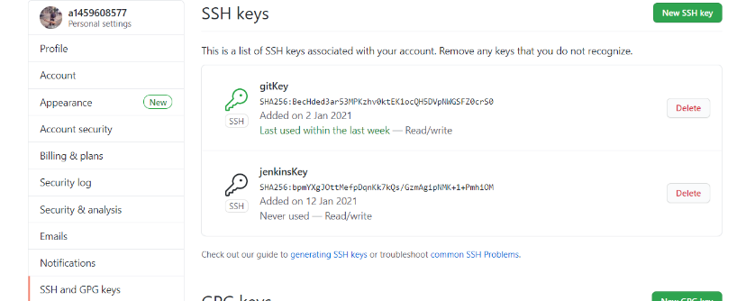
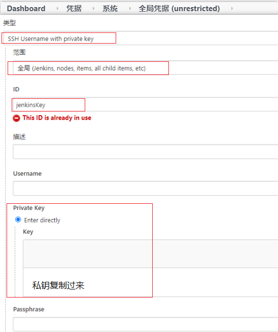
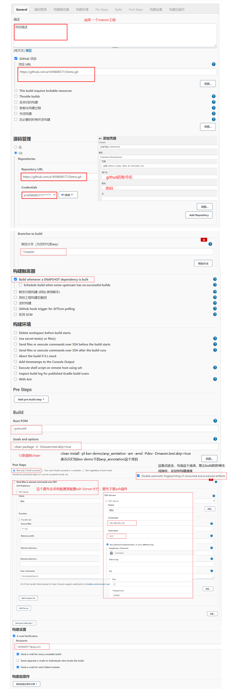

# Jnekins笔记

## Pipeline 模板

````shell
pipeline {

	agent any

	// 参数化构建
	parameters {
		string(name: '代码分支', defaultValue: 'master', description: '这是代码分支')
		booleanParam(name: '是否构建ksn-auth服务', defaultValue: false, description: '构建ksn-auth服务')
		booleanParam(name: '是否构建ksn-gateway服务', defaultValue: false, description: '构建ksn-gateway服务')
		booleanParam(name: '是否构建imgMerge-demo服务', defaultValue: false, description: '构建imgMerge-demo服务')
	}
	
	// 环境变量
	environment {
		url="https://gitee.com/com_ksn/demo.git"
	}
	
	tools {
		maven "maven3.6.3"
	}
	
	// 阶段
	stages {
		stage('拉取代码') {
			steps {
				script {
					echo '开始拉取代码'
					sh "rm -rf /mydata/jenkins_build"
					sh "mkdir -p /mydata/jenkins_build"
					dir('/mydata/jenkins_build') { // dir是一个步骤,表示更换执行目录~
						sh 'echo test'
						git branch:env.'代码分支', credentialsId:'f1014932-4cba-4b91-91a0-3dd1126cbec0', url:env.url
					}
					echo '拉取代码完成'
					retry(3) { // 重试三次
						sh 'echo 重试三次'
					}
					timeout (time:5, unit:'SECONDS') {
						echo '超过五秒钟超时'
					}
					echo '超时后'
				}
			}
		}
		// 构建
		stage('Build') {
			steps {
				script {
					if (env.'是否构建ksn-auth服务' == "true") {
						dir('/mydata/jenkins_build/ksn-auth/') {
							sh "mvn clean package -U -P dev -Dmaven.test.skip=true"
							sh "/mydata/script/build.sh auth"
						}
					}
					if (env.'是否构建ksn-gateway服务' == "true") {
						dir('/mydata/jenkins_build/ksn-gateway/') {
							sh "mvn clean package -U -P dev -Dmaven.test.skip=true"
							sh "/mydata/script/build.sh gateway"
						}
					}
					if (env.'是否构建imgMerge-demo服务' == "true") {
						dir('/mydata/jenkins_build/ksn-demo/imgMerge-demo/') {
							sh "mvn clean package -U -P dev -Dmaven.test.skip=true"
							sh "/mydata/script/build.sh imgMerge"
						}
					}
					def username="ksn"
					echo "${username}构建ksn-auth服务" // 使用字符串插值
					echo "构建次数BUILD_ID: ${env.BUILD_ID} ----- 构建工程名JOB_NAME: ${JOB_NAME} ----- jenkins地址JENKINS_URL: ${JENKINS_URL}" // 使用env获取公共环境变量
					echo "代码分支的值为： ${params.'代码分支'}"  // 使用params来访问自定义的参数
					sh 'mvn --version' // 在tools中定义的工具可以使用对应的命令
				}
			}
		}
		// 部署
		stage('Deploy') {	
			when {
				// branch 'dev'  // 当正在构建的分支与给出的分支模式匹配时执行stage
				//environment name: '代码分支', value: 'master'   // 当指定的环境变量设置为给定值时执行stage
				// expression {return params.DEBUG_BUILD} // 当指定的Groovy表达式求值为true时执行stage
				// not {environment name: '代码分支', value: 'master'}// 当嵌套条件为false时执行stage。必须包含一个条件
				// allOf{environment name: '代码分支', value: 'master'; branch 'master'} // 当所有嵌套条件都为真时，执行stage
				anyOf{environment name: '代码分支', value: 'master'; branch 'master'}  // 当至少一个嵌套条件为真时执行stage
			}
			steps {
				script {
					echo "开始部署"
					dir('/mydata/script/') {
						sh "chmod 777 stop.sh"
						sh "chmod 777 start.sh"
						if (env.'是否构建ksn-auth服务' == "true") {
							sh "./stop.sh auth"
							sh "./start.sh auth"
							echo "auth执行了start脚本"
						}
						if (env.'是否构建ksn-gateway服务' == "true") {
							sh "./stop.sh gateway"
							sh "./start.sh gateway"
							echo "gateway执行了脚本"
						}
						if (env.'是否构建imgMerge-demo服务' == "true") {
							sh "./stop.sh imgMerge"
							sh "./start.sh imgMerge"
							echo "imgMerge执行了脚本"
						}
					}
					echo "完成部署"
				}
			}
		}
	}

	post {
		always {
			echo 'always' // 这个总是会走
		}
		success {
			echo 'success' // 成功了就会走
		}
		failure {
			echo 'failure' // 失败才会走
			mail to: "1459608577@qq.com",
				subject: "Failed Pipeline: ${currentBuild.fullDisplayName}",
				body: "Something is wrong with ${env.BUILD_URL}" // 邮件内容可以自定义
		}
		unstable {
			echo 'unstable' // 不稳定的时候回输出这个
		}
		changed {
			echo 'changed' // 修改了就会走
		}
		aborted {
			echo 'aborted' // 中止了就会走， 一般属于手动取消构建
		}
	}
}
````

#### 基本概念

* agent any: 表示jenkins给这个jenkins分配一个执行者和工作区
* parameters： 展示在执行构建页面上的参数，可以通过env.name获取输入的值
* environment： 环境变量，也可以通过env来获取
* tools： 构建要使用的工具，如maven，git等
* stages:阶段
* stage:执行的每个阶段
* steps:要执行的步骤
* script： 写在执行步骤里的脚本，有些语句要写在脚本里如if
* sh: 要执行的shell命令
* dir： 相当于cd进入这个目录再执行里面的命令
* git：拉取代码的命令可以指定分支，地址，凭证
* retry： 重试机制，具体不太了解
* timeout： 超时机制具体不太了解
* when： 当满足某个条件才执行
* post:这个相当于执行完的回调，可以 在不同的回调中执行代码

### Jenkins流水线执行shell脚本的时候会 吧衍生进程删除掉，就导致虽然发布成功但是java进程被删掉。

1. 针对每个item：在execute shell输入框中加入BUILD_ID=DONTKILLME,即可防止jenkins杀死启动的tomcat进程

2. 永久方案：启动jenkins 的时候禁止jenkins杀死衍生进程
   * 使用java -jar启动，-Dhudson.util.ProcessTree.disable=true -jar jenkins.war
   * 使用Tomcat启动，Linux系统修改catalina.sh，在环境变量的说明后，脚本开始前加上这句话`JAVA_OPTS="$JAVA_OPTS -Dhudson.util.ProcessTree.disable=true"；`修改好Tomcat的配置文件后重新启动Tomcat
   
3. 在启动jenkins 的时候禁止jenkins杀死衍生进程.修改/etc/sysconfig/jenkins配置，在JENKINS_JAVA_OPTIONS中加入-Dhudson.util.ProcessTree.disable=true。需要重启jenkins生效

4. 如果是流水线的话，如下。在Pipeline中是通过设置JENKINS_NODE_COOKIE来让Jenkins不要kill掉Pipeline后台子进程

   ```
   stage('Deploy') {
   	steps {
   		withEnv(['JENKINS_NODE_COOKIE=dontkillme']){
   			script {
   				echo '开始部署！'
   				if (env.'是否构建wallet-system-api' == "true") {
   					dir('/data/code/wallet-system-api/target') {
   						sh "nohup java -jar app.jar > app.log &"
   					}
   				}
   				echo '部署完成！'
   			}
   		}
   	}
   }
   ```

   

### [安装jenkins离线问题](https://blog.csdn.net/qq_34395857/article/details/94635653?utm_medium=distribute.pc_relevant.none-task-blog-BlogCommendFromMachineLearnPai2-3.control&depth_1-utm_source=distribute.pc_relevant.none-task-blog-BlogCommendFromMachineLearnPai2-3.control)

###  Linux上安装jenkins  ### 

#### [安装参考链接  ](https://blog.csdn.net/qq_35868412/article/details/89475386)

##### [配置环境变量链接](https://blog.csdn.net/u014102846/article/details/83017859?utm_medium=distribute.pc_relevant.none-task-blog-BlogCommendFromBaidu-6.control&depth_1-utm_source=distribute.pc_relevant.none-task-blog-BlogCommendFromBaidu-6.control)

#### 1. 首先安装jenkins(参考链接)，配置清华大学的源，然后配置java，maven，git的环境变量。

#### 2. 配置git要生成秘钥(配置git路径时使用which git得到的结果)

```
ssh-keygen -t rsa -C "邮箱" //然后一直按回车就行
```

````
公钥内容在 ~/.ssh/id_rsa.pub
私有内容在 ~/.ssh/id_rsa
````

#### 3. 拿到秘钥之后把公钥配置在github上，把私钥放在jenkins上

#### （可以解决jenkins从github拉取代码不下来的问题）





#### 4.创建一个jenkins项目

* [参考链接1](https://blog.csdn.net/weixin_44747933/article/details/107118059?utm_medium=distribute.pc_relevant.none-task-blog-baidujs_title-10&spm=1001.2101.3001.4242)
* [参考链接2](https://blog.csdn.net/weixin_40400410/article/details/82148335)



#### 5. 注意事项

* 选择的pom.xml中要包含整个项目中有的依赖
* maven中最好指定一下jdk的版本(在setting中配置)

````xml
<profile>
    <id>jdk-1.8</id>
    <activation>
        <activeByDefault>true</activeByDefault>
        <jdk>1.8</jdk>
    </activation>
    <properties>
        <maven.compiler.source>1.8</maven.compiler.source>
        <maven.compiler.target>1.8</maven.compiler.target>
        <maven.compiler.compilerVersion>1.8</maven.compiler.compilerVersion>
    </properties>
</profile>
````

