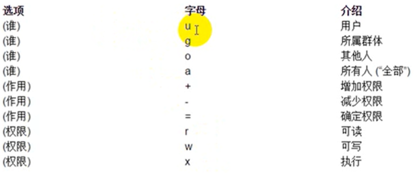

#linux笔记
###
##1. 安装
* 先安装VMware软件，然后安装虚拟机
##2. 命令
###1.关机命令(只能在root账号登陆的时候使用)
* **init0**
* **halt**
* **shutdown -h now**
###3.VM中的备份功能
* **快照：**又称还原点，相当于游戏存档，一般用于频繁使用情况，处于开机状态使用
	* 在VM的菜单栏中 -> 虚拟机 -> 快照
* **克隆：**就是克隆一份一样的 ，一般用于偶尔使用情况，克隆是必须是关机状态
	* 先关机 -> 右键要克隆的虚拟机 -> 管理 -> 克隆(注意要克隆完整的文件而不是链接)
##3.Linux系统的文件
* **Linux一切皆文件**
* 比较重要的文件夹

	* **bin:**全称是binary,含义是二级制，可以被运行
	* **dev:**一般用于存放外接设备，但是不能直接运行，要先挂载(类似windows的分配盘符)
	* **etc:**主要存储配置文件
	* **home:**这个是家目录，里面包含linux账户的信息，类似windows的user/用户目录
	* **proc:**process,表示的是进程的意思，里面包含的都是进程
	* **root:**是root用户的专用家目录
	* **sbin:**全称是super binary 也是存放二进制文件，但是需要super权限的用户才能使用
	* **tmp:**存放系统运行时产生的临时文件
	* **usr:**存放的是用户自己安装的软件
	* **var:**主要存放日志
	* **mnt:**当外部挂载的时候，就是访问的mnt文件夹
##4.Linux的基本指令
###1. 指令与选项
* 一个完整的指令的标准格式

		#指令主体[选项][操作对象]

* #**linux命令手册： https://man.linuxde.net/date**
* #**基本指令**
	1. **ls:**
		* 用法一：**ls** 列出当前目录下的所有文件，文件夹的名称
		* 用法二: **ls 路径**，表示打开指定路径下的所有文件，文件夹
			* 相对路径：需要一个参照物(一般是当前工程)
				* 路径写法： './'[当前目录], '../'[上一级目录]
			* 绝对路径：从根目录开始找
		* 用法三: **ls 选项 路径**， 表示在指定路径下寻找指定文件以指定的格式显示
			* 常见语法： 
				* **ls -l 路径:** 以列表的形式显示所有的文件/文件夹
				* **ls -la路径:** 显示所有的文件/文件(包括隐藏的文件/文件夹)
		  

		红线框起来的第一列表示文件的类型，**'-'表示是文件， 'd'表示是文件夹**，linux中以.开头的都是隐藏文件
		* 用法四: **ls -lh(-lah) 路径**， 表示指定路径下的指定文件的大小以较高可读性显示 
		* **补充：切换输入法，ctrl + 空格** 
		 
	* **pwd:**(print working directory)，表示打印当前工作目录的绝对路径
	* **cd:**(change direectory, 改变目录)，
		* 用法： **cd 路径**(只写路径代表绝对和相对路径都支持)
		* **cd ~:**这个命令直接切换到当前用户的家目录(root目录)
	* **mkdir:**(make directory, 创建目录)，
		* 语法一：**mkdir 路径**(路径可以包含文件夹名称)
		* 
			* 蓝色代表文件夹，黑色代表文件， 绿色代表所有权限都有
		* 语法二: **mkdir -p 路径:**假如要在root目录下创建一个文件夹，mkdir /root/a/b/c,此时root中不包含a，b，c文件夹，使用**mkdir 路径**创建不了，加个-p就可以了，这个命令可以一次创建多个不存在的文件夹
	* **touch:**创建文件
		* 语法： **touch 文件路径  或者  touch 文件路径1 文件路径2**
	* **cp:**
		* 语法: **cp 被复制的文件路径 复制到的文件的路径**, linux复制的时候可以改名，windows不可以(一般不推荐)
		* 使用cp命令复制文件夹的时候需要在后面加**-r**，否则，要复制的文件夹会被忽略， **cp -r 路径 路径**
			* **-r**表示递归复制
	* **mv:**(move，移动)相当于windows里的剪切
		* 语法： **mv 被剪切的文档路径 剪切到的文档路径**
	* **rm：**(删除文件或文件夹)
		* 删除文件： **rm -f 路径下的文件**, 如果不想输入y，可以在后面加**-f**(force:强制)，强制删除
		* 删除文件夹： **rm -rf 路径下的文件**也是递归删除，可以删除文件夹且不需要确认
		* 删除多个文档： **rm -rf 要删除的路径1 要删除的路径2**
			* 简写： **rm -rf 路径/linux***： *表示通配符，删除路径下所有linux开头的文档
	* **vim:**用来打开文件
		* 语法： **vim 文件路径**
		* 退出的方法： 在没有按其他键的情况下，**shift+:**， 然后输入 **q 回车**
	* **> or >>(输出重定向)** 例如： **ls -ah > 要输出到的路径**，文件可以不存在，不存在则自动新建
		* **>:**这个是覆盖输出，就是会覆盖文件原来的内容
		* **>>:**这个是追加输出， 在文件内容的末尾继续添加
	* **cat：**
		* 语法： **cat 要打开的文件路径** ，类似vim命令，会直接打开文件并退回到命令行
		* 作用二： 合并文件，**cat 待合并路径1 待合并路径2 ...待合并路径n > or >> 要合并的路径**把两个文件和成一个文件
		
* #**进阶指令**	
	1. **df：**查看磁盘分区
		* 语法： **df -h**
		*  
			* filesystem: 文件系统
			* size： 大小
			* used： 使用情况
			* avail： 总共多大
			* use%：使用百分比
			* mounted on： 挂载在哪里
	* **free：**查看磁盘使用情况
		* 语法： **free -m:**(-m表示以m为单位计算大小，不写-m则默认是以kb来计算，也可以使用-g)
		*  
			* 要看第二行，free是可用内存，真是可用内存为439
			* swap是临时内存
	* **head:**作用是查看某个文件的前n行 
		* 语法： **head -n 文件路径**(-n中的n必须是数字)
	* **tail:**作用是查看某个文件的后n行 
		* 语法1： **tail -n 文件路径**(-n中的n必须是数字)
		* 语法2： **tail -f 文件路径**
			* 作用是实时监控文件的动态变化
	* **less：**查看文件，以较少的内容进行输出，按下辅助功能键(数字+回车，空格键+上下左右方向键)查看更多
		* 语法： less 文件路径
	* **wc:**用来统计(行数， 单词数， 字节数)
		* wc -l 要统计的文件路径(统计行数-l:lines)
		* wc -w 要统计的文件路径(统计单词数-w:words)
		* wc -c 要统计的文件路径(统计字节数-c:bytes)
		* 直接 wc 要统计的路径: aaa bbb ccc 路径名(aaa是行数，bbb是单词数， ccc是字节数)
	* **date(重点)：**用来读取或设置时间
		* 获取当前时间
			* 语法一： **date**--------------  输出： 2019年2月12日 星期六 20：12：12
			* 语法二: **date +%F**(一定要写+号，F必须大写，等价于**date +%Y-%m-%d**) ---------------输出： 20：12：12
			* 语法三： **date "+%F %T"**(等价于**date "+%Y-%m-%d %H:%M：%S"**)  输出结果： 2020-12-12 12：12：12
		* 获取之前或者之后的时间点
			* 语法四： **date -d "-1 day" "-%F"** 输出： 2020-02-05(当前日期为2020-02-06)数字为正就是往后几天
	* **cal：**用来操作日历
		* 语法一： **cal** 输出当前月份的日历
		* 语法二： **cal -3** 输出当前月份的前一个月份， 当前月份， 当前月份的后一个月份
		* 语法三： **cal -y 2020** 输出指定年份的全部日历
	* **clear or ctrl + L:**清空终端(并不是真的清除)
	* **管道(重点):**管道符：**|**, 管道符一般用于**过滤**，**特殊**， **扩展处理**
		* 过滤案例： 输出根目录下带y的文档，**ls /|grep y**(grep是过滤指令)
		* 扩展案例： 使用wc指令统计根目录下有多少个文件， **ls /| wc -l**
		
* #**高级指令**		
	1. **hostname:**读取，设置主机名
		* 语法一： **hostname** 输出的是完整的主机名
		* 语法二： **hostname -f** 输出的是主机名中的**FQDN(全限定域名)**
	* **id：**
		* 语法一： **id** 输出  
		
		 
		* 语法二： **id 用户名**，是输出指定用户名的信息  
		
		
		* uid是用户id， gid是用户组， 组就是附加组
		* 验证用户信息： /etc/passwd
		* 验证用户组信息： /etc/group
 	* **whoami:**(“我是谁”指令),作用是显示当前登录的用户
	 	* 语法一： **whoami** 输出结果： root
	* **ps -ef:**作用是查看服务器进程
		* **-e(等价于-A)代表是查看全部进程，-f是显示进程的全字段(就是显示所有列)**
		
		
		* 案例：在结果中过滤要找的， **命令：ps -ef|grep 进程名**
	* **top：**作用是查看服务器进程占用的资源
		* 语法： **top，按q键退出**
		
		
		
		* M:在top命令下按M键，根据MEM排序
		* P:在top命令下按P键，根据%CPU排序
		* 1:默认显示一个cpu，按1显示所有cpu的使用情况
	* **du -sh:**作用是查看目录的真实大小
		* 语法： **du -sh 目录路径**
		* **-s:是代表显示汇总的数量，-h：是代表以kb，mb，或者gb来统计**
		* 查看当前目录下每个文件占比大小`du -ah --max-depth=1`
	* **find**： 作用是查找
		* 语法： **find 查找范围路径 选项 选项的值**
		* 选项L: 
			* **-name：**根据文档的名称来查(支持模糊查询)
			* **-type：**有两种类型- or d, -**代表文件(在这里用f表示)，d代表文件夹**
	* **service(重点)：**作用是控制一些软件服务的启动/停止/重启
		* 语法： **service 服务名 start/stop/restart**
	* **kill:**杀死进程
		* 语法一： **kill 进程PID**
		* 语法二： **killall 进程名**
	* **ifconfig(重点)：**获取网卡信息
		* 语法： **ifconfig**
	* **reboot:**重启计算机
		* 语法一： **reboot**
		* 语法二： **reboot -w**(模拟重启，但是不重启，在日志中 记录重启但是实际没有重启)
	* **shutdown：**关机 
		* 语法一： **showdown -h now "关机提示语" 或者 shutdown -h 21:26 "关机提示语"(在21:26将会关机，定时关机)**
		* 类似的关机命令
			* init0
			* halt
			* poweroff
	* **uptime：**输出持续在线时间(从开启到现在有多久)
		* 语法： **uptime**
	* **uname:**获取计算机系统信息
		* 语法一： **uname**  ，输出Linux，是获取操作系统的名称
		* 语法二： **uname -a** 输出的是操作系统的信息
	* **netstat -tnlp：**查看网络的来链接状态
		* 语法： **netstat -tnlp**
		* 选项： 
			* -t:只显示tcp协议的
			* -n:把地址转换成ip地址+端口号
			* -l:只显示listen状态的
			* -p:显示PID和进程名
	* **man：**(linux中所有命令的手册，全称是manual，手册的意思)
		* 语法 **man 命令名**， 退出按q

* #**练习**	
	* 重启虚拟机： reboot
	* 在命令行中快速删除光标前/后的内容： CTRL+u，ctrl+L
	* 删除tmp下以A开头的文件： rm -f /tmp/A*
	* 把/etc/passwd备份到/tmp下：cp /etc/passwd /tmp
	* 查看系统最后创建的三个用户：tail -3 /etc/passwd
	* 统计当前有多少账户：wc -l /etc/passwd
	* 创建/tmp/test.conf文件：touch /tmp/test.conf
	* 如何通过vim打开test.conf文件：vim test.conf
	* 如何查看/etc/passwd的前三行和后三行：head -3 /etc/passwd ，tail -3 /etc/passwd 
	* 如何一次性创建目录/root/1/2/3：mkdir -p /root/1/2/3
	* 最快返回当前用户的家目录：cd ~
	* 如何查看/etc占用的磁盘空间：du -sh /etc
	* 删除/etc下所有的文件： rm -ef /etc/*
	* 启动apache服务：service httpd start
	* 杀死apache进程： kill httpd

##5.Vim编辑器

#**三种模式**
* 命令模式：只能按快捷键(打开默认进入这个)
* 编辑模式：可以修改文件内容
* 末行模式：输入命令来操作文件(搜索，替换，保存，退出，撤销，高亮)
* vim打开文件的4种方式
	* **vim 文件路径，作用：打开指定文件**
	* **vim +数字 文件路径 作用：打开指定路径文件的第几行**
	* **vim +/关键字 文件路径 作用：打开文件并高亮显示关键字**
	* **vim 文件路径1 文件路径2 作用：打开多个文件**
#**1.命令模式**	
* 移动光标
	* 移动光标到第一行：**gg(按键)**
	* 移动光标到最后一行：**G(shirt + G)**
	* 移动光标到行首：**ctrl + 6(不是小键盘上的6)**
	* 移动光标到行尾：**ctrl + 4(不是小键盘上的4)**
	* 向上翻页：**ctrl + b**
	* 向下翻页：**ctrl + f**
* 复制粘贴
	* 复制当前行:**yy**
	* 往下复制指定行：**数字yy**
	* 粘贴：**p**
	* 自定义复制：**ctrl + v，然后上下左右键选择复制内容**
* 剪切/删除
	* 剪切后粘贴就是剪切，不粘贴就是删除： **dd**
	* 往下剪切几行： **数字dd**
	* 剪切一行不往上移动： **D**
* 撤销/恢复
	* 撤销： **u**
	* 恢复： **ctrl + r**
* 光标移动扩展： 
	* 移动到第几行： **数字G**
	* 向上/下移动指定行数： **数字 + 方向上/下键**
	* 向左/右移动指定行数： **数字 + 方向左/右键**
	* 末行模式中输入数字然后回车光标就到了指定的行数
	
#**2.模式之间的切换**	 
* 
* 命令模式->末行模式
	* 进入：**shift + ：**
	* 退出：**按一下esc或者按两下或者删除末行中所有内容**

#**3.编辑模式**	
* 进入方式：
	* 
	* 记住前两个**i，a。退出是按esc**

#**4.末行模式**	
* 保存
	* 保存： **:w**
	* 另存为： **:w + 空格 + 路径**
	* 退出： **q**
	* 保存并退出： **：wq**
	* 强制退出： **!**
	* 调用外部命令： **! + 直接在末行模式中输入外部命令**
* 查找/搜索
	* **/ + 关键词**
	* 在查找结果中，光标在结果中上/下移动： **N/n**
	* 取消高亮： **nohl(no height light)**
* 替换
	* 输入**s/要替换的/新代替的**(只会替换光标所在行符合条件的第一个)
	* 输入**s/要替换的/新代替的/g**(会替换光标所在行符合条件的所有选项)
	* 输入**%s/要替换的/新代替的/**(会替换整个文件符合条件的行的第一个)
	* 输入**%s/要替换的/新代替的/g**(会替换整个文件中所有符合条件的)
* 显示行号
	* **set nu(number)**
	* 不显示行号： **set nonu**
* 扩展
	* 查看使用vim打开的多个文件： **files**
		* 
		* **%a表示当前打开的文件**
		* **#表示上一次打开的文件**
	* 切换文件
		1. 打开文件：**open 同时打开的文件名**
		2. 切换文件上一个：**bp(back previous)**
		3. 切换文件下一个：**bn(back next)**

#**5.实用功能**
* 控制代码着色
	* 打开代码着色：**syntzx(语法) on**	
	* 关闭代码着色：**syntzx(语法) off**	
* vim中计算器的使用
	* 

#**6.扩展**
* vim的配置有三种
	* 临时配置文件
	* 个人配置文件(~/.vimrc)
	* 全局配置文件(/etc/vimrc)
* 永久设置行数
	* **创建一个个人配置文件，用编辑模式输入set nu然后切换到末行模式，然后wq保存就可以了**
	* 优先级： **个人配置文件>全局配置文件**
* 解决异常退出
	* 把交换(临时)文件(ls -a命令中以.开头以.swp结尾的文件就是临时文件)删除即可
* 别名机制：**作用是给命令起别名，类似创建自己的命令**
	* 
	* 先打开**~/.bashrc目录**，上面是格式，cls是自己写的别名，**要生效的话必须重新登录或重启**
* 退出方式
	* **:x(小写)**：融合了：q跟：wq的功能，也是保存退出
	* **:X(大写)**：大写是加密文件

#6.linux的自有模式

* 介绍： 就是不用安装软件就能使用的(内置的)服务

##**1.运行模式(运行级别)**
* 
	* 上图是/etc/inittab文件中的主要内容，在centos6.5中有7种隔离级别(需要root权限)
	* **0：**是关机级别(不要将默认运行级别设置成0)
	* **1：**是单用户模式
	* **2：**多用户模式，不带NFS(Network File System)
	* **3：**完整的多用户模式
	* **4：**没有被使用的模式(保留模式)
	* **5：**X11就是完整的图形化界面
	* **6：**表示重启级别(不要将默认运行级别设置成6)
	* 相关命令：
		* **init 0**：表示关机
		* **init 3**：切换到不带桌面的模式(纯命令模式下)
		* **init 5**：表示切换到图形化界面
		* **init 6**：表示重启
	* 其实都是调用init进程，然后传一个运行级别数字过去，然后执行
* 运行init 3指令进入纯命令模式(临时切换，重启后有恢复到图形化界面)
	* 
	* 退回到图形化界面就是**init 5**
* 设置为永久命令行模式
	* 就是把**/etc/inittab**中的init5改成init3即可
##**2.用户与用户组管理(重点)**
* 要实现的功能
	* 用户账号的添加，删除，修改及用户密码的管理
	* 用户组的管理
* 三个要注意的文件
	* **/etc/passwd:**存储用户的信息
	* **/etc/group:**存储用户组信息
	* **/etc/shadow:**存储用户密码信息
* 添加用户
	* 语法： **useradd 选项 用户名**
	* 常用选项： 
		* **-g:**就是可以给用户指定用户主组，选项的值是用户组id或者用户组名
		* **-G:**就是可以给用户指定用户附加组，选项的值是用户组id或者用户组名
		* **-u:**就是uid(用户的标注)，用户的id
		* **-c:**添加注释
	* 案例： 创建用户张三并检测是否创建成功
		* 
		* 第二种方式是查看是否存在家目录，**ls /home/**(因为用户创建好会在家目录创建一个同名的文件夹)
	* 扩展：了解一下passwd文件内容
		* 
			* zhangsan是用户名： 创建的新用户的名称，后期登录需要用到
			* x是密码：表示密码的占位
			* 第一个501是用户id：用户的识别符
			* 第二个501是用户组id：该用户所属的主组
			* ：：是注释： 解释该用户是干嘛用的
			* /home/zhangsan：这个家目录的路径
			* /bin/bash是解释器 shell：收集用户的命令，传递给内核处理
	* 案例： 创建一个用户组为501，用户id为666，用户附属组为500的名为lisi的用户
		* 
* 修改用户
	* 语法： **usermod 选项 用户名**
	* 常用选项：
		* **-g:**就是可以给用户指定用户主组，选项的值是用户组id或者用户组名
		* **-G:**就是可以给用户指定用户附加组，选项的值是用户组id或者用户组名
		* **-u:**就是uid(用户的标注)，用户的id
		* **-l：**表示修改用户名
* 设置密码
	* 语法： **passwd 用户名**
	* 切换用户命令： **su [用户名]**(用户名不填就是默认切换到root用户)
* 删除用户
	* 语法： **userdel 选项 用户名**
	* 常用选项： 
		* **-r：**表示在删除用户的时候同时将其家目录也删除
	* 如何删除已经登录的用户
		* 找到登录用户的进程，然后把父进程杀掉，**kill 父进程id**，然后在执行userdel
* 用户组管理
	* 作用：用来集中管理用户，对用户组进行添加，修改，删除等操作
	* 
	* 文件结构：
		* 用户组名：密码占位符：用户组id： 组内用户(asdf)
	* 添加用户组
		* 语法： **groupadd 选项 用户组名**
		* 常用选项：**-g**，用户组id，不指定就从500开始递增
	* 修改用户组
		* 语法： **groupmod 选项 用户组名**
		* 常用选项： 
			* **-g：**用户组id，不指定就从500开始递增
			* **-n：**用来设置用户组的名称
	* 删除用户组
		* 语法： **groupdel 用户组名**
		* 细节： 当要删除的组中有用户，则不能删除，一定要删除就要先移除用户
##**3.网络设置**
* 
	* 上面是网卡配置文件的路径，这里面都是网卡，网卡的命名规范： **ifcfg-网卡名**
	* 
	* 扩展
		* 重启网卡的两条命令(重启全部网卡)：
			1. **service network restart**
			2. **/etc/init.d/network restart(通用性比较强，/etc/init.d下方的都是对服务的快捷方式)**
		* 创建快捷方式的命令：**ln -s 原始文件路径 快捷方式路径**，然后就可以通过修改快捷方式来修改文件了
		* 重启单个网卡：
			* 1. 停止某个网卡： **ifdown**
			* 2. 启动某个网卡： **ifup**
##**4.ssh服务**
* ssh(secure shell，安全外壳协议)
	* **有两个作用，远程连接协议(主要作用)，远程文件上传协议**
	* **协议使用端口默认是22**，如需修改，则要修改ssh的配置文件(路径为：**/etc/ssh/ssh_config**)
	* 
		* 上图中**prot就是端口号**，**取值范围： 0-65535(两位十六进制的最大值)**
		* 端口的值不能占用别的服务已经占用的端口
	* 服务的重启
		1. **service shhd start/stop/restart**
		2. **/etc/init.d/sshd start/stop/restart**
* 远程终端
	* 用来远程连接的常用软件有，Xshell,Putty,secureCRT,以putty为例
	* 1.先用**ifconfig**命令检查IP地址，然后顺手测试一下通不通   
	* 
	* 2. 打开putty，输入相关的信息
	* 
	* 
		* 这里也是一样输入root，密码不会显示，输入后回车即可
* ssh服务文件传输
	* 1. 要安装的软件： **FileZilla**
	* 步骤1：选择文件->站点管理器
	* 
	* 步骤2： 
	* 
	* 连接成功截图
	* 
	* 步骤三：从windows本低上传文件到linux中，直接在windows中把文拖拽到linux区域，也可以右键本地文件，然后点击上传，从linux下载也是一样，从linux推拽过来即可
	* 扩展：通过命令行传输文件
		* 工具： **PSCP(只能通过命令行打开)**，为了 使用方便，加入到环境变量，成功截图如下
		* 
		* 用法
			* **1. pscp 选项 用户名@ linux主机地址:资源路径 windows本地地址(下载到windows)**
			* **2. pscp 选项 资源路径 用户名@linux主机地址：远程地址(上传到linux)**
			* **3. pscp 选项 ls 用户名@linux主机地址(列出远程路径下结构)**
		* 下载到本地windows(把linux中/etc下的所有文件下载到windows下的G：/tmp目录下)
			* 命令：**pscp -r root@192.168.6.129:/etc/* G:\tmp**
			*  
		* 上传文件到linux(把G：/tmp上传到linux中root目录下)
			* 命令： **pscp -r G:\tmp root@192.168.6.129:/root**，如果路径中包含空格，则需要用**""**括起来
			*  
##**5.设置主机名**
* 临时修改主机名的语法： **hostname 要设置的主机名**
* 永久设置主机名(需要重启)：
	* 主机名的配置文件路径： **/etc/sysconfig/network** ，修改其中的hostname即可
	* 但是想让hostname -f命令生效还需要修改linux的hosts文件，让他指向本地(设置一个FQDN)，路径： **etc/hosts**
		*  
		* 把设置的aaa加到里面
* 设置FQDN步骤总结： 先设置临时的-> 在设置永久的 (改配置文件) -> 添加一个只指向(修改/etc/hosts文件)
##**6.chkconfig**
* 作用：用做开机启动项的管理
* 1.查看开机启动项
	* 语法： **chkconfig --list**，其中0-6代表运行级别，在哪个运行级别下是否启用(on)/关闭(off),为关闭则是开机不启动
	*  
* 2.删除服务
	* 命令： **chkconfig --del 服务名**，以删除httpd为例子
	*  
* 3. 添加开机启动服务
	* 命令： **chkconfig --add 服务名**
	*  
* 4.设置某个服务在某个运行级别下启动/关闭
	* 命令： **chkconfig --level(级别的意思) 35 服务名 on/off(启动/不启动)**，35的意思是在运行级别3和5下启动服务
	* 
##**7.ntp服务**
* 作用： 对计算机的时间进行同步管理
* 一次性同步时间(手动同步时间): 
	* 命令： **ntpdate 上游服务器的 ip或域名**
	* 上游时间服务器的网址： **http://ntp.org.cn/pool.php**
	* 
* 自动设置时间同步(设置时间同步服务)
	* 服务名： **ntpd**
	* 启动服务： **service ntpd start**启动服务即可，然后设置成开机自启： **chkconfig --level 35 ntpd on**
##**8. 防火墙服务**
* 作用： 防止网络攻击
* 当前centos系统中防火墙名称： **iptables**(centos7.x版本中名为:**firewalled**)
* 1.查看是否开机自启
	* 
* 2.对iptables进行启动/关闭操作
	* 命令： **service iptables start/stop/restart**
	* 
* 3.查看iptables的状态(规则)
	* 命令： **service iptables status**
	* 	
* 4.查看防火墙规则的命令
	* **iptables -L -n**
	* **-L：**表示列出规则
	* **-n：**表示把字母变成数字显示
* 5.简单设置防火墙规则
	* 命令 ： **iptables -I INPUT -p tcp --dport 80 -j ACCEPT**
		* **iptables：**主命令
		* **-I：**add，添加规则(如果使用的是-A，则会把规则添加到末尾，使用-I则会添加到行首)
		* **input：**进站请求，(出站请求ouput)
		* **-p：**protocol，指定协议(tcp/icmp/udp)
		* **--dport：**指定端口号
		* **-j：**指定行为结果，允许(accept)/禁止(reject)
	* 执行后需要保存命令： **/etc/init.d/itables save**
	* 	
##**9.rpm管理**
* 作用： 对linux系统上的软件进行安装，卸载，查询
* 1.查询
	* 命令： **rpm -qa(queryAll的缩写) | grep 关键词**
		* **-q：**表示查询
		* **-a：**表示全部
* 2.卸载
	* **rpm -e 软件名称**
	* 删除火狐是没有依赖关系，但是删除httpd(apache)的时候有依赖关系，忽略依赖关系直接删除
		* **rpm -e 软件名称 --nodeps**
* 3.安装
	* 查看块状设备的信息： **lsblk(list block devices)** 
	* 
	* 扩展： 光盘的挂载与解挂
		* 解挂：
			* 命令： **umount**
			* 语法： **umount 挂载路径**
			* 
		* 挂载： 
			* 命令： **mount**
			* 语法： **mount 文件的原始路径 要挂载的位置**
				* 设备原始地址： **/dev/sr0**
				* 挂载的地址(一般情况都是这个)：**/mnt**
		* 
	* 安装的命令： **rpm -ivh 软件的完整名称**
		* **-i:**install，下载
		* **-v:**显示进度条
		* **-h:**表示以#代表进度条
		
##**10.cron/crontab任务计划** 

* 作用： 24小时值守
* 命令： **crontab 选项**
	* **-l：**list，列出指定用户的计划列表
	* **-e：**edit,修改指定用户的计划列表
	* **-u：**user，不指定用户就代表是当前用户
	* **-r：**remove，删除指定用户的计划列表
* 查询有无计划列表
	* 
* 修改计划列表(重点)
	* 计划任务的规则语法格式： 以行为单位，一行就是一个计划
	* **分 时 日 月 周 需要执行的命令**(格式)
	* 例如：每天0点0分执行reboot命令就是： **0 0 * * * reboot**(没指定就是*)
	* 取值范围
		* 分：0-59
		* 时：0-23
		* 日：1-31
		* 月：1-12
		* 周：0-6，0表示星期天
	* 四个符号
		* *：表示全部，取值范围里的每一个数字
		* -：做区间表达式，加入要表示1~7，就写成1-7
		* /：表示每多少，例如1m/s，加入想十分钟执行一个命令，就在分的位置写*/10
		* ,：表示多个取值，假如想在2点，6点的时候执行命令，就可以在点的位置写2,6
* 案例： 
	1. 每月的1，10，22日的4：45重启network服务：45 4 1,10,22 * * service network restart
	2. 每周六周日的1：10重启network服务： 10 1 * * 0,6 service network restart
	3. 每天18：00到23：00之间每隔30分钟重启network服务： */30 18-23  * * * /etc/init.d/network
	4. 每隔两天的上午8点到11点的第3和第15分钟重启network服务：3,15 8-11 */2 * * service network restart
	5. 每5秒中往root家目录的RT.txt文件中输入当前时间信息，使用追加输出
* crontab的权限问题
	* 本身是任何用户都可以创建自己的计划任务，超级管理员可以设置不让某些用户创建计划任务
	* 配置文件路径： **etc/cron.deny(黑名单)** ，在里面写用户名，一行一个，写了就没有权限了
	* 
	* 
	* 另一个配置文件路径:**/etc/allow(白名单)**,（本身不存在，自己创建）
	* 优先级： **白名单 > 黑名单**

##**11.权限管理操作**
* linux系统一般将文件可存/取/访问的身份分为三个类别： owner， group， others且三种身份各有read(读)，write(写)，execute(执行)等权限
	* 读权限： 
		* 对文件夹来说，读权限影响用户是否能够列出目录结构
		* 对文件来说，影响用户是否可以查看文件内容
	* 写权限：
		* 对文件夹来说，影响文件夹的创建/删除/移动/复制文档
		* 对文件来说，影响文件是否可以编辑
	* 执行权限： 
		* 一般都是对文件来说，特别是脚本文件
* 身份介绍
	* Owner身份(文件所有者，默认是文档的创建者)
		* 除文件所有者外其他人无法查看
	* Group身份(与文件所有者同组的用户)
		* 多个团队在同一台主机上 工作时，a组不能查看b组
	* Others身份(其他人)
		* 例如： 大明有一套房子，里面住着大明(owner)和二明(group)，然后有个外人张三 ，张三(others)就是others身份
	* Root用户(超级管理员)
* 权限介绍
	* **ls -l(等价于ll)**
	* 
	* 
	* 十位字符的含义(都是rwx三个参数的组合，且顺序不变)
		* 第一位表示文档类型，”-“表示文件，”d“表示文件夹，”l“表示软连接，”s“表示套接字
		* **2-4位表示文档所有者的权限情况(owner)**
			1. 第二位表示读权限的情况，取值有**r(可读)，-(没有权限)**
			2. 第三位表示写权限的情况，取值有**w(可修改)，-(没有权限)**
			3. 第四位表示执行权限的情况，取值有**x(可执行)，-(没有权限)**
		* **5-7位表示与文件所有者同在一个组的权限情况(group)**
			1. 第五位表示读权限的情况，取值有**r(可读)，-(没有权限)**
			2. 第六位表示写权限的情况，取值有**w(可修改)，-(没有权限)**
			3. 第七位表示执行权限的情况，取值有**x(可执行)，-(没有权限)**
		* **8-10位表示其他人的权限(others)**
			1. 第八位表示读权限的情况，取值有**r(可读)，-(没有权限)**
			2. 第九位表示写权限的情况，取值有**w(可修改)，-(没有权限)**
			3. 第十位表示执行权限的情况，取值有**x(可执行)，-(没有权限)**
* 权限设置
	* **chmod 选项 权限模式 文档**
	* 注意事项(字母形式)： 
		* 常用选项： **-R**，表示递归设置权限
		* 权限模式： 就是该文件需要设置的文件信息
		* 文档： 可以是文件或文件夹
		* 注意点：如果要给文档设置权限，他必须是文档所有者 或者root用户
	* 
		* 给谁设置： 
			* **u：**表示user，就是文件所有者(owner)
			* **g:**表示所有者的同组用户(group)
			* **o:**表示其他用户(others)
			* **a:**表示给所有用户设置权限，(设置权限时不指定用户则默认给所有用户设置)
		* 权限分配方式：
			* **+：**表示给用户新增权限
			* **-：**给用户删除权限
			* **=：**表示将权限设置成具体的值
		* 权限字符：
			* **r:**可读
			* **w:**可写
			* **x:**可执行
	* 
	* 数字形式：
		* 
		* 语法： **chmod 选项 数字(777) 文档**
* 注意事项
	* 使用root权限创建一个文件夹的权限如下
	* 
	* 然后在oo里创建a.txt，给a.txt777的权限
	* 
* 属主与属组设置
	* 属主：所属的主人(文件的主人)
	* 属组：所属的用户组
	* 
	* 如果有时候要删除用户时，就要修改其对应的属主和属组信息
		* 1.chown
			* 作用： 更改文档的所属用户
			* 语法： **chown -R username 文档路径**
			* 
		* 2.chgrp
			* 作用： 更改文档所属用户组
			* 语法： **chgrp -R groupname 文档路径**
			* 
	* 把两个命令合二为一： **chown -R username：groupname 文档路径**
* 扩展
	* 
	* Sudo配置文件路径： **/etc/sudoers**
	* a.配置sudo文件要使用**visudo**，使用方法和vim一致
	* b.配置普通用户权限
	* 
	* 
		* 这里建议写指令的路径，查看指令路径的命令是： **which 指令名称**
	* 
	* 然后切换用户asdf执行指令会报错原因是前面没有加**sudo**
	* 
	* 普通用户怎么查看自己可执行的指令： **sudo -l**
	* 

#**7.linux的网络基础**
##**1.网络相关命令**
* **ping：**检测当前主机和目标主机之间的连通性(不是百分百准确)
	* 语法： **ping 主机地址(ip地址，主机名，域名)**
	* 测试与百度之间的通信
	* 
* **netstat：**查看网络的来连接信息
	* 语法一： **netstat -tnlp**
		* **-t:**表示tcp协议
		* **-n:**将字母转换成数字
		* **-l:**列出状态为监听
		* **-p:**显示进程相关信息
	* 语法二： **netstat -an**
		* **-a:**表示全部
		* **-n:**将字母转换成数字
* **traceroute：**查找当前主机和目标主机之间的所有网关
	* 语法： **traceroute 主机地址**
	* window也有这个命令： **tracert**
	* 在线工具网址： **http://tool.chinaz.com/map.aspx**
* **arp：**查看本地缓存mac表，在window下同样适用
	* 
	* 语法： **arp -a**
	* 删除指定的缓存记录： **arp -d 主机地址**
	* 
* **tcpdump(了解)：**用来抓包的
	* 
	* 语法：
		* **tcpdump 协议 port 端口**
		* **tcpdump 协议 port 端口 host 地址**
		* **tcpdump -i 网卡设备名** 
##**2.shell基础**
###shell入门
* 编写规范：
	
		#!bin/bash:指定告知系统当前这个脚本要使用的shell(解释器)
		Shell相关指令
* 文件命名规范：**文件名.sh**(.sh就是后缀)
* 使用流程: 
	* 1.先创建一个.sh文件： touch /vin.sh
	* 2.编写shell代码
	* 3.执行shell脚本: 要有执行权限
* 案例： 用shell简本输出hellow world
	* 输出命令： **echo 内容**(内容就是要输出的文字)
	* 注意： 如果输出的内容种包含字母和数字，则需要用引号包起来
	* 
	* 
* 案例二：使用root用户创建并执行test2.sh，实现创建一个shelltest用户，并在其家目录中新建try.html
	* 
	* 脚本执行的另一种方式： **/bin/bash 脚本的路径**
###shell进阶
* 变量：
	* 定义： **name="aaa"**
	* 使用： **echo $name**
	* 
	* 双引号能识别变量和实现转义(例如*，加个\就变成了乘法的意思\*)，单引号不行
	* 案例：定义一个变量，输出当前时间
	* 
	* 反引号： **`**，当在脚本中需要执行外部命令并且赋值给变量时，要用反引号括起来
* 只读变量： **readonly 变量名**
	* 
* 接受用户输入：
	* 语法： **read -p 提示信息 变量名**
	* 
* 删除变量：
	* 语法： **unset 变量名**
	* 
* 条件判断语句
	* 语法一：**单行写法：if [condition];then command;fi**
	
			if condition(条件)
			then(表示Java中“(”)
				command1(这里面写指令)
				command2...
			else 
				command3
			fi(表示Java中“)”)
	* 语法二： 
		
			if condition1				if () {
			then							command1
				command1				} else if () {
			elif condition2					command2
			then						} else {
				command2					command3							
			else						}
				command3
			fi	
* 运算符
	* **算数运算符**
		* 
		* 
	* **关系运算符**
		* 
	* **逻辑运算符**
		* 
	* **字符串运算符**
		* 
	* **文件测试运算符**
		* 
	* **shell脚本附带选项**
		* 问题描述： 怎么在shell中处理 tail -n 10 access.log这样的命令行选项？
			* 1.调用tail指令
			* 2.系统把后续选项传递给tail
			* 3.tail先打开指定的文件
			* 4.然后取最后十行
		* 问题：自定义指令
			* 传递(就是在命令行输入)：**./test.sh a b c**
			* 接受： 在脚本中可以用“$1”来表示a，“$2”表示b
		* 测试： 编写一个shell脚本，传递a b c 并输出其值
		* 
		* 练习
		* 
		* 
		* 然后自定义指令吧**./test9.sh**给个别名叫**user**就可以了
#**8.安装软件**
###安装ncurses
* 
	* 1.先把软件压缩包上传到服务器
	* 2.解压
	* 3.切换到源码文件夹，然后执行后续操作
	* 配置(config/configure/bootstrap) => 编译(make/bootstrapd) => 安装(make install/bootstrapd install)
		* 指定安装路径： **--prefix=路径**
		* 
* 
* 
###安装mysql
* 使用yum安装：**yum install mysql-server**
###初始化mysql
* 1.**service mysqld start**
* 2.**mysql _ secure _ installation**
* 3.然后输入mysql中root用户的密码，如果没有就按回车
###mysql的启动控制
* 语法： **service mysqld start/stop/restart**
* 进入mysql的方式：**mysql -u用户名 -p**
* 退出mysql： **exit**或者**ctrl + c**
* 远程连接mysql： **flush privileges;**(需要先把mysql库中的user表中user名为root的host改成“**%**”)
###默认目录/文件位置
* 数据库储存目录： **/var/lib/mysql**
* 配置文件： **/etc/my.cnf**
###mysql基本操作
* 
* 
###安装nginx
* 官网： **http://nginx.org/**
* 在服务器直接下载： **wget 下载连接**
	* 下载到/usr/local/pan
	* 指令： **wget http://nginx.org/download/nginx-1.17.8.tar.gz**
* 然后解压： **tar -zxvf nginx-1.17.8.tar.gz**
* 配置编译安装的时候遇到报错：没有PCRE库
	* 
	* 解决： 直接yum安装pcre-devel。指令：**yum install pcre-devel**
* 然后有报错说缺少zlib
	* 
	* 解决： **yum install zlib-devel**
* 然后还要下载zlib的压缩包
* 最终命令： **./configure --prefix=/usr/local/nginx --with-pcre --with-zlib=/usr/lib**
* 然后make 和 make install
* 
* 
* nginx的启动及重载指令
	* 启动： **安装路径+回车即可(/usr/local/nginx/sbin/nginx)**
	* 重载： **安装路径 -s reload(/usr/local/nginx/sbin/nginx -s reload)**
* 卸载已经安装的软件时需要先停止服务，然后**rm -rf 软件安装目录**
###关于LAMP(Linux + Apache + Mysql + PHP)

