# Netty笔记

## I/O模型

### BIO（同步阻塞）

### 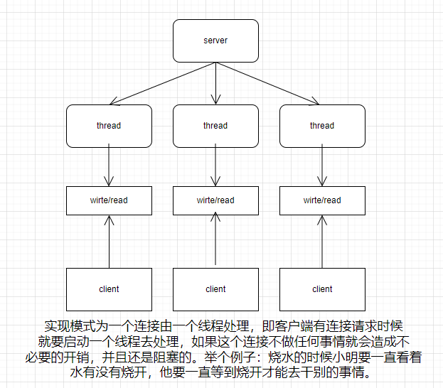  

### NIO（同步非阻塞）

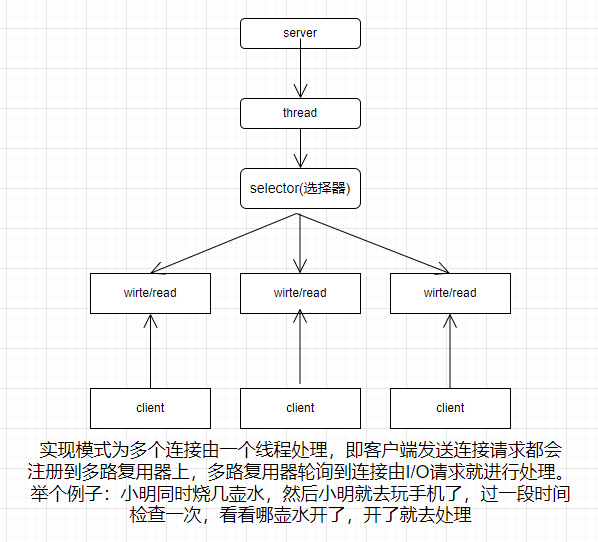  

### AIO（异步非阻塞）

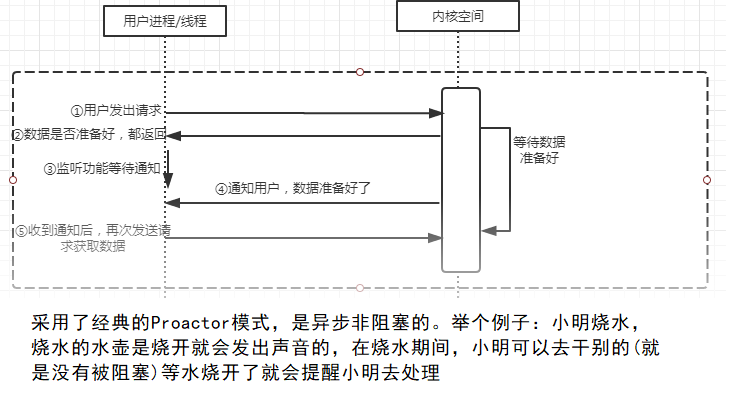 

## NIO基本介绍

* 有三大核心部分：==Channel(通道)， Buffer(缓冲区)， Selector(选择器)==
* nio是面向缓冲区，或者面向 块编程的。数据读取到一个它稍后处理的缓冲区，需要时可在缓冲区中前后移动，这就增加了处理过程中的灵活性，使用它可以提供非阻塞式的高伸缩性网络
* 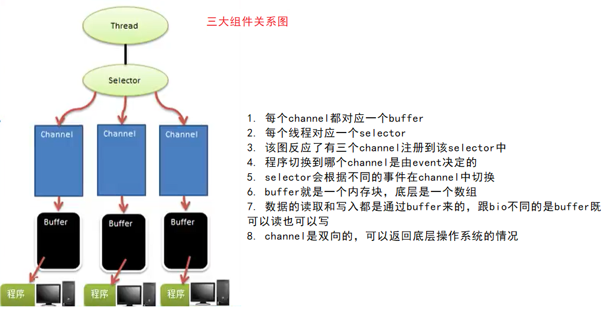 

## Buffer

* 描述：缓冲区本质是一个可以读写数据的内存块，可以理解成内部包含一个数组的容器对象。它提供了一些方法可以更好的去使用内存块，缓冲区对象内置了一些机制，能够跟踪和记录缓冲区的状态变化情况，Channel提供从文件网络读取数据的渠道，但是读取和写入的数据都必须经由Buffer
* 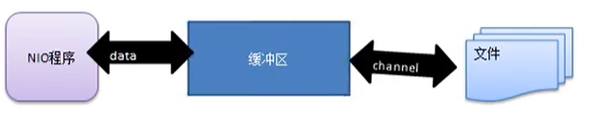 

```java
// Buffer部分代码
public abstract class Buffer {

    /**
     * The characteristics of Spliterators that traverse and split elements
     * maintained in Buffers.
     */
    static final int SPLITERATOR_CHARACTERISTICS =
        Spliterator.SIZED | Spliterator.SUBSIZED | Spliterator.ORDERED;

    // Invariants: mark <= position <= limit <= capacity
    private int mark = -1; // 标记
    private int position = 0; // 数组的索引
    private int limit; // 数组的长度
    private int capacity; // 容量
    
    ......
```

|          |                                                              |
| -------- | :----------------------------------------------------------- |
| mark     | 标记，一般不会修改                                           |
| position | 位置，下一个要被读或写的元素的索引，每次读写都会改变，为下次读写做准备 |
| limit    | buffer的最大大小，可以改变                                   |
| capacity | buffer的容量，不可以改变                                     |

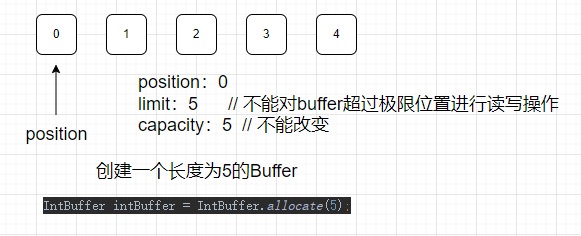 

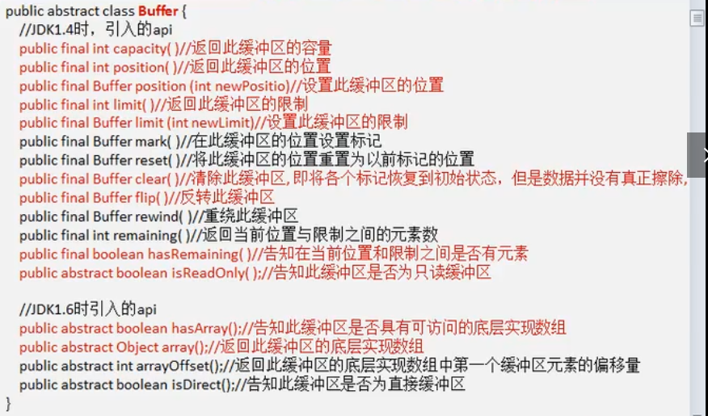 

## Channel

* channel和流的区别

  1. channel可以同时读写，流只能读或者写
  2. channel可以实现异步读写
  3. channel可以从buffer中读取数据也可以写入数据

  ### 案例一

  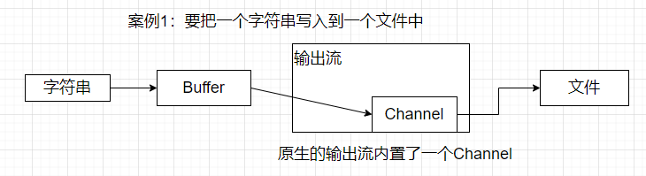 

  ```java
  public static void main(String[] args) throws Exception {
      // 字符串
      String str = "adsf, 111";
      // 创建一个buffer
      ByteBuffer byteBuffer = ByteBuffer.allocate(1024);
      // 然后把数据写到缓冲区
      byteBuffer.put(str.getBytes(StandardCharsets.UTF_8));
      // 此时position已经到达后面，要进行翻转flip
      byteBuffer.flip();
      // 创建一个输出流用来写数据然后使用 channel进行包装
      FileOutputStream fileOutputStream = new FileOutputStream("G:\\a.txt");
      FileChannel channel = fileOutputStream.getChannel();
      // 把数据从缓冲区写入channel中
      channel.write(byteBuffer);
      // 关闭流
      fileOutputStream.close();
  }
  ```

  ### 案例二

  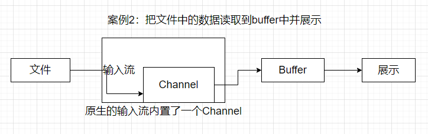 

  ```java
  public static void main(String[] args) throws Exception {
      // 创建一个输入流
      File file = new File("G:\\a.txt");
      FileInputStream fileInputStream = new FileInputStream(file);
      // 获取channel
      FileChannel channel = fileInputStream.getChannel();
      // 创建一个buffer
      ByteBuffer buffer = ByteBuffer.allocate((int) file.length());
      // 把channel中的数据写入到buffer中
      channel.read(buffer);
      // 展示buffer中数据
      System.out.println(new String(buffer.array()));
  }
  ```

  ### 案例三

  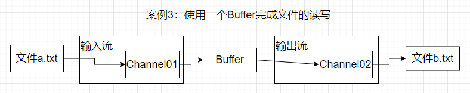 

  ```java
  public static void main(String[] args) throws Exception {
      // 获取通道
      FileInputStream fileInputStream = new FileInputStream("G:\\a.txt");
      FileChannel channel01 = fileInputStream.getChannel();
  
      FileOutputStream fileOutputStream = new FileOutputStream("G:\\b.txt");
      FileChannel channel02 = fileOutputStream.getChannel();
  
      // 创建buffer
      ByteBuffer byteBuffer = ByteBuffer.allocate(512);
      // 这里的循环是为了体现clear()方法的作用：就是复原buffer的值，不复原的话第二次去读取就会出现死循环
      while (true) {
          // 复原buffer
          byteBuffer.clear();
          // 先把数据从通道一读取到buffer中
          int read = channel01.read(byteBuffer);
          // 表示已经读完了
          if (read == -1) {
              break;
          }
          // 反转
          byteBuffer.flip();
          // 然后写到通道二中
          channel02.write(byteBuffer);
      }
      fileOutputStream.close();
      fileInputStream.close();
  }
  ```

  ### 案例四

  ```java
  public static void main(String[] args) throws Exception {
      /**
           * 使用transferFrom方法拷贝文件
           **/
      // 获取流对象
      FileInputStream fileInputStream = new FileInputStream("G:\\a.png");
      FileOutputStream fileOutputStream = new FileOutputStream("G:\\b.png");
      // 获取channel对象
      FileChannel channel = fileInputStream.getChannel();
      FileChannel channel1 = fileOutputStream.getChannel();
      // 进行拷贝 两个方法都可以
      channel.transferTo(0, channel.size(), channel1);
      // channel1.transferFrom(channel, 0, channel.size());
      fileInputStream.close();
      fileOutputStream.close();
  }
  ```

  ### 关于Buffer和Channel的注意事项和细节

  * ByteBuffer支持类型化的put和get，就是放入buffer的类型和取出来的时候接收的类型要一致，不然 会报错

  * 可以将一个普通的buffer转化成一个只读的buffer

    ```java
    public static void main(String[] args) {
        ByteBuffer buffer = ByteBuffer.allocate(10);
        for (int i = 0; i < buffer.capacity() - 1; i++) {
            buffer.put((byte) i);
        }
        buffer.flip();
        ByteBuffer byteBuffer = buffer.asReadOnlyBuffer();
        while (buffer.hasRemaining()) {
            System.out.println(buffer.get());
        }
        byteBuffer.put((byte) 9);
    }
    ```

  * NIO还提供了MappedByteBuffer，可以让文件直接在内存（堆外内存）中进行修改

    ```java
    public static void main(String[] args) throws Exception {
            /**
             * MappedByteBuffer可以让文件直接在内存（堆外内存）修改，操作系统不需要拷贝一次
             **/
            File file = new File("G:\\1.txt");
            RandomAccessFile randomAccessFile = new RandomAccessFile(file, "rw");
    
            FileChannel channel = randomAccessFile.getChannel();
    
            /*
             * 参数一：FileChannel.MapMode.READ_WRITE 使用的读写模式
             * 参数二：0 可以直接修改的起点位置
             * 参数三：5 是映射到内存的大小(不是索引位置)，即将1.txt的多个字节映射到内存，可以直接修改的范围就是0-5
             * 整个表示就是可以直接在内存中修改1.txt文件0-5字节的内容
             */
            MappedByteBuffer buffer = channel.map(FileChannel.MapMode.READ_WRITE, 0, 5);
            buffer.put(0, (byte) 'Y');
            buffer.put(4, (byte) 'A');
            // buffer.put(5, (byte) 'Z'); // 异常IndexOutOfBoundsException
    
            channel.close();
        }
    ```

  * NIO还支持通过多个Buffer完成读写操作，即Scattering（分散）和Gathering（聚合）

## Selector(选择器)

* selector能够检测多个注册的通道上是否有事件发生==(注意：多个channel以事件的方式可以注册到同一个Selector)==如果有事件发生以便获取事件再进行相应的处理，这样就可以使用单线程去管理多个通道，也就是管理多个连接和请求

* #### Selector类的相关方法

  * ```java
    public static Selector open() // 得到一个选择器对象
    ```

  * ```java
    // 监控所有的注册通道，当其中有io操作可以进行时，将对应的selectorKey加入到内部集合并返回，参数用来设置超时时间
    public abstract int select(long timeout) // 阻塞timeout秒，在timeout秒后返回
    public abstract int select() // 一直阻塞到监听到事件为止
    public abstract int selectNow() // 非阻塞的，立即返回
    ```

  * ```java
    public abstract Set<SelectionKey> selectedKeys() // 从内部集合中获取所有的selectionKey
    ```

  * ```java
    public abstract Selector wakeup(); // 唤醒selector
    ```

* #### NIO非阻塞网络编程原理图

  * 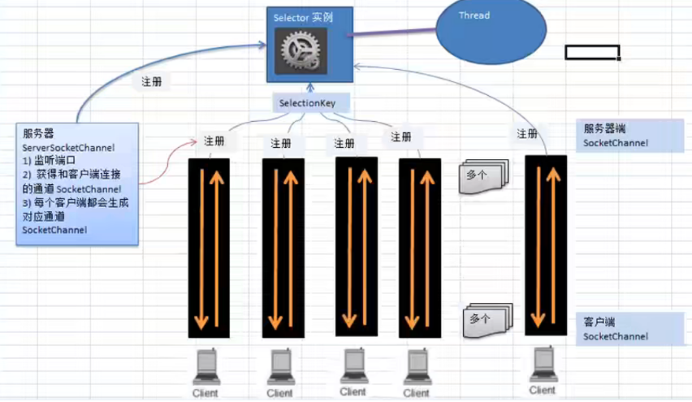 

  * ##### 流程说明

    1. 当有客户端连接时，会通过ServerSocketChannel 得到SocketChannel 
    2. 然后把SocketChannel注册到Selector上，调用的register(Selector sel, int ops)方法，selector可以注册多个SocketChannel，
    3. 注册后返回一个SelectionKey ，会和该selector进行关联，就是存在一个集合里
    4. Selector进行监听select方法，返回有事件发生的通道个数，然后进一步获取发生事件的channel的selectionKey
    5. 在通过selectionKey的channel方法反向获取通道在完成业务处理

* ##### NIO案例：编写一个NIO入门案例，实现服务器端和客户端之间的数据简单通讯(非阻塞)…..详情看netty-demo的NIOServer和NIOClient

* #### SelectionKey

  * 表示Selector和网络通道的注册关系，共四种

    * ```java
      // 表示读操作
      public static final int OP_READ = 1 << 0; // 值为1
      // 表示写操作
      public static final int OP_WRITE = 1 << 2; // 值为4
      // 表示连接已经建立
      public static final int OP_CONNECT = 1 << 3; // 值为8
      // 有新的网络连接可用
      public static final int OP_ACCEPT = 1 << 4; // 值为16
      ```

  * 相关方法

    * ```java
      public abstract Selector selector(); // 得到与之关联的selector对象
      public abstract SelectableChannel channel(); // 得到与之关联的channel对象
      public final Object attachment() // 得到关联的共享数据
      public abstract SelectionKey interestOps(int ops) // 设置或改变监听事件
      public final boolean isReadable() // 是否可以读
      public final boolean isWritable() // 是否可以写
      public final boolean isAcceptable() // 是否可以accept
      ```

* #### ServerSocketChannel： 在服务端监听新的Socket连接

  * ```java
    public static ServerSocketChannel open(); // 得到一个ServerSocketChannel通道
    public final ServerSocketChannel bind(); // 设置服务器端口
    public abstract SocketChannel accept(); // 接受一个连接，返回代表这个连接的通道对象
    public final SelectionKey register(Selector sel, int ops, Object att); // 注册到选择器并设置监听事件
    public final SelectableChannel configureBlocking(boolean block); // 设置是否阻塞，false为非阻塞
    ```

* #### SocketChannel：网络IO通道负责具体的读写操作

  * ```java
    public static SocketChannel open(); // 得到一个SocketChannel通道
    public final SelectableChannel configureBlocking(boolean block); // 设置是否阻塞，false为非阻塞
    public abstract boolean connect(SocketAddress remote); // 连接服务器
    public abstract boolean finishConnect(); // 是否完成连接
    public abstract int read(ByteBuffer dst); // 从通道里读
    public abstract int write(ByteBuffer src); // 往通道里写
    public final void close(); // 关闭通道
    ```

## NIO网络编程应用实例-群聊系统

* 步骤==（详情见netty-demo的GroupChatServer.java和GroupChatClient.java）==：
  1. 编写服务器端启动并监听6667
  2. 服务器端接受客户端信息，并实现转发（处理上线和离线）
  3. 连接客户端
  4. 接受消息
  5. 发送消息

## Netty线程模型

目前存在的有：

* 传统阻塞性IO服务模型

* 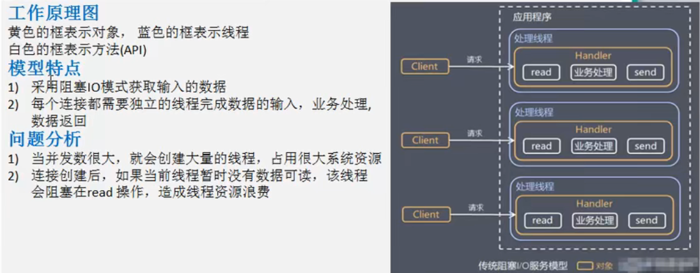 

* Reactor模式，Reactor又分为三种：

  1. ##### 单Reactor单线程

     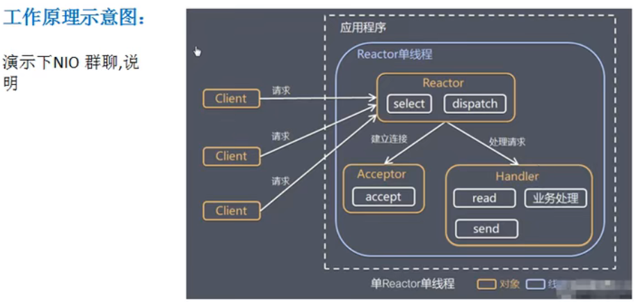 

     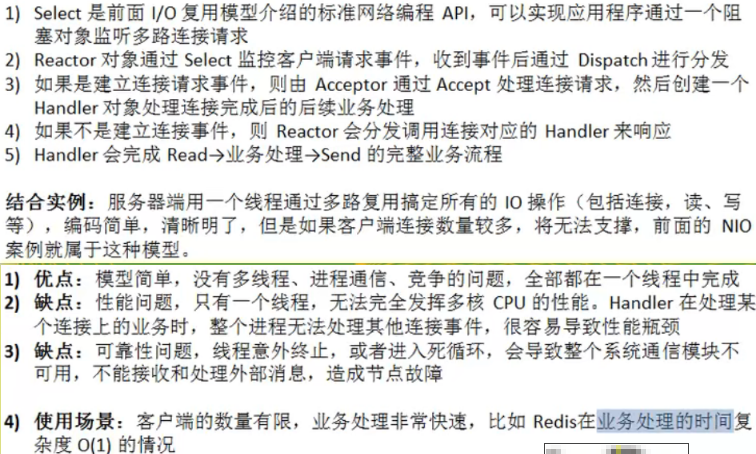 

  2. #### 单Reactor多线程

     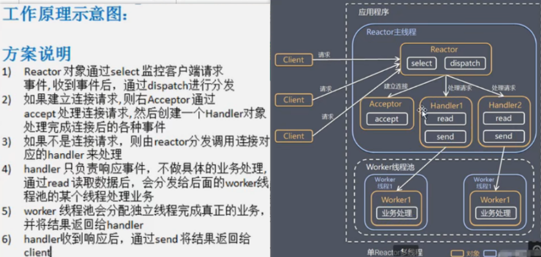 

     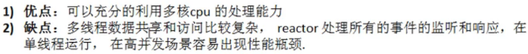 

  3. #### 主从Reactor多线程（Netty模型）

     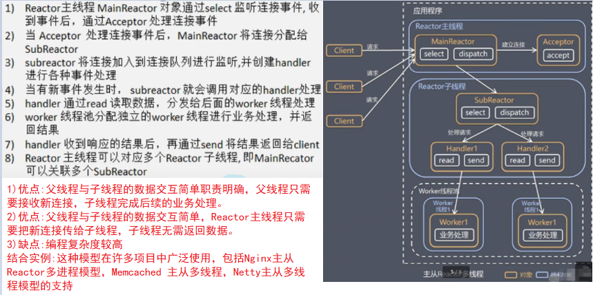 

      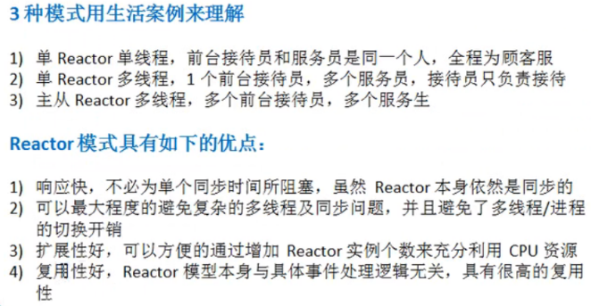 

* ## Netty使用的模型

* 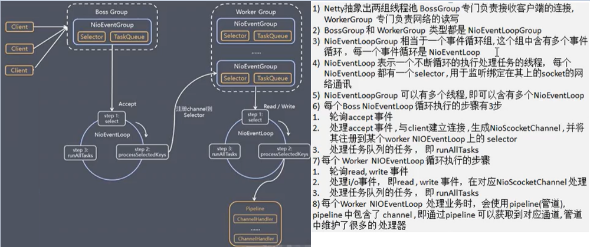 

* #### netty使用的任务队列

* 


