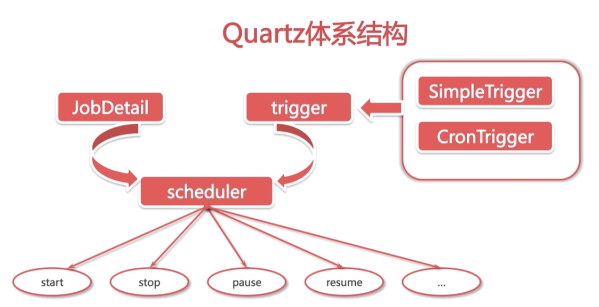
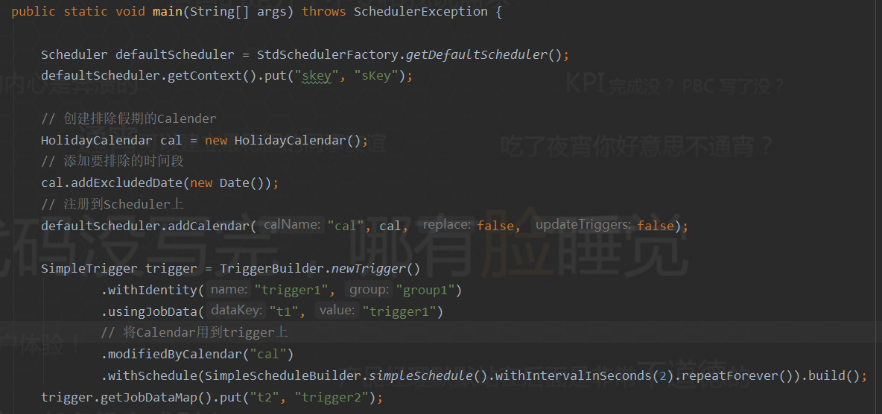
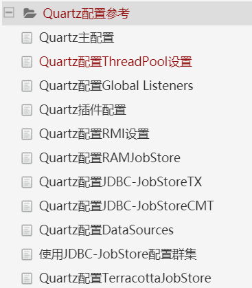

# Quartz笔记

## [中文文档](https://www.w3cschool.cn/quartz_doc/quartz_doc-2put2clm.html)

# quartz调度核心元素

#### Scheduler： 任务调度器，是实际执行任务调度的控制器，在spring中通过SchedulerFactoryBean封装起来
#### Trigger: 触发器，用于定义调度的时间规则。有SimpleTrigegr，CronTrigger，主要用第二种
#### Calendar： 它是一些日历特点时间点的集合，一个Trigger可以有多个Calender，以便排除或包含某些时间点
#### Job： 是一个接口，只有一个方法void execute(JobExecutionContext context)，实现这个接口定义运行任务
#### JobDetail：用来描述Job实现类和其他静态信息，如名字，关联监听器等。在spring中有JobDetailFactoryBean和 MethodInvokingJobDetailFactoryBean两种实现，如果任务调度中要执行某个类的某个方法就可以通过MethodInvokingJobDetailFactoryBean来调用
####Quartz体系结构
####监听器： JobListener,TriggerListener,SchedulerListener,对JobDetail,Trigger, Scheduler进行监听

##Hello Quartz例子

 view code

	public static void main(String[] args) throws SchedulerException {
	    Scheduler defaultScheduler = StdSchedulerFactory.getDefaultScheduler();
	    defaultScheduler.getContext().put("skey", "sKey");
	
	    SimpleTrigger trigger = TriggerBuilder.newTrigger()
	            .withIdentity("trigger1", "group1")
	            .usingJobData("t1", "trigger1")
	            .withSchedule(SimpleScheduleBuilder.simpleSchedule().withIntervalInSeconds(3).repeatForever()).build();
	    trigger.getJobDataMap().put("t2", "trigger2");
	
	    JobDetail job = JobBuilder.newJob(HelloJob.class)
	            .withIdentity("job1", "group1")
	            .usingJobData("j1", "job1")
	            .usingJobData("j2", "job2").build();
	
	    defaultScheduler.scheduleJob(job, trigger);
	    defaultScheduler.start();
	}
	
	@Slf4j
	public class HelloJob implements Job {
	
	    @Override
	    public void execute(JobExecutionContext context) throws JobExecutionException {
	        log.info("j1:{}",context.getJobDetail().getJobDataMap().get("j1"));
	        log.info("j2:{}",context.getJobDetail().getJobDataMap().get("j2"));
	
	        log.info("t1:{}",context.getTrigger().getJobDataMap().get("t1"));
	        log.info("t2:{}",context.getTrigger().getJobDataMap().get("t2"));
	
	        Object skey = null;
	        try {
	            skey = context.getScheduler().getContext().get("skey");
	        } catch (SchedulerException e) {
	            e.printStackTrace();
	        }
	
	        log.info("skey: {}", skey);
	        log.info(LocalDateTime.now().toString());
	    }
	}

##Job & JobDetail
####实现自动注入getMergedJobDataMap里的属性

 view code

	@Slf4j
	public class HelloJob implements Job {
	
		// 先定义好属性名
	    String t1;
	    String t2;
	    String j1;
	    String j2;
	
		// 无参构造不能少，不然就不能构造job
	    public HelloJob() {}
	
	    @Override
	    public void execute(JobExecutionContext context) throws JobExecutionException {
	        log.info("j1:{}",context.getJobDetail().getJobDataMap().get("j1"));
	        log.info("j2:{}",context.getJobDetail().getJobDataMap().get("j2"));
	
	        log.info("t1:{}",context.getTrigger().getJobDataMap().get("t1"));
	        log.info("t2:{}",context.getTrigger().getJobDataMap().get("t2"));
	
	        log.info("合并后的map:{}",context.getMergedJobDataMap());
	
	        log.info("-------------------------------------------------------");
	        log.info("jobKey:{}",context.getJobDetail().getKey());
	        log.info("注入的值:t1: {},t2: {},j1: {},j2: {},",t1, t2, j1, j2);
	        log.info("-------------------------------------------------------");
	
	        Object skey = null;
	        try {
	            skey = context.getScheduler().getContext().get("skey");
	        } catch (SchedulerException e) {
	            e.printStackTrace();
	        }
	
	        log.info("skey: {}", skey);
	        log.info(LocalDateTime.now().toString());
	    }
	
		// 设置属性的set方法
	    public void setT1(String t1) {
	        this.t1 = t1;
	    }
	
	    public void setT2(String t2) {
	        this.t2 = t2;
	    }
	
	    public void setJ1(String j1) {
	        this.j1 = j1;
	    }
	
	    public void setJ2(String j2) {
	        this.j2 = j2;
	    }
	}

##Trigger
####Trigger的公共属性
######jobKey： 当trigger触发时被执行的job身份
######startTime： 设置trigger第一次触发的时间，是Date类型的。有些类型的trigger，会在设置的startTime时立即触发，有些类型的trigger，表示其触发是在startTime之后开始生效。比如，现在是1月份，你设置了一个trigger–“在每个月的第5天执行”，然后你将startTime属性设置为4月1号，则该trigger第一次触发会是在几个月以后了(即4月5号)。
######endTime： 表示trigger的失效时间。比如，”每月第5天执行”的trigger，如果其endTime是7月1号，则其最后一次执行时间是6月5号。
######priority： trigger的优先级。当有多个trigger，但是线程数量很少时，就会有多个trigger同时执行。这时候就可以设置优先级，默认值是5。只有同时执行的trigger才会比较优先级
######misfire： 错过触发，如果控制器关闭或者线程池没有空闲线程，此时持久性trigger就会错过触发时间就是错过触发。不同类型的trigger的misfire机制不同，默认使用的都是“智能机制(smart policy)”，即根据trigger的类型和配置动态调整行为。当控制器重启时查询所有错过触发的trigger再更新trigger的信息
######calendar： 日历示例。Calendar用于从trigger的调度计划中排除时间段，

###Simple Trigger
#####可以在具体的时间点执行一次或者在具体的时间点执行，并以指定间隔重复执行若干次。包括开始时间，结束时间，重复次数，间隔时间
######指定时间开始触发，不重复:
    LocalDateTime of = LocalDateTime.of(2021, 01, 18, 15, 33, 0);
    Date from = Date.from(of.atZone(ZoneId.systemDefault()).toInstant());

    SimpleTrigger trigger = (SimpleTrigger) TriggerBuilder.newTrigger()
            .withIdentity("trigger1", "group1")
            .startAt(from) // 设置开始时间
            .forJob("job1", "group1")
            .build();
######指定时间触发，每隔10秒执行一次，重复10次：
    SimpleTrigger trigger = TriggerBuilder.newTrigger()
            .withIdentity("trigger1", "group1")
            // 设置开始时间，15后开始执行
            .startAt(futureDate(15, DateBuilder.IntervalUnit.SECOND))
            // 五秒执行一次，重复8次
            .withSchedule(SimpleScheduleBuilder.simpleSchedule().withIntervalInSeconds(5).withRepeatCount(8))
            .forJob("job1", "group1")
            .build();
######立即触发，每个5s执行一次，直到15:58：
    SimpleTrigger trigger = TriggerBuilder.newTrigger()
            .withIdentity("trigger1", "group1")
            .withSchedule(SimpleScheduleBuilder.simpleSchedule().withIntervalInSeconds(5).repeatForever())
            .endAt(dateOf(15, 58, 0))
            .build();
######建立一个触发器，将在下一个小时的整点触发，然后每2小时重复一次：
    SimpleTrigger trigger = TriggerBuilder.newTrigger()
            .withIdentity("trigger1", "group1")
            .startAt(evenMinuteDate(null))
            .withSchedule(SimpleScheduleBuilder.simpleSchedule().withIntervalInSeconds(5).repeatForever())
            .build();
####SimpleTrigger Misfire策略
#####SimpleTrigger的Misfire策略常量：
	MISFIRE_INSTRUCTION_IGNORE_MISFIRE_POLICY
	MISFIRE_INSTRUCTION_FIRE_NOW
	MISFIRE_INSTRUCTION_RESCHEDULE_NOW_WITH_EXISTING_REPEAT_COUNT
	MISFIRE_INSTRUCTION_RESCHEDULE_NOW_WITH_REMAINING_REPEAT_COUNT
	MISFIRE_INSTRUCTION_RESCHEDULE_NEXT_WITH_REMAINING_COUNT
	MISFIRE_INSTRUCTION_RESCHEDULE_NEXT_WITH_EXISTING_COUNT

	// 设置trigger的错过触发策略
	SimpleTrigger trigger = TriggerBuilder.newTrigger()
	            .withIdentity("trigger1", "group1")
	            .withSchedule(SimpleScheduleBuilder.simpleSchedule()
	                    .withIntervalInSeconds(5)
	                    .repeatForever()
	                    .withMisfireHandlingInstructionNextWithExistingCount())
	            .build();
###CronTrigger
#####建立一个触发器，每隔一分钟，每天上午8点至下午5点之间：
    CronTrigger trigger = TriggerBuilder.newTrigger()
            .withIdentity("trigger1", "group1")
            .withSchedule(CronScheduleBuilder.cronSchedule("*/3 * 8-17 * * ?"))
            .build();
#####建立一个触发器，将在16:57每天发生：
    CronTrigger trigger = TriggerBuilder.newTrigger()
            .withIdentity("trigger1", "group1")
            .withSchedule(dailyAtHourAndMinute(16, 57))
            .forJob("job1", "group1")
            .build();
#####将在每周一的17:08触发：
    CronTrigger trigger = TriggerBuilder.newTrigger()
            .withIdentity("trigger1", "group1")
            .withSchedule(weeklyOnDayAndHourAndMinute(DateBuilder.MONDAY, 17, 8))
            .forJob("job1", "group1")
            .build();
####CronTrigger Misfire说明
######CronTrigger的Misfire指令常数
	MISFIRE_INSTRUCTION_IGNORE_MISFIRE_POLICY
	MISFIRE_INSTRUCTION_DO_NOTHING
	MISFIRE_INSTRUCTION_FIRE_NOW

    CronTrigger trigger = TriggerBuilder.newTrigger()
        .withIdentity("trigger1", "group1")
        .withSchedule(weeklyOnDayAndHourAndMinute(DateBuilder.MONDAY, 17, 8)
        .withMisfireHandlingInstructionFireAndProceed()) // 配置错过触发
        .forJob("job1", "group1")
        .build();
##TriggerListeners，JobListeners和SchedulerListeners
####添加jobListener(TriggerListener差不多)
	scheduler.getListenerManager().addJobListener(myJobListener, jobKeyEquals(jobKey("myJobName", "myJobGroup")));
####添加对特定组的所有job感兴趣的JobListener
	scheduler.getListenerManager().addJobListener(myJobListener, jobGroupEquals("myJobGroup"));
####添加对两个特定组的所有job感兴趣的JobListener
	scheduler.getListenerManager().addJobListener(myJobListener, or(jobGroupEquals("myJobGroup"), jobGroupEquals("yourGroup")));
####添加对所有job感兴趣的JobListener
	scheduler.getListenerManager().addJobListener(myJobListener, allJobs());
####添加SchedulerListener
	scheduler.getListenerManager().addSchedulerListener(mySchedListener);
####删除SchedulerListener
	scheduler.getListenerManager().removeSchedulerListener(mySchedListener);

##Job Stores
###RAMJobStore
#####存在内存中，速度很快，是默认选项，缺点是当程序崩了数据都会消失，具体的配置文件在 org/quartz/.quartz.properties中有一条如下：

	org.quartz.jobStore.class: org.quartz.simpl.RAMJobStore

###JDBC JobStore
#####它通过JDBC将其所有数据保存在数据库中。首先得找到创建表的sql脚本，然后配置使用JDBC JobStore中的JobStoreTX
	#配置Quartz以使用JobStoreTx
	org.quartz.jobStore.class = org.quartz.impl.jdbcjobstore.JobStoreTX
	# 配置JDBCJobStore以使用DriverDelegate,DriverDelegate负责执行特定数据库可能需要的任何JDBC工作。常用StdJDBCDelegate
	org.quartz.jobStore.driverDelegateClass = org.quartz.impl.jdbcjobstore.StdJDBCDelegate
	# 使用表前缀配置JDBCJobStore	
	org.quartz.jobStore.tablePrefix = QRTZ_
	#使用要使用的DataSource的名称配置JDBCJobStore
	org.quartz.jobStore.dataSource = myDS
	#线程管理
	#线程池实现
	org.quartz.threadPool.class = org.quartz.simpl.SimpleThreadPool
	#线程池数量
	org.quartz.threadPool.threadCount = 50
	#线程优先级
	org.quartz.threadPool.threadPriority = 5
	org.quartz.threadPool.threadsInheritContextClassLoaderOfInitializingThread = true

##Quartz配置参考
####默认情况下会从quartz.properties里面加在配置信息，如果加载失败就从org/quartz包里加载默认的。如果想使用除了 这些默认的可以配置org.quartz.properties属性指向所需的文件

### 主配置调度器设置 ###
	// 指定任务名称
	org.quartz.scheduler.instanceName
	
	// 指定任务id必须唯一可以设置成AUTO表示自动生成，或者SYS_PROP，从系统获取
	org.quartz.scheduler.instanceId
### Quartz配置ThreadPool设置 ###
	// 是要使用的ThreadPool实现的名称，一般用这个org.quartz.simpl.SimpleThreadPool
	org.quartz.threadPool.class
	
	// 配置可用于并发执行的线程数
	org.quartz.threadPool.threadCount
	
	// 线程优先级，默认为5
	org.quartz.threadPool.threadPriority
	
	// 设置是否是守护线程，默认为false
	org.quartz.threadPool.makeThreadsDaemons
	
	// 在自定义线程池
	org.quartz.threadPool.class = com.mycompany.goo.FooThreadPool
	org.quartz.threadPool.somePropOfFooThreadPool = someValue
### Quartz配置Global Listeners ###
#####通过配置文件配置Listener包括给一个全限定类名，然后指定类的属性，这个类必须要有无参构造且属性被反射设置只支持基本类型
####配置全局TriggerListener
	org.quartz.triggerListener.NAME.class = com.foo.MyListenerClass
	org.quartz.triggerListener.NAME.propName = propValue
	org.quartz.triggerListener.NAME.prop2Name = prop2Value
####配置全局JobListener
	org.quartz.jobListener.NAME.class = com.foo.MyListenerClass
	org.quartz.jobListener.NAME.propName = propValue
	org.quartz.jobListener.NAME.prop2Name = prop2Value
### Quartz插件配置 ###
	org.quartz.plugin.NAME.class = com.foo.MyPluginClass
	org.quartz.plugin.NAME.propName = propValue
	org.quartz.plugin.NAME.prop2Name = prop2Value

#### 日志记录Triggers历史插件的示例配置 ####

	org.quartz.plugin.triggHistory.class = \
	  org.quartz.plugins.history.LoggingTriggerHistoryPlugin
	org.quartz.plugin.triggHistory.triggerFiredMessage = \
	  Trigger \{1\}.\{0\} fired job \{6\}.\{5\} at: \{4, date, HH:mm:ss MM/dd/yyyy}
	org.quartz.plugin.triggHistory.triggerCompleteMessage = \
	  Trigger \{1\}.\{0\} completed firing job \{6\}.\{5\} at \{4, date, HH:mm:ss MM/dd/yyyy\}.
### Quartz配置RAMJobStore ###
#####RAMJobStore用于存储内存中的调度信息(job，trigger，calendar)，但是是存在内存中，当进程终止所有信息都会丢失。
	org.quartz.jobStore.class = org.quartz.simpl.RAMJobStore

	// 默认值为60s，在被认为“misfired”之前，调度程序将“tolerate”一个Triggers将其下一个启动时间通过的毫秒数
	org.quartz.jobStore.misfireThreshold

### Quartz配置JDBC-JobStoreTX或JobStoreCMT ###
	// 通过这个属性来设置JobStoreTX
	org.quartz.jobStore.class = org.quartz.impl.jdbcjobstore.JobStoreTX
	org.quartz.jobStore.class = org.quartz.impl.jdbcjobstore.JobStoreCMT
	
	// 代表不同数据库的方言，一般配置这个，用于完全符合JDBC的驱动程序
	org.quartz.jobStore.driverDelegateClass = org.quartz.impl.jdbcjobstore.StdJDBCDelegate
		
	// 配置表前缀，
	org.quartz.jobStore.tablePrefix
	
	// 设置quartz是否是集群
	org.quartz.jobStore.isClustered
	
	/** 
	* 必须是在“LOCKS”表中选择一行并在该行上放置一个锁的SQL字符串。如果未设置，
	* 默认值为“SELECT * FROM {0} LOCKS WHERE SCHED_NAME = {1} AND LOCK_NAME =？FOR UPDATE“，
	* 适用于大多数数据库。在运行时使用上面配置的TABLE_PREFIX替换“{0}”。“{1}”被替换为调度程序的名称。
	** /
	org.quartz.jobStore.selectWithLockSQL

### 使用JDBC-JobStore配置群集 ###
####集群配置示例
	#============================================================================
	# Configure Main Scheduler Properties  
	#============================================================================
	
	org.quartz.scheduler.instanceName = MyClusteredScheduler
	org.quartz.scheduler.instanceId = AUTO
	
	#============================================================================
	# Configure ThreadPool  
	#============================================================================
	
	org.quartz.threadPool.class = org.quartz.simpl.SimpleThreadPool
	org.quartz.threadPool.threadCount = 25
	org.quartz.threadPool.threadPriority = 5
	
	#============================================================================
	# Configure JobStore  
	#============================================================================
	
	org.quartz.jobStore.misfireThreshold = 60000
	
	org.quartz.jobStore.class = org.quartz.impl.jdbcjobstore.JobStoreTX
	org.quartz.jobStore.driverDelegateClass = org.quartz.impl.jdbcjobstore.oracle.OracleDelegate
	org.quartz.jobStore.useProperties = false
	org.quartz.jobStore.dataSource = myDS
	org.quartz.jobStore.tablePrefix = QRTZ_
	
	org.quartz.jobStore.isClustered = true
	org.quartz.jobStore.clusterCheckinInterval = 20000
	
	#============================================================================
	# Configure Datasources  
	#============================================================================
	
	org.quartz.dataSource.myDS.driver = oracle.jdbc.driver.OracleDriver
	org.quartz.dataSource.myDS.URL = jdbc:oracle:thin:@polarbear:1521:dev
	org.quartz.dataSource.myDS.user = quartz
	org.quartz.dataSource.myDS.password = quartz
	org.quartz.dataSource.myDS.maxConnections = 5
	org.quartz.dataSource.myDS.validationQuery=select 0 from dual

##SpringBoot2.0整合Quartz并持久化
####启动类上添加@EnableScheduling注解，然后实现job类
	public class SampleJob implements Job {
	    @Override
	    public void execute(JobExecutionContext context) throws JobExecutionException {
			// 业务逻辑
	        System.out.println(LocalDateTime.now().format(DateTimeFormatter.ofPattern("yyyy-MM-dd HH:mm:ss")));
	    }
	}
####在配置文件中配置持久化
	spring:
	  datasource:
	    type: com.alibaba.druid.pool.DruidDataSource
	    druid:
	      driver-class-name: com.mysql.cj.jdbc.Driver
	      url: jdbc:mysql://192.168.0.189:3306/demo?useUnicode=true&characterEncoding=utf8&zeroDateTimeBehavior=convertToNull&allowMultiQueries=true&serverTimezone=PRC&useSSL=false&autoReconnect=true
	      username: root
	      password: root
	  quartz:
	    job-store-type: jdbc
	    jdbc:
	      initialize-schema: embedded
	    properties:
	      org:
	        quartz:
	          scheduler:
	            instanceName: MyScheduler
	            instanceId: AUTO
	          jobStore:
	            class: org.quartz.impl.jdbcjobstore.JobStoreTX
	            driverDelegateClass: org.quartz.impl.jdbcjobstore.StdJDBCDelegate
	            tablePrefix: qrtz_
	            isClustered: true
	            clusterCheckinInterval: 10000
	            useProperties: false
	          threadPool:
	            class: org.quartz.simpl.SimpleThreadPool
	            threadCount: 10
	            threadPriority: 5
	            threadsInheritContextClassLoaderOfInitializingThread: true
####一个任务配置多个触发器
	@Service
	public class QuartzService {
	
	    public void test() throws SchedulerException {
	        Scheduler scheduler = StdSchedulerFactory.getDefaultScheduler();
	
	        JobDetail jobDetail = JobBuilder.newJob(QuartzJob.class)
	                .withIdentity("job1", "group1")
	                .usingJobData("jobData1", "asdf")
	                .storeDurably()
	                .build();
	
	        CronTrigger trigger = TriggerBuilder.newTrigger()
	                .withIdentity("trigger1", "group1")
	                .forJob("job1", "group1")
	                .usingJobData("t1", "qwer")
	                .startNow()
	                .withSchedule(CronScheduleBuilder.cronSchedule("*/1 * * * * ?"))
	                .build();
	
	        SimpleTrigger trigger1 = TriggerBuilder.newTrigger()
	                .withIdentity("trigger2", "group1")
	                .forJob("job1", "group1")
	                .usingJobData("t2", "qwer2")
	                .withSchedule(SimpleScheduleBuilder.simpleSchedule().withIntervalInSeconds(3).repeatForever())
	                .build();
	
	        scheduler.scheduleJob(jobDetail, trigger);
	
	        scheduler.scheduleJob(trigger1);
	        scheduler.start();
	    }
	}

