#RabbitMQ笔记
##[rabbitMQ官网](https://www.rabbitmq.com/#getstarted)
##[rabbitMQ笔记](https://blog.csdn.net/hellozpc/article/details/81436980)
##安装，启动
###安装Erlang(类似rabbitmq开发环境)
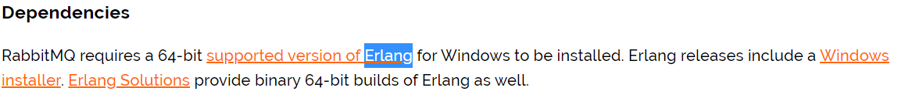
###启动
* 刚安装好进入安装rabbitMQ的目录，

* 输入启动命令就可以在127.0.0.1：15672进入官网，使用**guest/guest**登录： 
	> 第一次启动命令： rabbitmq-plugins enable rabbitmq_management 
	> 
	> 停止：net stop RabbitMQ 
	> 
	> 启动：net start RabbitMQ
##添加用户
###添加admin用户
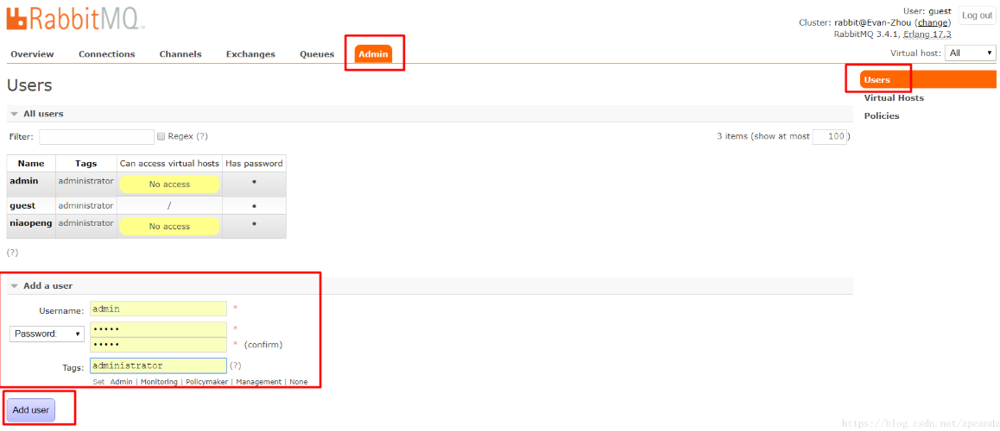
###用户角色
* 1、超级管理员(**administrator**):可登陆管理控制台，可查看所有的信息，并且可以对用户，策略(policy)进行操作。
* 2、监控者(**monitoring**)
可登陆管理控制台，同时可以查看rabbitmq节点的相关信息(进程数，内存使用情况，磁盘使用情况等)
* 3、策略制定者(**policymaker**)
可登陆管理控制台, 同时可以对policy进行管理。但无法查看节点的相关信息(上图红框标识的部分)。
* 4、普通管理者(**management**)
仅可登陆管理控制台，无法看到节点信息，也无法对策略进行管理。
* 5、其他
无法登陆管理控制台，通常就是普通的生产者和消费者。
###创建Virtual Hosts(相当于mysql的db数据库)
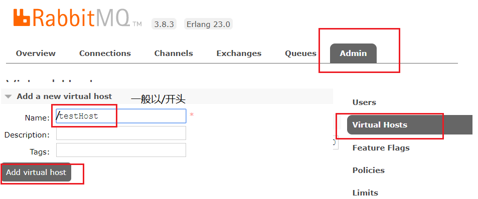
-
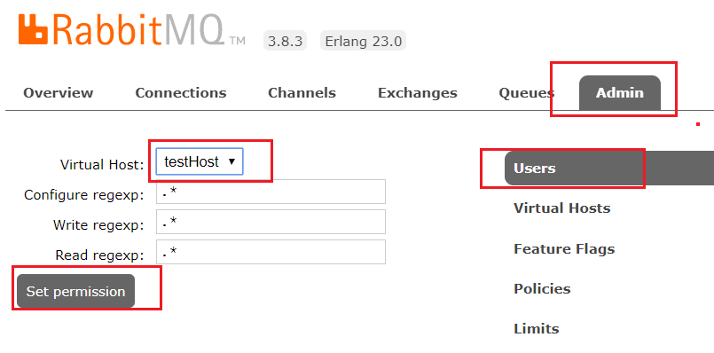
-
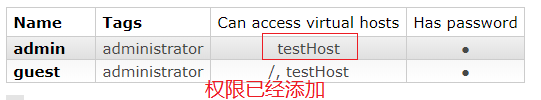
###管理界面中的功能
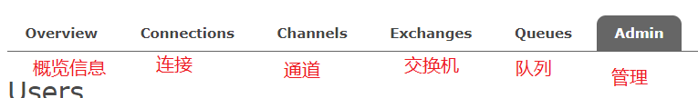
-
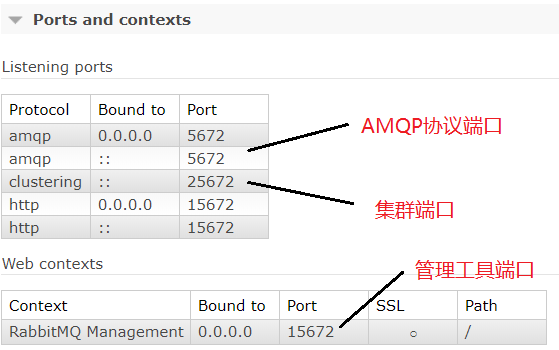
##学习五种队列
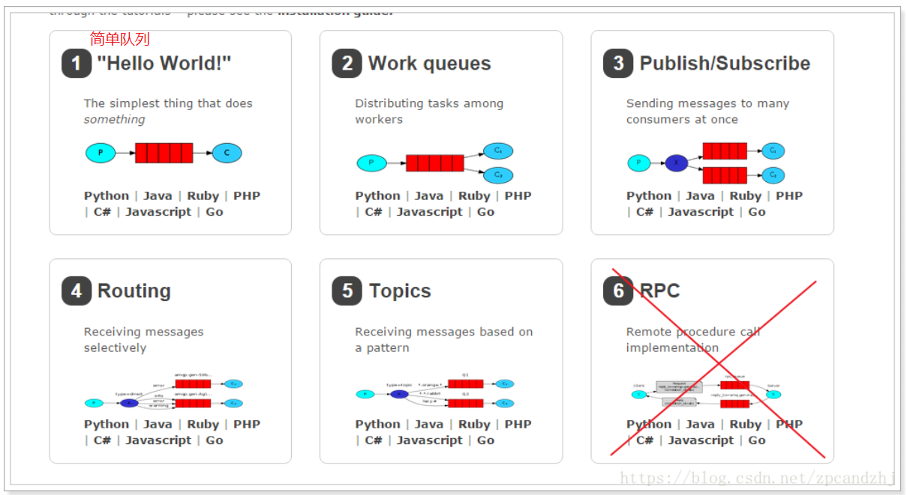
###新建maven项目，导入依赖
	<dependency>
        <groupId>com.rabbitmq</groupId>
        <artifactId>amqp-client</artifactId>
        <version>5.2.0</version>
    </dependency>

    <dependency>
        <groupId>org.slf4j</groupId>
        <artifactId>slf4j-api</artifactId>
        <version>2.0.0-alpha1</version>
    </dependency>

    <dependency>
        <groupId>org.slf4j</groupId>
        <artifactId>slf4j-log4j12</artifactId>
        <version>2.0.0-alpha1</version>
    </dependency>

    <dependency>
        <groupId>log4j</groupId>
        <artifactId>log4j</artifactId>
        <version>1.2.17</version>
    </dependency>
###1.简单队列(simple queue)
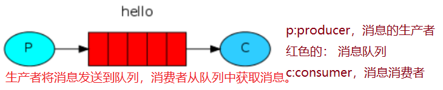
#####导入依赖
	<dependency>
	   <groupId>com.rabbitmq</groupId>
	   <artifactId>amqp-client</artifactId>
	   <version>3.4.1</version>
	</dependency>
#####获取MQ的连接
	public static Connection getConnection() throws IOException, TimeoutException {
        //创建连接工厂
        ConnectionFactory factory = new ConnectionFactory();
        //设置服务地址
        factory.setHost("127.0.0.1");
        //设置AMQP协议端口
        factory.setPort(5672);
        //设置vhost
        factory.setVirtualHost("testHost");
        //设置登录用户名密码
        factory.setUsername("admin");
        factory.setPassword("1234");
        //返回
        return factory.newConnection();
    }
#####生产者发送消息到队列
	private static final  String QUEUE_NAME="test_queue";
    public static void main(String[] args) throws IOException, TimeoutException {
        //获取连接
        Connection connection = RabbitMqUtils.getConnection();
        //从连接中获取一个通道
        Channel channel = connection.createChannel();
        //s声明一个队列,就是往哪个队列里发消息
        channel.queueDeclare(QUEUE_NAME, false, false, false, null);
        String msg = "hello world";
        //发送消息
        channel.basicPublish("", QUEUE_NAME, null, msg.getBytes());
        System.out.println("发送消息" + msg);
        channel.close();
        connection.close();
    }

#####管理工具中查看消息
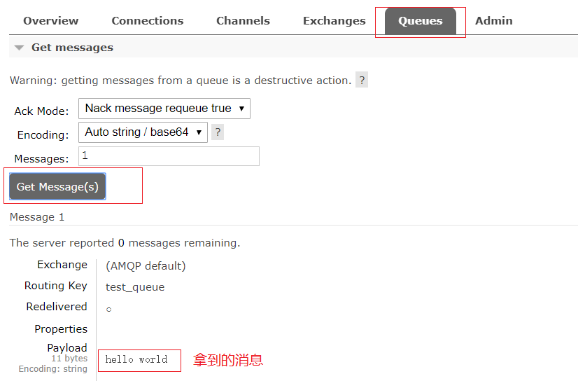
#####消费者从队列中获取消息
* java老的api

		private static final  String QUEUE_NAME="test_queue";
	    public static void main(String[] args) throws IOException, TimeoutException, InterruptedException {
	        //获取连接
	        Connection connection = RabbitMqUtils.getConnection();
	        //创建频道
	        Channel channel = connection.createChannel();
	        //定义队列的消费者
	        QueueingConsumer consumer = new QueueingConsumer(channel);
	        //监听队列
	        channel.basicConsume(QUEUE_NAME,true,  consumer);
	        while (true) {
	            QueueingConsumer.Delivery delivery = consumer.nextDelivery();
	            byte[] body = delivery.getBody();
	            String s = new String(body);
	            System.out.println("收到消息" + s);
	        }
	    }
* java新的api

		private static final  String QUEUE_NAME="test_queue";
	    public static void main(String[] args) throws Exception {
	        //获取连接
	        Connection connection = RabbitMqUtils.getConnection();
	        //创建频道
	        Channel channel = connection.createChannel();
	        //队列声明
	        channel.queueDeclare(QUEUE_NAME, false, false, false, null);
	        DefaultConsumer consumer = new DefaultConsumer(channel) {
	            //一旦有消息 就会触发这个方法
	            @Override
	            public void handleDelivery(String consumerTag, Envelope envelope, AMQP.BasicProperties properties, byte[] body) throws IOException {
	                String s = new String(body);
	                System.out.println("接收的信息" + s);
	            }
	        };
	        //监听队列
	        channel.basicConsume(QUEUE_NAME,true,  consumer);
	    }
###2.工作队列(work queue)
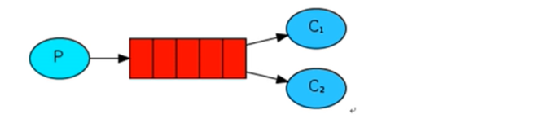
#####消费者1

	private static final String QUEUE_NAME = "workQueue";
    public static void main(String[] args) throws Exception {
        Connection connection = RabbitMqUtils.getConnection();
        Channel channel = connection.createChannel();
        channel.queueDeclare(QUEUE_NAME, false, false, false, null);
        DefaultConsumer consumer = new DefaultConsumer(channel) {
            @Override
            public void handleDelivery(String consumerTag, Envelope envelope,
                                       AMQP.BasicProperties properties, byte[] body) throws IOException {
                String s = new String(body);
                System.out.println("[1] 接收到的数据" + s);
                try {
                    Thread.sleep(2000);
                } catch (InterruptedException e) {
                    e.printStackTrace();
                } finally {
                    System.out.println("[1] done");
                }
            }
        };
        boolean autoAsk = true;
        channel.basicConsume(QUEUE_NAME, autoAsk, consumer);
    }
#####消费者2

	private static final String QUEUE_NAME = "workQueue";
    public static void main(String[] args) throws Exception {
        Connection connection = RabbitMqUtils.getConnection();
        Channel channel = connection.createChannel();
        channel.queueDeclare(QUEUE_NAME, false, false, false, null);
        DefaultConsumer consumer = new DefaultConsumer(channel) {
            @Override
            public void handleDelivery(String consumerTag, Envelope envelope,
                                       AMQP.BasicProperties properties, byte[] body) throws IOException {
                String s = new String(body);
                System.out.println("[2] 接收到的数据" + s);
                try {
                    Thread.sleep(1000);
                } catch (InterruptedException e) {
                    e.printStackTrace();
                } finally {
                    System.out.println("[2] done");
                }
            }
        };
        boolean autoAsk = true;
        channel.basicConsume(QUEUE_NAME, autoAsk, consumer);
    }
#####生产者1

	private static final String QUEUE_NAME = "workQueue";
    public static void main(String[] args) throws Exception {
        //获取连接
        Connection connection = RabbitMqUtils.getConnection();
        //获取channel
        Channel channel = connection.createChannel();
        //声明队列
        channel.queueDeclare(QUEUE_NAME, false, false, false, null);
        for (int i = 0; i < 40; i++) {
            String msg = "发出信息" + i;
            channel.basicPublish("", QUEUE_NAME, null, msg.getBytes());
            Thread.sleep(i * 20);
        }
        channel.close();
        connection.close();
    }
#####测试结果
* 1、消费者1和消费者2获取到的消息内容是不同的，同一个消息只能被一个消费者获取。
* 2、消费者1和消费者2获取到的消息的数量是相同的，一个是消费奇数号消息，一个是偶数。
	* 其实，这样是不合理的，因为消费者1线程停顿的时间短。应该是消费者1要比消费者2获取到的消息多才对。
RabbitMQ 默认将消息顺序发送给下一个消费者，这样，每个消费者会得到相同数量的消息。即轮询（round-robin）分发消息。
	* 怎样才能做到按照每个消费者的能力分配消息呢？联合使用 Qos 和 Acknowledge 就可以做到。
basicQos 方法设置了当前信道最大预获取（prefetch）消息数量为1。消息从队列异步推送给消费者，消费者的 ack 也是异步发送给队列，从队列的视角去看，总是会有一批消息已推送但尚未获得 ack 确认，Qos 的 prefetchCount 参数就是用来限制这批未确认消息数量的。设为1时，队列只有在收到消费者发回的上一条消息 ack 确认后，才会向该消费者发送下一条消息。prefetchCount 的默认值为0，即没有限制，队列会将所有消息尽快发给消费者。
	* **轮询分发** ：使用任务队列的优点之一就是可以轻易的并行工作。如果我们积压了好多工作，我们可以通过增加工作者（消费者）来解决这一问题，使得系统的伸缩性更加容易。在默认情况下，RabbitMQ将逐个发送消息到在序列中的下一个消费者(而不考虑每个任务的时长等等，且是提前一次性分配，并非一个一个分配)。平均每个消费者获得相同数量的消息。这种方式分发消息机制称为Round-Robin（轮询）。
	* **公平分发(fair dipatch)** ：虽然上面的分配法方式也还行，但是有个问题就是：比如：现在有2个消费者，所有的奇数的消息都是繁忙的，而偶数则是轻松的。按照轮询的方式，奇数的任务交给了第一个消费者，所以一直在忙个不停。偶数的任务交给另一个消费者，则立即完成任务，然后闲得不行。而RabbitMQ则是不了解这些的。这是因为当消息进入队列，RabbitMQ就会分派消息。它不看消费者为应答的数目，只是盲目的将消息发给轮询指定的消费者。**使用公平分发必须关闭自动应答ack，改成手动**
* 为了解决这个问题，我们使用basicQos( prefetchCount = 1)方法，来限制RabbitMQ只发不超过1条的消息给同一个消费者。当消息处理完毕后，有了反馈，才会进行第二次发送。
还有一点需要注意，使用公平分发，必须关闭自动应答，改为手动应答。
#####解决方法:work queue的能者多劳模式
* 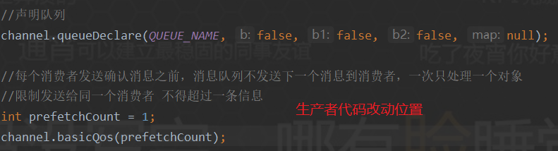
* 消费者

		private static final String QUEUE_NAME = "workQueue";
	    public static void main(String[] args) throws Exception {
	        Connection connection = RabbitMqUtils.getConnection();
	        final Channel channel = connection.createChannel();
	        channel.queueDeclare(QUEUE_NAME, false, false, false, null);
	        channel.basicQos(1);  //保证每次之分发一个消息
	        DefaultConsumer consumer = new DefaultConsumer(channel) {
	            @Override
	            public void handleDelivery(String consumerTag, Envelope envelope,
	                                       AMQP.BasicProperties properties, byte[] body) throws IOException {
	                String s = new String(body);
	                System.out.println("[1] 接收到的数据" + s);
	                try {
	                    Thread.sleep(2000);
	                } catch (InterruptedException e) {
	                    e.printStackTrace();
	                } finally {
	                    System.out.println("[1] done");
	                    channel.basicAck(envelope.getDeliveryTag(), false);   //手动发送一个回执告诉队列完成了
	                }
	            }
	        };
	
	        boolean autoAsk = false;  //自动应答改成false
	        channel.basicConsume(QUEUE_NAME, autoAsk, consumer);
	    }
###消息应答与消息持久化
####消息应答
	boolean autoAsk = false;
    channel.basicConsume(QUEUE_NAME, autoAsk, consumer);
* 当boolean autoAsk = true(自动模式)，表示开启自动应答，一旦rabbitmq把消息发给消费者就立即删除，如果把正在处理消息的消费者杀死，就会丢失数据
* 当boolean autoAsk = false(手动模式)，如果消费者挂掉，则把消息发给另一个消费者，rabbitmq支持消息应答，消费者发送一个消息回执给rabbitmq，rabbitmq就把内存中的消息删掉
* **消息应答默认是开启的，就是默认为false**
####消息持久化

	//声明队列
	boolean durable = false; //消息持久化
    channel.queueDeclare(QUEUE_NAME, durable, false, false, null);
* 将程序中的durable改成true是不可以的，rabbitmq不允许修改一个已经声明的队列
###3.订阅模式(publish/subscribe)
* 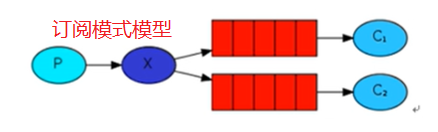
* 解读:
	1. 一个生产者，多个消费者
	2. 每一个消费者都有自己的队列
	3. 生产者没有直接把消息发给队列，而是发到交换机exchange
	4. 每个队列都要绑定到交换机上
	5. 生产者发送的消息进过交换机，经过队列，就能实现一个消息被多个消费者消费

#####生产者

	private static final String EXCHANGE_NAME = "test_exchange_fanout";
    public static void main(String[] args) throws Exception {
        Connection connection = RabbitMqUtils.getConnection();
        Channel channel = connection.createChannel();
        //声明交换机
        channel.exchangeDeclare(EXCHANGE_NAME, "fanout");
        String msg = "hello exchange";
        channel.basicPublish(EXCHANGE_NAME, "", null, msg.getBytes());
        System.out.println("Send " + msg);
        channel.close();
        connection.close();
    }

* 
* 交换机生成了，，但是数据丢失，原因是：交换机咩没有存储能力，只有队列才有，还没有把队列跟交换机绑定，所以消息没了
#####消费者1(消费者2同下)
	private static final String QUEUE_NAME = "test_queue_fanout_email";
    private static final String EXCHANGE_NAME = "test_exchange_fanout";
    public static void main(String[] args) throws Exception {
        Connection connection = RabbitMqUtils.getConnection();
        final Channel channel = connection.createChannel();
        //声明队列
        channel.queueDeclare(QUEUE_NAME, false, false, false, null);
        //绑定队列到交换机
        channel.queueBind(QUEUE_NAME, EXCHANGE_NAME, "");
        channel.basicQos(1);
        DefaultConsumer defaultConsumer = new DefaultConsumer(channel) {
            @Override
            public void handleDelivery(String consumerTag, Envelope envelope, AMQP.BasicProperties properties, byte[] body) throws IOException {
                String s = new String(body);
                System.out.println("[1] 收到消息" + s);
                channel.basicAck(envelope.getDeliveryTag(), false);
            }
        };
        channel.basicConsume(QUEUE_NAME, false, defaultConsumer);
    }
#####测试结果：同一个消息被多个消费者获取。一个消费者队列可以有多个消费者实例，只有其中一个消费者实例会消费到消息。
###Exchange(交换机)
- 一方面接受生产者的消息，一方面把消息推送给队列
* 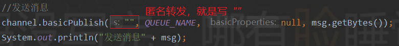
#####Fanout(不处理路由键)
* 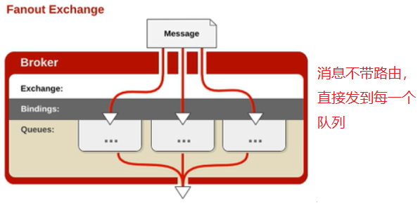
#####Direct处理路由键)
* 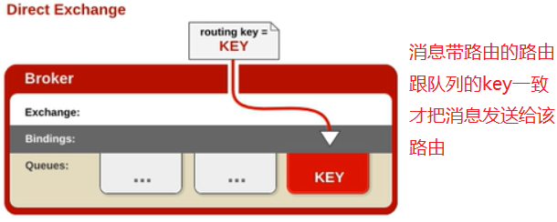
###4.路由模式
* 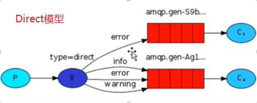
#####生产者
	private static final String EXCHANGE_NAME = "test_exchange_direct";
    public static void main(String[] args) throws Exception {
        Connection connection = RabbitMqUtils.getConnection();
        Channel channel = connection.createChannel();
        //设置交换机类型
        channel.exchangeDeclare(EXCHANGE_NAME, "direct");
        String msg = "hello direct";
        String routeKey = "info";
        channel.basicPublish(EXCHANGE_NAME, routeKey, null, msg.getBytes());
        channel.close();
        connection.close();
    }
#####消费者1(消费者2同下，改动数字位置)
	private static final String QUEUE_NAME = "test_queue_direct_1";
    private static final String EXCHANGE_NAME = "test_exchange_direct";
    public static void main(String[] args) throws Exception {
        Connection connection = RabbitMqUtils.getConnection();
        final Channel channel = connection.createChannel();
        channel.basicQos(1);
        channel.queueDeclare(QUEUE_NAME, false, false, false, null);
        channel.queueBind(QUEUE_NAME, EXCHANGE_NAME, "error");
        DefaultConsumer consumer = new DefaultConsumer(channel) {
            @Override
            public void handleDelivery(String consumerTag, Envelope envelope, AMQP.BasicProperties properties, byte[] body) throws IOException {
                String s = new String(body);
                System.out.println("[1] 接收信息" + s);
                channel.basicAck(envelope.getDeliveryTag(), false);
            }
        };
        channel.basicConsume(QUEUE_NAME, false, consumer);
    }
###5. 主题模式（通配符模式）
* 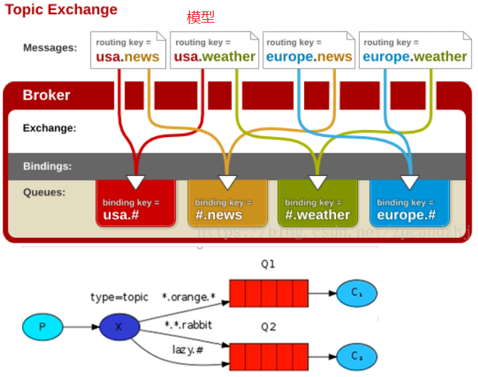
#####topic exchange：将路由键与某模式匹配
* **#：**匹配一个或者多个，可以零个
* ***:**匹配一个
#####生产者
	private static final String EXCHANGE_NAME = "test_exchange_topic";
    public static void main(String[] args) throws Exception {
        Connection connection = RabbitMqUtils.getConnection();
        Channel channel = connection.createChannel();
        channel.exchangeDeclare(EXCHANGE_NAME, "topic");
        String msg  = "hello topic";
        String routeKey = "Goods.delete.add";
        channel.basicPublish(EXCHANGE_NAME, routeKey, null, msg.getBytes());
        System.out.println("---send---" + msg);
        channel.close();
        connection.close();
    }	
#####消费者
	private static final String EXCHANGE_NAME = "test_exchange_topic";
    private static final String QUEUE_NAME = "test_queue_topic_1";
    public static void main(String[] args) throws Exception {
        Connection connection = RabbitMqUtils.getConnection();
        final Channel channel = connection.createChannel();
        channel.queueDeclare(QUEUE_NAME, false, false, false, null);
        channel.queueBind(QUEUE_NAME, EXCHANGE_NAME, "Goods.*");
        channel.basicQos(1);
        DefaultConsumer consumer = new DefaultConsumer(channel) {
            @Override
            public void handleDelivery(String consumerTag, Envelope envelope, AMQP.BasicProperties properties, byte[] body) throws IOException {
                String s = new String(body);
                System.out.println("[1] 收到消息" + s);
                channel.basicAck(envelope.getDeliveryTag(), false);
            }
        };
        channel.basicConsume(QUEUE_NAME, false, consumer);
    }
###rabbitmq中的消息确认机制(事务+confirm)
* 在rabbitmq中可以通过持久化数据解决rabbitmq服务器异常的数据丢失问题
* 问题： 生产者将消息发出后，消息到底有没有到达rabbitmq服务器，默认情况下是不知道的
	* 解决方法： 
		* AMQP实现事务机制
		* Confirm模式

####事务机制(txSelect,txCommit, txRollback)
* **txSelect:**将当前的channel设置成transation模式
* **txCommit：**提交事务
* **txRollback：**回滚事务
#####生产者(消费者正常接收)
	private static final String QUEUE_NAME = "test_queue_tx";
    public static void main(String[] args) throws Exception {
        Connection connection = RabbitMqUtils.getConnection();
        Channel channel = connection.createChannel();
        channel.queueDeclare(QUEUE_NAME, false, false, false, null);
        String msg = "hello tx";
        try {
            channel.txSelect();
            channel.basicPublish("", QUEUE_NAME, null, msg.getBytes());
            int a = 1/0;
            channel.txCommit();
        } catch (Exception e) {
            e.printStackTrace();
            channel.txRollback();
            System.out.println("出现错误，回滚信息");
        }
        channel.close();
        connection.close();
    }
####Confirm模式
* 开启confirm模式： **channel.confirmSelect()**
	* 编程模式：
		1. 普通的 发一条 调用waitForConfirms()
		2. 批量的 发一批 调用waitForConfirms()
		3. 异步confirm模式： 提供一个回调方法
#####confirm普通模式(单条)
	private static final String QUEUE_NAME = "test_confirm01";
    public static void main(String[] args) throws Exception {
        Connection connection = RabbitMqUtils.getConnection();
        Channel channel = connection.createChannel();
        //生产者调用confirmSelect() ，将channel设置成confirm模式
        channel.confirmSelect();
        channel.queueDeclare(QUEUE_NAME, false, false, false, null);
        String msg = "hello confirm";
        channel.basicPublish("", QUEUE_NAME, null, msg.getBytes());

        if (!channel.waitForConfirms()) {
            System.out.println("发送失败");
        } else {
            System.out.println("发送成功");
        }
        channel.close();
        connection.close();
    }
#####confirm普通模式(批量)
    private static final String QUEUE_NAME = "test_confirm01";
    public static void main(String[] args) throws Exception {
        Connection connection = RabbitMqUtils.getConnection();
        Channel channel = connection.createChannel();
        //生产者调用confirmSelect() ，将channel设置成confirm模式
        channel.confirmSelect();
        channel.queueDeclare(QUEUE_NAME, false, false, false, null);
        for (int i=0; i < 10; i++) {
            //批量发送
            String msg = "hello confirm" + i;
            channel.basicPublish("", QUEUE_NAME, null, msg.getBytes());
        }
        int i = 1/0;
        //确认消息
        if (!channel.waitForConfirms()) {
            System.out.println("发送失败");
        } else {
            System.out.println("发送成功");
        }
        channel.close();
        connection.close();
    }
#####confirm异步模式
* 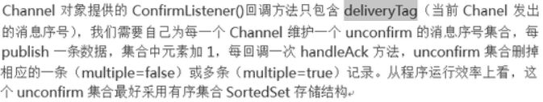
####生产者端Confirm模式的实现原理
* 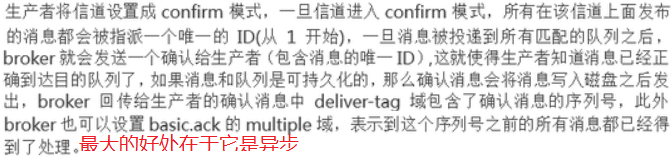
##spring整合rabbitMQ
####配置文件
	<beans xmlns="http://www.springframework.org/schema/beans"
	       xmlns:xsi="http://www.w3.org/2001/XMLSchema-instance" xmlns:rabbit="http://www.springframework.org/schema/rabbit"
	       xsi:schemaLocation="http://www.springframework.org/schema/rabbit
	   http://www.springframework.org/schema/rabbit/spring-rabbit-1.4.xsd
	   http://www.springframework.org/schema/beans
	   http://www.springframework.org/schema/beans/spring-beans-4.1.xsd">
	
	    <!-- 定义RabbitMQ的连接工厂 -->
	    <rabbit:connection-factory id="connectionFactory" host="127.0.0.1" port="5672"
	                               username="admin" password="1234"
	                               virtual-host="testHost"
	    ></rabbit:connection-factory>
	
	    <!-- 定义Rabbit模板，指定连接工厂以及定义exchange(exchange要和上面的一致) 发送到交换机就是exchange=""，
	    发送到队列就是Queue="", 可以使用route-key绑定key-->
	    <rabbit:template id="amqpTemplate" connection-factory="connectionFactory" exchange="fanoutExchange"></rabbit:template>
	    <!--    <rabbit:template id="amqpTemplate" connection-factory="connectionFactory" exchange="fanoutExchange"></rabbit:template>-->
	    <!--    <rabbit:template id="amqpTemplate" connection-factory="connectionFactory" exchange="topicExchange"></rabbit:template>-->
	
	    <!-- MQ的管理，包括队列、交换器等 -->
	    <rabbit:admin connection-factory="connectionFactory"></rabbit:admin>
	
	    <!-- 定义B系统需要监听的队列，自动声明 -->
	    <rabbit:queue name="q_topic_testB" auto-declare="true"></rabbit:queue>
	
	    <!-- 定义交换器，暂时不把Q绑定到交换机，在管理界面去绑定 -->
	<!--    <rabbit:topic-exchange name="topicExchange" auto-declare="true"></rabbit:topic-exchange>-->
	    <rabbit:fanout-exchange name="fanoutExchange" auto-declare="true">
	        <rabbit:bindings>
	            <rabbit:binding queue="q_topic_testB"></rabbit:binding>
	        </rabbit:bindings>
	    </rabbit:fanout-exchange>
	<!--    <rabbit:direct-exchange name="directExchange" auto-declare="true"></rabbit:direct-exchange>-->
	
	<!--定义消费者-->
	    <bean id="recevie1" class="com.hnguigu.rabbit.Recevie1"></bean>
	
	<!--监听-->
	    <rabbit:listener-container connection-factory="connectionFactory">
	        <rabbit:listener ref="recevie1" method="listen" queue-names="q_topic_testB"></rabbit:listener>
	    </rabbit:listener-container>
	
	</beans>
####生产者
	public static void main(String[] args) throws Exception {
        //读取配置文件
        ClassPathXmlApplicationContext context = new ClassPathXmlApplicationContext("classpath:rabbitContext.xml");
        //rabbit模板
        RabbitTemplate bean = context.getBean(RabbitTemplate.class);

        String format = new SimpleDateFormat("yyyy-mm-dd").format(new Date());
        //发送消息
        HashMap<String, Object> map = new HashMap<String, Object>();
        map.put("name", "zhangsan");
        map.put("age", 1);
        map.put("date", format);
        bean.convertAndSend(JSON.toJSONString(map));
	//        bean.convertAndSend("type2", JSON.toJSONString(map));
        Thread.sleep(1000);//休眠一秒
        context.destroy(); //销毁容器
    }
##SpringBoot整合rabbitMQ
####rabbitmqautoconfigure中的自动配置
* 自动配置连接工厂ConnectionFactory
* Rabbitproperties封装了rabbit的配置
* RabbitTemplate，给rabbitMQ发送和接收消息
* AmqpAdmin： rabbitmq系统管理功能组件
	* AmqpAdmin：创建和删除queue，exchange， bingding
* @RabbitListener + @EnableRabbit
	* **@RabbitListener:**表示监听队列，作用在方法上，一旦这个队收到消息就会调用方法
	* **@EnableRabbit：**表示开启对rabbitmq注解的支持
####生产者(简单队列)
	//    单播，点对点(发送)
	    @Test
	    void contextLoads() {
	//        message需要自己构建，
	//        rabbitTemplate.send(Exchange, routeKey, message)；
	//        object默认当成消息体只需要传入要发送的对象，默认把obj当成消息体
	//        rabbitTemplate.convertAndSend(Exchange, routeKey, Object);
	        HashMap<String, Object> map = new HashMap<>();
	        map.put("age", 1);
	        map.put("arr", Arrays.asList("asdf", 123, true));
	        rabbitTemplate.convertAndSend("e_topic_testB", "good", map);
	    }
####生产者(广播模式)
	//    广播模式
    @Test
    public void fanout() {
        HashMap<String, Object> map = new HashMap<>();
        map.put("age", 1);
        map.put("arr", Arrays.asList("asdf", 123, true));
        rabbitTemplate.convertAndSend("e_fanout_testB", "", map);
    }
####消费者

	//    (接收)
    @Test
    public void recevie1() {
        //用这个会把消息转成含有消息头和消息体的Message对象
	//        rabbitTemplate.receive();

	//        直接拿到收到的消息 会把消息体转成想要的对象
	//        rabbitTemplate.receiveAndConvert();

        Object o = rabbitTemplate.receiveAndConvert("q_topic_testB");
        System.out.println(o.getClass());
        System.out.println("[1] 接收到的消息:" + o);
    }

####使用amqpadmin进行创建删除

	//    使用amqpadmin创建删除queue，exchange
    @Test   //创建exchange
    public void amqoadmin1() {
        amqpAdmin.declareExchange(new DirectExchange("amqp.directExchange"));
        System.out.println("创建exchange成功");
    }

    @Test  //创建queue
    public void amqoadmin2() {
        amqpAdmin.declareQueue(new Queue("amqp_queue"));
        System.out.println("创建queue成功");
    }

    @Test //创建绑定规则
    public void amqoadmin3() {
        amqpAdmin.declareBinding(new Binding("amqp_queue", Binding.DestinationType.QUEUE, "amqp.directExchange", "good", null));
        System.out.println("binding成功");
    }

