#Redis笔记
##简介
###概述
* Redis(REmote DIctionary Server):远程字典服务器
* 使用C语言编写，遵守BSD协议
* 是一个高性能的(key/value)分布式内存数据库，基于内存运行并支持持久化的Nosql数据库，也成为数据结构服务器
* [redis官网](https://redis.io/)
###安装（没有gcc就要先装gcc）
######1.检查虚拟机中是否已经安装了gcc
> gcc -v
> 
> 否则就安装gcc：yum install gcc
######2.下载redis.tar.gz放到/usr/下然后解压
> tar -zxvf redis.tar.gz
> 
> cd redis
> 
> make如果执行的是make && make install，redis就会默认安装在/usr/local/redis
> 
> make PREFIX=/usr/test install 就是安装在/usr/test下
> 
> vi /usr/redis/redis.conf
> 
> * 修改端口：port 6380
> * 修改是否以守护进程启动： daemonize yes
> * 将IP绑定注释掉：#bind 127.0.0.1
> * 将保护模式关闭：protected-mode no
> * 配置密码： requirepess 123456
> * 修改pidfile： pidfile /var/run/redis_6380.pid
> 
> pidfile的作用就是防止启动多个进程副本，pidfile里只有一行，记录了该进程的id。进程运行后会给pidfile加上文件锁，只有获得该锁的进程才有写入权限(F_WRLOCK),把自身的pid写入该文件中，其他视图获得该锁的进程会自动退出。
> 
> 指定配置文件启动redis： ./redis-server /usr/redis-master-slave/6380/redis-4.0.6/redis.conf
> 
* 启动： **redis-server /redis.conf路径**，然后再**redis-cli -p 6379**
* hello-world： 输入set k1 hello， 然后输入get k1，输出结果是hello
* 关闭： shutdown
###杂项知识
* 单进程
* 默认16个数据库，索引都是从0开始，默认使用0号库
* **select 索引：**切换库
* **Dbsize：**查看当前库中key的数量
* **FLUSHDB：**清除当前库中所有key，**FLUSHALL：**清除所有库中的key
* 16个库的密码都一样，密码统一管理， 默认端口是6379
##redis的数据类型
###[redis的命令手册](http://redisdoc.com/)
###redis的五大数据类型
####String(字符串)：单值单value
* 
* 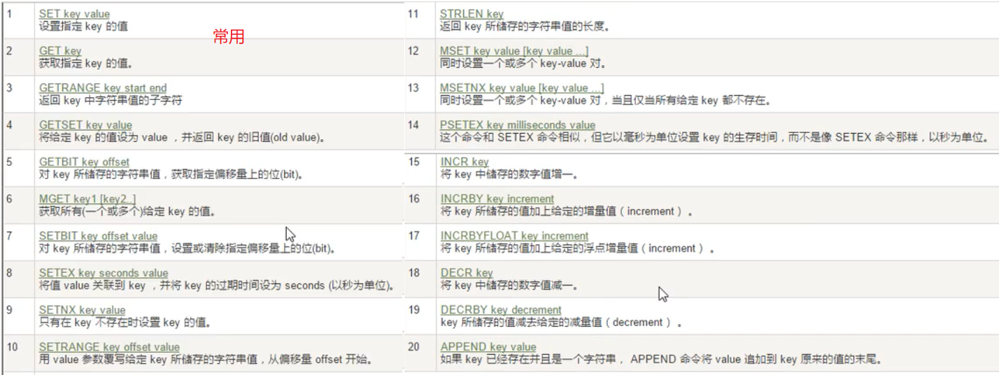
* **set/get/del/append/strlen**(设置值/获取值/删除key/追加值/值的长度)，例如：strlen k1
* **Incr/decr/incrby/decrby**(一定要是数字才能加减)：+1/-1/+给定值/-给定值，例如incr k1,incrby k1 3
* **getrange/setrange**
	* getrange:获取其指定区间的值，类似between...and...,从0到-1表示获取全部,例如：**getrange k1 0 5**
	* setrange:设置指定区间的值，例如**SETRANGE k1 1 aaa**，从索引为1开始设置，把2，3，4替换成aaa
* **setex(set with expire)键秒值/setnx(set if not exist)**
	* setex: 设置 key的过期时间和值，例如：**setex k1 10 v1**，十秒后k1过期
	* setnx: 如果key不存在或者为nil，就设置值，例如：**setnx k5 v5**
* **mset/mget/msetnx**
	* mset： 批量设置值，例如： **mset k1 v1 k2 v2**
	* mget： 批量获取值，例如： **mget k1 k2**
	* msetnx： 当key不存在或为nil时批量设置值，例如： **msetnx k1 v1 k2 v2**，其中有一个存在就不能设置
* **getset(先get再set)**
####Hash(哈希，类似java里的map)：KV模式不变，但V是键值对
* 
* 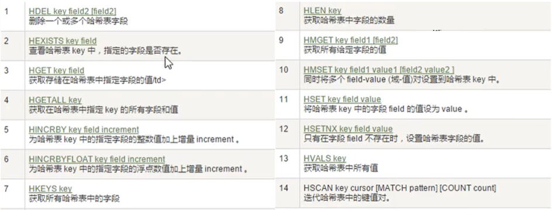
* **hset/hget/hmset/hmget/hgetall/hdel**
	* 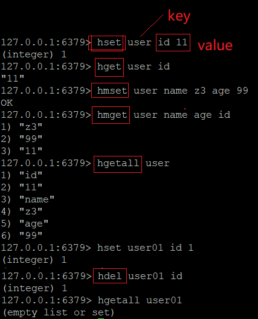
* **hlen key:**获取hash里键的个数
* **hexists key 某个值：**判断这个key里有没有这个值
* **hkeys/hvals key：**获取这个key里的所有键/获取这个key里的所有值
* **HINCRBY/HINCRBYFLOAT**

		127.0.0.1:6379> HINCRBY user age 2
		(integer) 101
		127.0.0.1:6379> HINCRBYFLOAT user age 0.5
		"101.5"
* **HSETNX：**如果不存在才插进去

		127.0.0.1:6379> HSETNX user age 22
		(integer) 0
		127.0.0.1:6379> HSETNX user sex 1
		(integer) 1

####List(列表)：单值多value
* 
* 
* **LPUSH/rpush/lrange:**从左边开始添加/从右边开始添加，例如：**Lpush mylist 0 1 2**
	* lrange： 查看list的值，例如： **lrange mylist01 0 2**，0到-1表示查看全部
* **lpop/rpop：**把最外层的值移出list/把最里层的值移出list
* **lindex：**按照索引获得元素(从上到下)，例如：**LINDEX mylist01 1**
* **llen：**获得list的长度
* **lrem key(list remove的意思)：**删除 N个value，例如：**lrem mylist03 1 3**的意思是，再list中删除1个3
* **ltrim 要截取的list 开始index 结束index：**截取开始到结束key的值赋值给要截取的list
* **rpoplpush：**源列表，目的列表，例如：**rpoplpush list01 list02**，就是把list01最下面的值放到list02的第一个值
* **lset key index value：**再指定key的指定索引用指定值替换
* **linsert key before/after list中的值 要插入的值：**再指定list中指定值的前或者后插入一个值
* 
####Set(集合)：单值多value
* 
* 
* **sadd/smembers/sismember**
	* 
* **scard：**获取set里有几个值
* **srem key value：**删除set中指定的值
* **SRANDMEMBER key i：**随机从key中抽取i个值
* **spop key：**随机出栈
* **SMOVE key1 key2 在key1中的某个值：**把在可以key1中的某个值赋给key2
* 
####Zset(sorted set)(有序集合)
* 
* 
* **sorted set：**
	* 
* **zadd/zrange/**
	* 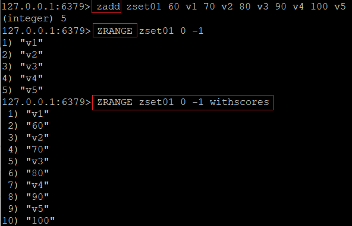
* **ZRANGEBYSCORE key s1 s2:**
	* 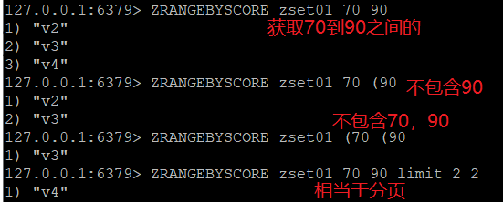
* **zrem key key中某个score对应的值：**删除，例如：**zrem zset01 v5**
* **ZCARD/ZCOUNT/ZRANK/ZSCORE**
	* 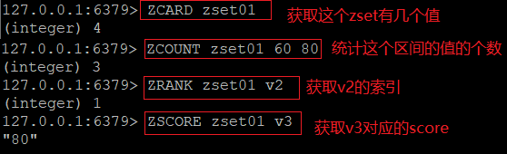
* **ZREVRANK key 值：**反向获取这个值的索引，例如：**ZREVRANK zset01 v4**，zrank获取到v4的索引是3，这边反向获取的就是0
* **ZREVRANGE：**反向获取所有的值
	* 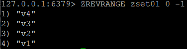
###redis中的key
* keys *：显示库中所有的key的名称
* **EXISTS 某个key的名称：**判断库中有没有这个key
* **MOVE key名 库名：**把当前库中的一个key移动到另一个库中，例如MOVE k1 2
* **expire key 秒钟数：**为给定的 key设置过期时间
* **ttl key：**查看这个key还有多久过期，-1表示永不过期，-2表示已经过期
* **type key：**查看这个key是什么类型的
* 
##redis的配置文件redis.conf
###配置文件路径：/opt/redis/redis.conf
###Units单位
* 
###INCLUDES包含
* 
###GENERAL通用
###SNAPSHOTTING快照
* **save**
	* 默认是**一分钟修改一万次，五分钟十万次，十五分钟一次**
	* 命令： **save 秒钟 写操作次数**
	* 禁用： 想禁用rdb持久化策略，只要不设置任何save指令就可以，或者save ""，传一个空字符串
	* 即时备份操作：直接**save**即可
* **stop-writes-on-bgsave-error**：默认是yes，表示后台出错前台停止备份，配置成no表示不在乎数据不一致
* **rdbcompression**：设置成yes表示开启LZF算法进行压缩，默认开启
* **rdbchecksum**：设置成yes表示存储快照后让redis使用CRC64算法来做数据检验，但是会增加10%性能消耗
* **dbfilename**：设置备份文件的名字
* **dir**：获得当前执行命令的目录
###REPLICATION复制
###SECURITY安全
* 获取redis密码： **config get requirepass**
* 设置密码： **config set requirepass "123456"**
* 要运行其他命令就要先输入密码： **auth 密码**
###LIMITS限制
* maxclients 10000：连接数
* maxmemory <bytes>：最大可用物理内存
* maxmemory-policy noeviction:当内训数据达到maxmemory时，会根据这个来清除缓存
	* 1，noeviction：不执行任何淘汰策略，当达到内存限制的时候客户端执行命令会报错。
	* 2，allkeys-lru：从所有数据范围内查找到最近最少使用的数据进行淘汰，直到有足够的内存来存放新数据。
	* 3，volatile-lru：从所有的最近最少访问数据范围内查找设置到过期时间的数据进行淘汰，如果查找不到数据，则回退到noeviction。
	* 4，allkeys-random：从所有数据范围内随机选择key进行删除。
	* 5，volatile-random：从设置了过期时间的数据范围内随机选择key进行删除。
	* 6，volatile-ttl：从设置了过期时间的数据范围内优先选择设置了TTL的key进行删除。
* maxmemory-samples 5:
###APPEND ONLY MODE追加
* appendonly：默认no，不打开状态
* appendfilename：生成文件的名字
* appendfsync：
	* Always：同步持久化每次发生数据变更会立即记录到磁盘，性能较差但是数据完整性比较好
	* Everysec：出厂默认推荐，异步操作，每秒记录，一秒内宕机有数据丢失
	* No
* no-appendfsync-on-rewrite：重写时是否可以运用appendfsync，用默认配置即可，保证数据安全性
* auto-aof-rewrite-percentage：设置重写的基准值，100%，就是一倍，默认为100
* auto-aof-rewrite-min-size： 64M，默认为64mb
###常见配置介绍
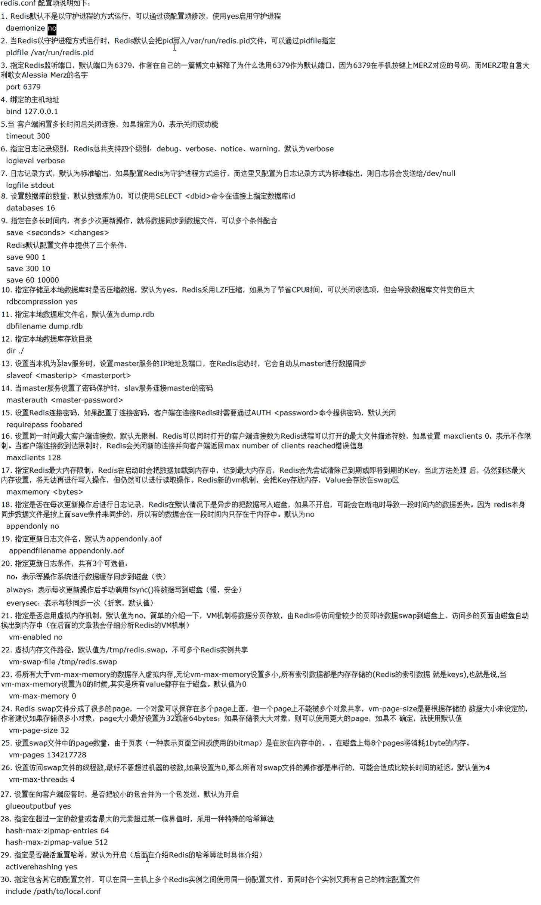
##redis的持久化
###RDB(redis database)
* 介绍
	* 
* Fork：
	* 
* rdb保存的是dump.rdb文件
* 配置位置：对应上面的SNAPSHOTTING快照
* 如何触发rdb快照:使用save或者bgsave快速备份，save相当于同步，bgsave相当于异步
* 如何恢复：把备份文件(dump.rdb)放到redis安装目录即可
* 如何停止：动态停止所有RDB保存规则的方法：**redis-cli config set save ""**
* 
###AOF(append only file)
* 介绍
	* 
* AOF保存的是appendonly.aof文件
* 配置位置：对应上面的APPEND ONLY MODE追加
* AOF启动/修复/恢复:**把appendonly改成yes/修复就是redis-check-aof --fix 文件路径**
* Rewrite
	* 是什么
	* 
	* 重写原理：
	* 
	* 触发机制：Redis会记录上次重写时AOF的大小，默认配置是当AOF文件大小是上次rewrite后大小的一倍且文件大于64M时触发
* 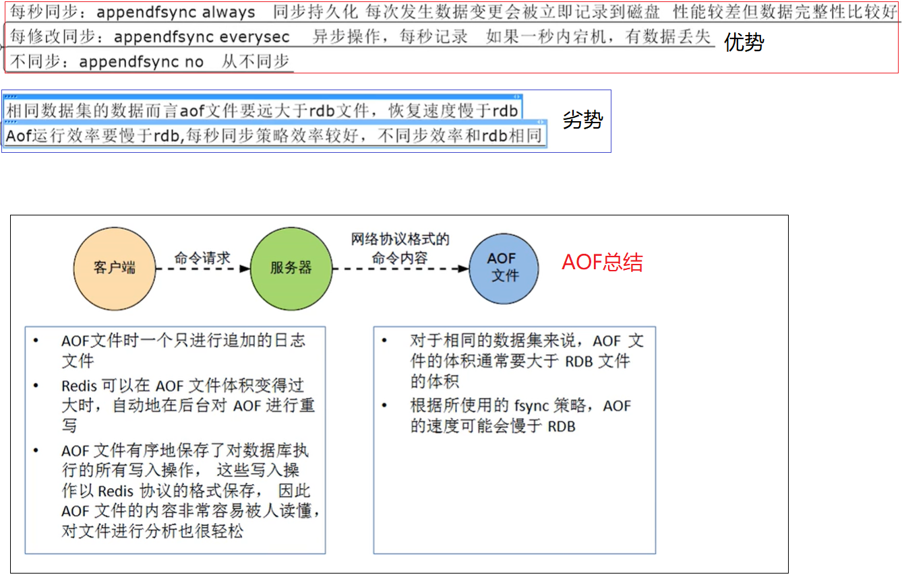
##redis的事务
###是什么
* 
###能干嘛：一个队列中，一次性，顺序性，排他性的执行一系列命令
###怎么用
* 正常执行：**MULTI...EXEC**
* 放弃事务：**MULTI...DISCARD**
* 全体连坐：**MULTI...EXEC**，如果其中一个报错，就都不会执行，
* 冤头债主：**MULTI...EXEC**，如果运行的时候没报错，exec的时候才报错那么其他没报错的正常运行
* watch监控：
	* 乐观锁:类似mysql里的行锁，并发性高，策略是提交版本必须高于当前版本
	* 悲观锁：类似mysql里的表锁，并发性弱，安全性高
	* CAS(check and set)：
	* 案例
		* 初始化信用卡可用余额和欠额
		* 无加塞篡改，先监控在multi，保证两笔交易在同一个事务里面
		* 有加塞篡改(在我修改的时候有别人修改)
		* unwatch(使用unwatch取消监控，在重新watch)
		* 一旦执行exec之前的监控锁都会被取消
###常用命令

###3阶段

###3特性

##redis的发布和订阅
###是什么：
* 进程中的一种消息通信模式：发送者(pub)发送消息，订阅者(sub)收到消息
###命令
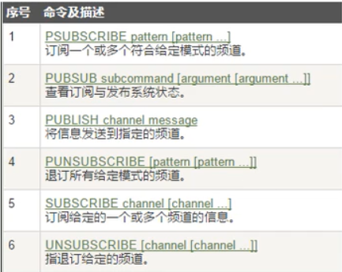
###案例
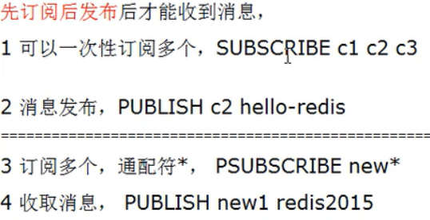
##redis的复制(Master/Slave)
###是什么
* 是我们所说的主从复制，主机数据更新后根据配置和策略，自动同步到备机的master/slave机制，master以写为主，slave以读为主
###能干嘛
* 读写分离
* 容灾回复
###怎么用
1. 配从库不配主库
2. 从库配置： **slaveof 主库ip 主库端口**
	* 每次和master断开后都要重新连接，除非配置进redis.conf文件
	* Info replication
3. 修改配置文件细节操作
	* 拷贝多个redis.conf文件
	* 开启daemonize yes
	* Pid文件名字
	* 指定端口
	* Log文件名字
	* Dump.rdb名字
4. 常用3招
	* 一主二仆
		* Init
		* 一个Master两个Slave
		* 日志查看
		* 主从问题演示，使用**info replication**查看当前库的身份
	* 薪火相传
		* 
	* 反客为主： **SLAVEOF no one：**是当前库停止与其他库的同步，转变成主库master
###复制原理

###哨兵模式(sintinel)
* 是什么：反客为主的自动版，监控后台主机是否故障，故障了就根据投票数把一个从库变成主库
* 怎么用(使用步骤)
	* 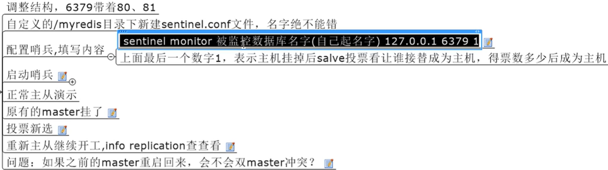
* 一组sintinel能监控多个master
###复制的缺点

