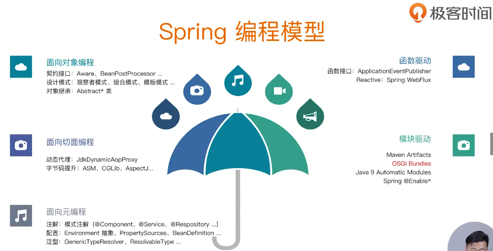
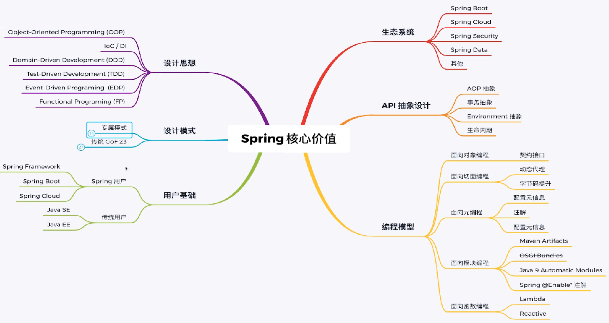
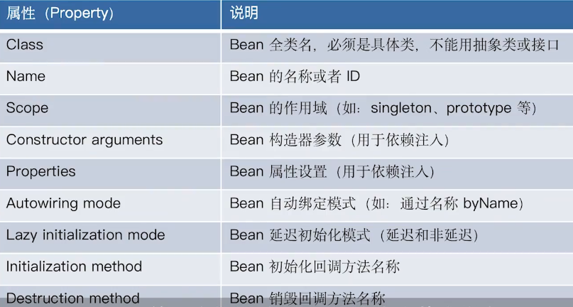

# Spring-xmg笔记

## 课前准备

## Spring 特性总览

### 核心特性(Core)

* loC 容器 (loC Container)

  * Spring loC 依赖查找

    * 根据 Bean 名称查找
      * 实时查找
      * 延迟查找
    * 根据 Bean 类型查找
      * 单个Bean 对象
      * 集合Bean对象
    * 根据 Bean 名称+类型查找
    * 根据 Java 注解查找
      * 单个 Bean 对象
      * 集合Bean 对象

  * Spring loc 依赖注入

    * 根据 Bean 名称注入
    * 根据 Bean 类型注入
      * 单个 Bean 对象
      * 集合Bean 对象
    * 注入容器内建Bean 对象
    * 注入非Bean 对象
    * 注入类型
      * 实时注入
      * 延迟注入

  * Spring loc 依赖来源

    * 自定义 Bean
    * 容器内建 Bean 对象，内部容器构建的Bean
    * 容器内建依赖，也就是内部容器构建的依赖，容易初始化时候给我们创建的一些Bean

  * Spring loC 配置元信息

    * Bean 定义配置
      * 基于XML文件
      * 基于Properties 文件
      * 基于Java注解
      * 基于 Java API(专题讨论)
    * loC 容器配置
      * 基于XML文件
      * 基于 Java注解
      * 基于 Java API(专题讨论)
    * 外部化属性配置
      * 基于Java注解

  * Spring loC 容器

    * BeanFactory 和 ApplicationContext 谁才是 Spring loC 容器?

      > 两者都是ioc容器，只不过a在b的基础上进行扩展比如对aop更好的支持以及对event的处理。a是b的一个超集，a包含b所有的东西，还多出一些新特性。

  * Spring 应用上下文使用 ，ApplicationContext 除了 loC 容器角色，还有提供：

    * 面向切面 (AOP)
    * 配置元信息 (Configuration Metadata)
    * 资源管理 (Resources)
    * 事件(Events)
    * 国际化 (i18n)
    * 注解(Annotations)
    * Environment 抽象(Environment Abstraction)

  * 使用Spring loC 容器

    * BeanFactory 是 Spring 底层loC 容器 
    * ApplicationContext 是具备应用特性的 BeanFactory 超集

  * Spring loC 容器生命周期

    * 启动
    * 运行
    * 停止

  * 面试题精选

* Spring 事件 (Events)

* 资源管理 (Resources国际化 (i18n)

* 校验(Validation)

* 数据绑定(Data Binding)

* 类型装换 (Type Conversion)

* Spring 表达式(Spring Express Language)

* 面向切面编程(AOP)

### 数据存储(Data Access)

* JDBC
* 事务抽象 (Transactions)
* DAO 支持 (DAO Support)
* O/R映射 (O/R Mapping)
* XML编列(XML Marshalling)

### Web技术(web)

* Web Servlet 技术栈
  * Spring MVC
  * WebSocket
  * SockJS
* Web Reactive 技术栈
  * Spring WebFlux
  * WebClient
  * WebSocket

### 技术整合 (Integration)

* 远程调用(Remoting)
* Java 消息服务(JMS)
* Java 连接架构 (JCA)
* Java 管理扩展(JMX)
* Java 邮件客户端(Email)
* 本地任务 (Tasks)
* 本地调度 (Scheduling)
* 缓存抽象 (Caching)
* Spring 测试(Testing)

### 测试 (Testing)

* 模拟对象 (Mock Objects)
* TestContext 框架 (TestContext Framework)
* Spring MVC 测试(Spring MVC Test)
* Web 测试客户端(WebTestClient) 

## Spring 版本特性

## Spring 模块化设计

## Spring 对 Java 语言特性运用

## Spring 对 JDK API 实践

## Spring 对 Java EE API 整合

## Spring 编程模型

 

## Spring 核心价值

 

## 面试题精选

### 笔记

#### SpringBean基础

* 定义 Spring Bean

  * 什么是 BeanDefinition? 
  * BeanDefinition 是 Spring Framework 中定义 Bean 的配置元信息接口，包含：
    * Bean的类名
    * Bean 行为配置元素，如作用域、自动绑定的模式，生命周期回调等
    * 其他 Bean 引用，又可称作合作者 (collaborators) 或者依赖 (dependencies)
    * 配置设置，比如 Bean 属性 (Properties)

* BeanDefinition 元信息

  * 元信息
    *   
  * BeanDefinition 构建
    * 通过 BeanDefinitionBuilder
    * 通过AbstractBeanDefinition 以及派生类

* 命名 Spring Bean

  * Bean 的名称
    * 每个 Bean 拥有一个或多个标识符 (identifiers)，这些标识符在 Bean 所在的容器必须是唯的。通常，一个 Bean 仅有一个标识符，如果需要额外的，可考虑使用别名 (Alias) 来扩充。
    * 在基于XML的配置元信息中，开发人员可用 id 或者name 属性来规定 Bean 的标识符。通常 Bean 的 标识符由字母组成，允许出现特殊字符。如果要想引入 Bean 的别名的话，可在name 属性使用半角逗号 (“”)或分号 (“,”)来间隔。
    * Bean的id或name 属性并非必须制定，如果留空的话，容器会为 Bean 自动生成一个唯一的名称。Bean的命名尽管没有限制不过官方建议采用驼峰的方式，更符合 Java 的命名约定。
  * Bean 名称生成器(BeanNameGenerator)
  * 由 Spring Framework 2.0.3 引入，框架内建两种实现DefaultBeanNameGenerator: 默认通用 BeanNameGenerator 实现
  * AnnotationBeanNameGenerator: 基于注解扫描的 BeanNameGenerator 实现，起始于 Spring

* Spring Bean 的别名

* Bean 别名 (Alias) 的价值

  * 复用现有的 BeanDefinition

  * 更具有场景化的命名方法，比如:

    > <alias name="myApp-dataSource"alias="subsystemA-dataSource"/>
    >
    > <alias name="myApp-dataSource"alias="subsystemB-dataSource"/>

* 注册 Spring Bean

* BeanDefinition注册

  * XML 配置元信息
    * <bean name="...”... />
  * Java 注解配置元信息
    * @Bean
    * @Component
    * @lmport
  * Java API配置元信息
    * 命名方式: BeanDefinitionRegistry#registerBeanDefinition(String,BeanDefinition)
    * 非命名方式: BeanDefinitionReaderUtils#registerWithGeneratedName(AbstractBeanDefinition,BeanfinitionRegistry)
    * 配置类方式: AnnotatedBeanDefinitionReader#register(Class...)

* 实例化 Spring Bean

* 初始化 Spring Bean

* 延迟初始化 Spring Bean

* 销毁 Spring Bean

* 垃圾回收 Spring Bean

* 面试题精选

