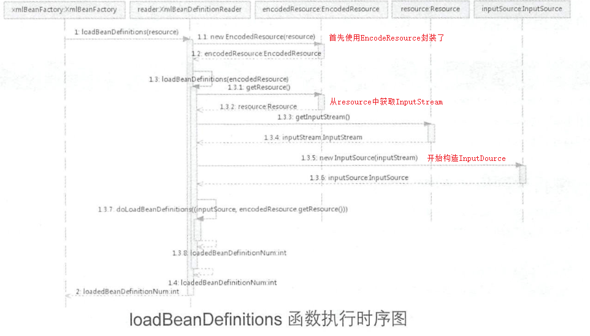
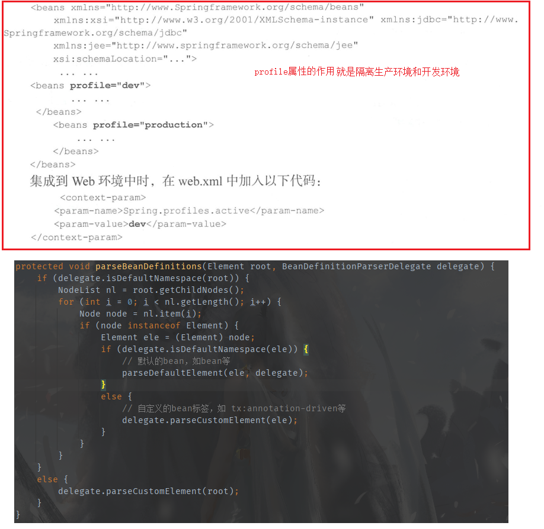
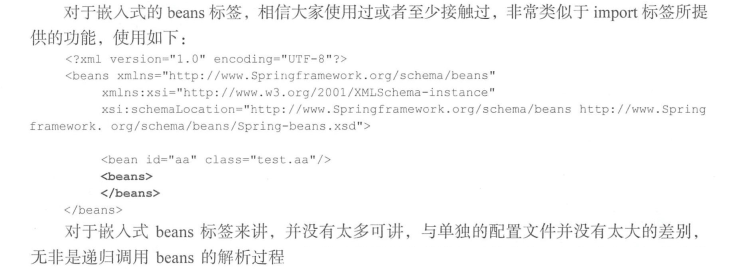

#Spring源码笔记
##1.容器的基本实现
###1.1.首先来看一个最简单的例子
	@Test
	public void Test() {
		BeanFactory bf = new XmlBeanFactory("xxx.xml");
		User user = (User)bf.getBean("user");
		Sting name = user.getName();
	}
####1.1.1分析：
1. 首先从xml文件中读取配置
2. 使用反射创建User对象
3. 调用User实例的getName()方法
####1.1.2想完成上述功能至少需要三个类:
1. 读取配置文件的类Reader
2. 创建实例的类
3. 把整个流程串联到一起的类
###1.2.核心类的介绍
####1.2.1 DefaultListableBeanFactory 
######它是注册和加载bean的默认实现，和它的子类XmlBeanFactory的区别就是XmlBeanFactory使用的是自定义的xml读取器---XmlBeanDefinitionReader，实现了个性化的读取。DefaultListableBeanFactory继承了AbstractAutowireCapableBeanFactory并实现了ConfigurableListableBeanFactory和BeanDefinitionRegistry

####1.2.2XmlBeanDefinitionReader
######这个类就是XmlBeanFactory用来读取xml配置文件的。继承了AbstractBeanDefinitionReader，使用ResourceLoader将资源路径转换成Resource文件，然后在通过DocumentLoader把Resource文件转换成Document文件，这个是一个接口，源码中是new了一个默认实现类。然后通过BeanDefinitionDocumentReader的DefaultBeanDefinitionDocumentReader解析Document。
####1.3容器的基础XmlBeanFactory

######1.3.1配置文件的封装

######在XmlBeanFactory的构造函数中进行了资源的加载，在真正进行资源加载的之前，调用了父类的构造方法，一直追下去会发现AbstractAutowireCapableBeanFactory这个类的构造方法中使用了ignoreDependencyInterface方法，这个方法的作用是自动装配忽略指定类，为的是，例如a属性依赖b属性时，a初始化了，b还没有初始化，就会自动初始化b。当b继承了BeanNameAware就不会被自动装配

######1.3.2加载Bean

######doLoadBeanDefinitions()方法主要是做了三件事，第一是获取xml的校验模式，第二加载xml文件，得到Document对象，第三是根据返回的Document信息注册Bean信息。
1. 获取检验模式：如果手动指定了就使用手动指定的，没有指定则使用自动的，自动的话会使用专门检验xml的类XmlValidationModeDetector来处理，这个类通过验证有没有DOCTYPE，来区分DTD还是XSD。
2. 加载xml文件： 调用的是DocumentLoader接口的实现类DefaultDocumentLoader，其中有一个参数是entityResolver。这个接口接收publicId，systemId，返回InputSource对象。查看它的实现类DelegatingEntityResolver。不同的验证模式使用不同的解析器，解析dtd是BeansDtdResolver这个类干的，它截取systemId最后的xx.dtd，然后在当前路径下寻找。 解析xsd则是用PluggableSchemaResolver，它是默认到META-INF/Spring.schemas文件中找systemId对应的xsd文件。
3. **解析以及注册BeanDefinition**：首先会解析profile属性，然后在DefaultBeanDefinitionDocumentReader类中解析前后都由两个方法执行preProcessXml，postProcessXml，但是两个方法中都没有代码。在面向对象设计方法学中常说的一句话：**一个类要么是面向继承设计的，要么就用final修饰。**这两个方法是为子类设计的，是模板方法模式。继承自DefaultBeanDefinitionDocumentReader的类想要在解析前后做处理，只需要重写这两个方法即可。继续深入会发现处理xml中bean标签时会有所差距，默认的标签就使用默认的处理，自定义的就需要另外处理，如下图黑色代码部分所示。

###1.4 默认标签的解析
######对四种(import, alias, bean, beans)默认标签做了不同的解析
####1.4.1 bean标签的解析及注册
1. **解析BeanDefinition：** 就是从元素中解析各个属性如class，id等，然后封装到AbstractBeanDefinition中返回。
2. **AbstractBeanDefinition的属性：** 这个类中包含了bean标签的很多属性，基本都有
	1. ChildBeanDefinition： 标签里嵌套标签就用这个存
	2. GenericBeanDefinition： 没有父标签，也没有子标签就用这个存
	3. RootBeanDefinition： 有子标签用这个存
3. **解析默认标签中的自定义标签元素：**
4. **注册解析的BeanDefinition：**
	1. 通过beanName注册BeanDefinition
		1. 校验methodOverride属性
		2. 注册bean，就是往ConcurrentHashMap存数据
		3. 记录beanName
		4. 重置缓存信息
	2. 通过别名注册BeanDefinition
		1. 名称相同就不用处理， 把原来的alias移除掉
		2. 如果alias不允许被覆盖就抛出异常
		3. 循环检查alias，当a->b 存在时，再次出现a->c->b就会抛出异常
		4. 注册alias
5. **通知监听器解析及注册完成：**当需要在注册BeanDefinition事件进行监听时可以通过注册监听器的方法将处理逻辑写入监听器，spring没有做逻辑处理。
####1.4.2 alias标签的解析
######跟1.4.1中第4.2里说的差不多

	protected void processAliasRegistration(Element ele) {
		// 获取beanName
		String name = ele.getAttribute(NAME_ATTRIBUTE);
		// 获取别名
		String alias = ele.getAttribute(ALIAS_ATTRIBUTE);
		boolean valid = true;
		if (!StringUtils.hasText(name)) {
			getReaderContext().error("Name must not be empty", ele);
			valid = false;
		}
		if (!StringUtils.hasText(alias)) {
			getReaderContext().error("Alias must not be empty", ele);
			valid = false;
		}
		if (valid) {
			try {
				// 注册alias
				getReaderContext().getRegistry().registerAlias(name, alias);
			}
			catch (Exception ex) {
				getReaderContext().error("Failed to register alias '" + alias +
						"' for bean with name '" + name + "'", ele, ex);
			}
			// 通知监听器注册完成了
			getReaderContext().fireAliasRegistered(name, alias, extractSource(ele));
		}
	}
####1.4.3 import标签的解析
1. 获取resource属性所表示的路径
2. 解析系统属性：例如“ $ {user.dir}”
3. 判断是绝对路径还是相对路径
4. 如果是绝对路径就递归调用bean的解析过程
5. 如果是相对路径就计算出绝对路径再进行解析
6. 通知监听器解析完成
#
	protected void importBeanDefinitionResource(Element ele) {
		// 获取resource属性
		String location = ele.getAttribute(RESOURCE_ATTRIBUTE);
		// 如果不存在就不做任何处理
		if (!StringUtils.hasText(location)) {
			getReaderContext().error("Resource location must not be empty", ele);
			return;
		}

		// Resolve system properties: e.g. "${user.dir}"  解析系统属性：例如“ $ {user.dir}”
		location = getReaderContext().getEnvironment().resolveRequiredPlaceholders(location);

		Set<Resource> actualResources = new LinkedHashSet<>(4);

		// Discover whether the location is an absolute or relative URI 判断是绝对路径还是相对路径
		boolean absoluteLocation = false;
		try {
			absoluteLocation = ResourcePatternUtils.isUrl(location) || ResourceUtils.toURI(location).isAbsolute();
		}
		catch (URISyntaxException ex) {
			// cannot convert to an URI, considering the location relative//考虑到相对位置，因此无法转换为URI
			// unless it is the well-known Spring prefix "classpath*:" //除非它是众所周知的Spring前缀“ classpath *：”
		}

		// Absolute or relative? 绝对还是相对？
		if (absoluteLocation) {
			try {
				// 如果是绝对路径就直接根据地址加载配置文件
				int importCount = getReaderContext().getReader().loadBeanDefinitions(location, actualResources);
				if (logger.isTraceEnabled()) {
					logger.trace("Imported " + importCount + " bean definitions from URL location [" + location + "]");
				}
			}
			catch (BeanDefinitionStoreException ex) {
				getReaderContext().error(
						"Failed to import bean definitions from URL location [" + location + "]", ele, ex);
			}
		}
		else {
			// No URL -> considering resource location as relative to the current file. 没有URL->考虑相对于当前文件的资源位置。
			// 如果是相对地址就根据相对地址算出绝对地址
			try {
				int importCount;
				//Resource存在多个子实现类,如VfsResource, FilesystemResource等,
				// 而每个resource的createRelative方式实现都不一样,所以这里先使用子类的方法尝试解析
				Resource relativeResource = getReaderContext().getResource().createRelative(location);
				if (relativeResource.exists()) {
					importCount = getReaderContext().getReader().loadBeanDefinitions(relativeResource);
					actualResources.add(relativeResource);
				}
				else {
					// 如果解析不成功就使用默认的解析器ResourcePatternResolver进行解析
					String baseLocation = getReaderContext().getResource().getURL().toString();
					importCount = getReaderContext().getReader().loadBeanDefinitions(
							StringUtils.applyRelativePath(baseLocation, location), actualResources);
				}
				if (logger.isTraceEnabled()) {
					logger.trace("Imported " + importCount + " bean definitions from relative location [" + location + "]");
				}
			}
			catch (IOException ex) {
				getReaderContext().error("Failed to resolve current resource location", ele, ex);
			}
			catch (BeanDefinitionStoreException ex) {
				getReaderContext().error(
						"Failed to import bean definitions from relative location [" + location + "]", ele, ex);
			}
		}
		Resource[] actResArray = actualResources.toArray(new Resource[0]);
		// 通知监听器注册完成了
		getReaderContext().fireImportProcessed(location, actResArray, extractSource(ele));
	}
####1.4.4 嵌入式beans标签的解析

###1.5 自定义标签的解析(跳过)
##2. Bean的加载
###2.1FactoryBean的使用

###2.2缓存中获取单例bean
	protected Object getSingleton(String beanName, boolean allowEarlyReference) {
		// Quick check for existing instance without full singleton lock 快速检查现有实例，而无需完全单例锁定
		// 1. 检查singletonObjects缓存中是否有实例 singletonObjects：beanName -》 beanInstance
		Object singletonObject = this.singletonObjects.get(beanName);
		if (singletonObject == null && isSingletonCurrentlyInCreation(beanName)) {
			// 2. singletonObjects中没有， 在从earlySingletonObjects中查询 earlySingletonObjects： beanName -》 beanInstance，
			// 区别是当bean还在加载，就可以调用getBean获取，目的是用来检测循环引用
			singletonObject = this.earlySingletonObjects.get(beanName);
			if (singletonObject == null && allowEarlyReference) {
				// 如果为空，就锁定全局变量并进行处理
				synchronized (this.singletonObjects) {
					// Consistent creation of early reference within full singleton lock
					// 如果这个bean正在加载就不处理
					singletonObject = this.singletonObjects.get(beanName);
					if (singletonObject == null) {
						singletonObject = this.earlySingletonObjects.get(beanName);
						if (singletonObject == null) {
							// 当某些方法需要提前初始化的时候则会调用addSingletonFactory方法将对应的
							// ObjectFactory初始化策略储存在singletonFactories中
							// 3. 再找不到就尝试从singletonFactories获取ObjectFactory
							ObjectFactory<?> singletonFactory = this.singletonFactories.get(beanName);
							if (singletonFactory != null) {
								// 调用预先设定的getObject方法
								// 4. 然后再调用getObject方法来创建bean
								singletonObject = singletonFactory.getObject();
								// 记录在缓存中 earlySingletonObjects和singletonObject互斥
								this.earlySingletonObjects.put(beanName, singletonObject);
								this.singletonFactories.remove(beanName);
							}
						}
					}
				}
			}
		}
		return singletonObject;
	}
######2.2.1首先会从singletonObjects中获取bean实例，没有再从earlySingletonObjects获取，还是没有就创建bean。如果bean正在加载就不处理，然后实在找不到，就去singletonFactories中找bean的ObjectFactory，然后调用getObject()方法创建bean，再把bean加到earlySingletonObjects中，然后清除singletonFactories中这个bean的ObjectFactory对象。
1. **singletonObjects：**这个map存的是beanName -> beanInstance
2. **earlySingletonObjects:**这个map存的也是beanName -> beanInstance，区别是当bean放到这里面后，当bean还在创建的时候，家可以通过getBean获取到，目的是为了检测循环引用
3. **singletonFactories"**beanName -> ObjectFactory
4. **registeredSingletons:**用来保存当前已经注册的bean
###2.3 从bean的实例中获取对象
####