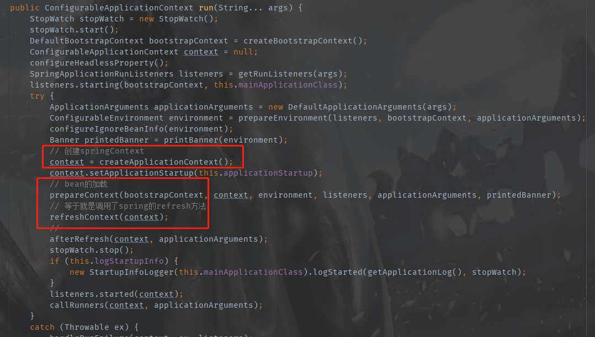
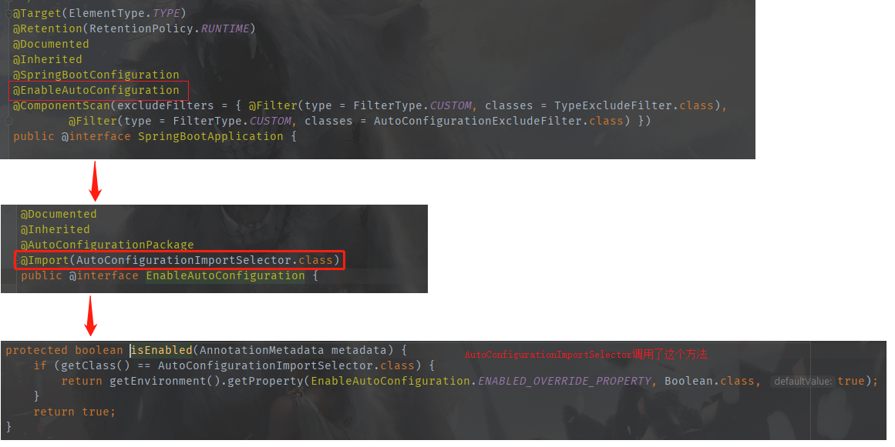
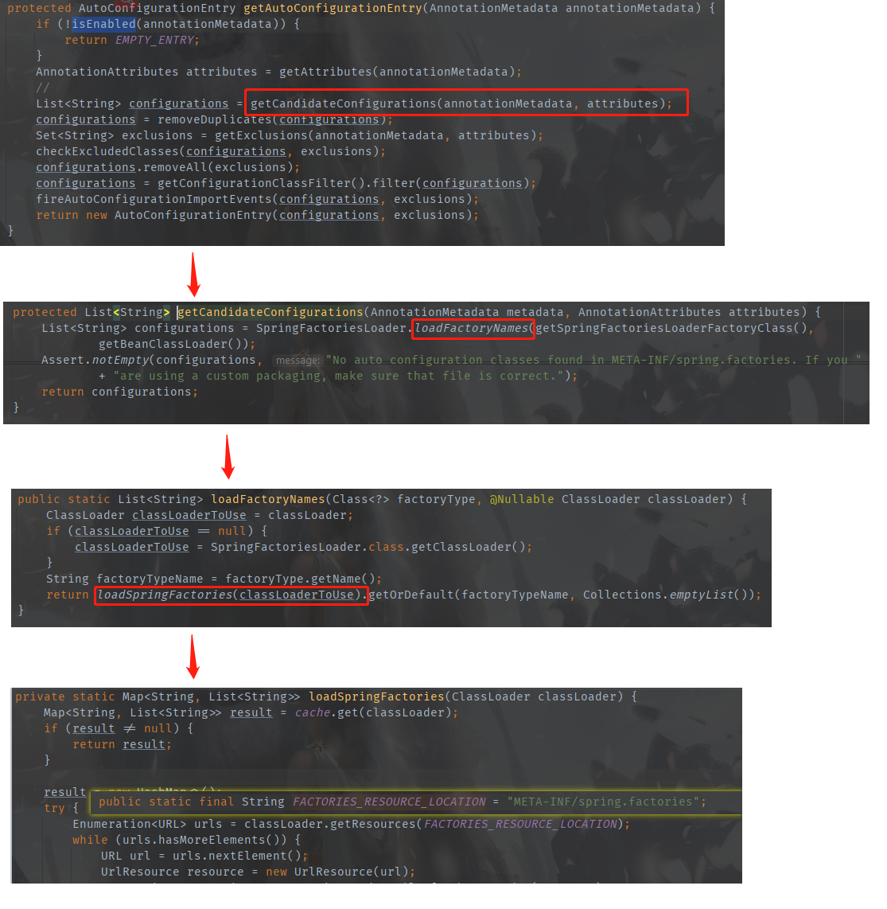
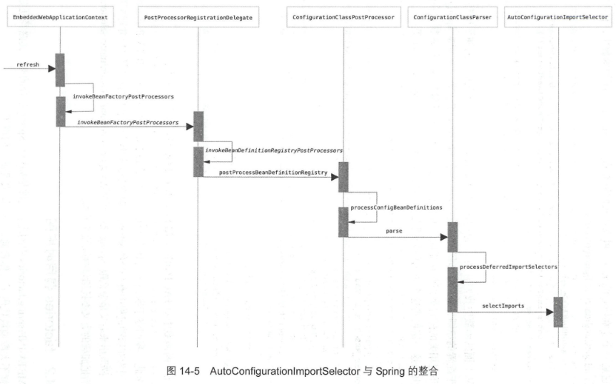
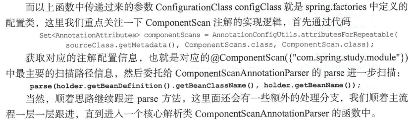
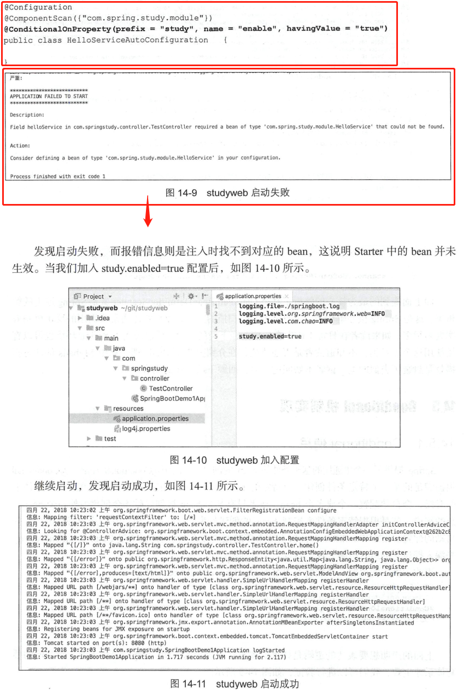

#Spring Boot源码
##run方法解析

	public ConfigurableApplicationContext run(String... args) {
		StopWatch stopWatch = new StopWatch();
		stopWatch.start();
		DefaultBootstrapContext bootstrapContext = createBootstrapContext();
		ConfigurableApplicationContext context = null;
		configureHeadlessProperty();
		SpringApplicationRunListeners listeners = getRunListeners(args);
		listeners.starting(bootstrapContext, this.mainApplicationClass);
		try {
			ApplicationArguments applicationArguments = new DefaultApplicationArguments(args);
			ConfigurableEnvironment environment = prepareEnvironment(listeners, bootstrapContext, applicationArguments);
			configureIgnoreBeanInfo(environment);
			Banner printedBanner = printBanner(environment);
			// 创建springContext
			context = createApplicationContext();
			context.setApplicationStartup(this.applicationStartup);
			// bean的加载
			prepareContext(bootstrapContext, context, environment, listeners, applicationArguments, printedBanner);
			// 等于就是调用了spring的refresh方法
			refreshContext(context);
			//
			afterRefresh(context, applicationArguments);
			stopWatch.stop();
			if (this.logStartupInfo) {
				new StartupInfoLogger(this.mainApplicationClass).logStarted(getApplicationLog(), stopWatch);
			}
			listeners.started(context);
			callRunners(context, applicationArguments);
		}
		catch (Throwable ex) {
			handleRunFailure(context, ex, listeners);
			throw new IllegalStateException(ex);
		}

		try {
			listeners.running(context);
		}
		catch (Throwable ex) {
			handleRunFailure(context, ex, null);
			throw new IllegalStateException(ex);
		}
		return context;
	}
####总结： springboot内置了spring原有的启动类，在启动的时候启动和刷新，只是吧context换成了AnnotationConfigWebApplicationContext
##@SpringBootApplication注解
###1. starter的自动配置原理

####spring.factories的加载

####factories调用时序图

####配置类的解析
* ConfigurationClassPostProcessor作为Spring扩展点是Spring Boot一系列功能的基础入口。
* ConfigurationClassParser作为解析职责的基本处理类,涵盖了各种解析处理的逻辑,如@lmport.@Bean.@ImportResource 、@PropertySource、@ComponentScan等注解都是在这个注解类中完成的,而这个类对外开放的函数入口就是parse方法。对应时序图中的步骤3。
* 在完成步骤3后,所有解析的结果已经通过3.2.2步骤放在了parse的configurationClasses,属性中,这时候对这个属性进行统一的spring bean硬编码注册,注册逻辑统一委托给ConfigurationClassBeanDefinitionReader,对外的接口是loadBeanDefinitions,对应步聚4
* 当然,在parse中的处理是最复杂的, parse中首先会处理自己本身能扫描到的bean注册逻辑,然后才会处理spring.factories定义的配置。处理spring.factories定义的配置首先就是要加载配置类,这个时候EnableAutoConfigurationImportSelector提供的selectlmports就被派上用场了,它返回的配置类需要进行进一步解析,因为这些配置类中可能对应不同的类型,如@Import,@Bean,@ImportResource 、@PropertySource@ComponentScan,而这些类型又有不同的处理逻辑,例如ComponentScan,我们就能猜到这里面除了解析外一定还会有递归解析的处理逻辑,因为很有可能通过ComponentScan又扫描出了另一个ComponentScan配置
####Componentscan的切入点
	protected final SourceClass doProcessConfigurationClass(
			ConfigurationClass configClass, SourceClass sourceClass, Predicate<String> filter)
			throws IOException {

		if (configClass.getMetadata().isAnnotated(Component.class.getName())) {
			// Recursively process any member (nested) classes first
			processMemberClasses(configClass, sourceClass, filter);
		}

		// Process any @PropertySource annotations
		for (AnnotationAttributes propertySource : AnnotationConfigUtils.attributesForRepeatable(
				sourceClass.getMetadata(), PropertySources.class,
				org.springframework.context.annotation.PropertySource.class)) {
			if (this.environment instanceof ConfigurableEnvironment) {
				processPropertySource(propertySource);
			}
			else {
				logger.info("Ignoring @PropertySource annotation on [" + sourceClass.getMetadata().getClassName() +
						"]. Reason: Environment must implement ConfigurableEnvironment");
			}
		}

		// Process any @ComponentScan annotations
		Set<AnnotationAttributes> componentScans = AnnotationConfigUtils.attributesForRepeatable(
				sourceClass.getMetadata(), ComponentScans.class, ComponentScan.class);
		if (!componentScans.isEmpty() &&
				!this.conditionEvaluator.shouldSkip(sourceClass.getMetadata(), ConfigurationPhase.REGISTER_BEAN)) {
			for (AnnotationAttributes componentScan : componentScans) {
				// The config class is annotated with @ComponentScan -> perform the scan immediately
				Set<BeanDefinitionHolder> scannedBeanDefinitions =
						this.componentScanParser.parse(componentScan, sourceClass.getMetadata().getClassName());
				// Check the set of scanned definitions for any further config classes and parse recursively if needed
				for (BeanDefinitionHolder holder : scannedBeanDefinitions) {
					BeanDefinition bdCand = holder.getBeanDefinition().getOriginatingBeanDefinition();
					if (bdCand == null) {
						bdCand = holder.getBeanDefinition();
					}
					if (ConfigurationClassUtils.checkConfigurationClassCandidate(bdCand, this.metadataReaderFactory)) {
						parse(bdCand.getBeanClassName(), holder.getBeanName());
					}
				}
			}
		}

		// Process any @Import annotations
		processImports(configClass, sourceClass, getImports(sourceClass), filter, true);

		// Process any @ImportResource annotations
		AnnotationAttributes importResource =
				AnnotationConfigUtils.attributesFor(sourceClass.getMetadata(), ImportResource.class);
		if (importResource != null) {
			String[] resources = importResource.getStringArray("locations");
			Class<? extends BeanDefinitionReader> readerClass = importResource.getClass("reader");
			for (String resource : resources) {
				String resolvedResource = this.environment.resolveRequiredPlaceholders(resource);
				configClass.addImportedResource(resolvedResource, readerClass);
			}
		}

		// Process individual @Bean methods
		Set<MethodMetadata> beanMethods = retrieveBeanMethodMetadata(sourceClass);
		for (MethodMetadata methodMetadata : beanMethods) {
			configClass.addBeanMethod(new BeanMethod(methodMetadata, configClass));
		}

		// Process default methods on interfaces
		processInterfaces(configClass, sourceClass);

		// Process superclass, if any
		if (sourceClass.getMetadata().hasSuperClass()) {
			String superclass = sourceClass.getMetadata().getSuperClassName();
			if (superclass != null && !superclass.startsWith("java") &&
					!this.knownSuperclasses.containsKey(superclass)) {
				this.knownSuperclasses.put(superclass, configClass);
				// Superclass found, return its annotation metadata and recurse
				return sourceClass.getSuperClass();
			}
		}

		// No superclass -> processing is complete
		return null;
	}

###2. Conditional机制实现
####Conditional使用

####Conditional原理
	@Override
	public ConditionOutcome getMatchOutcome(ConditionContext context, AnnotatedTypeMetadata metadata) {
		List<AnnotationAttributes> allAnnotationAttributes = annotationAttributesFromMultiValueMap(
				metadata.getAllAnnotationAttributes(ConditionalOnProperty.class.getName()));
		List<ConditionMessage> noMatch = new ArrayList<>();
		List<ConditionMessage> match = new ArrayList<>();
		for (AnnotationAttributes annotationAttributes : allAnnotationAttributes) {
			// 核心逻辑
			ConditionOutcome outcome = determineOutcome(annotationAttributes, context.getEnvironment());
			(outcome.isMatch() ? match : noMatch).add(outcome.getConditionMessage());
		}
		if (!noMatch.isEmpty()) {
			return ConditionOutcome.noMatch(ConditionMessage.of(noMatch));
		}
		return ConditionOutcome.match(ConditionMessage.of(match));
	}
