#SpringBoot
##1. 入门程序hello world
###1. 实现功能：浏览器发送hello请求，服务器接收并响应一个hello world
* 创建maven工程
* 导入springboot的依赖

		<parent>
	        <groupId>org.springframework.boot</groupId>
	        <artifactId>spring-boot-starter-parent</artifactId>
	        <version>1.5.9.RELEASE</version>
	    </parent>
	    <dependencies>
	        <dependency>
	            <groupId>org.springframework.boot</groupId>
	            <artifactId>spring-boot-starter-web</artifactId>
	        </dependency>
	    </dependencies>
* 编写让springboot启动代码

		@SpringBootApplication//说明这是一个springboot应用
		public class main {
		    public static void main(String[] args) {
		        //spring应用启动起来
		        SpringApplication.run(main.class, args);
		    }
		}
* 编写controller代码，然后运行上面的main方法，访问localhost:8080/hello即可

	    @RequestMapping("/hello")
	    @ResponseBody
	    public String main() {
	        return "hello world!";
	    }
###2. 简化部署
* 导入插件

		<!--    这个插件的作用时可以将这个项目打包成一个可执行的jar包-->
	    <build>
	        <plugins>
	            <plugin>
	                <groupId>org.springframework.boot</groupId>
	                <artifactId>spring-boot-maven-plugin</artifactId>
	            </plugin>
	        </plugins>
	    </build>
* 在maven中使用package打包，然后复制到桌面
* 然后使用命令**java -jar 桌面路径**即可运行(在linux上可以试一下)
##2. hello world探究
### 1. POM文件

	<parent>// 父项目
        <groupId>org.springframework.boot</groupId>
        <artifactId>spring-boot-starter-parent</artifactId>
        <version>1.5.9.RELEASE</version>
    </parent>
		
	//这是上面那个的父项目，真正管理所有springboot依赖(springboot版本仲裁中心)
	<parent>
		<groupId>org.springframework.boot</groupId>
		<artifactId>spring-boot-dependencies</artifactId>
		<version>1.5.9.RELEASE</version>
		<relativePath>../../spring-boot-dependencies</relativePath>
	</parent>
	以后导包不需要写版本号，但是也有没在dependencies中的的依赖就需要写版本号
### 2. 导入的依赖

	<dependency>
        <groupId>org.springframework.boot</groupId>
        <artifactId>spring-boot-starter-web</artifactId>
    </dependency>
* spring-boot-starter: 是springboot场景启动器(就是导入了web模块正常运行的组件
* 
### 3.主程序类，主入口类(main)
* 

		@Target({ElementType.TYPE})
		@Retention(RetentionPolicy.RUNTIME)
		@Documented
		@Inherited
		@SpringBootConfiguration  //springboot配置，表示是一个springboot的配置类
		@EnableAutoConfiguration  //开启自动配置功能
		@ComponentScan(
		    excludeFilters = {@Filter(
		    type = FilterType.CUSTOM,
		    classes = {TypeExcludeFilter.class}
		), @Filter(
		    type = FilterType.CUSTOM,
		    classes = {AutoConfigurationExcludeFilter.class}
		)}
		)
##3.快速创建一个SpringBoot项目
###1. 步骤
* new project => 选择spring initiallizr => 然后选择jdk => 选择需要的模块 => 创建工程
* **@RestController注解可以代替@controller和@responseBody这两个注解**
###2.目录结构
* resource：
	* static： 存放静态资源(js，css，img)，相当于WebContent
	* templates： 存放模板(springboot默认使用嵌入式的Tomcat，因此不支持jsp，要使用jsp则需要使用模板引擎freemarker，thymeleaf)
	* application.properties： 是springboot的配置文件，可以修改一些默认设置
##4.SpringBoot配置
###1.配置文件
* SpringBoot使用的全局配置文件,这两个后缀都会认为是全局配置文件，名字固定
	* application.properties
	* application.yml
* 作用：修改SpringBoot配置的默认值
* YAML（YAML Ain't Markup Language）
	* YAML  A Markup Language：是一个标记语言
	* YAML   isn't Markup Language：不是一个标记语言；
* 标记语言：
	* 以前的配置文件；大多都使用的是  **xxxx.xml**文件；
	* YAML：**以数据为中心**，比json、xml等更适合做配置文件；
	* YAML：配置例子

			server:
  			  port: 8081
###2.YML的基本语法
* 基本语法： 
	* key： val(空格不能少，冒号后面加空格)
	* 如果是层级关系，只要左边对齐的都是同一级
		
			server： 
			  port: 8081
			  path: /hello
	* 属性和值对大小写敏感
* 值的写法
	* 字面量： 普通的值(数字，字符串，boolean)
		* k: v字面直接来写，字符串默认不用加引号
			* ""双引号： 不会转义字符串里面的特殊字符；特殊字符会作为本身想表示的意思
			
					name:   "zhangsan \n lisi"：输出；zhangsan 换行  lisi
			* ''单引号： 会转义特殊字符，特殊字符最终只是一个普通的字符串数据
			
					name:   'zhangsan \n lisi'：输出；zhangsan \n  lisi
	* 对象： Map(属性和值)，(键值对)
		* 还是k: v模式

				1.user			//注意缩进
					name: zhangsan
					age: 15

				2.user: {name: zhangsan,age: 15}  //行内写法，写成一行的格式
				
	* 数组(list,set)： 
		* 用(- 值)的形式，空格不能少

				pets
				  - cat
				  - dog
				  - pig
		* 行内写法： pets: [cat,dog,pig]
###3.配置文件的值注入
* 1.在yml配置文件中写好后需要在domain的类上加一个**@ConfigurationProperties(prefix = "user")**注解

		user:
		    name: zhangsan
		    age: 15
		    isBoss: false
		    birthday: 2015/02/02
		    maps: {k1: v1, k2: v2}
		    list:
		      - aa
		      - bb
		    Dog:
		      name: lisi
		      age: 2
	* @ConfigurationProperties注解表示把这个类中的属性和yml配置文件中的属性绑定，默认从全局配置文件取值
	* prefix：是yml文件中的user，表示通过这个user来找
* 遇到报错：Not registered via @EnableConfigurationProperties, marked as Spring component, or scanned via @ConfigurationPropertiesScan
	* 解决方法在pom文件中添加如下代码，然后在domain的类上添加**@component**注解：

			<dependency>  //这个是配置文件处理器，导入后在配置文件中就有提示
			    <groupId>org.springframework.boot</groupId>
			    <artifactId>spring-boot-configuration-processor</artifactId>
			    <optional>true</optional>
			</dependency>
	* 在springboot的test文件中如果不能使用@RunWith(apringRunner.class)注解，在pom.xml中加入junit的配置
	* 使用@autowired注入时有红色下划线，要把包全部放在创建项目时生成类的 那个包下
* 2.在properties配置文件中，

		user.uname=张三   //这里原本时乱码，在ctrl+alt+s搜索file encoding，把
		user.age=18			proterties文件的类型改成utf-8然后把旁边的勾勾上
		user.is-boss=false
		user.birthday=2018/11/25
		user.maps.k1=v1
		user.maps.k2=v2
		user.list=a,b,c
		user.dog.name=qwer
		user.dog.age=5
###4.使用@Value和@ConfiguretionProterties获取值的区别
* 
* **松散语法**： 支持的话lastName和last-name两种写法都可以，不支持就只能lastName
	* 大写的就是last-name，小写的就是last_name
* **spEL表达式**：就是用@Value注入可以@value(${2*11}),但是使用@ConfiguretionProterties注解在yml文件中就不能使用
* **JSR303:**数据验证规范，使用前要在类上加**@Vilidatded**注解**验证规范：https://www.ibm.com/developerworks/cn/java/j-lo-jsr303/index.html**
* 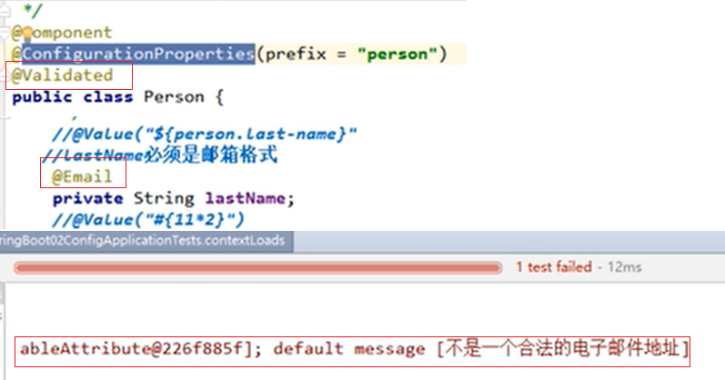
###5.@PropertySource和@ImportResource
* **@PropertySource：**加载指定的配置文件，先从全局配置文件中查找，在从指定文件中找
* 
* **@ImportResource：**导入spring的配置文件，让配置文件里的内容生效
* 
* **SpringBoot中推荐给容器中添加组件的方式：使用全注解**
	* 1.类似spring配置文件(不推荐)
	* 2.配置类(推荐)

		    @Bean      //id就是getHelloService
		    public HelloService getHelloService() {
		        return new HelloService();
		    }
###6.配置文件占位符
* 
* **随机数**

		${random.value}、${random.int}、${random.long} //可以通过这些获取数值
		${random.int(10)}、${random.int[1024,65536]}
###7.Profile
* 1.多Profile文件
	* 创建多个properties配置文件，格式：application-{profile}.properties,默认读取的是application.properties
* 2.yml支持多文档块方式
* 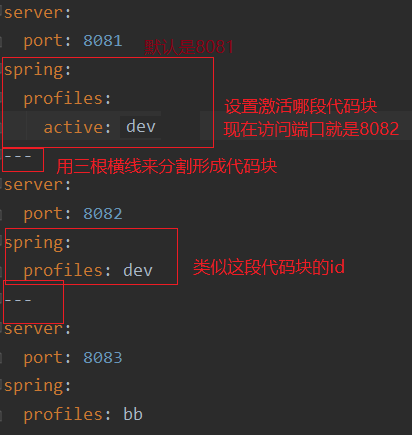
* 3.激活指定Profile
	* 1.切换读取其他配置文件： **spring.profiles.active = {profile}**(这个就是上面指定的值，这个是在配置文件中指定，直接下写在配置文件中即可)
	* 2.命令行： **--spring.profiles.active = bb**(这个bb是图片上的的bb)
	* 
	* 3.虚拟机参数：**-Dspring.profiles.active = bb**
	* 
###8.配置文件位置加载顺序
* 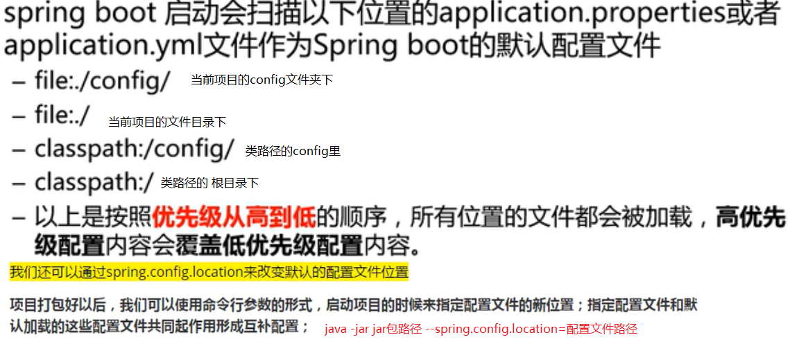
* 
* springboot会从高往低加载，而且会**互补配置**
###9.外部配置的加载顺序
- **SpringBoot也可以从以下位置加载配置； 优先级从高到低；高优先级的配置覆盖低优先级的配置，所有的配置会形成互补配置**
	* **1.命令行参数:**所有的配置都可以在命令行上进行指定

			java -jar spring-boot-02-config-02-0.0.1-SNAPSHOT.jar --server.port=8087  --server.context-path=/abc 
			//多个配置用空格分开； --配置项=值
	* 2.来自java:comp/env的JNDI属性
	* 3.Java系统属性（System.getProperties()）
	* 4.操作系统环境变量
	* 5.RandomValuePropertySource配置的random.*属性值
	* **由jar包外向jar包内进行寻找,优先加载带profile**
	* **6.jar包外部的application-{profile}.properties或application.yml(带spring.profile)配置文件**
	* **7.jar包内部的application-{profile}.properties或application.yml(带spring.profile)配置文件**
	* **再来加载不带profile**
	* **8.jar包外部的application.properties或application.yml(不带spring.profile)配置文件**
	* **9.jar包内部的application.properties或application.yml(不带spring.profile)配置文件**
	* 10.@Configuration注解类上的@PropertySource
	* 11.通过SpringApplication.setDefaultProperties指定的默认属性

	所有支持的配置加载来源；[参考官方文档](https://docs.spring.io/spring-boot/docs/1.5.9.RELEASE/reference/htmlsingle/#boot-features-external-config)
###10.自动配置的原理
* [配置文件能配置的属性参照](https://docs.spring.io/spring-boot/docs/1.5.9.RELEASE/reference/htmlsingle/#common-application-properties)
* **自动配置原理：**
	* 1.SpringBoot启动的时候，开启了自动配置功能，**@EnableAutoConfiguretion**注解
	* 2.@EnableAutoConfiguretion的作用： 
		* 利用**AutoConfigurationImportSelector**给容器导入一些组件，可以点进去查看selectImports的内容
	* 3.以**HttpEncodingAutoConfiguration**自动配置类为例
			
			@Configuration(proxyBeanMethods = false)  //表示这是一个配置类，也可以给容器中添加组件
			@EnableConfigurationProperties({HttpProperties.class}) //启用指定类的Httpproperties功能，类里面的内容在读取指定的配置文件，
			将配置文件的内容和HttpProperties绑定
			@ConditionalOnWebApplication(type = Type.SERVLET)
			//它的底层是spring中@Conditional注解，根据不同条件来判断，满足条件时配置类里的配置才生效，当前这个时判断是否是web应用
			@ConditionalOnClass({CharacterEncodingFilter.class})
			//这个时判断当前项目中有没有这个类(CharacterEncodingFilter),这个是springmvc中的过滤器
			@ConditionalOnProperty(
			    prefix = "spring.http.encoding",
			    value = {"enabled"},
			    matchIfMissing = true//这个的意思时判断如不存在判断也成立
			)
			//这个注解是判断配置文件中是否有这个配置，在"spring.http.encoding"是否有"enabled"属性
			public class HttpEncodingAutoConfiguration {
	* **所有配置文件中的属性都在xxxxProperties类中被封装，根据配置类中的条件是否被满足，满足则配置类生效**
	* 
	* 精髓： 
		* 1.springboot启动会加载大量自动配置类
		* 2.然后看我们需要的功能springboot有没有默认写好的配置类
		* 3.然后再看配置了那些组件，有的话就不用在配置
		* 4.给容器中自动配置类添加组件时，会从properties中获取某些属性，我们可以指定
	
				xxxxAutoConfiguretion自动配置类
				给容器中添加组件
				xxxxProperties中封装配置文件中的属性
				查看方法：找到任意一个xxxAutoConfidyretion类，点进去@EnableConfigurationProperties({xxx.class})，然后就能看到了
* 细节：
	* 1. **@Conditional注解：**必须是@Conditional指定的条件成立，配置类才生效
	* 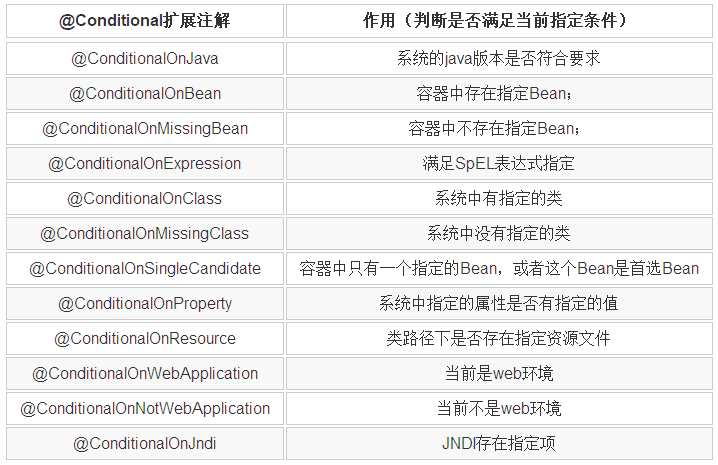
	* 2.可以通过配置属性debug=true让springboot在控制台打印自动配置报告
	* 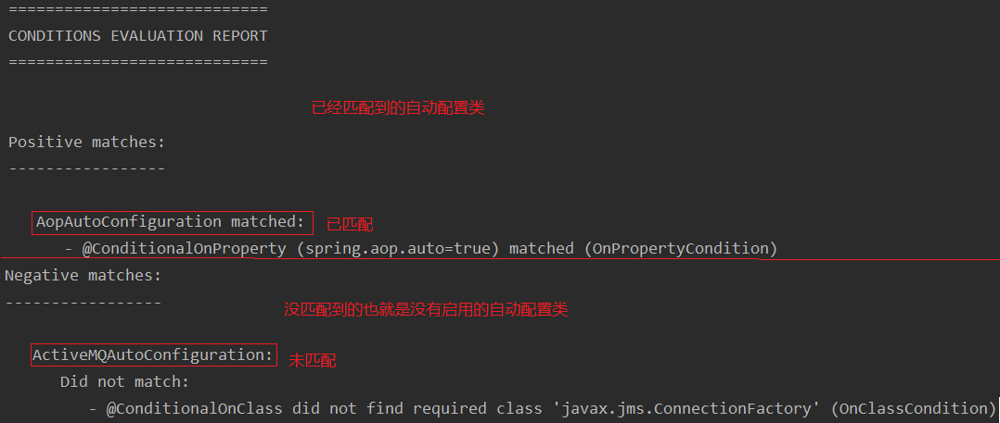
##5.日志
###1.日志框架
* 市面上的日志框架：JUL、JCL、Jboss-logging、logback、log4j、log4j2、slf4j....
* 
* 左边选一个门面（抽象层）、右边来选一个实现；
	* 日志门面：  SLF4J；
	* 日志实现：Logback；
	*
* SpringBoot：底层是Spring框架，Spring框架默认是用JCL;
###2.SLF4J的使用
####1.如何在系统中使用slf4j
* 以后开发的时候，日志记录方法的调用，不应该来直接调用日志的实现类，而是调用日志抽象层里面的方法；给系统里面导入slf4j的jar和  logback的实现jar

		import org.slf4j.Logger;
		import org.slf4j.LoggerFactory;
		
		public class HelloWorld {
		  public static void main(String[] args) {
		    Logger logger = LoggerFactory.getLogger(HelloWorld.class);
		    logger.info("Hello World");
		  }
		}
* 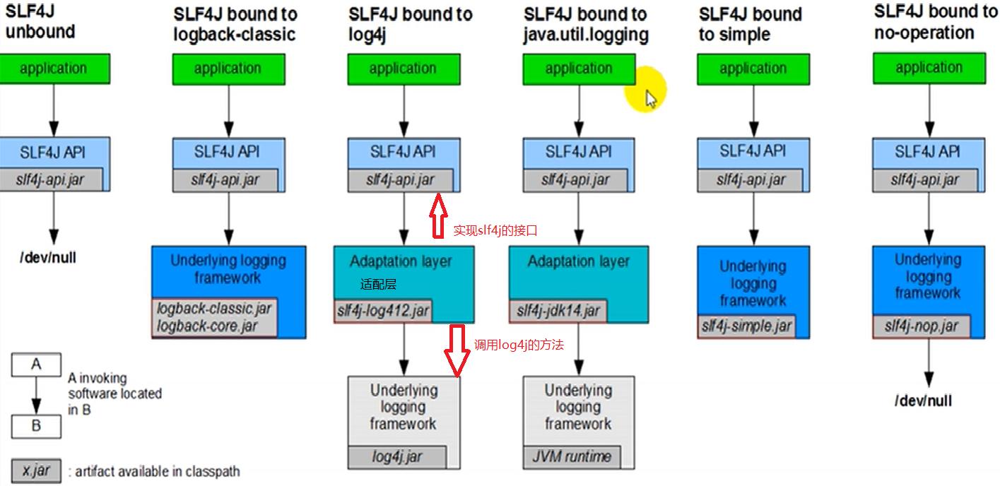
* 
* 如何让系统中所有的日志都统一到slf4j
	* 1、将系统中其他日志框架先排除出去；
	* 2、用中间包来替换原有的日志框架；
	* 3、我们导入slf4j其他的实现
####2.SpringBoot中的日志关系
* 查看项目中各个包的关系：**ctrl + alt + shift + u**

	    <dependency>     //springboot用这个来做日志管理
	      <groupId>org.springframework.boot</groupId>
	      <artifactId>spring-boot-starter-logging</artifactId>
	      <version>2.2.5.RELEASE</version>
	      <scope>compile</scope>
	    </dependency>
* 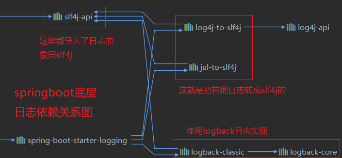
* 总结：
	* SpringBoot底层也是使用slf4j+logback的方式进行日志记录
	* SpringBoot也把其他的日志都替换成了slf4j；
	* 如果我们要引入其他框架？一定要把这个框架的默认日志依赖移除掉？Spring框架用的是commons-logging；
	* **SpringBoot能自动适配所有的日志，而且底层使用slf4j+logback的方式记录日志，引入其他框架的时候，只需要把这个框架依赖的日志框架排除掉即可**
###3.日志的使用
####1.默认配置
* SpringBoot已经默认配置好了
* 
* 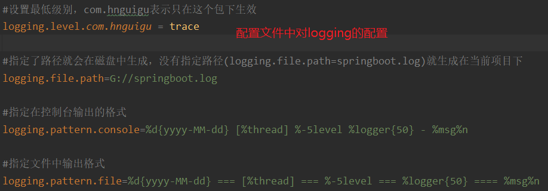
* **日志输出格式例子： %d{yyyy-MM-dd HH:mm:ss.SSS} [%thread] %-5level %logger{50} - %msg%n**
	* **%d**表示日期时间，
	* **%thread**表示线程名，
	* **%-5level**：级别从左显示5个字符宽度
	* **%logger{50}** 表示logger名字最长50个字符，否则按照句点分割。 
	* **%msg**：日志消息
	* **%n**是换行符
####2.指定配置
* 
* 直接用logback.xml:会被日志框架直接识别
* 使用logback-spring.xml:就会交给springboot来处理​

		<springProfile name="staging">   //springboot高级功能
		    <!-- configuration to be enabled when the "staging" profile is active -->
		  	可以指定某段配置只在某个环境下生效
		</springProfile>

* 
###4.切换日志框架
* 可以按照日志结构图来切换
* 切换slf4j + log4j

		<dependency>   //首先导入这个包(slf4j和log4j的中间包)
            <groupId>org.slf4j</groupId>
            <artifactId>slf4j-log4j12</artifactId>
        </dependency>

		<dependency>   //然后在把下面这两个移除
            <groupId>org.springframework.boot</groupId>
            <artifactId>spring-boot-starter-web</artifactId>
            <exclusions>
                <exclusion>
                    <artifactId>logback-classic</artifactId>
                    <groupId>ch.qos.logback</groupId>
                </exclusion>
                <exclusion>
                    <artifactId>log4j-to-slf4j</artifactId>
                    <groupId>org.apache.logging.log4j</groupId>
                </exclusion>
            </exclusions>
        </dependency>
* 切换到log4j2

        <dependency>
            <groupId>org.springframework.boot</groupId>
            <artifactId>spring-boot-starter-log4j2</artifactId>
        </dependency>

        <dependency>
            <groupId>org.springframework.boot</groupId>
            <artifactId>spring-boot-starter-web</artifactId>
            <exclusions>
                <exclusion>
                    <artifactId>spring-boot-starter-logging</artifactId>
                    <groupId>org.springframework.boot</groupId>
                </exclusion>
            </exclusions>
        </dependency>   
##6.SpringBoot与Web开发
###SpringBoot对静态资源的映射规则；

		//源码
	public void addResourceHandlers(ResourceHandlerRegistry registry) {
        if (!this.resourceProperties.isAddMappings()) {
            logger.debug("Default resource handling disabled");
        } else {
            Duration cachePeriod = this.resourceProperties.getCache().getPeriod();
            CacheControl cacheControl = this.resourceProperties.getCache().getCachecontrol().toHttpCacheControl();
            if (!registry.hasMappingForPattern("/webjars/**")) {
                this.customizeResourceHandlerRegistration(registry.addResourceHandler(new String[]{"/webjars/**"}).addResourceLocations(new String[]{"classpath:/META-INF/resources/webjars/"}).setCachePeriod(this.getSeconds(cachePeriod)).setCacheControl(cacheControl));
            }

            String staticPathPattern = this.mvcProperties.getStaticPathPattern();
            if (!registry.hasMappingForPattern(staticPathPattern)) {
                this.customizeResourceHandlerRegistration(registry.addResourceHandler(new String[]{staticPathPattern}).addResourceLocations(WebMvcAutoConfiguration.getResourceLocations(this.resourceProperties.getStaticLocations())).setCachePeriod(this.getSeconds(cachePeriod)).setCacheControl(cacheControl));
            }

        }
    }
####1.所有**/webjars/****都去**"classpath:/META-INF/resources/webjars/"**下找资源
* **/webjars/**：**就是以jar包的方式引入静态资源，[webjars官网](https://www.webjars.org/ "webjars官网")
* 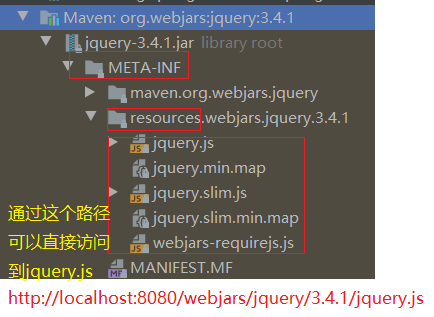

		//WebMvcAutoConfiguration => this.resourceProperties 
		//这里可以设置和静态资源相关的参数，如缓存时间等
		@ConfigurationProperties(prefix = "spring.resources",ignoreUnknownFields = false)
		public class ResourceProperties {
####2.**/****:访问当前项目的任何资源(这些就是静态资源文件夹)
* 访问locahost://8080/abc ==> 去静态资源文件夹里找abc

		* "classpath:/META-INF/resources/"(类路径)
		* "classpath:/resources/"
		* "classpath:/static/"
		* "classpath:/public/"
		* "/":当前项目的根路径
####3.欢迎页：静态资源文件夹下的所有index.html页面，被"/**"映射
    @Bean   //对欢迎页的映射
    public WelcomePageHandlerMapping welcomePageHandlerMapping(ApplicationContext applicationContext, FormattingConversionService mvcConversionService, ResourceUrlProvider mvcResourceUrlProvider) {
        WelcomePageHandlerMapping welcomePageHandlerMapping = new WelcomePageHandlerMapping(new TemplateAvailabilityProviders(applicationContext), applicationContext, this.getWelcomePage(), this.mvcProperties.getStaticPathPattern());
        welcomePageHandlerMapping.setInterceptors(this.getInterceptors(mvcConversionService, mvcResourceUrlProvider));
        return welcomePageHandlerMapping;
    }
* 例如访问locahost://8080/时会去所有静态资源文件夹中找index.html然后显示
###4.模板引擎
####
####thymeleaf
* **1.引入thymeleaf**

		<dependency>  
            <groupId>org.springframework.boot</groupId>
            <artifactId>spring-boot-starter-thymeleaf</artifactId>
        </dependency>

		切换thymeleaf版本
		<properties>
			<thymeleaf.version>3.0.11.RELEASE</thymeleaf.version>
			<!-- 布局功能的支持程序  thymeleaf3主程序  layout2以上版本 -->
			<!-- thymeleaf2   layout1-->
			<thymeleaf-layout-dialect.version>2.1.1</thymeleaf-layout-dialect.version>
	  	</properties>
* 
* **2.在html文件中导入thymeleaf的命名空间**

		<html lang="en" xmlns:th="http://www.thymeleaf.org">
* **3.使用thymeleaf的语法**

		<!DOCTYPE html>
		<html lang="en" xmlns:th="http://www.thymeleaf.org">
		<head>
		    <meta charset="UTF-8">
		    <title>Title</title>
		</head>
		<body>
		<h2>成功！</h2>
		

		</body>
		</html>
* **4.thymeleaf的语法规则**
	* **1.  th：任意html属性，可以替换原来的值**比如： 

结果： id=bb
* 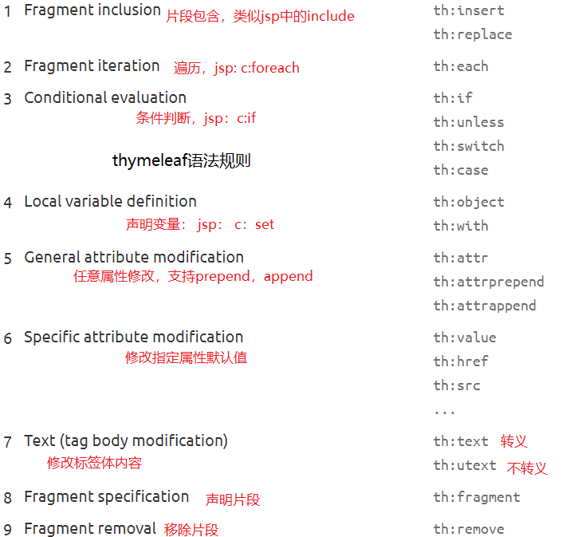
	* **2.表达式语法**

			Simple expressions(表达式语法):
				Variable Expressions: ${...} //获取变量值；OGNL；
					1）、获取对象的属性、调用方法
		    		2）、使用内置的基本对象：
		    			#ctx : the context object.
		    			#vars: the context variables.
		                #locale : the context locale.
		                #request : (only in Web Contexts) the HttpServletRequest object.
		                #response : (only in Web Contexts) the HttpServletResponse object.
		                #session : (only in Web Contexts) the HttpSession object.
		                #servletContext : (only in Web Contexts) the ServletContext object.
		                
		                用法例如：${session.foo}
		            3）、内置的一些工具对象：
						#execInfo : information about the template being processed.
						#messages : methods for obtaining externalized messages inside variables expressions, in the same way as they would be obtained using #{…} syntax.
						#uris : methods for escaping parts of URLs/URIs
						#conversions : methods for executing the configured conversion service (if any).
						#dates : methods for java.util.Date objects: formatting, component extraction, etc.
						#calendars : analogous to #dates , but for java.util.Calendar objects.
						#numbers : methods for formatting numeric objects.
						#strings : methods for String objects: contains, startsWith, prepending/appending, etc.
						#objects : methods for objects in general.
						#bools : methods for boolean evaluation.
						#arrays : methods for arrays.
						#lists : methods for lists.
						#sets : methods for sets.
						#maps : methods for maps.
						#aggregates : methods for creating aggregates on arrays or collections.
						#ids : methods for dealing with id attributes that might be repeated (for example, as a result of an iteration).
				Selection Variable Expressions: *{...}  //选择表达式，和${}在功能上是一样；
				    
用法
					    
Name: Sebastian.

					    
Surname: Pepper.

					    
Nationality: Saturn.

				    

				Message Expressions: #{...}  //获取国际化内容
				Link URL Expressions: @{...}  //定义url
					@{/order/process(execId=${execId},execType='FAST')}
				Fragment Expressions: ~{...}  //片段引用表达式
					
...

			Literals(字面量)
				Text literals: 'one text', 'Another one!',…
				Number literals: 0, 34, 3.0, 12.3,…
				Boolean literals: true, false
				Null literal: null
				Literal tokens: one, sometext, main,…
			Text operations:(文本操作)
				String concatenation: +
				Literal substitutions: |The name is ${name}|
			Arithmetic operations:(数学运算)
				Binary operators: +, -, *, /, %
				Minus sign (unary operator): -
			Boolean operations:(布尔运算)
				Binary operators: and, or
				Boolean negation (unary operator): !, not
			Comparisons and equality:(比较运算)
				Comparators: >, <, >=, <= (gt, lt, ge, le)
				Equality operators: ==, != (eq, ne)
			Conditional operators:(条件运算)
				If-then: (if) ? (then)
				If-then-else: (if) ? (then) : (else)
				Default: (value) ?: (defaultvalue)
			Special tokens:()
				No-Operation: _
* 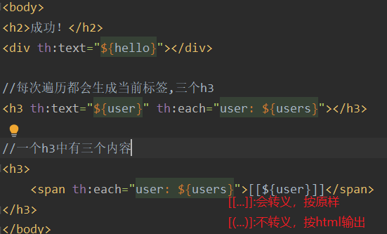
###5.SpringMVC自动配置
####[SpringMVC自动配置官方文档](https://docs.spring.io/spring-boot/docs/1.5.10.RELEASE/reference/htmlsingle/#boot-features-developing-web-applications)
####1.Spring MVC auto-configuration
* Spring Boot 自动配置好了SpringMVC，以下是SpringBoot对SpringMVC的默认配置:（WebMvcAutoConfiguration）
	* Inclusion of `ContentNegotiatingViewResolver` and `BeanNameViewResolver` beans.
	  - 自动配置了ViewResolver（视图解析器：根据方法的返回值得到视图对象（View），视图对象决定如何渲染（转发？重定向？））
	  - ContentNegotiatingViewResolver：组合所有的视图解析器的；
	  - **如何定制：我们可以自己给容器中添加一个视图解析器；自动的将其组合进来；**
	- Support for serving static resources, including support for WebJars (see below).静态资源文件夹路径,webjars
	- Static `index.html` support. 静态首页访问，访问静态资源中的index.html
	- Custom `Favicon` support (see below).  favicon.ico(图标)
	- 自动注册了 of `Converter`, `GenericConverter`, `Formatter` beans.
	  - Converter：转换器；  public String hello(User user)：类型转换使用Converter
	  - `Formatter`  格式化器；  2017.12.17===Date；
	
				@Bean
				@ConditionalOnProperty(prefix = "spring.mvc", name = "date-format")//在文件中配置日期格式化的规则
				public Formatter<Date> dateFormatter() {
					return new DateFormatter(this.mvcProperties.getDateFormat());//日期格式化组件
				}
		* **自己添加的格式化器转换器，我们只需要放在容器中即可**
	- Support for `HttpMessageConverters` (see below).
		- HttpMessageConverter：SpringMVC用来转换Http请求和响应的；User---Json；
  		- `HttpMessageConverters` 是从容器中确定；获取所有的HttpMessageConverter；
  		- **自己给容器中添加HttpMessageConverter，只需要将自己的组件注册容器中（@Bean,@Component）**
	- Automatic registration of `MessageCodesResolver` (see below).定义错误代码生成规则
	- Automatic use of a `ConfigurableWebBindingInitializer` bean (see below).
		* **我们可以配置一个ConfigurableWebBindingInitializer来替换默认的；（添加到容器）**

				初始化WebDataBinder；
			    请求数据=====JavaBean；
* **org.springframework.boot.autoconfigure.web：web的所有自动场景；**
* If you want to keep Spring Boot MVC features, and you just want to add additional [MVC configuration](https://docs.spring.io/spring/docs/4.3.14.RELEASE/spring-framework-reference/htmlsingle#mvc) (interceptors, formatters, view controllers etc.) you can add your own `@Configuration` class of type `WebMvcConfigurerAdapter`, but **without** `@EnableWebMvc`. If you wish to provide custom instances of `RequestMappingHandlerMapping`, `RequestMappingHandlerAdapter` or `ExceptionHandlerExceptionResolver` you can declare a `WebMvcRegistrationsAdapter` instance providing such components.
If you want to take complete control of Spring MVC, you can add your own `@Configuration` annotated with `@EnableWebMvc`.
####2、扩展SpringMVC

	<mvc:view-controller path="/hello" view-name="success"/>
    <mvc:interceptors>
        <mvc:interceptor>
            <mvc:mapping path="/hello"/>
            <bean></bean>
        </mvc:interceptor>
    </mvc:interceptors>
* **编写一个配置类(@configuration)，是WebMvcConfigurerAdapter类型；不能标注@EnableWebMvc**

		//使用WebMvcConfigurerAdapter可以来扩展SpringMVC的功能，既保留了所有的自动配置，也能用我们扩展的配置；
		@Configuration
		public class MyMvcConfig extends WebMvcConfigurerAdapter {
		
		    @Override
		    public void addViewControllers(ViewControllerRegistry registry) {
		       // super.addViewControllers(registry);
		        //浏览器发送 /atguigu 请求来到 success
		        registry.addViewController("/test").setViewName("success");
		    }
		}
	* 原理：
		* 1.WebMvcAutoConfiguration是SpringMVC的自动配置类
		* 2.在做其他自动配置时会导入；@Import(**EnableWebMvcConfiguration**.class)

			    @Configuration
				public static class EnableWebMvcConfiguration extends DelegatingWebMvcConfiguration {
			      private final WebMvcConfigurerComposite configurers = new WebMvcConfigurerComposite();
			
				 //从容器中获取所有的WebMvcConfigurer
			      @Autowired(required = false)  //@autowired写在方法上表示方法的参数要从容器中获取
			      public void setConfigurers(List<WebMvcConfigurer> configurers) {
			          if (!CollectionUtils.isEmpty(configurers)) {
			              this.configurers.addWebMvcConfigurers(configurers);
			            	//一个参考实现；将所有的WebMvcConfigurer相关配置都来一起调用；  
			            	@Override
			             // public void addViewControllers(ViewControllerRegistry registry) {
			              //    for (WebMvcConfigurer delegate : this.delegates) {
			               //       delegate.addViewControllers(registry);
			               //   }
			              }
			          }
				}
		* 3.容器中所有的WebMvcConfigurer都会一起起作用；
		* 4. 我们的配置类也会被调用；
		* 效果：SpringMVC的自动配置和我们的扩展配置都会起作用；
####3.全面接管SpringMVC；
* **我们在配置类中添加@EnableWebMvc,**SpringBoot对SpringMVC的自动配置就不生效了，所有都是我们自己配置；
* 原理：为什么@EnableWebMvc自动配置就失效了；
	* 1. @EnableWebMvc的核心(就是导入了DelegatingWebMvcConfiguration这个类)
	* 
			@Import(DelegatingWebMvcConfiguration.class)
			public @interface EnableWebMvc {
	* 2.DelegatingWebMvcConfiguration继承了WebMvcConfigurationSupport

			@Configuration
			public class DelegatingWebMvcConfiguration extends WebMvcConfigurationSupport {
	* 3.WebMvcAutoConfiguration中有一个判断的注解，没有上面的类，自动配置才生效

			@Configuration
			@ConditionalOnWebApplication
			@ConditionalOnClass({ Servlet.class, DispatcherServlet.class,
					WebMvcConfigurerAdapter.class })
			//容器中没有这个组件的时候，这个自动配置类才生效
			@ConditionalOnMissingBean(WebMvcConfigurationSupport.class)
			@AutoConfigureOrder(Ordered.HIGHEST_PRECEDENCE + 10)
			@AutoConfigureAfter({ DispatcherServletAutoConfiguration.class,ValidationAutoConfiguration.class})
			public class WebMvcAutoConfiguration {
	* 4.导入的WebMvcConfigurationSupport只是SpringMVC最基本的功能；
###6.修改SpringBoot的默认配置
* 1.SpringBoot在自动配置很多组件的时候，先看容器中有没有用户自己配置的（@Bean、@Component）如果有就用用户配置的，如果没有，才自动配置；如果有些组件可以有多个（ViewResolver）将用户配置的和自己默认的组合起来；

* 2.在SpringBoot中会有非常多的xxxConfigurer帮助我们进行扩展配置
* 3.在SpringBoot中会有非常多的xxxCustomizer帮助我们进行定制配置
### 7、RestfulCRUD
####1.默认访问首页
	@Configuration
	public class myMvcConfig extends WebMvcConfigurerAdapter {
	
	    @Bean
	    public WebMvcConfigurerAdapter getWebMvcConfigurerAdapter() {
	        WebMvcConfigurerAdapter adapter = new WebMvcConfigurerAdapter(){
	            @Override    
	            public void addViewControllers(ViewControllerRegistry registry) {
	                registry.addViewController("/").setViewName("index");
	                registry.addViewController("/index").setViewName("index");
	            }
	        };
	        return adapter;
	    }
	}
####2.国际化
* 1.编写国际化配置文件
	* 抽取页面需要的国际化消息
		* 在resources新建文件夹i18n => 新建一个叫index.properties和index_zh_CN.properties => 右击父文件夹 => NEW => Add => 点击右边的+号 => 输入en_US 即可自动创建英语的国际化配置文件
		* 选一个index_zh_CN.properties => 点击左下角的resource bundle => 然后点击右上角的+ => 输入标题 => 第一个框是默认显示的，第二个是英语显示的，第三个是中文显示的
* 2.使用**ResourceBundleMessageSource**管理国际化资源文件
	* 在MessageResourceAutoConfig类中springboot已经配置好了
	
			@Bean
		    @ConfigurationProperties(prefix = "spring.messages")//可以通过spring.message来设置一些属性
		    public MessageSourceProperties messageSourceProperties() {
		        return new MessageSourceProperties();
		    }

			private String basename = "messages";
			//我们的配置文件可以放在类路径下叫message.properties，

			@Bean
		    public MessageSource messageSource(MessageSourceProperties properties) {
		        ResourceBundleMessageSource messageSource = new ResourceBundleMessageSource();
		        if (StringUtils.hasText(properties.getBasename())) {
					//设置国际化资源文件的基础名
		            messageSource.setBasenames(StringUtils.commaDelimitedListToStringArray(StringUtils.trimAllWhitespace(properties.getBasename())));
		        }
		
		        if (properties.getEncoding() != null) {
		            messageSource.setDefaultEncoding(properties.getEncoding().name());
		        }
		
		        messageSource.setFallbackToSystemLocale(properties.isFallbackToSystemLocale());
		        Duration cacheDuration = properties.getCacheDuration();
		        if (cacheDuration != null) {
		            messageSource.setCacheMillis(cacheDuration.toMillis());
		        }
		
		        messageSource.setAlwaysUseMessageFormat(properties.isAlwaysUseMessageFormat());
		        messageSource.setUseCodeAsDefaultMessage(properties.isUseCodeAsDefaultMessage());
		        return messageSource;
		    }	
	* 在配置文件中加**spring.message.basename=i18n.index**即可
* 3.去页面获取国际化的值
	* 出现乱码就在setting中搜file encoding，把GBK改成UTF-8即可
	* 效果：根据浏览器语言设置的信息切换了国际化；
		* 原理：国际化Locale（区域信息对象）；webmvcAutoconfig中配置了LocaleResolver（获取区域信息对象）；

		        @Bean
		        @ConditionalOnMissingBean
		        @ConditionalOnProperty(prefix = "spring.mvc",name = {"locale"})
		        public LocaleResolver localeResolver() {
		            if (this.mvcProperties.getLocaleResolver() == org.springframework.boot.autoconfigure.web
								.servlet.WebMvcProperties.LocaleResolver.FIXED) {
		                return new FixedLocaleResolver(this.mvcProperties.getLocale());
		            } else {
		                AcceptHeaderLocaleResolver localeResolver = new AcceptHeaderLocaleResolver();//从request头中取区域信息
		                localeResolver.setDefaultLocale(this.mvcProperties.getLocale());
		                return localeResolver;
		            }
		        }
	* 根据下方点击中文或英文来切换页面的语言
		
			//实现LocaleResolver接口，在resolveLocale中判断是那种语言
			public class myLocaleResolver implements LocaleResolver {
			    @Override
			    public Locale resolveLocale(HttpServletRequest request) {
			        String l = request.getParameter("l");
			        Locale locale = Locale.getDefault();
			        if (!StringUtils.isEmpty(l)) {
			            String[] s = l.split("_");
			            locale = new Locale(s[0], s[1]);//第一个是语言，第二个是国家
			        }
			        return locale;
			    }

			//在myWebConfig中加入自己写的localeResolver，localeResolver不能写别的名字，否则不生效
		  	@Bean
		    public LocaleResolver localeResolver() {
		        return new myLocaleResolver();
		    }
* 4.登录页面
	* 禁用thymeleaf缓存： **spring.thymeleaf.cache=false**
	* 日期格式化： **spring.mvc.data-format=yyyy-MM-dd hh:mm:ss**
	* 重新编译： **ctrl + f9**
	* 登录后显示错误信息

			

	* 拦截器进行登录检查

			//实现拦截器的接口
			public class logonhandlerinterceptor implements HandlerInterceptor {
			    @Override
			    public boolean preHandle(HttpServletRequest request, HttpServletResponse response, Object handler) throws Exception {
			        Object username = request.getSession().getAttribute("username");
			        if (!StringUtils.isEmpty(username)) {
			            return true; //登录了就放行
			        }
			        request.setAttribute("msg", "没有权限");
			        request.getRequestDispatcher("/index").forward(request,response);
			        return false; //没登陆就不放行，并转发到这个页面
			    }
	
			//把自己写的拦截器交给容器管理
            @Override
            public void addInterceptors(InterceptorRegistry registry) {
				//拦截所有请求后排除下面三个请求
                registry.addInterceptor(new logonhandlerinterceptor()).addPathPatterns("/**")
                        .excludePathPatterns("/index","/", "/login");
            }
* 5.CRUD员工列表
* 
* thymeleaf页面公共元素抽取

		1、抽取公共片段
		

			&copy; 2011 The Good Thymes Virtual Grocery
		

		
		2、引入公共片段
		

		写法一： ~{templatename::#aa}：模板名::选择器
		写法二： ~{templatename::fragmentname}:模板名::片段名
	* 三种引入方式
		* **th:insert：**把原来标签内容插入到div中
		* **th:replace：**用div把原来最外层标签替换掉
		* **th:include：**将被引入的内容直接用div包含起来

				<footer th:fragment="copy">
					&copy; 2011 The Good Thymes Virtual Grocery
				</footer>

				引入方式
				

				

				

				效果
				

				    <footer>
				    	&copy; 2011 The Good Thymes Virtual Grocery
				    </footer>
				

				
				<footer>
					&copy; 2011 The Good Thymes Virtual Grocery
				</footer>
				
				

					&copy; 2011 The Good Thymes Virtual Grocery
				

	* 引入片段时传参
		
			<nav class="col-md-2 d-none d-md-block bg-light sidebar" id="sidebar">
			<!--引入侧边栏;传入参数-->
			

	* **修改form表单的提交方式**
	* 
### 8.错误处理机制
####1.SpringBoot默认的错误处理机制
#####默认效果
* 1.返回一个默认的页面
	* 
	* 浏览器发请求的时候
	* 
* 2.用其他客户端访问，返回的错误页面是json数据
	* 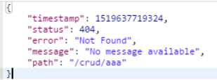
	* 其他客户端发请求时
	* 
* 原理：**可以参照ErrorMVCAutoConfiguretion**错误的自动配置
* 给容器中添加的组件
	* **DefaultErrorAttributes**

		    public Map<String, Object> getErrorAttributes(WebRequest webRequest, boolean includeStackTrace) {
		        Map<String, Object> errorAttributes = new LinkedHashMap();
		        errorAttributes.put("timestamp", new Date());
		        this.addStatus(errorAttributes, webRequest);
		        this.addErrorDetails(errorAttributes, webRequest, includeStackTrace);
		        this.addPath(errorAttributes, webRequest);
		        return errorAttributes;
		    }
			

	* **BasicErrorController：**处理默认的error请求

			@Controller		
			@RequestMapping({"${server.error.path:${error.path:/error}}"})
			public class BasicErrorController extends AbstractErrorController {

			@RequestMapping(produces = {"text/html"})
		    public ModelAndView errorHtml(HttpServletRequest request, HttpServletResponse response) {
		        HttpStatus status = this.getStatus(request); //产生html数据，浏览器发的请求来这里
		        Map<String, Object> model = Collections.unmodifiableMap(this.getErrorAttributes(request, this.isIncludeStackTrace(request, MediaType.TEXT_HTML)));
		        response.setStatus(status.value());
				//去哪个错误页面和包含的内容
		        ModelAndView modelAndView = this.resolveErrorView(request, response, status, model);
		        return modelAndView != null ? modelAndView : new ModelAndView("error", model);
		    }
		
		    @RequestMapping
		    public ResponseEntity<Map<String, Object>> error(HttpServletRequest request) {
		        HttpStatus status = this.getStatus(request);  //产生json数据，其他客户端发的来这里
		        if (status == HttpStatus.NO_CONTENT) {
		            return new ResponseEntity(status);
		        } else {
		            Map<String, Object> body = this.getErrorAttributes(request, this.isIncludeStackTrace(request, MediaType.ALL));
		            return new ResponseEntity(body, status);
		        }
		    }
	* **ErrorPageCustomizer**

			@Value("${error.path:/error}")
			private String path = "/error";  系统出现错误以后来到error请求进行处理；（web.xml注册的错误页面规则）
	* **DefaultErrorViewResolver**

			public ModelAndView resolveErrorView(HttpServletRequest request, HttpStatus status, Map<String, Object> model) {
				
		        ModelAndView modelAndView = this.resolve(String.valueOf(status.value()), model);
		        if (modelAndView == null && SERIES_VIEWS.containsKey(status.series())) {
		            modelAndView = this.resolve((String)SERIES_VIEWS.get(status.series()), model);
		        }
			        return modelAndView;
		    }
			
		    private ModelAndView resolve(String viewName, Map<String, Object> model) {
				//默认springboot可以去找一个页面  error/404
		        String errorViewName = "error/" + viewName;
				//模板引擎可以解析就解析
		        TemplateAvailabilityProvider provider = this.templateAvailabilityProviders.getProvider(errorViewName, this.applicationContext);
				//可以的话就用模板引擎解析，不可以就是另一种方式，就子啊静态文件夹下找对应的页面error/404.html
		        return provider != null ? new ModelAndView(errorViewName, model) : this.resolveResource(errorViewName, model);
			}

	步骤：一但系统出现4xx或者5xx之类的错误；ErrorPageCustomizer就会生效（定制错误的响应规则）；就会来到/error请求；就会被**BasicErrorController**处理，一种是html一种是json；

	1）响应页面；去哪个页面是由**DefaultErrorViewResolver**解析得到的；

		protected ModelAndView resolveErrorView(HttpServletRequest request, HttpServletResponse response, HttpStatus status, Map<String, Object> model) {
	        Iterator var5 = this.errorViewResolvers.iterator();
	
	        ModelAndView modelAndView;
	        do {
	            if (!var5.hasNext()) {
	                return null;
	            }
	
	            ErrorViewResolver resolver = (ErrorViewResolver)var5.next();
	            modelAndView = resolver.resolveErrorView(request, status, model);
	        } while(modelAndView == null);
	
	        return modelAndView;
		}
#####定制错误响应
* 1.如何定制错误页面
	* **1）、有模板引擎的情况下；error/状态码;** 【将错误页面命名为  **错误状态码.html** 放在模板引擎文件夹里面的 **error**文件夹下】，发生此状态码的错误就会来到  对应的页面；
	
		- **我们可以使用4xx和5xx作为错误页面的文件名来匹配这种类型的所有错误，精确优先（优先寻找精确的状态码.html）；**	
		- 页面能获取的信息
			* timestamp:时间戳
			* status：状态码
			* error：错误提示
			* exception：异常对象
			* message：异常消息
			* errors：JSR303数据校验的错误都在这里
	* 2）、没有模板引擎（模板引擎找不到这个错误页面），静态资源文件夹下找；
	* 3）、以上都没有错误页面，就是默认来到SpringBoot默认的错误提示页面；	
​				
* 2.如何定制错误的json数据
	* 1）、自定义异常处理&返回定制json数据；

			@ControllerAdvice
			public class MyExceptionHandler {
			
			    @ResponseBody
			    @ExceptionHandler(UserNotExistException.class)
			    public Map<String,Object> handleException(Exception e){
			        Map<String,Object> map = new HashMap<>();
			        map.put("code","user.notexist");
			        map.put("message",e.getMessage());
			        return map;
			    }
			}
			//没有自适应效果...
	* 2）、转发到/error进行自适应响应效果处理

		    @ExceptionHandler(UserNotExistException.class)
		    public String handleException(Exception e, HttpServletRequest request){
		        Map<String,Object> map = new HashMap<>();
		        /**
		         * Integer statusCode = (Integer) request
		         .getAttribute("javax.servlet.error.status_code");
		         */
				//传入我们自己的错误状态码  4xx 5xx，否则就不会进入定制错误页面的解析流程	
		        request.setAttribute("javax.servlet.error.status_code",500);
		        map.put("code","user.notexist");
		        map.put("message",e.getMessage());
				request.setAttribute("ext", map);
		        //转发到/error
		        return "forward:/error";
		    }
	* 3）、将我们的定制数据携带出去；
		* 出现错误后，会来到/error请求。会被BasicErrorController处理，两种方式响应出去可以获取的数据都是由getErrorAttributes得到的，(实现了AbstractErrorController（ErrorController）这个接口)
		* 1.完全来编写一个ErrorController的实现类【或者是编写AbstractErrorController的子类】，放在容器中；
		* 2.页面上能用的数据，或者是json返回能用的数据都是通过**errorAttributes.getErrorAttributes**得到；容器中**DefaultErrorAttributes.getErrorAttributes()**；默认进行数据处理的；
			* 自定义ErrorAttributes
			* 
					//给容器中加入我们自己定义的ErrorAttributes
					@Component
					public class MyErrorAttributes extends DefaultErrorAttributes {
					
					    @Override
					    public Map<String, Object> getErrorAttributes(RequestAttributes requestAttributes, boolean includeStackTrace) {
					        Map<String, Object> map = super.getErrorAttributes(requestAttributes, includeStackTrace);
					        map.put("company","atguigu");

							Map<String, Object> ext = requestAttributes.getAttribute("ext");
							map.put("ext", ext)
					        return map;
					    }
					}
			* 最终的效果：响应是自适应的，可以通过定制ErrorAttributes改变需要返回的内容，
##7.配置嵌入式Servlet容器
* SpringBoot默认使用Tomcat作为嵌入式的Servlet容器；
* 
###1）、如何定制和修改Servlet容器的相关配置；
####1.修改和server有关的配置(在ServerProperties中可以看到)

	server.port=8081
	server.context-path=/crud
	server.tomcat.uri-encoding=utf-8

	//通用的server配置：server.xxx
	//tomcat的设置：server.tomcat.xxx
####2.编写一个WebServerFactoryCustomizer：嵌入式的servlet的定制容器，来修改servlet容器的配置
    @Bean
    public WebServerFactoryCustomizer webServerFactoryCustomizer() {
        return new WebServerFactoryCustomizer<ConfigurableWebServerFactory>(){
            //定制嵌入式容器的相关规则
            @Override
            public void customize(ConfigurableWebServerFactory factory) {
                factory.setPort(8083);
            }
        };
    }
### 2）、注册Servlet三大组件【Servlet、Filter、Listener】
由于SpringBoot默认是以jar包的方式启动嵌入式的Servlet容器来启动SpringBoot的web应用，没有web.xml文件。
####1.注册三大组件用以下方式
* **ServletRegistrationBean**
	
	    @Bean
	    public ServletRegistrationBean myServlet() {
	        ServletRegistrationBean servletRegistrationBean = new ServletRegistrationBean(new MyServlet(), "/bb");
	        return servletRegistrationBean;
	    }
* **FilterRegistrationBean**

	    @Bean
	    public FilterRegistrationBean myFilter() {
	        FilterRegistrationBean filterRegistrationBean = new FilterRegistrationBean();
	        filterRegistrationBean.setFilter(new MyFilter());
	        filterRegistrationBean.setUrlPatterns(Arrays.asList("/bb","/test"));
	        return filterRegistrationBean;
	    }
* **ServletListenerRegistrationBean**

	    @Bean
	    public ServletListenerRegistrationBean servletListenerRegistrationBean() {
	        ServletListenerRegistrationBean<EventListener> servletListenerRegistrationBean = new ServletListenerRegistrationBean<>(new MyListener());
	        return servletListenerRegistrationBean;
	    }
	SpringBoot帮我们自动SpringMVC的时候，自动的注册SpringMVC的前端控制器；DIspatcherServlet；
	
	DispatcherServletAutoConfiguration中：

		@Bean(name = DEFAULT_DISPATCHER_SERVLET_REGISTRATION_BEAN_NAME)
		@ConditionalOnBean(value = DispatcherServlet.class, name = DEFAULT_DISPATCHER_SERVLET_BEAN_NAME)
		public ServletRegistrationBean dispatcherServletRegistration(
		      DispatcherServlet dispatcherServlet) {
		   ServletRegistrationBean registration = new ServletRegistrationBean(
		         dispatcherServlet, this.serverProperties.getServletMapping());
		    //默认拦截： /  所有请求；包静态资源，但是不拦截jsp请求；   /*会拦截jsp
		    //可以通过server.servletPath来修改SpringMVC前端控制器默认拦截的请求路径
		    
		   registration.setName(DEFAULT_DISPATCHER_SERVLET_BEAN_NAME);
		   registration.setLoadOnStartup(
		         this.webMvcProperties.getServlet().getLoadOnStartup());
		   if (this.multipartConfig != null) {
		      registration.setMultipartConfig(this.multipartConfig);
		   }
		   return registration;
		}
### 3）、切换为其他嵌入式Servlet容器
* 
* 默认支持：
	* Tomcat(默认使用)

			<dependency>
			   <groupId>org.springframework.boot</groupId>
			   <artifactId>spring-boot-starter-web</artifactId>
			   引入web模块默认就是使用嵌入式的Tomcat作为Servlet容器；
			</dependency>
	* Jetty

			<dependency>
	            <groupId>org.springframework.boot</groupId>
	            <artifactId>spring-boot-starter-web</artifactId>
				//先把tomcat排除掉
	            <exclusions>
	                <exclusion>
	                    <artifactId>spring-boot-starter-tomcat</artifactId>
	                    <groupId>org.springframework.boot</groupId>
	                </exclusion>
	            </exclusions>
	        </dependency>
	        然后在引入其他容器
	        <dependency>
	            <artifactId>spring-boot-starter-jetty</artifactId>
	            <groupId>org.springframework.boot</groupId>
	        </dependency>
	* Undertow
	
			<dependency>
	            <groupId>org.springframework.boot</groupId>
	            <artifactId>spring-boot-starter-web</artifactId>
				//先把tomcat排除掉
	            <exclusions>
	                <exclusion>
	                    <artifactId>spring-boot-starter-tomcat</artifactId>
	                    <groupId>org.springframework.boot</groupId>
	                </exclusion>
	            </exclusions>
	        </dependency>
	        然后在引

入其他容器
	        <dependency>
	            <artifactId>spring-boot-starter-undertow</artifactId>
	            <groupId>org.springframework.boot</groupId>
	        </dependency>
### 4）、嵌入式Servlet容器自动配置原理；
**EmbeddedServletContainerAutoConfiguration**：嵌入式Servlet容器的自动配置

	@AutoConfigureOrder(Ordered.HIGHEST_PRECEDENCE)
	@Configuration
	@ConditionalOnWebApplication
	@Import(BeanPostProcessorsRegistrar.class)
	//导入BeanPostProcessorsRegistrar：Spring注解版；给容器中导入一些组件
	//导入了EmbeddedServletContainerCustomizerBeanPostProcessor：
	//后置处理器：bean初始化前后（创建完对象，还没赋值赋值）执行初始化工作
	public class EmbeddedServletContainerAutoConfiguration {

	@Configuration
	@ConditionalOnClass({ Servlet.class, Tomcat.class })//判断当前是否引入了Tomcat依赖；
	@ConditionalOnMissingBean(value = EmbeddedServletContainerFactory.class, search = SearchStrategy.CURRENT)
	//判断当前容器没有用户自己定义EmbeddedServletContainerFactory：嵌入式的Servlet容器工厂；作用：创建嵌入式的Servlet容器
	public static class EmbeddedTomcat {

		@Bean
		public TomcatEmbeddedServletContainerFactory tomcatEmbeddedServletContainerFactory() {
			return new TomcatEmbeddedServletContainerFactory();
		}

	}

* EmbeddedServletContainerFactory（嵌入式Servlet容器工厂）
* 

		public interface EmbeddedServletContainerFactory {
		
		   //获取嵌入式的Servlet容器
		   EmbeddedServletContainer getEmbeddedServletContainer(
		         ServletContextInitializer... initializers);
		
		}
* EmbeddedServletContainer：（嵌入式的Servlet容器）
* 
* 以**TomcatEmbeddedServletContainerFactory**为例

		@Override
		public EmbeddedServletContainer getEmbeddedServletContainer(
		      ServletContextInitializer... initializers) {
		    //创建一个Tomcat
		   Tomcat tomcat = new Tomcat();
		    
		    //配置Tomcat的基本环节
		   File baseDir = (this.baseDirectory != null ? this.baseDirectory
		         : createTempDir("tomcat"));
		   tomcat.setBaseDir(baseDir.getAbsolutePath());
		   Connector connector = new Connector(this.protocol);
		   tomcat.getService().addConnector(connector);
		   customizeConnector(connector);
		   tomcat.setConnector(connector);
		   tomcat.getHost().setAutoDeploy(false);
		   configureEngine(tomcat.getEngine());
		   for (Connector additionalConnector : this.additionalTomcatConnectors) {
		      tomcat.getService().addConnector(additionalConnector);
		   }
		   prepareContext(tomcat.getHost(), initializers);
		    
		    //将配置好的Tomcat传入进去，返回一个EmbeddedServletContainer；并且启动Tomcat服务器
		   return getTomcatEmbeddedServletContainer(tomcat);
		}
* 我们对嵌入式容器的配置修改是怎么生效？

		ServerProperties、EmbeddedServletContainerCustomizer
	* **EmbeddedServletContainerCustomizer(定制器)**：定制器帮我们修改了Servlet容器的配置
	* 原理：

			容器中导入了**EmbeddedServletContainerCustomizerBeanPostProcessor**
			//初始化之前
			@Override
			public Object postProcessBeforeInitialization(Object bean, String beanName)
			      throws BeansException {
			    //如果当前初始化的是一个ConfigurableEmbeddedServletContainer类型的组件
			   if (bean instanceof ConfigurableEmbeddedServletContainer) {
			       //
			      postProcessBeforeInitialization((ConfigurableEmbeddedServletContainer) bean);
			   }
			   return bean;
			}
			
			private void postProcessBeforeInitialization(
						ConfigurableEmbeddedServletContainer bean) {
			    //获取所有的定制器，调用每一个定制器的customize方法来给Servlet容器进行属性赋值；
			    for (EmbeddedServletContainerCustomizer customizer : getCustomizers()) {
			        customizer.customize(bean);
			    }
			}
			
			private Collection<EmbeddedServletContainerCustomizer> getCustomizers() {
			    if (this.customizers == null) {
			        // Look up does not include the parent context
			        this.customizers = new ArrayList<EmbeddedServletContainerCustomizer>(
			            this.beanFactory
			            //从容器中获取所有这葛类型的组件：EmbeddedServletContainerCustomizer
			            //定制Servlet容器，给容器中可以添加一个EmbeddedServletContainerCustomizer类型的组件
			            .getBeansOfType(EmbeddedServletContainerCustomizer.class,
			                            false, false)
			            .values());
			        Collections.sort(this.customizers, AnnotationAwareOrderComparator.INSTANCE);
			        this.customizers = Collections.unmodifiableList(this.customizers);
			    }
			    return this.customizers;
			}

			ServerProperties也是定制器
	* 步骤：
		* 1）、SpringBoot根据导入的依赖情况，给容器中添加相应的EmbeddedServletContainerFactory【TomcatEmbeddedServletContainerFactory】
		* 2）、容器中某个组件要创建对象就会惊动后置处理器；EmbeddedServletContainerCustomizerBeanPostProcessor；
		只要是嵌入式的Servlet容器工厂，后置处理器就工作；
		* 3）、后置处理器，从容器中获取所有的**EmbeddedServletContainerCustomizer**，调用定制器的定制方法
### 5）、嵌入式Servlet容器启动原理；

什么时候创建嵌入式的Servlet容器工厂？什么时候获取嵌入式的Servlet容器并启动Tomcat；

获取嵌入式的Servlet容器工厂：

* 1）、SpringBoot应用启动运行run方法

* 2）、refreshContext(context);SpringBoot刷新IOC容器【创建IOC容器对象，并初始化容器，创建容器中的每一个组件】；如果是web应用创建**AnnotationConfigEmbeddedWebApplicationContext**，否则：**AnnotationConfigApplicationContext**

* 3）、refresh(context);**刷新刚才创建好的ioc容器；**

	public void refresh() throws BeansException, IllegalStateException {
	   synchronized (this.startupShutdownMonitor) {
	      // Prepare this context for refreshing.
	      prepareRefresh();
	
	      // Tell the subclass to refresh the internal bean factory.
	      ConfigurableListableBeanFactory beanFactory = obtainFreshBeanFactory();
	
	      // Prepare the bean factory for use in this context.
	      prepareBeanFactory(beanFactory);
	
	      try {
	         // Allows post-processing of the bean factory in context subclasses.
	         postProcessBeanFactory(beanFactory);
	
	         // Invoke factory processors registered as beans in the context.
	         invokeBeanFactoryPostProcessors(beanFactory);
	
	         // Register bean processors that intercept bean creation.
	         registerBeanPostProcessors(beanFactory);
	
	         // Initialize message source for this context.
	         initMessageSource();
	
	         // Initialize event multicaster for this context.
	         initApplicationEventMulticaster();
	
	         // Initialize other special beans in specific context subclasses.
	         onRefresh();
	
	         // Check for listener beans and register them.
	         registerListeners();
	
	         // Instantiate all remaining (non-lazy-init) singletons.
	         finishBeanFactoryInitialization(beanFactory);
	
	         // Last step: publish corresponding event.
	         finishRefresh();
	      }
	
	      catch (BeansException ex) {
	         if (logger.isWarnEnabled()) {
	            logger.warn("Exception encountered during context initialization - " +
	                  "cancelling refresh attempt: " + ex);
	         }
	
	         // Destroy already created singletons to avoid dangling resources.
	         destroyBeans();
	
	         // Reset 'active' flag.
	         cancelRefresh(ex);
	
	         // Propagate exception to caller.
	         throw ex;
	      }
	
	      finally {
	         // Reset common introspection caches in Spring's core, since we
	         // might not ever need metadata for singleton beans anymore...
	         resetCommonCaches();
	      }
	   }
	}

* 4）、  onRefresh(); web的ioc容器重写了onRefresh方法

* 5）、webioc容器会创建嵌入式的Servlet容器；**createEmbeddedServletContainer**();

* **6）、获取嵌入式的Servlet容器工厂：**
	* EmbeddedServletContainerFactory containerFactory = getEmbeddedServletContainerFactory();
	* 从ioc容器中获取EmbeddedServletContainerFactory 组件**TomcatEmbeddedServletContainerFactory**创建对象，后置处理器一看是这个对象，就获取所有的定制器来先定制Servlet容器的相关配置；

* 7）、**使用容器工厂获取嵌入式的Servlet容器**：

		this.embeddedServletContainer = containerFactory.getEmbeddedServletContainer(getSelfInitializer());

* 8）、嵌入式的Servlet容器创建对象并启动Servlet容器；

* 总结：
	* **先启动嵌入式的Servlet容器，再将ioc容器中剩下没有创建出的对象获取出来；**
	* **IOC容器启动创建嵌入式的Servlet容器**
## 8、使用外置的Servlet容器
嵌入式Servlet容器：应用打成可执行的jar

​		优点：简单、便携；

​		缺点：默认不支持JSP、优化定制比较复杂（使用定制器【ServerProperties、自定义EmbeddedServletContainerCustomizer】，自己编写嵌入式Servlet容器的创建工厂【EmbeddedServletContainerFactory】）；
###快速生成webapp及web.xml文件
* ctrl +shift + alt +s 进入项目结构目录
* 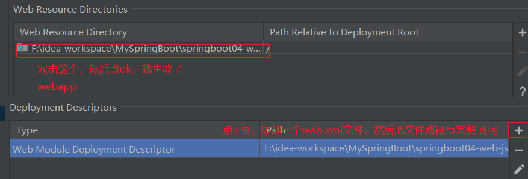
###步骤
####1. 必须创建一个war项目；（创建springboot项目时选择war）
####2.将嵌入式的Tomcat指定为provided；(生成项目就配置好了)

	<dependency>
	   <groupId>org.springframework.boot</groupId>
	   <artifactId>spring-boot-starter-tomcat</artifactId>
	   <scope>provided</scope>
	</dependency>
####3.必须编写一个**SpringBootServletInitializer**的子类，并调用configure方法

	public class ServletInitializer extends SpringBootServletInitializer {

	   @Override
	   protected SpringApplicationBuilder configure(SpringApplicationBuilder application) {
	       //传入SpringBoot应用的主程序
	      return application.sources(SpringBoot04WebJspApplication.class);
	   }
	}
####4.启动服务器就可以使用；
###原理
jar包：执行SpringBoot主类的main方法，启动ioc容器，创建嵌入式的Servlet容器；

war包：启动服务器，**服务器启动SpringBoot应用**【SpringBootServletInitializer】，启动ioc容器；

servlet3.0

8.2.4 Shared libraries / runtimes pluggability：(pdf文件中的章节)

* 规则：
	* 	1）、服务器启动（web应用启动）会创建当前web应用里面每一个jar包里面ServletContainerInitializer实例：
	* 	2）、ServletContainerInitializer的实现放在jar包的META-INF/services文件夹下，有一个名为javax.servlet.ServletContainerInitializer的文件，内容就是ServletContainerInitializer的实现类的全类名
	* 	3）、还可以使用@HandlesTypes，在应用启动的时候加载我们感兴趣的类；
* 流程
	* 1）、启动Tomcat
	* 2）、org\springframework\spring-web\4.3.14.RELEASE\spring-web-4.3.14.RELEASE.jar!\META-INF\services\javax.servlet.ServletContainerInitializer：
	* Spring的web模块里面有这个文件：**org.springframework.web.SpringServletContainerInitializer**
	* 3）、SpringServletContainerInitializer将@HandlesTypes(WebApplicationInitializer.class)标注的所有这个类型的类都传入到onStartup方法的Set<Class<?>>；为这些WebApplicationInitializer类型的类创建实例；
	* 4）、每一个WebApplicationInitializer都调用自己的onStartup；
	* 
	* 5）、相当于我们的SpringBootServletInitializer的类会被创建对象，并执行onStartup方法
	* 6）、SpringBootServletInitializer实例执行onStartup的时候会createRootApplicationContext；创建容器

			protected WebApplicationContext createRootApplicationContext(
			      ServletContext servletContext) {
			    //1、创建SpringApplicationBuilder
			   SpringApplicationBuilder builder = createSpringApplicationBuilder();
			   StandardServletEnvironment environment = new StandardServletEnvironment();
			   environment.initPropertySources(servletContext, null);
			   builder.environment(environment);
			   builder.main(getClass());
			   ApplicationContext parent = getExistingRootWebApplicationContext(servletContext);
			   if (parent != null) {
			      this.logger.info("Root context already created (using as parent).");
			      servletContext.setAttribute(
			            WebApplicationContext.ROOT_WEB_APPLICATION_CONTEXT_ATTRIBUTE, null);
			      builder.initializers(new ParentContextApplicationContextInitializer(parent));
			   }
			   builder.initializers(
			         new ServletContextApplicationContextInitializer(servletContext));
			   builder.contextClass(AnnotationConfigEmbeddedWebApplicationContext.class);
			    
			    //调用configure方法，子类重写了这个方法，将SpringBoot的主程序类传入了进来
			   builder = configure(builder);
			    
			    //使用builder创建一个Spring应用
			   SpringApplication application = builder.build();
			   if (application.getSources().isEmpty() && AnnotationUtils
			         .findAnnotation(getClass(), Configuration.class) != null) {
			      application.getSources().add(getClass());
			   }
			   Assert.state(!application.getSources().isEmpty(),
			         "No SpringApplication sources have been defined. Either override the "
			               + "configure method or add an @Configuration annotation");
			   // Ensure error pages are registered
			   if (this.registerErrorPageFilter) {
			      application.getSources().add(ErrorPageFilterConfiguration.class);
			   }
			    //启动Spring应用
			   return run(application);
			}

	* 7）、Spring的应用就启动并且创建IOC容器

			public ConfigurableApplicationContext run(String... args) {
			   StopWatch stopWatch = new StopWatch();
			   stopWatch.start();
			   ConfigurableApplicationContext context = null;
			   FailureAnalyzers analyzers = null;
			   configureHeadlessProperty();
			   SpringApplicationRunListeners listeners = getRunListeners(args);
			   listeners.starting();
			   try {
			      ApplicationArguments applicationArguments = new DefaultApplicationArguments(
			            args);
			      ConfigurableEnvironment environment = prepareEnvironment(listeners,
			            applicationArguments);
			      Banner printedBanner = printBanner(environment);
			      context = createApplicationContext();
			      analyzers = new FailureAnalyzers(context);
			      prepareContext(context, environment, listeners, applicationArguments,
			            printedBanner);
			       
			       //刷新IOC容器
			      refreshContext(context);
			      afterRefresh(context, applicationArguments);
			      listeners.finished(context, null);
			      stopWatch.stop();
			      if (this.logStartupInfo) {
			         new StartupInfoLogger(this.mainApplicationClass)
			               .logStarted(getApplicationLog(), stopWatch);
			      }
			      return context;
			   }
			   catch (Throwable ex) {
			      handleRunFailure(context, listeners, analyzers, ex);
			      throw new IllegalStateException(ex);
			   }
			}
* 总结:**启动Servlet容器，再启动SpringBoot应用**
# 9、Docker
## 1、简介
**Docker**是一个开源的应用容器引擎；是一个轻量级容器技术；

Docker支持将软件编译成一个镜像；然后在镜像中各种软件做好配置，将镜像发布出去，其他使用者可以直接使用这个镜像；运行中的这个镜像称为容器，容器启动是非常快速的。
先
# 10.SpringBoot与数据访问
##整合JDBC
###导入依赖

    <dependency>
        <groupId>org.springframework.boot</groupId>
        <artifactId>spring-boot-starter-jdbc</artifactId>
    </dependency>

    <dependency>
        <groupId>mysql</groupId>
        <artifactId>mysql-connector-java</artifactId>
        <scope>runtime</scope>
    </dependency>
###配置yml文件

	spring:
	  datasource:
	    username: root
	    password: 123456
	    url: jdbc:mysql://192.168.6.133:3307/testjdbc
	    driver-class-name: com.mysql.cj.jdbc.Driver
###效果
* 默认是用org.apache.tomcat.jdbc.pool.DataSource作为数据源；(2.0以后就是用Hikari)
* 数据源的相关配置都在DataSourceProperties里面；
###原理
* 所在包： org.springframework.boot.autoconfigure.jdbc：
1. 参考DataSourceConfiguration，根据配置创建数据源，1.x默认使用Tomcat连接池；可以使用**spring.datasource.type**指定自定义的数据源类型；
2. SpringBoot默认可以支持；

 		org.apache.tomcat.jdbc.pool.DataSource、HikariDataSource、BasicDataSource、
3. 自定义数据源

	    static class Generic {
	        Generic() {
	        }
	
	        @Bean
	        DataSource dataSource(DataSourceProperties properties) {
				//构建者模式，根据反射创建数据源，并绑定相关属性
	            return properties.initializeDataSourceBuilder().build();
	        }
	    }
4. DataSourceInitializer：ApplicationListener

* 作用：
	* 1）、runSchemaScripts();运行建表语句；
	* 2）、runDataScripts();运行插入数据的sql语句；
* 默认只需要将文件命名为：
		
		schema-*.sql、data-*.sql
		默认规则：schema.sql，schema-all.sql；
		可以使用   
			schema:
		      - classpath:department.sql
		      指定位置
###使用druid数据源
* 先导入依赖

		<dependency>
	        <groupId>com.alibaba</groupId>
	        <artifactId>druid</artifactId>
	        <version>1.1.22</version>
	    </dependency>
* maven导包导不进来，Unable to import Maven project   See logs for details
	* 解决方法： idea的settings>>build,execution,Deployment>>Build Tools>>Maven>>importing的 JDK for importer 设置问题，我的默认设置是jre，但是jre不满足我们需要，所以要设置为jdk才好。

* 新建一个配置类

			@Configuration
			public class jdbcconfig {
			
				/把yml中的属性跟这个绑定
			    @ConfigurationProperties("spring.datasource")
			    @Bean
			    public DataSource druid() {
			        return  new DruidDataSource();
			    }
			
			//    配置druid的监控
			    //配置一个管理后台的servlet
			    @Bean
			    public ServletRegistrationBean statViewBean() {
			        ServletRegistrationBean<Servlet> bean = new ServletRegistrationBean<>(new StatViewServlet(), "/druid/*");
			        HashMap<String, String> map = new HashMap<>();
			        map.put("loginUsername", "admin");
			        map.put("loginPassword", "123456");
			        map.put("allow", "");
			        map.put("deny", "192.168.6.139");
			
			        bean.setInitParameters(map);
			        return bean;
			    }
			
			    //配置一个web监控的filter
			    @Bean
			    public FilterRegistrationBean webStatFilter() {
			        FilterRegistrationBean<Filter> bean = new FilterRegistrationBean<>();
			        bean.setFilter(new WebStatFilter());
			
			        HashMap<String, String> map = new HashMap<>();
			        map.put("exclusions", "*.js,*.css,/druid/*");
			
			        bean.setInitParameters(map);
			
			        bean.setUrlPatterns(Arrays.asList("/*"));
			
			        return bean;
			    }
			}
##整合mybatis
###注解版
#####导入依赖

    <dependency>
        <groupId>org.mybatis.spring.boot</groupId>
        <artifactId>mybatis-spring-boot-starter</artifactId>
        <version>2.1.2</version>
    </dependency>
#####配置数据源相关属性，同上jdbc
#####正常使用mybatis

	@Mapper
	public interface DepartmentMapper {
	
	    @Select("select *from department where id = #{id}")
	    public Department queryById(Integer id);
#####自定义MyBatis的配置规则；给容器中添加一个ConfigurationCustomizer；
* 就是数据库列名带下划线，javabean中是大写的解决方法

		@org.springframework.context.annotation.Configuration
		public class ConfigMybatis {
		
		    @Bean
		    public ConfigurationCustomizer configurationCustomizer() {
		        return new ConfigurationCustomizer() {
		            @Override
		            public void customize(Configuration configuration) {
		                configuration.setMapUnderscoreToCamelCase(true);
		            }
		        };
		    }
		}
#####当@mapper太多时，在启动类上加@MapperScan("com.hnguigu.springboot06.mapper")即可扫瞄所有mapper

###配置文件版
* 加入下面配置即可

		mybatis:
		  config-location: classpath:mybatis/mybatis-config.xml #全局配置文件路径
		  mapper-locations: classpath:mybatis/mapper/*.xml #映射文件路径
##整合springdata_JPA
###编写一个实体类（bean）和数据表进行映射，并且配置好映射关系；
	
	@Data
	@Entity  //告诉jpa这不是普通的javabean，这是要和数据库映射的类
	@Table(name = "tbl_user")  //指定生成的表名，不指定则为user，用来指定和那张数据表映射
	public class User {
	
	    @Id //表明这是主键
	    @GeneratedValue(strategy = GenerationType.IDENTITY) //表示主键自增
	    private Integer id;
	    @Column(name = "last_name")  //表示和数据表对应的列
	    private String lastName;
	    @Column  //如果省略，属性名就是列名
	    private String email;
	}
###编写一个Dao接口来操作实体类对应的数据表（Repository）

	//继承JpaRepository来完成对数据库的操作
	public interface UserRepository extends JpaRepository<User, Integer> { //第一个是要操作的实体类对应的数据表，第二个是实体类主键的类型
	}
###yml配置

	  jpa:
	    hibernate:
	      ddl-auto: update #表示每次都更新或者创建表
	    show-sql: true #控制台打印sql语句
# 11，SpringBoot启动配置原理
##几个重要的事件回调机制

配置在META-INF/spring.factories

**ApplicationContextInitializer**

**SpringApplicationRunListener**

只需要放在ioc容器中

**ApplicationRunner**

**CommandLineRunner**
##启动流程
###1、创建SpringApplication对象
	initialize(sources);
	private void initialize(Object[] sources) {
	    //保存主配置类
	    if (sources != null && sources.length > 0) {
	        this.sources.addAll(Arrays.asList(sources));
	    }
	    //判断当前是否一个web应用
	    this.webEnvironment = deduceWebEnvironment();
	    //从类路径下找到META-INF/spring.factories配置的所有ApplicationContextInitializer；然后保存起来
	    setInitializers((Collection) getSpringFactoriesInstances(
	        ApplicationContextInitializer.class));
	    //从类路径下找到ETA-INF/spring.factories配置的所有ApplicationListener
	    setListeners((Collection) getSpringFactoriesInstances(ApplicationListener.class));
	    //从多个配置类中找到有main方法的主配置类
	    this.mainApplicationClass = deduceMainApplicationClass();
	}
###2、运行run方法

	public ConfigurableApplicationContext run(String... args) {
	   StopWatch stopWatch = new StopWatch();
	   stopWatch.start();
	   ConfigurableApplicationContext context = null;
	   FailureAnalyzers analyzers = null;
	   configureHeadlessProperty();
	    
	   //获取SpringApplicationRunListeners；从类路径下META-INF/spring.factories
	   SpringApplicationRunListeners listeners = getRunListeners(args);
	    //回调所有的获取SpringApplicationRunListener.starting()方法
	   listeners.starting();
	   try {
	       //封装命令行参数
	      ApplicationArguments applicationArguments = new DefaultApplicationArguments(
	            args);
	      //准备环境
	      ConfigurableEnvironment environment = prepareEnvironment(listeners,
	            applicationArguments);
	       		//创建环境完成后回调SpringApplicationRunListener.environmentPrepared()；表示环境准备完成
	       
	      Banner printedBanner = printBanner(environment);
	       
	       //创建ApplicationContext；决定创建web的ioc还是普通的ioc
	      context = createApplicationContext();
	       
	      analyzers = new FailureAnalyzers(context);
	       //准备上下文环境;将environment保存到ioc中；而且applyInitializers()；
	       //applyInitializers()：回调之前保存的所有的ApplicationContextInitializer的initialize方法
	       //回调所有的SpringApplicationRunListener的contextPrepared()；
	       //
	      prepareContext(context, environment, listeners, applicationArguments,
	            printedBanner);
	       //prepareContext运行完成以后回调所有的SpringApplicationRunListener的contextLoaded（）；
	       
	       //s刷新容器；ioc容器初始化（如果是web应用还会创建嵌入式的Tomcat）；Spring注解版
	       //扫描，创建，加载所有组件的地方；（配置类，组件，自动配置）
	      refreshContext(context);
	       //从ioc容器中获取所有的ApplicationRunner和CommandLineRunner进行回调
	       //ApplicationRunner先回调，CommandLineRunner再回调
	      afterRefresh(context, applicationArguments);
	       //所有的SpringApplicationRunListener回调finished方法
	      listeners.finished(context, null);
	      stopWatch.stop();
	      if (this.logStartupInfo) {
	         new StartupInfoLogger(this.mainApplicationClass)
	               .logStarted(getApplicationLog(), stopWatch);
	      }
	       //整个SpringBoot应用启动完成以后返回启动的ioc容器；
	      return context;
	   }
	   catch (Throwable ex) {
	      handleRunFailure(context, listeners, analyzers, ex);
	      throw new IllegalStateException(ex);
	   }
	}
### 3、事件监听机制

先新建这个文件然后配置在META-INF/spring.factories

**ApplicationContextInitializer**

	public class HelloApplicationContextInitializer implements ApplicationContextInitializer<ConfigurableApplicationContext> {
	    @Override
	    public void initialize(ConfigurableApplicationContext applicationContext) {
	        System.out.println("ApplicationContextInitializer...initialize..."+applicationContext);
	    }
	}

**SpringApplicationRunListener**

	public class HelloSpringApplicationRunListener implements SpringApplicationRunListener {
	
	    //必须有的构造器
	    public HelloSpringApplicationRunListener(SpringApplication application, String[] args){
	
	    }
	
	    @Override
	    public void starting() {
	        System.out.println("SpringApplicationRunListener...starting...");
	    }
	
	    @Override
	    public void environmentPrepared(ConfigurableEnvironment environment) {
	        Object o = environment.getSystemProperties().get("os.name");
	        System.out.println("SpringApplicationRunListener...environmentPrepared.."+o);
	    }
	
	    @Override
	    public void contextPrepared(ConfigurableApplicationContext context) {
	        System.out.println("SpringApplicationRunListener...contextPrepared...");
	    }
	
	    @Override
	    public void contextLoaded(ConfigurableApplicationContext context) {
	        System.out.println("SpringApplicationRunListener...contextLoaded...");
	    }
	
	    @Override
	    public void finished(ConfigurableApplicationContext context, Throwable exception) {
	        System.out.println("SpringApplicationRunListener...finished...");
	    }
	}

配置（META-INF/spring.factories）

	org.springframework.context.ApplicationContextInitializer=\
	com.atguigu.springboot.listener.HelloApplicationContextInitializer
	
	org.springframework.boot.SpringApplicationRunListener=\
	com.atguigu.springboot.listener.HelloSpringApplicationRunListener

只需要放在ioc容器中

**ApplicationRunner**

	@Component
	public class HelloApplicationRunner implements ApplicationRunner {
	    @Override
	    public void run(ApplicationArguments args) throws Exception {
	        System.out.println("ApplicationRunner...run....");
	    }
	}

**CommandLineRunner**

	@Component
	public class HelloCommandLineRunner implements CommandLineRunner {
	    @Override
	    public void run(String... args) throws Exception {
	        System.out.println("CommandLineRunner...run..."+ Arrays.asList(args));
	    }
	}
# 12，自定义starter(场景启动器)
##starter：
###1、这个场景需要使用到的依赖是什么？
###2、如何编写自动配置

	@Configuration  //指定这个类是一个配置类
	@ConditionalOnXXX  //在指定条件成立的情况下自动配置类生效
	@AutoConfigureAfter  //指定自动配置类的顺序
	@Bean  //给容器中添加组件
	
	@ConfigurationPropertie结合相关xxxProperties类来绑定相关的配置
	@EnableConfigurationProperties //让xxxProperties生效加入到容器中
	
	自动配置类要能加载
	将需要启动就加载的自动配置类，配置在META-INF/spring.factories
	org.springframework.boot.autoconfigure.EnableAutoConfiguration=\
	org.springframework.boot.autoconfigure.admin.SpringApplicationAdminJmxAutoConfiguration,\
	org.springframework.boot.autoconfigure.aop.AopAutoConfiguration,\
###3、模式：
启动器只用来做依赖导入；

专门来写一个自动配置模块；

启动器依赖自动配置；别人只需要引入启动器（starter）

mybatis-spring-boot-starter；自定义启动器名-spring-boot-starter
###4、步骤
* 1）、启动器模块

		<?xml version="1.0" encoding="UTF-8"?>
		<project xmlns="http://maven.apache.org/POM/4.0.0"
		         xmlns:xsi="http://www.w3.org/2001/XMLSchema-instance"
		         xsi:schemaLocation="http://maven.apache.org/POM/4.0.0 http://maven.apache.org/xsd/maven-4.0.0.xsd">
		    <modelVersion>4.0.0</modelVersion>
		
		    <groupId>com.atguigu.starter</groupId>
		    <artifactId>atguigu-spring-boot-starter</artifactId>
		    <version>1.0-SNAPSHOT</version>
		
		    <!--启动器-->
		    <dependencies>
		
		        <!--引入自动配置模块-->
		        <dependency>
		            <groupId>com.atguigu.starter</groupId>
		            <artifactId>atguigu-spring-boot-starter-autoconfigurer</artifactId>
		            <version>0.0.1-SNAPSHOT</version>
		        </dependency>
		    </dependencies>
		
		</project>
* 2）、自动配置模块

		<?xml version="1.0" encoding="UTF-8"?>
		<project xmlns="http://maven.apache.org/POM/4.0.0" xmlns:xsi="http://www.w3.org/2001/XMLSchema-instance"
		   xsi:schemaLocation="http://maven.apache.org/POM/4.0.0 http://maven.apache.org/xsd/maven-4.0.0.xsd">
		   <modelVersion>4.0.0</modelVersion>
		
		   <groupId>com.atguigu.starter</groupId>
		   <artifactId>atguigu-spring-boot-starter-autoconfigurer</artifactId>
		   <version>0.0.1-SNAPSHOT</version>
		   <packaging>jar</packaging>
		
		   <name>atguigu-spring-boot-starter-autoconfigurer</name>
		   <description>Demo project for Spring Boot</description>
		
		   <parent>
		      <groupId>org.springframework.boot</groupId>
		      <artifactId>spring-boot-starter-parent</artifactId>
		      <version>1.5.10.RELEASE</version>
		      <relativePath/> <!-- lookup parent from repository -->
		   </parent>
		
		   <properties>
		      <project.build.sourceEncoding>UTF-8</project.build.sourceEncoding>
		      <project.reporting.outputEncoding>UTF-8</project.reporting.outputEncoding>
		      <java.version>1.8</java.version>
		   </properties>
		
		   <dependencies>
		
		      <!--引入spring-boot-starter；所有starter的基本配置-->
		      <dependency>
		         <groupId>org.springframework.boot</groupId>
		         <artifactId>spring-boot-starter</artifactId>
		      </dependency>
		
		   </dependencies>
		
		</project>

		package com.atguigu.starter;
		
		import org.springframework.boot.context.properties.ConfigurationProperties;
		
		@ConfigurationProperties(prefix = "atguigu.hello")
		public class HelloProperties {
		
		    private String prefix;
		    private String suffix;
		
		    public String getPrefix() {
		        return prefix;
		    }
		
		    public void setPrefix(String prefix) {
		        this.prefix = prefix;
		    }
		
		    public String getSuffix() {
		        return suffix;
		    }
		
		    public void setSuffix(String suffix) {
		        this.suffix = suffix;
		    }
		}

		package com.atguigu.starter;
		
		public class HelloService {
		
		    HelloProperties helloProperties;
		
		    public HelloProperties getHelloProperties() {
		        return helloProperties;
		    }
		
		    public void setHelloProperties(HelloProperties helloProperties) {
		        this.helloProperties = helloProperties;
		    }
		
		    public String sayHellAtguigu(String name){
		        return helloProperties.getPrefix()+"-" +name + helloProperties.getSuffix();
		    }
		}

		package com.atguigu.starter;
		
		import org.springframework.beans.factory.annotation.Autowired;
		import org.springframework.boot.autoconfigure.condition.ConditionalOnWebApplication;
		import org.springframework.boot.context.properties.EnableConfigurationProperties;
		import org.springframework.context.annotation.Bean;
		import org.springframework.context.annotation.Configuration;
		
		@Configuration
		@ConditionalOnWebApplication //web应用才生效
		@EnableConfigurationProperties(HelloProperties.class)
		public class HelloServiceAutoConfiguration {
		
		    @Autowired
		    HelloProperties helloProperties;
		    @Bean
		    public HelloService helloService(){
		        HelloService service = new HelloService();
		        service.setHelloProperties(helloProperties);
		        return service;
		    }
		}

# [更多SpringBoot整合示例](https://github.com/spring-projects/spring-boot/tree/master/spring-boot-samples)

