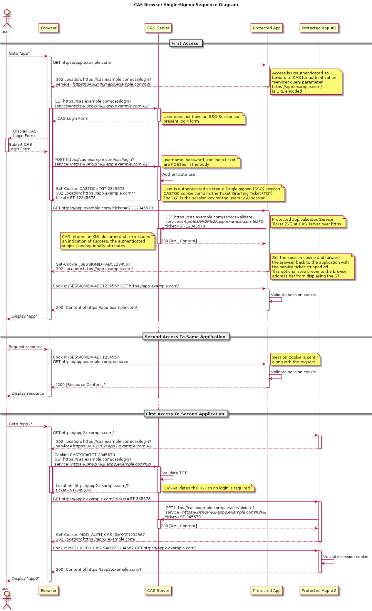
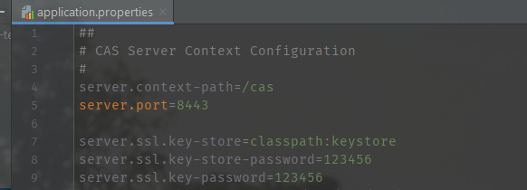
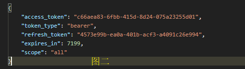
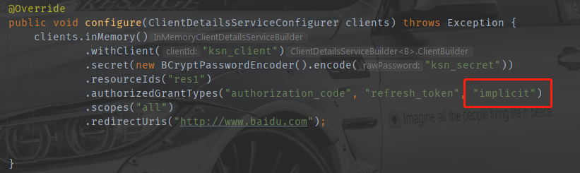
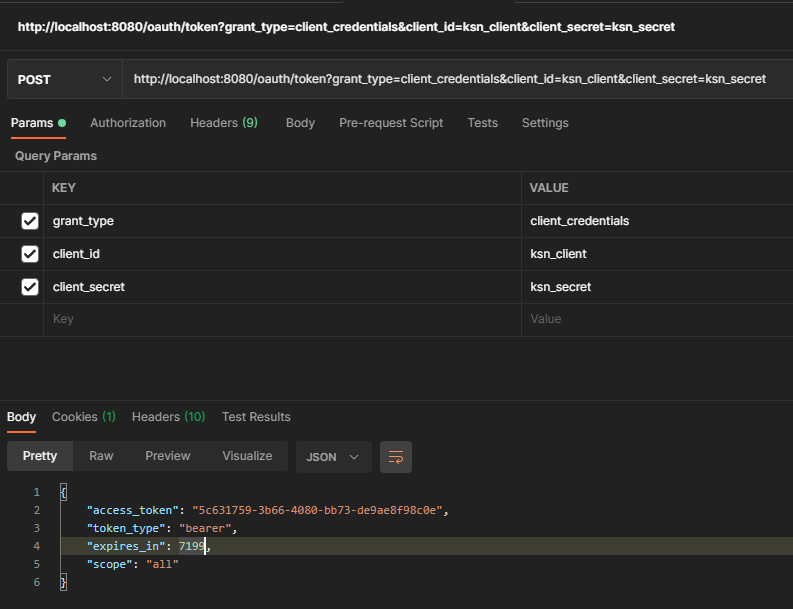
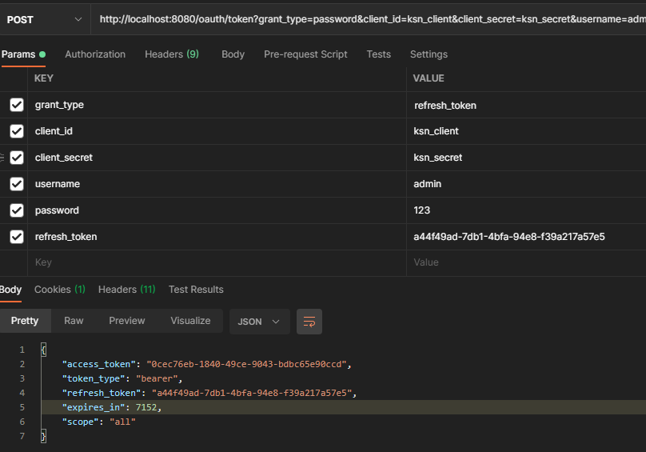
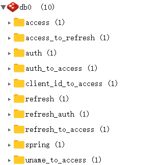
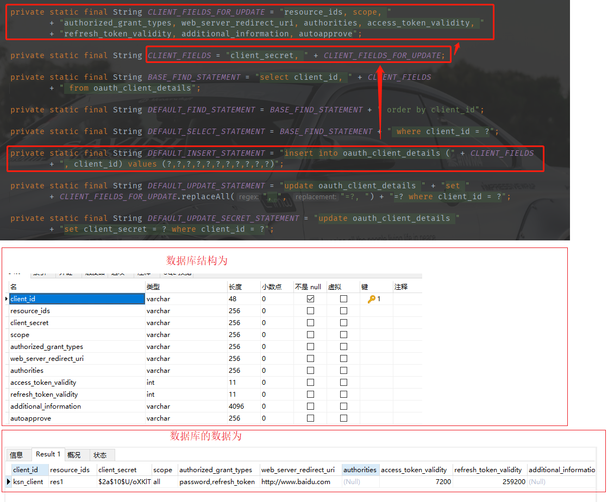

#Spring Security

##1. CAS整合 Spring Security(一)

###三个概念
* **TGT**：TGT 全称叫做 Ticket Granting Ticket，这个相当于我们平时所见到的 HttpSession 的作用，用户登录成功后，用户的基本信息，如用户名、登录有效期等信息，都将存储在此。
* **TGC**：TGC 全称叫做 Ticket Granting Cookie，TGC 以 Cookie 的形式保存在浏览器中，根据 TGC 可以帮助用户找到对应的 TGT，所以这个 TGC 有点类似与会话 ID。
* **ST**：ST 全称是 Service Ticket，这是 CAS Sever 通过 TGT 给用户发放的一张票据，用户在访问其他服务时，发现没有 Cookie 或者 ST ，那么就会 302 到 CAS Server 获取 ST，然后会携带着 ST 302 回来，CAS Client 则通过 ST 去 CAS Server 上获取用户的登录状态。
###CAS登录流程

#
1. 用户通过浏览器访问应用1，应用1 发现用户没有登录，于是返回 302，并且携带上一个 service 参数，让用户去 CAS Server 上登录。
2. 浏览器自动重定向到 CAS Server 上，CAS Server 获取用户 Cookie 中携带的 TGC，去校验用户是否已经登录，如果已经登录，则完成身份校验（此时 CAS Server 可以根据用户的 TGC 找到 TGT，进而获取用户的信息）；如果未登录，则重定向到 CAS Server 的登录页面，用户输入用户名/密码，CAS Server 会生成 TGT，并且根据 TGT 签发一个 ST，再将 TGC 放在用户的 Cookie 中，完成身份校验。
3. CAS Server 完成身份校验之后，会将 ST 拼接在 service 中，返回 302，浏览器将首先将 TGC 存在 Cookie 中，然后根据 302 的指示，携带上 ST 重定向到应用1。
4. 应用1 收到浏览器传来的 ST 之后，拿去 CAS Server 上校验，去判断用户的登录状态，如果用户登录合法，CAS Server 就会返回用户信息给 应用1。
5. 浏览器再去访问应用2，应用2 发现用户未登录，重定向到 CAS Server。
6. CAS Server 发现此时用户实际上已经登录了，于是又重定向回应用2，同时携带上 ST。
7. 应用2 拿着 ST 去 CAS Server 上校验，获取用户的登录信息。
###搭建CAS Server服务
####1. 下载构建CAS Server的模板,版本选择5.3的maven版
>https://github.com/apereo/cas-overlay-template
####2. 生成HTTPS证书，云服务申请，或者去买，或者jdk自带的keytool工具
> keytool -genkey -alias casserver -keyalg RSA -keystore ./keystore

####3. 配置并启动
######1. 首先进入cas-overlay-template下，打开cmd，输入mvn clean package，在新建目录src/main/resource，再把verlays/org.apereo.cas.cas-server-webapp-tomcat-5.3.14/WEB-INF/classes/application.properties文件跟生成的keystore放到resources下，如图：

######2. 更改application.properties配置文件，配置keystore的地址和password

######3. 在当前项目下执行`build.cmd run`，第一次会有点久，成功后如图： 

######4. 输入`https://127.0.0.1:8443/cas/login`,访问成功即可。默认的用户名是 casuser，密码是 Mellon。可以再配置文件中修改,改完重启即可
> cas.authn.accept.users=casuser::Mellon

######5. 配置用户从数据库读取，打开https://github.com/javalanxiongwei/cas-overlay-template-master/blob/master/cas.sql，拿到cas.sql文件并执行。此时会多出一张用户表sys_user

######6. 在pom.xml中新增依赖

	<!--新增支持jdbc验证-->
	<dependency>
	        <groupId>org.apereo.cas</groupId>
	        <artifactId>cas-server-support-jdbc</artifactId>
	        <version>${cas.version}</version>
	</dependency>
	<!--使用mysql驱动-->
	<dependency>
	        <groupId>mysql</groupId>
	        <artifactId>mysql-connector-java</artifactId>
	        <version>5.1.21</version>
	</dependency>
######7. 配置数据库相关,以下配置，如驱动，查询数据库等等需要根据不同的场景进行调整:
* 若密码无加密，调整passwordEncoder.type=NONE
* 若密码加密策略为SHA，调整passwordEncoder.encodingAlgorithm=SHA
* 若算法为自定义，实现org.springframework.security.crypto.password.PasswordEncoder接口，并且把类名配置在passwordEncoder.type

		#jdbc验证配置
		#Query Database Authentication 数据库查询校验用户名开始
		#查询账号密码sql，必须包含密码字段
		cas.authn.jdbc.query[0].sql=select * from sys_user where username=?
		#指定上面的sql查询字段名（必须）
		cas.authn.jdbc.query[0].fieldPassword=password
		#指定过期字段，1为过期，若过期需要修改密码
		cas.authn.jdbc.query[0].fieldExpired=expired
		#为不可用字段段，1为不可用，
		cas.authn.jdbc.query[0].fieldDisabled=disabled
		#数据库方言hibernate的知识
		cas.authn.jdbc.query[0].dialect=org.hibernate.dialect.MySQLDialect
		#数据库驱动
		cas.authn.jdbc.query[0].driverClass=com.mysql.jdbc.Driver
		#数据库连接
		cas.authn.jdbc.query[0].url=jdbc:mysql://127.0.0.1:3306/demo?useUnicode=true&characterEncoding=UTF-8
		#数据库用户名
		cas.authn.jdbc.query[0].user=root
		#数据库密码
		cas.authn.jdbc.query[0].password=root
		#默认加密策略，通过encodingAlgorithm来指定算法，默认NONE不加密
		cas.authn.jdbc.query[0].passwordEncoder.type=DEFAULT
		cas.authn.jdbc.query[0].passwordEncoder.characterEncoding=UTF-8
		cas.authn.jdbc.query[0].passwordEncoder.encodingAlgorithm=MD5
		#Query Database Authentication 数据库查询校验用户名结束
		#jdbc验证配置
######8. 分别使用admin/admin, wolfcode/wolfcode, lanxw/666 登录效果如下：

######9. 其他
* 我们已经把CAS Server端的验证变成使用JDBC的方式认证,而且在数据库中也已经对明文密码使用md5进行加密,但是只是用md5加密安全性不够高.所以一般我们会对密码使用md5+盐加密来增加密码管理的安全性.我们需要修改application.properties,在配置文件中指定盐值和加密次数:
对应的sys_user_encode的脚本也是从上面的github地址获取.

		#Encode Database Authentication 开始
		#加密次数
		cas.authn.jdbc.encode[0].numberOfIterations=2
		#该列名的值可替代上面的值，但对密码加密时必须取该值进行处理(如果使用这个配置需要把上面的配置注释)
		#cas.authn.jdbc.encode[0].numberOfIterationsFieldName=
		# 盐值固定列
		cas.authn.jdbc.encode[0].saltFieldName=username
		#静态盐值(如果使用这个配置需要把上面的配置注释)
		#cas.authn.jdbc.encode[0].staticSalt=.
		cas.authn.jdbc.encode[0].sql=select * from sys_user_encode where username=?
		#对处理盐值后的算法
		cas.authn.jdbc.encode[0].algorithmName=MD5
		cas.authn.jdbc.encode[0].passwordFieldName=password
		cas.authn.jdbc.encode[0].expiredFieldName=expired
		cas.authn.jdbc.encode[0].disabledFieldName=disabled
		cas.authn.jdbc.encode[0].url=jdbc:mysql://127.0.0.1:3306/demo?useUnicode=true&characterEncoding=UTF-8
		cas.authn.jdbc.encode[0].dialect=org.hibernate.dialect.MySQLDialect
		cas.authn.jdbc.encode[0].user=root
		cas.authn.jdbc.encode[0].password=root
		cas.authn.jdbc.encode[0].driverClass=com.mysql.jdbc.Driver
		#Encode Database Authentication 结束
##2. CAS整合 Spring Security(二)
###1. 服务记录
####1.1. 某一个 Client 需要接入 CAS Server 进行验证，则该 Client 必须提前在 CAS Server 上配置其信息。
######1.1.1 首先新建`src/main/resources/services`文件夹，再创建client1-99.json文件，（这个配置可以参考官方给出的模版：overlays/org.apereo.cas.cas-server-webapp-tomcat-5.3.14/WEB-INF/classes/services/Apereo-10000002.json）

		{
		  // @calss 指定注册服务类，这个是固定的org.apereo.cas.services.RegexRegisteredService。
		  "@class": "org.apereo.cas.services.RegexRegisteredService", 
		  // serviceId 则通过正则表达式用来匹配具体的请求。
		  "serviceId": "^(https|http)://.*",
		  // name 是接入的 client 的名称。
		  "name": "client1",
		  // id 是接入的 client 的 id。
		  "id": 99,
		  // description 是接入的 client 的描述信息。
		  "description": "应用1 的定义信息",
		  // evaluationOrder 则指定了执行的优先级。
		  "evaluationOrder": 1
		}
######然后在`src/main/resources/application.properties`下配置
	#指定配置 JSON 文件的位置。
	cas.serviceRegistry.json.location=classpath:/services
	#开启 JSON 识别。
	cas.serviceRegistry.initFromJson=true
####1.2. JDK证书
######1.2.1 首先使用命令到处`.cer`文件
> keytool -export -trustcacerts -alias casserver -file ./cas.cer -keystore ./keystore
######1.2.2 导入jdk,导入完成后重启CAS Server
> keytool -import -v -trustcacerts -alias casserver -file ./cas.cer -storepass changeit -keystore "%JAVA_HOME%/jre/lib/security/cacerts"
> 
>keytool -import -v -trustcacerts -alias 文件名 -file "文件完整路径" -storepass changeit -keystore "%JAVA_HOME%/jre/lib/security/cacerts"

	查看证书命令
	keytool -list -keystore cacerts -alias 证书名
	默认密码:changeit
	删除证书
	keytool -delete -alias casserver -keystore cacerts 
######1.2.3 修改 hosts
	#CAS Server 的请求域名
	127.0.0.1 cas.ksn.com
	#CAS Client 的请求域名
	127.0.0.1 client1.cas.ksn.com
###2. 开发 Client
#Spring Secrity + OAuth2
##授权码模式
###1. 首先导入依赖

	<dependency>
        <groupId>org.springframework.boot</groupId>
        <artifactId>spring-boot-starter-web</artifactId>
    </dependency>
    <dependency>
        <groupId>org.springframework.cloud</groupId>
        <artifactId>spring-cloud-starter-oauth2</artifactId>
    </dependency>
    <dependency>
        <groupId>org.springframework.cloud</groupId>
        <artifactId>spring-cloud-starter-security</artifactId>
    </dependency>
###2. 配置security相关的

	@Configuration
	@EnableWebSecurity
	@EnableGlobalMethodSecurity(prePostEnabled = true)
	public class SecurityConfig extends WebSecurityConfigurerAdapter {
	
		// 配置密码
	    @Bean
	    public PasswordEncoder passwordEncoder() {
	        return new BCryptPasswordEncoder();
	    }
	
		// 简单配置下用户
	    @Override
	    protected void configure(AuthenticationManagerBuilder auth) throws Exception {
	        auth.inMemoryAuthentication()
	                .withUser("admin").password(passwordEncoder().encode("123")).roles("admin")
	                .and()
	                .withUser("user").password(passwordEncoder().encode("123")).roles("user");
	    }
	
	    @Override
	    protected void configure(HttpSecurity http) throws Exception {
	        http.csrf().disable().formLogin();
	    }
	}
###3. 配置授权服务

	// 表示开启授权服务器自动化配置
	@EnableAuthorizationServer
	@Configuration
	public class AuthorizationServer extends AuthorizationServerConfigurerAdapter {
	
	    @Autowired
	    ClientDetailsService clientDetailsService;
	
	
	    /**
	     * 配置token存放位置，可以是内存，redis也可以结合jwt一起使用
	     * @return
	     */
	    @Bean
	    TokenStore tokenStore() {
	        return new InMemoryTokenStore();
	    }
	    /**
	     * 用来配置token的一些基本信息，
	     * @return
	     */
	    @Bean
	    AuthorizationServerTokenServices authorizationServerTokenServices() {
	        DefaultTokenServices services = new DefaultTokenServices();
	        services.setClientDetailsService(clientDetailsService);
	        // 是否支持刷新
	        services.setSupportRefreshToken(true);
	        // 存储位置
	        services.setTokenStore(tokenStore());
	        // 过期时间
	        services.setAccessTokenValiditySeconds(60 * 60 *2);
	        // 刷新令牌过期时间
	        services.setRefreshTokenValiditySeconds(60 * 60 * 24 * 3);
	        return services;
	    }
	
	    @Bean
	    public AuthorizationCodeServices authorizationCodeServices() {
	        // 表示授权码存在内存中
	        return new InMemoryAuthorizationCodeServices();
	    }
	
	    /**
	     * 用来配置令牌端点的安全约束，就是说谁能访问，谁不能访问
	     * @param security
	     * @throws Exception
	     */
	    @Override
	    public void configure(AuthorizationServerSecurityConfigurer security) throws Exception {
	                // 指一个 Token 校验的端点，这个端点我们可以设置成直接访问，后面当资源服务器收到token后，需要去校验token的合法性，就会走这个
	        security.checkTokenAccess("permitAll")
	                .allowFormAuthenticationForClients();
	    }
	
	    /**
	     * 授权码模式需要校验用户和客户端，这里就是校验客户端，可以从数据库查，类似UserDetailsService
	     * @param clients
	     * @throws Exception
	     */
	    @Override
	    public void configure(ClientDetailsServiceConfigurer clients) throws Exception {
	        clients.inMemory()
	                .withClient("ksn_client")
	                .secret(new BCryptPasswordEncoder().encode("ksn_secret"))
	                .resourceIds("res1")
	                .authorizedGrantTypes("authorization_code", "refresh_token")
	                .scopes("all")
	                .redirectUris("http://www.baidu.com");
	
	
	    }
	
	    /**
	     * 用来配置令牌的访问端点和令牌服务，authorizationCodeServices用来配置授权码的存储位置，这里是先存在内存中
	     * authorizationServerTokenServices是用来配置token的存储位置，token是用来获取资源的，授权码是用来获取token的用一次就失效
	     * @param endpoints
	     * @throws Exception
	     */
	    @Override
	    public void configure(AuthorizationServerEndpointsConfigurer endpoints) throws Exception {
	        endpoints.authorizationCodeServices(authorizationCodeServices())
	                .tokenServices(authorizationServerTokenServices());
	    }
	}
###4. 测试
######首先访问链接一，这个地址会跳转到一个页面如图一,点击确认之后会跳转到配置的redirect_uri，这里的redirect_uri要和代码中配置的一致，跳转后这个地址后面会多一个code的属性，就是授权码，再用这个授权码访问链接二就能获取到token了，如图二
	链接一：
	http://localhost:8080/oauth/authorize?client_id=ksn_client&response_type=code&scope=all&redirect_uri=http://www.baidu.com

	链接二：
	localhost:8080/oauth/token?client_id=ksn_client&grant_type=authorization_code&redirect_uri=
	http://www.baidu.com&client_secret=ksn_secret&code=h3pZrO

##简单模式
####1. 在上面的基础上，修改authorizedGrantTypes，加上implicit即可。然后访问链接一，登录后选择通过就跳转到redirect_uri了。跳转后的链接如链接二，后面的access_token就是token。
	
	链接一：
	http://localhost:8080/oauth/authorize?client_id=ksn_client&response_type=code&scope=all&redirect_uri=http://www.baidu.com

	链接二：
	https://www.baidu.com/#access_token=b9da9cd7-4498-4859-8b41-ecf497050bc9&token_type=bearer&expires_in=7199

##密码模式
####1. 首先在SecurityConfig中实现authenticationManager方法并交给容器管理

    @Bean
    @Override
    protected AuthenticationManager authenticationManager() throws Exception {
        return super.authenticationManager();
    }
####2. 修改授权服务类的authorizedGrantTypes，加上password。然后修改configure方法

    @Override
    public void configure(AuthorizationServerEndpointsConfigurer endpoints) throws Exception {
        // 授权码模式，简单模式
  	    // endpoints.authorizationCodeServices(authorizationCodeServices())
    	//          .tokenServices(authorizationServerTokenServices());

        // 密码模式
        endpoints.authenticationManager(authenticationManager)
                .tokenServices(authorizationServerTokenServices());
    }
####3. 测试，访问如下链接即可返回token
	http://localhost:8080/oauth/token
	?grant_type=password
	&client_id=ksn_client
	&client_secret=ksn_secret
	&username=admin
	&password=123
##客户端模式
####1. 在之前的基础上修改authorizedGrantTypes，加上client_credentials,然后访问如下链接即可。
	http://localhost:8080/oauth/token?grant_type=client_credentials&client_id=ksn_client&client_secret=ksn_secret

##刷新token

####各个接口

##把token存入redis，从数据库读取token信息
###1. 把token存入redis
######1.1 首先导入redis依赖，配置redis

	<dependency>
	    <groupId>org.springframework.boot</groupId>
	    <artifactId>spring-boot-starter-data-redis</artifactId>
	</dependency>
	
	spring.redis.host=127.0.0.1
	spring.redis.port=6379
###1.2 修改TokenStore即可

    @Autowired
    RedisConnectionFactory redisConnectionFactory;
    @Bean
    TokenStore tokenStore() {
        return new RedisTokenStore(redisConnectionFactory);
    }

###2. 从数据库读取token信息
######2.1 通过查看ClientDetailsService，它有两个实现类，从数据库中读数据是使用了JdbcClientDetailsService这个类，又通过查看这个类推断出数据库的表结构并且导入数据库依赖，配置数据源

######2.2 修改配置类即可，如果想要自定义规则就可以实现ClientDetailsService，然后实现其中的方法即可。
	@Autowired
	DataSource dataSource;

	@Bean
	ClientDetailsService clientDetailsService() {
	    return new JdbcClientDetailsService(dataSource);
	}

	@Override
	public void configure(ClientDetailsServiceConfigurer clients) throws Exception {
	    clients.withClientDetails(clientDetailsService());
	}

	@Bean
	AuthorizationServerTokenServices tokenServices() {
	    DefaultTokenServices services = new DefaultTokenServices();
	    services.setClientDetailsService(clientDetailsService());
	    services.setSupportRefreshToken(true);
	    services.setTokenStore(tokenStore);
	    return services;
	}
##返回自定义token
###新建token配置类

	@Configuration
	public class AgileJwtTokenConfig {
	
	    @Autowired
	    RedisConnectionFactory redisConnectionFactory;
	
		// 配置生成方式使用RSA非对称加密算法，token最大长度512
	    @Bean
	    public JwtAccessTokenConverter jwtAccessTokenConverter() {
	        JwtAccessTokenConverter converter = new JwtAccessTokenConverter();
	        // 非对称加密
	        converter.setKeyPair(SecureUtil.generateKeyPair("RSA", 512));
	        return converter;
	    }
	
	    @Bean
	    public TokenEnhancer tokenEnhancer() {
	        return (accessToken, authentication) -> {
	            // 自定义token携带的信息
	            Map<String, Object> map = Collections.synchronizedMap(new HashMap<>());
	            map.put("GlobalConstants.PLATFORM_NAME_KEY", "GlobalConstants.PLATFORM_NAME_EN");
	
	            ((DefaultOAuth2AccessToken) accessToken).setAdditionalInformation(map);
	            return accessToken;
	        };
	    }
	
	    /**
	     * 配置token存放位置，可以是内存，redis也可以结合jwt一起使用
	     * @return
	     */
	    @Bean
	    TokenStore tokenStore() {
	        return new RedisTokenStore(redisConnectionFactory);
	    }
	}
###修改oauth2配置类

	@Bean
    AuthorizationServerTokenServices authorizationServerTokenServices() {
        TokenEnhancerChain tokenEnhancerChain = new TokenEnhancerChain();
        // 告诉spring security把自定义token生产方式加入到TokenEnhancerChain中
        tokenEnhancerChain.setTokenEnhancers(CollUtil.newArrayList(jwtAccessTokenConverter, tokenEnhancer));
        DefaultTokenServices services = new DefaultTokenServices();
        services.setClientDetailsService(clientDetailsService());
        // 是否支持刷新	
        services.setSupportRefreshToken(true);
        // 存储位置
        services.setTokenStore(tokenStore);
        // 刷新 token时把refresh_token也刷新
        services.setReuseRefreshToken(true);
        // 将自定义的token生产方式加到TokenEnhancer中
        services.setTokenEnhancer(tokenEnhancerChain);
        return services;
    }

	@Override
    public void configure(AuthorizationServerEndpointsConfigurer endpoints) throws Exception {
        // 密码模式
        endpoints.authenticationManager(authenticationManager)
                .tokenServices(authorizationServerTokenServices())
                .accessTokenConverter(jwtAccessTokenConverter)
                .tokenStore(tokenStore)
                .allowedTokenEndpointRequestMethods(HttpMethod.OPTIONS, HttpMethod.GET, HttpMethod.POST);
    }
###给别的服务加上权限认证，导入security， oauth2， redis的依赖，然后在添加一个配置类

	@Configuration
	// 开启资源服务的自动化配置
	@EnableResourceServer
	public class ResourceServerConfig extends ResourceServerConfigurerAdapter {
	    @Autowired
	    RedisConnectionFactory redisConnectionFactory;
	
	    @Bean
	    public PasswordEncoder passwordEncoder() {
	        return new BCryptPasswordEncoder();
	    }
	
	    @Bean
	    public TokenStore redisTokenStore() {
	        return new RedisTokenStore(redisConnectionFactory);
	    }
	
	    @Override
	    public void configure(ResourceServerSecurityConfigurer resources) {
	        resources.resourceId("res1").tokenStore(redisTokenStore());
	    }
	
	    @Override
	    public void configure(HttpSecurity http) throws Exception {
	        http.authorizeRequests()
	                .anyRequest().authenticated();
	    }
	}
##接入Github第三方登录
###github新建一个应用

###新建一个boot工程导入web，thymeleaf依赖，新建index.html，注意a标签的地址是获取授权码的.client_id是创建应用时的id，state随意，是用来防篡改的。
>https://github.com/login/oauth/authorize?client_id=xxxxxx&state=ksn

	<body>
	
hello 欢迎来到小站！

	

	    社交账号登录：<a href="https://github.com/login/oauth/authorize?client_id=xxxxxx&state=javaboy">
	        <svg t="1587352912571" class="icon" viewBox="0 0 1024 1024" version="1.1" xmlns="http://www.w3.org/2000/svg"
	             p-id="2196" width="32" height="32">
	            <path d="M512 42.666667A464.64 464.64 0 0 0 42.666667 502.186667 460.373333 460.373333 0 0 0 363.52 938.666667c23.466667 4.266667 32-9.813333 32-22.186667v-78.08c-130.56 27.733333-158.293333-61.44-158.293333-61.44a122.026667 122.026667 0 0 0-52.053334-67.413333c-42.666667-28.16 3.413333-27.733333 3.413334-27.733334a98.56 98.56 0 0 1 71.68 47.36 101.12 101.12 0 0 0 136.533333 37.973334 99.413333 99.413333 0 0 1 29.866667-61.44c-104.106667-11.52-213.333333-50.773333-213.333334-226.986667a177.066667 177.066667 0 0 1 47.36-124.16 161.28 161.28 0 0 1 4.693334-121.173333s39.68-12.373333 128 46.933333a455.68 455.68 0 0 1 234.666666 0c89.6-59.306667 128-46.933333 128-46.933333a161.28 161.28 0 0 1 4.693334 121.173333A177.066667 177.066667 0 0 1 810.666667 477.866667c0 176.64-110.08 215.466667-213.333334 226.986666a106.666667 106.666667 0 0 1 32 85.333334v125.866666c0 14.933333 8.533333 26.88 32 22.186667A460.8 460.8 0 0 0 981.333333 502.186667 464.64 464.64 0 0 0 512 42.666667"
	                  fill="#2c2c2c" p-id="2197"></path>
	        </svg>
	    </a>
	

	
国际站：<a href="http://www.javaboy.org">javaboy.org</a>

	
国内站：<a href="http://www.itboyhub.com">itboyhub.com</a>

	</body>
###然后添加一个接口/authorization/code

	@ResponseBody
    @GetMapping("/code")
    public String code(@RequestParam("code") String code, @RequestParam("state") String state) {
        HashMap<String, Object> map = new HashMap<>();
        map.put("client_id", "cd2857419595e06f3721");// 应用中有
        map.put("client_secret", "c07f67405d1563c4d785dc599e9091c1e333e6c6"); // 应用中有
        map.put("state", "ksn");// 跟请求的一致
        map.put("code", code); // 通过调用授权码接口会跟在url后面
        map.put("redirect_uri", "http://127.0.0.1:8003/authorize/code");  // 这里要跟配置的回调地址一模一样
        String s = JSONUtil.toJsonStr(map);
		// 调用获取token的接口
        HttpResponse execute = HttpUtil.createPost("https://github.com/login/oauth/access_token").body(s).execute();
        System.out.println(execute.body());
		//拿到token放在请求用户信息的地址的请求头中
        String token = "token " + execute.body().substring(execute.body().indexOf("=") + 1, execute.body().indexOf("&"));
        HashMap<String, String> stringStringHashMap = new HashMap<>();
        stringStringHashMap.put("Authorization", token);
        HttpResponse execute1 = HttpUtil.createGet("https://api.github.com/user").addHeaders(stringStringHashMap).execute();
		// 获取到用户信息
        return execute1.body();
    }
##SpringSecurity的异常处理流程
######SpringSecurity是由一串过滤链组成的，典型的责任链模式。处理异常的过滤器在倒数第二个，叫ExceptionTranslationFilter。它继承了GenericFilterBean，所以查看它的doFilter方法会发现只有一句`chain.doFilter(request, response);`。而最后一个过滤器是FilterSecurityInterceptor。FilterSecurityInterceptor专门处理授权问题，然后抛出异常被ExceptionTranslationFilter捕捉到，调用catch块中的`throwableAnalyzer.getFirstThrowableOfType`，判断异常类型是认证异常还是授权异常，如果都不是就走ServletException 异常类型的处理逻辑，然后调用`handleSpringSecurityException(request, response, chain, ase);`。
