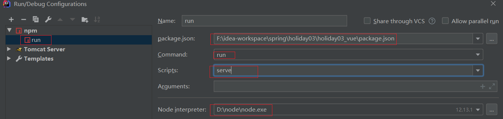
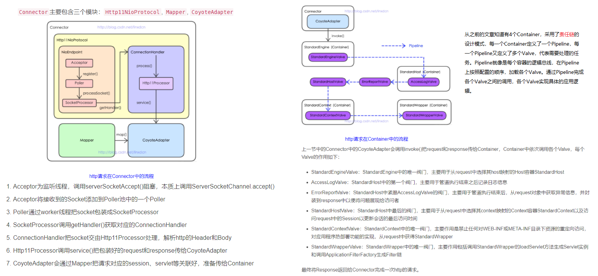
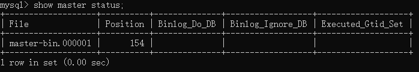

学习笔记

### 1. SpringMVC设置编码和请求头

	使用的是@RequestBody 和@RequestMapping这两个注解, 设置@RequestBody, 返回参数是json

​		使用@RequestMapping，这是 springMVC的写法，@RequestMapping("aa"),这个aa就相当于servlet中的action， 在里面设置
​		produces="application/json;charset=utf-8"可以把Content-Typeh设置成这个，解决前台拿数据 乱码问题
###2. maven项目clean或其他命令出错时，可能项目的名字是汉字导致的
###3. vue自定义验证规则之只能输入正整数
​	1. 现在input输入框中绑定一个  值发生改变就出发的事件 @keyup.native = "aa"
​	2.   
​		

	   		methods: {
			//      验证只能输入正整数
	      	aa(){
		        this.single_bet_min.value=this.single_bet_min.value.replace(/[^\.\d]/g,'');
		        this.single_bet_min.value=this.single_bet_min.value.replace('.','');
			}

###4. springMVC处理跨域请求，在contorller类上加这个注解

		@CrossOrigin(origins = "*", maxAge = 3600)
###5.在idea上配置vue环境
1. 首先安装 node.js
	* 查看node版本号： **node -v**
	* 查看node安装路径： **where node**
2. 安装阿里镜像和vue-cli
	* 安装镜像： **npm i -g cnpm --registry=https:**
	* 安装cli： 
		
			npm i -g vue-cli  //这个是安装命令
			vue -V //测试是否安装成功：
3. 然后安装webpack打包工具： **cnpm install -g webpack**
4. 使用图形化界面创建vue-cli项目： **在命令行输入：vue ui**
5. 在idea中配置
	* 1.安装vue.js插件
	* 2.配置HTML支持.vue后缀的文件。
	* 
	* 3.配置ECMAScript6
	* 
	* 
	* 然后点击+号，找到npm
	* 
###6.vue图形化页面搭建vue-cli
* 1.打开命令行输入**vue ui**
* 2.这个是第一步要选择的 
* 
* 
* 安装element-ui：插件 => 添加插件 => 搜索element-ui => 点击安装
	
	* 
* 安装axios： 依赖 => 添加依赖 => 搜索axios => 点击安装
###7.vuex的简单使用
* 先安装vuex： **npm i vuex -S**
* 在mian.js入口函数中引入

		import Vuex from "vuex"
		Vue.use(Vuex)
* 然后建立一个仓库
	
		var store = new Vuex.Store({
			state: {    //用来存储数据
				totalconunt: 1
			},
			mutations: {  //这里面的放啊是用来修改上面属性中的数据的
				updateconunt(state, arg) {
					state.totalcount = arg
				}
			}
		});
* 然后要在vue对象中绑定

		var vue = new Vue({
			el: '#app',
			data: {},
			store: store   //可以简写成store
		})
* 可以通过**this.$store.store.totalcount**来使用state中的参数，通过**this.$store.commit("updateconunt",参数一)**来调用
###8.ssm聚合工程(注解方式)
####1.先建好工程，建好模块，把每一个工程的pom都依赖好，导入jar包，然后开始编写controller层
####2.编写controller
* 
* 1.在controller工程中建包：con.hnguigu.web和com.hnguigu.config
* 2.在web下建一个web工程的启动类MyServletInitializer，相当于disparcatchServlet

		//1.继承下面这个类，实现下面的三个方法
		public class MyServletInitializer extends AbstractAnnotationConfigDispatcherServletInitializer {
		    @Override
		    protected Class<?>[] getRootConfigClasses() {
				//这个相当于application.xml，是大容器
		        return new Class[]{MyRootConfig.class};
		    }
		
		    @Override
		    protected Class<?>[] getServletConfigClasses() {
				//这个相当于springmvc.xml，是小容器，	
		        return new Class[]{MyServletConfig.class};
		    }
		
		    @Override
		    protected String[] getServletMappings() {
				//这个就是拦截所有请求，相当于disparcatchServlet
		        return new String[]{"/"};
		    }
		}
####3.编写MyRootConfig类(大容器)
* 大容器需要的注解

		@Configuration  //标名这是一个配置类 
		@ComponentScan(basePackages = "com.hnguigu") //扫描这里的包
		@MapperScan(basePackages = "com.hnguigu.mapper")//扫描mapper
		@PropertySource(value = "classpath:jdbc.properties")//读jdbc配置文件
		@EnableTransactionManagement //事务相关
* 然后就是把数据源，MybatisSqlSessionFactoryBean， DataSourceTransactionManager加入ioc容器

		@Bean
		public DataSource getDataSource() {
		    DruidDataSource dataSource = new DruidDataSource();
		    dataSource.setDriverClassName(driver);
		    dataSource.setUrl(url);
		    dataSource.setUsername(username);
		    dataSource.setPassword(password);
		    return  dataSource;
		}
		
		@Bean
		public MybatisSqlSessionFactoryBean getMybatisSqlSessionFactoryBean(DataSource dataSource) {
		    Resource resource = new ClassPathResource("myBatis-config.xml");
		    MybatisSqlSessionFactoryBean factoryBean = new MybatisSqlSessionFactoryBean();
		    factoryBean.setDataSource(dataSource);
		    factoryBean.setConfigLocation(resource);
		    return  factoryBean;
		}
		
		@Bean
		public DataSourceTransactionManager getDataSourceTransactionManager(DataSource dataSource) {
		    DataSourceTransactionManager transactionManager = new DataSourceTransactionManager();
		    transactionManager.setDataSource(dataSource);
		    return transactionManager;
		}
####4.编写MyServletConfig类(小容器)
* 小容器需要的注解

		@Configuration
		@ComponentScan(basePackages = "com.hnguigu.web.controller")
		@EnableWebMvc
* 配置视图解析器，静态资源过滤器，拦截器， 异常处理解析器，文件上传解析器

		public class MyServletConfig extends WebMvcConfigurerAdapter {//先继承这个类
		//public class MyServletConfig implements WebMvcConfigurer {
		    //视图解析器
		    @Override
		    public void configureViewResolvers(ViewResolverRegistry registry) {
		        registry.jsp("/WEB-INF/pages", ".jsp");
		    }
		
		    //静态资源过滤器
		    @Override
		    public void addResourceHandlers(ResourceHandlerRegistry registry) {
		        registry.addResourceHandler("/js/**").addResourceLocations("/js/");
		        registry.addResourceHandler("/css/**").addResourceLocations("/css/");
		    }
		
			//拦截器
		    @Override
		    public void addInterceptors(InterceptorRegistry registry) {
		        registry.addInterceptor(new HandleInterceptor3())
		                .addPathPatterns("/**")
		                .excludePathPatterns("/Replydetail/*");
		    }
		
		    //异常处理解析器
		    @Override
		    public void configureHandlerExceptionResolvers(List<HandlerExceptionResolver> exceptionResolvers) {
		        exceptionResolvers.add(new CostomExceptionHandle());
		    }
		
		    //文件上传解析器
		    public CommonsMultipartResolver commonsMultipartResolver() {
		        CommonsMultipartResolver commonsMultipartResolver = new CommonsMultipartResolver();
		
		        commonsMultipartResolver.setDefaultEncoding("utf-8");
		        commonsMultipartResolver.setMaxUploadSize(8388608);
		        commonsMultipartResolver.setMaxUploadSizePerFile(3145728);
		
		        return commonsMultipartResolver;
		    }							
		}
###9.SpringBoot项目热部署
####方法1(SpringBoot项目)
####1.ctrl + shift + s 
* 
####2.ctrl + shift + alt + /，选择Registry
* 
####3.在pom文件中导入依赖即可

	<dependency>
        <groupId>org.springframework.boot</groupId>
        <artifactId>spring-boot-devtools</artifactId>
        <optional>true</optional>
    </dependency>
----
####方法2(聚合工程)
###1.在父工程的pom中引入

    <plugins>
      <plugin>
        <groupId>org.apache.maven.plugins</groupId>
        <artifactId>maven-site-plugin</artifactId>
        <configuration>
          <locales>en,fr</locales>
        </configuration>
      </plugin>
    </plugins>
###2.子工程中引入

    <dependency>
        <groupId>org.springframework.boot</groupId>
        <artifactId>spring-boot-devtools</artifactId>
        <scope>runtime</scope>
        <optional>true</optional>
    </dependency>
###3. ctrl + shift + s 
* 
###4. ctrl + shift + alt + /, 选择Registry
* 
###10.@ControllerAdvice的应用场景
####1.全局异常处理
* 使用 @ControllerAdvice 实现全局异常处理，只需要定义类，添加该注解即可定义方式如下：

		@ControllerAdvice
		public class MyGlobalExceptionHandler {
		    @ExceptionHandler(Exception.class)
		    public ModelAndView customException(Exception e) {
		        ModelAndView mv = new ModelAndView();
		        mv.addObject("message", e.getMessage());
		        mv.setViewName("myerror");
		        return mv;
		    }
		}
		@ExceptionHandler 注解用来指明异常的处理类型，即如果这里指定为 NullpointerException，则数组越界异常就不会进到这个方法中来。

####2.全局数据绑定
* 全局数据绑定功能可以用来做一些初始化的数据操作，我们可以将一些公共的数据定义在添加了 @ControllerAdvice 注解的类中，这样，在每一个 Controller 的接口中，就都能够访问导致这些数据。
* 使用步骤，首先定义全局数据，如下：

		@ControllerAdvice
		public class MyGlobalExceptionHandler {
		    @ModelAttribute(name = "md")
		    public Map<String,Object> mydata() {
		        HashMap<String, Object> map = new HashMap<>();
		        map.put("age", 99);
		        map.put("gender", "男");
		        return map;
		    }
		}
* 使用 @ModelAttribute 注解标记该方法的返回数据是一个全局数据，默认情况下，这个全局数据的 key 就是返回的变量名，value 就是方法返回值，当然开发者可以通过 @ModelAttribute 注解的 name 属性去重新指定 key。
* 定义完成后，在任何一个Controller 的接口中，都可以获取到这里定义的数据：

		@RestController
		public class HelloController {
		    @GetMapping("/hello")
		    public String hello(Model model) {
		        Map<String, Object> map = model.asMap();
		        System.out.println(map);
		        int i = 1 / 0;
		        return "hello controller advice";
		    }
		}
###11.CentO6.5不能上网的情况
* 可能是因为本机服务没有开，
* 

###vue-cli3项目打包
####在项目根目录下创建vue.config.js文件，加入如下配置，然后在cmd窗口cd到项目目录，然后npm run build即可

	const path = require('path')
	const debug = process.env.NODE_ENV !== 'production'
	
	module.exports = {
	  publicPath: process.env.NODE_ENV === 'production' ? './' : '/', // 根域上下文目录
	  outputDir: 'dist', // 构建输出目录
	  assetsDir: 'assets', // 静态资源目录 (js, css, img, fonts)
	  lintOnSave: false, // 是否开启eslint保存检测，有效值：ture | false | error
	  runtimeCompiler: true, // 运行时版本是否需要编译
	  transpileDependencies: [], // 默认babel-loader忽略mode_modules，这里可增加例外的依赖包名
	  productionSourceMap: false, // 是否在构建生产包时生成 sourceMap 文件，false将提高构建速度
	  configureWebpack: config => { // webpack配置，值位对象时会合并配置，为方法时会改写配置
	    if (debug) { // 开发环境配置
	      config.devtool = 'cheap-module-eval-source-map'
	    } else { // 生产环境配置
	    }
	  },
	  devServer: {
	    open: true, //自动启动浏览器
	    host: '0.0.0.0',
	    port: 8081,
	    https: false,
	    hotOnly: false, //webpack已经默认开启，这里false
	    proxy: { // 配置跨域
	      '/api': {
	        target: 'http://127.0.0.1:8080/renewal',  //打包后接口地址
	        ws: true,
	        changOrigin: true,
	        pathRewrite: {
	          '^/api': ''
	        }
	      }
	    },
	    before: app => {}
	  }
	}
###把打包好的vue项目在nginx上跑起来
* 安装nginx，直接解压，然后双击nginx.exe即可启动nginx，
* 然后进入修改nginx的配置文件，/nginx/conf/nginx.conf
* 
* 然后重启nginx，nginx.exe -s reload，最后访问127.0.0.1：端口即可访问项目
###ssm+shiro+vue跨域问题
* 首先在vue项目中main.js中加一句axios.defaults.withCredentials = true，这句话的意思是允许前端携带cookie
* 然后再跨域过滤器中配置一段代码

	    HttpServletResponse  httpServletResponse = (HttpServletResponse) response;
	    HttpServletRequest httpServletRequest = (HttpServletRequest) request;
	    
	    httpServletResponse.setHeader("Access-control-Allow-Origin", httpServletRequest.getHeader("Origin")); //标识允许哪个域到请求，直接修改成请求头的域
	    httpServletResponse.setHeader("Access-Control-Allow-Methods", "GET,POST,OPTIONS,PUT,DELETE");//标识允许的请求方法
	    // 响应首部 Access-Control-Allow-Headers 用于 preflight request （预检请求）中，列出了将会在正式请求的 Access-Control-Expose-Headers 字段中出现的首部信息。修改为请求首部
	    httpServletResponse.setHeader("Access-Control-Allow-Headers", httpServletRequest.getHeader("Access-Control-Request-Headers"));
	    httpServletResponse.setContentType("application/json;charset=utf-8");
	    //这句是允许接受跨域cookie设置，因为shiro是根据jsessionid作为用户的唯一标识
	    httpServletResponse.setHeader("Access-Control-Allow-Credentials", "true");
	    
	    chain.doFilter(request, httpServletResponse);
###nginx反向代理跨域
* nginx配置文件

		server {
		    listen       8082; //前端端口
		    server_name  localhost;
			charset    utf-8; #设置编码为utf-8
		
		    location / {
			
				add_header 'Access-Control-Allow-Origin' '*' always;
				add_header 'Access-Control-Allow-Credentials' 'true' always;
				add_header 'Access-Control-Allow-Methods' 'GET, POST, OPTIONS' always;
				add_header 'Access-Control-Allow-Headers' 'DNT,X-CustomHeader,Keep-Alive,User-Agent,X-Requested-With,If-Modified-Since,Cache-Control,Content-Type' always;
			
		        root   F:\idea-workspace\Shiro\ssm+shiro+vue\ssm+shiro_vue\shiro_vue\dist;
		        index  index.html index.htm;
		    }
			
			location /user/ {
			
				add_header 'Access-Control-Allow-Origin' '*' always;
				add_header 'Access-Control-Allow-Credentials' 'true' always;
				add_header 'Access-Control-Allow-Methods' 'GET, POST, OPTIONS' always;
				add_header 'Access-Control-Allow-Headers' 'DNT,X-CustomHeader,Keep-Alive,User-Agent,X-Requested-With,If-Modified-Since,Cache-Control,Content-Type' always;
			
		        proxy_pass   http://127.0.0.1:8080; # 后端接口 IP:port
		    }
		
		    error_page   500 502 503 504  /50x.html;
		    	location = /50x.html {
		        root   html;
		    }
		}
###linux查看某个端口是否使用：lsof -i ：6379
###linux升级内核
	1.导入key
        rpm --import https://www.elrepo.org/RPM-GPG-KEY-elrepo.org, 如果报SSL错误, 则需要更新网络安全服务  yum update nss
	2.安装elrepo的yum源
        到该http://elrepo.org/tiki/tiki-index.php网址找到最新的包, 执行
        rpm -Uvh https://www.elrepo.org/elrepo-release-6-8.el6.elrepo.noarch.rpm
	3.安装内核    
		yum --enablerepo=elrepo-kernel  install  kernel-lt -y
	4. 最后修改引导文件,将默认引导改为0
		vim /etc/grub.conf 将default改成0, 如果原来是0,则改成1. 
	5 最最后 reboot一下, 然后再用uname -a 查看一下内核版本就可以了!!!!!!!!!!!!!!!!!
###docker安装时出现Cannot retrieve metalink for repository: epel. Please verify its path and try again

	解决方法： 一句话：把/etc/yum.repos.d/epel.repo，文件第3行注释去掉，把第四行注释掉。具体如下：
	
	打开/etc/yum.repos.d/epel.repo，将
	
	[epel]
	name=Extra Packages for Enterprise Linux 6 - $basearch
	#baseurl=http://download.fedoraproject.org/pub/epel/6/$basearch
	mirrorlist=https://mirrors.fedoraproject.org/metalink?repo=epel-6&arch=$basearch
	修改为
	
	[epel]
	name=Extra Packages for Enterprise Linux 6 - $basearch
	baseurl=http://download.fedoraproject.org/pub/epel/6/$basearch
	#mirrorlist=https://mirrors.fedoraproject.org/metalink?repo=epel-6&arch=$basearch
	再清理源，重新安装
	
	yum clean all
	yum install -y 需要的包
###centos6.5安装docker报错，docker 已死，但 pid 文件仍存
* 输入命令，然后重启

		命令：yum install device-mapper-event-libs
		
		重启：/etc/init.d/docker restart
###解决低版本的MySQL客户端的“error 2059: Authentication plugin ‘caching_sha2_password’ cannot be loaded”错误
* 
	1. 用高版本的 MySQL，或者进入该 Docker 容器，登录 MySQL 服务器
	2. 执行 MySQL shell 命令查看服务器的版本：
	
			命令：select version();
			执行结果：
			| version() |
			+-----------+
			| 8.0.16    |
			+-----------+
			1 row in set (0.00 sec)
	3. 查看当前默认的密码认证插件：
	
			命令： show variables like 'default_authentication_plugin';
			
			| Variable_name                 | Value                 |
			+-------------------------------+-----------------------+
			| default_authentication_plugin | caching_sha2_password |
			+-------------------------------+-----------------------+
			1 row in set (0.01 sec)

  	4. 查看当前所有用户绑定的认证插件：
  	
			命令 select host,user,plugin from mysql.user;

			+-----------+------------------+-----------------------+
			| host      | user             | plugin                |
			+-----------+------------------+-----------------------+
			| %         | root             | caching_sha2_password |
			| localhost | healthchecker    | caching_sha2_password |
			| localhost | mysql.infoschema | caching_sha2_password |
			| localhost | mysql.session    | caching_sha2_password |
			| localhost | mysql.sys        | caching_sha2_password |
			+-----------+------------------+-----------------------+
			5 rows in set (0.00 sec)
	5. 假如想更改 root 用户的认证方式

			# 修改加密规则
			> ALTER USER 'root'@'%' IDENTIFIED BY 'root' PASSWORD EXPIRE NEVER;
			# 更新用户密码
			> ALTER USER 'root'@'%' IDENTIFIED WITH mysql_native_password BY '123456';
			# 赋予 root 用户最高权限
			> grant all privileges on *.* to root@'%' with grant option;
			# 刷新权限
			> flush privileges;

		注意：在这之后，将不再支持以下的权限授予语句：

		>grant all privileges on *.* to root@'%' identified by '123456' with grant option;
###springboot根据sql脚本建表不成功
* 解决方法：
	* （1） 在application配置文件指定执行sql（静态资源）的地方加上initialization-mode:always即可
	* （2）如果你配置文件没有指定执行文件的名称而是使用默认的schema.sql或者schema-all.sql的话就在配置文件中加上
		
		>spring.datasource.initialization-mode=always
* 原理：
	* 因为SpringBoot在启动时，只有检测到spring.datasource.initialization-mode=ALWAYS配置，然后再检测spring.datasource.schema，且配置的sql角本命令不为空，才会去执行schema和spring.datasource.data。因此需要在scheme.sql中随便写一句sql语句。
	所以在application.properties/application.yml文件中必须配置spring.datasource.initialization-mode=ALWAYS
###vue前后端分离实现文件上传
* 
###idea将web项目打包成war包
* 
###在nginx上挂载本地文件和本地nginx.conf文件
* [参考文章](https://blog.csdn.net/qq_26614295/article/details/80505246)
* 主要命令

		docker run  --name mynginx -d -p 80:80 
		-v /data/nginx/html:/usr/share/nginx/html 
		-v /data/nginx/conf/nginx.conf:/etc/nginx/nginx.conf 
		-v /data/nginx/conf.d/default.conf:/etc/nginx/conf.d/default.conf  
		-v /data/nginx/logs:/var/log/nginx 
		nginx
		把本地的/data/nginx下的各个文件挂载到nginx上
###springboot整合mybatis-plus和mybatis

	server:
	  port: 8001 #端口号
	
	spring:
	  application:
	    name: cloud-payment-service # 服务名称
	  datasource:
	    type: com.alibaba.druid.pool.DruidDataSource
	    url: jdbc:mysql://localhost:3306/guigu?useUnicode=true&characterEncoding=UTF-8&useSSL=false&serverTimezone=GMT%2B8
	    password: root
	    username: root
	    driver-class-name: com.mysql.cj.jdbc.Driver
	
	整合mybatis(配置这个即可开始使用)
	#mybatis:
	#  mapper-locations: classpath:mapper/*.xml
	#  type-aliases-package: com.hnguigu.springcloud.domain # 实体类所在包名， 会用包名简单映射

	整合mybatis-plus()
	# mybatis-plus相关配置
	mybatis-plus:
	  # xml扫描，多个目录用逗号或者分号分隔（告诉 Mapper 所对应的 XML 文件位置）
	  mapper-locations: classpath:mapper/*.xml
	  # 以下配置均有默认值,可以不设置
	  global-config:
	    db-config:
	      #主键类型 AUTO:"数据库ID自增" INPUT:"用户输入ID",ID_WORKER:"全局唯一ID (数字类型唯一ID)", UUID:"全局唯一ID UUID";
	      id-type: auto
	      #字段策略 IGNORED:"忽略判断"  NOT_NULL:"非 NULL 判断")  NOT_EMPTY:"非空判断"
	      field-strategy: NOT_EMPTY
	      #数据库类型
	      db-type: MYSQL
	  configuration:
	    # 是否开启自动驼峰命名规则映射:从数据库列名到Java属性驼峰命名的类似映射
	    map-underscore-to-camel-case: true
	    # 如果查询结果中包含空值的列，则 MyBatis 在映射的时候，不会映射这个字段
	    call-setters-on-nulls: true
	    # 这个配置会将执行的sql打印出来，在开发或测试的时候可以用
	    log-impl: org.apache.ibatis.logging.stdout.StdOutImpl

2. 配置完yml文件后还需要在主启动类加个扫描注解
* 
3. 编写配置类

		@Configuration
		public class MybatisPlusConfig {
		
		    @Bean
		    public PaginationInterceptor paginationInterceptor() {
		        return new PaginationInterceptor();
		    }
		    
		}
###在日志中输出消息的方法
* 
###使用restTemplate进行远程调用
####1.导入spring相关依赖，
    <dependency>
        <groupId>org.springframework.boot</groupId>
        <artifactId>spring-boot-starter-web</artifactId>
    </dependency>
####2. 建立一个配置类

	@Configuration
	public class ApplicattionContextConfig {
	
	    @Bean
	    public RestTemplate getRestTemplate() {
	        return new RestTemplate();
	    }
	}
####3. 调用
    public static final String URL = "http://localhost:8001";

    @Resource
    private RestTemplate restTemplate;

    @GetMapping("/payment/add")
    public CommonReault<Payment> add(Payment payment) {
        // 三个参数分别是， 要远程调用的url地址， 第二个是参数， 第三个是返回值类型
        return restTemplate.postForObject(URL + "/payment/payment", payment, CommonReault.class);
    }
###centos7的ip是127.0.0.1解决

	vi /etc/sysconfig/network-scripts/ifcfg-ens33
	然后重启
	service network restart
###centos7.0 没有netstat 和 ifconfig, wget命令问题
> yum install net-tools 
> 
> (wget没有的话执行以下命令)
> 
>yum -y install wget
>
>yum -y install setup
>
>yum -y install perl

###Centos7安装docker
####查看内核版本, 要大于3.10
> uname -a
####把yum包更新到最新
> yum update
####安装需要的软件包,yum-util 提供yum-config-manager功能，另外两个是devicemapper驱动依赖的
> yum install -y yum-utils device-mapper-persistent-data lvm2
#### 设置yum源（选择其中一个）
> yum-config-manager --add-repo http://download.docker.com/linux/centos/docker-ce.repo（中央仓库）

> yum-config-manager --add-repo http://mirrors.aliyun.com/docker-ce/linux/centos/docker-ce.repo（阿里仓库）
####查看所有仓库中所有docker版本
> yum list docker-ce --showduplicates | sort -r
####安装docker
> yum install docker-ce-18.03.1.ce
####启动docker
> systemctl start docker
###解决git push时出现Failed to connect to github.com port 443: Timed out
* 把C:\Windows\System32\drivers\etc下的host文件中关于github的都注释掉就可以了
###安装ik分词器，[git地址](https://github.com/medcl/elasticsearch-analysis-ik)

	1. 下载好.zip后缀的文件后使用解压：
	unzip elasticsearch.zip -d ik
	2. 然后把ik文件夹传到容器内部
	docker cp ik 容器名:地址(例如: docker cp ik elasticsearch:/usr/share/elasticsearch/plugins)
	3. 重启elasticsearch容器，然后在kibana中测试，ik分词器中包括了ik_smart和ik_max_word两种
	GET _analyze
	{
	    "analyzer": "ik_smart",
	    "text": "这是一个对分词器的测试"
	}
	区别：
		ik_max_word：这是/一个/一/个/对分/分词器/分词/词/器/测试
		ik_smart：这是/一个/分词器/测试
		standard：这/是/一/个/对/分/词/器/的/测/试
###解决mybatis一级缓存导致数据不显示，前端显示ref问题
* 
* 解决方法： 

		IPage<InsuranceServiceApplyInfoVo> insuranceServiceApplyInfoVoIPage = provider.selectPageVo(pageVo);
  	  insuranceServiceApplyInfoVoIPage.getRecords().stream().forEach(item -> {
  	      if (null != item.getInsuranceProductInfoVo()) {
  	          item.setInsuranceProductInfoVo(new InsuranceProductInfoVo(item.getInsuranceProductInfoVo()));
  	      }
  	  });
  	  return provider.selectPageVo(pageVo);
		把可能会出现重复对象的对象重新new一遍，就不会使它们的引用地址指向同一个对象了，然后再vo类中添加一个新的构造方法即可


###Nginx配置下载服务器和图片服务器
####图片服务器
	location ~ .*\.(gif|jpg|jpeg|png)$ {  
	    expires 24h;  
	      root /home/hy/nginx_download/user/img;#指定图片存放路径  
	      access_log /home/hy/nginx_download/logs/images.log;#日志存放路径  
	      proxy_store on;  
	      proxy_store_access user:rw group:rw all:rw;  
	      proxy_temp_path     /home/hy/nginx_download/user/img;#图片访问路径  
	      proxy_redirect     off;  
	      proxy_set_header    Host 127.0.0.1;  
	      client_max_body_size  10m;  
	      client_body_buffer_size 1280k;  
	      proxy_connect_timeout  900;  
	      proxy_send_timeout   900;  
	      proxy_read_timeout   900;  
	      proxy_buffer_size    40k;  
	      proxy_buffers      40 320k;  
	      proxy_busy_buffers_size 640k;  
	      proxy_temp_file_write_size 640k;  
	      if ( !-e $request_filename)  
	      {  
	         proxy_pass http://127.0.0.1;#默认80端口  
	      }  
	  }
####下载服务器
	

	location /model {
	    charset  utf-8;
	    root /home/hy/nginx_download/user; #配置下载文件的路径
		#alias /data/download/;
	
		// 下载文件后缀为txt的
	    if ($request_filename ~* ^.*?\.(txt)$){
	    	add_header Content-Disposition 'attachment';
	    	add_header Content-Type: 'APPLICATION/OCTET-STREAM';
		}
	
	    autoindex on; // 打开目录浏览功能，为on则会显示文件列表，为off就显示403
	    autoindex_exact_size   off; // 显示文件大小
	    autoindex_localtime    on; // 显示文件时间
		// 记录日志的地方，main表示使用默认的日志模板，可以使用log_format自定义模板
		access_log  /home/hy/nginx_download/logs/download.log  main; 
	}

* 
  ###    ### 


### ###查找进程号命令

````
ps -ef | grep Test1-1.0-SNAPSHOT.jar | grep -v grep | awk '{print $2}'
````

* ps -ef | grep Test1-1.0-SNAPSHOT.jar 
grep -v grep: grep -v是反向查找，grep是查找包含指定字符串的行，结合起来就是查找不包含指定字符串的行，比如这个就是查找不包含grep的行
	awk '{print $2}'： 就是把字段文本根据空格或tab拆分，取第2段文本

### ###定时任务的几种方式

#### ####[参考链接](https://www.jianshu.com/p/ac3daf7a248f)

#### ####使用延迟线程池ScheduledExecutorService

```java
public class ScheduledExecutorTimeTaskService {

    private int a = 0;

    private ScheduledExecutorService scheduledExecutorService = Executors.newScheduledThreadPool(3);

    /**
     * 延时2s开始执行
     */
    public void task1() {
        scheduledExecutorService.schedule(() -> {
            log.info("task-start");
            try {
                TimeUnit.SECONDS.sleep(5);
            } catch (InterruptedException e) {
                e.printStackTrace();
            }
            log.info("task-end");
        },  3, TimeUnit.SECONDS);
    }

    /**
     * 间隔多久执行方法
     * @param a1 首次执行延迟多久
     * @param a2 每次执行间隔多久
     */
    public void task2(int a1, int a2) {
        scheduledExecutorService.scheduleAtFixedRate(() -> {
            log.info("task-start");
            try {
                TimeUnit.SECONDS.sleep(1);
            } catch (InterruptedException e) {
                e.printStackTrace();
            }
            a++;
            System.out.println(a);
            if (a > 5) {
                scheduledExecutorService.shutdown();
            }
            log.info("task-end");
        }, a1,a2, TimeUnit.SECONDS);
    }

    /**
     * 间隔多久执行方法, 跟task2作用差不多
     * 差别就是：
     *      scheduleWithFixedDelay： 是以上一个任务执行完后才开始计算间隔时间
     *      scheduleAtFixedRate： 是当上一个任务开始执行的时候就计算间隔时间，上一个任务完成后立即执行下一个任务，没有完成则等待
     * @param a1 首次执行延迟多久
     * @param a2 每次执行间隔多久
     */
    public void task3(int a1, int a2) {
        scheduledExecutorService.scheduleWithFixedDelay(() -> {
            log.info("task-start");
            try {
                TimeUnit.SECONDS.sleep(1);
            } catch (InterruptedException e) {
                e.printStackTrace();
            }
            log.info("task-end");
        },  a1, a2, TimeUnit.SECONDS);
    }
}
```
####Spring的@Scheduled注解实现定时任务
######首先在启动类上添加@EnableScheduling注解
	@EnableScheduling
	@SpringBootApplication
	public class TestApplication {
	
	    public static void main(String[] args) {
	        SpringApplication.run(TestApplication.class, args);
	    }
	}
######再到service类里的方法上加上@Scheduled注解
	public class ScheduledAnnotationTimeTaskService {
	
	    /**
	     * 每隔2s执行一次，如果上次任务超过2s则上次任务结束后马上下一次任务，
	     */
	    @Scheduled(initialDelay=5000, fixedRate = 4000)
	    public void task1() {
	        log.info("task-start1");
	        sleep(1);
	        log.info("task-end1");
	    }
	
	    /**
	     * initialDelay: 首次任务执行延迟的时间
	     * fixedRate： 它的间隔2s是以上一个任务开始执行开始计算，
	     * fixedDelay： 它的间隔2s是等上一次任务执行完了等2s再执行下一个任务
	     */
	    @Scheduled(initialDelay=5000, fixedDelay = 4000)
	    public void task2() {
	        log.info("task-start2");
	        sleep(1);
	        log.info("task-end2");
	    }
	
	    @Scheduled(cron = "0/3 * * * * ?")
	    public void task3() {
	        log.info("task-start3");
	        sleep(1);
	        log.info("task-end3");
	    }
	
	    public static void sleep(int a) {
	        try {
	            TimeUnit.SECONDS.sleep(a);
	        } catch (InterruptedException e) {
	            e.printStackTrace();
	        }
	    }
	}
####Quartz定时任务
#####首先导依赖，然后启动类上也添加@EnableScheduling注解
	<dependency>
	    <groupId>org.springframework.boot</groupId>
	    <artifactId>spring-boot-starter-quartz</artifactId>
	    <version>2.3.2.RELEASE</version>
	</dependency>


###mysql索引相关
[参考链接](https://www.cnblogs.com/bypp/p/7755307.html)

###部署tomcat到linux上
####修改tomcat端口以及去掉war包前缀
######[修改端口参考链接](https://blog.csdn.net/qq_43040108/article/details/113481484)

	修改<Server port="8005" shutdown="SHUTDOWN">  关闭通信的端口
	<Connector port="8009" protocol="AJP/1.3" redirectPort="8443"/>  与其他服务器通信的端口，如集群
	<Connector connectionTimeout="20000" port="8080" protocol="HTTP/1.1" redirectPort="8443"/> 用于监听浏览器发送的请求

######[去掉war包前缀参考链接](https://blog.csdn.net/a624193873/article/details/103575732)

	把war包的名字改成ROOT.war即可
###mysql存储过程相关
####命令行创建存储过程(在navicat中用命令创建存储过程好像不行，只能创建一个空的存储过程)
	delimiter $$ -- 表示暂时用$$代替；，免得mysql命令行认为；是结束符号
	create procedure test1()
	begin
		select * from book;
	end;
####调用存储过程
	call test1()
####在存储过程中使用变量
	create procedure test1()
	begin
		declare username varchar(36) default 'asdf'; -- 声明变量username
		set username '1111';	-- 给username 设置值 
		select price into username from book where id = 7; 
		select username; -- 查询username的值
	end
####删除存储过程
	drop procedure test1;
####存储过程参数
#####入参（in）
	create procedure test2(bookId int)
	begin
		declare username varchar(36) default 'asdf';
		select book_name into username from book where id = bookId;
		select username;
	end
	调用 
	call test2(3)
#####出参（out）
	create procedure test3(in bookId int, out bookName varchar(36))
	begin
		select book_name into bookName from book where id = bookId;
	end
	调用
	set @bookName = '';
	call test3(4, @bookName);
	select @bookName as bookName;
#####出入参（inout）
	CREATE DEFINER=`root`@`localhost` PROCEDURE `test4`(inout bookId int, inout bookName varchar(36))
	BEGIN
		#Routine body goes here...
		set bookName = 'test1';
		update book set book_name = 'asdf' where id = bookId;
		select bookName;
	END
	调用
	set @bookId = '3';
	set @bookName = 'tes';
	call test4(@bookId, @bookName);
	select @bookName as bookName;
####存储过程条件语句
#####基本结构
	if() then...else...end if;

	if() then...
	elseif() then...
	else...
	end if;
#####实例
	CREATE DEFINER=`root`@`localhost` PROCEDURE `test5`(in bookId int)
	BEGIN
		#Routine body goes here...
		declare username varchar(36) default '';
		if (bookId%2=0)
		then
			select id from book where id = bookId;
		else
			select book_name into username from book where id = bookId;
			select username;
		end if;
	END

	CREATE DEFINER=`root`@`localhost` PROCEDURE `test6`(in bookId int)
	BEGIN
		#Routine body goes here...
		if(bookId = 1)
		then
			select 'asdf1';
		elseif(bookId = 2)
		then
			select 'asdf2';
		else
			select 'asdf3';
		end if;
	END
	调用
	call test5(2)
	call test6(2)
####存储过程循环语句
#####while语句
	while() do
		...
	end while;

	CREATE DEFINER=`root`@`localhost` PROCEDURE `whilecirc`()
	BEGIN
		#Routine body goes here...
		declare i int default 11;
		begin
			while(i<20) do
				set i = i+1;
				insert into book values(i,'bookname','au',200 +i,'pe');
			end while;
		END;
	END
#####repeat语句，它在执行操作后检查结果，而 while 则是执行前进行检查。
	repeat...until...end repeat;

	CREATE DEFINER=`root`@`localhost` PROCEDURE `repeatcirc`()
	BEGIN
		#Routine body goes here...
		declare i int default 0;
		select count(*) into i from book;
		repeat
			begin
				set i = i - 1;
				delete from book where id = i;
			end;
			until i < 20
		end repeat;
	END
####mysql存储过程例子
	CREATE DEFINER=`pcspsit`@`%` PROCEDURE `statistic`()
	BEGIN
		#Routine body goes here...
		declare circulationTotal varchar(36) default '0'; -- 循环次数
		declare exist int default 0; -- 是否存在
		declare total varchar(36) default '0'; -- 总数
		declare optionTotle varchar(36) default '0'; -- 总选择数
		declare optionStopFlag int default 0; -- 选项循环的停止标识
		declare questionStopFlag int default 0; -- 题目循环的停止标识
		
		declare optionId varchar(36) default ''; -- 选项id
		declare questionId varchar(36) default ''; -- 题目id
	 	
			-- 创建一个游标，就是一个临时存储区，存在question_cur中
			declare question_cur cursor for select id from pcsp_aeo_question_info where DELETED = 0 and INVALID = 0;
			-- 当游标执行完后吧questionStopFlag设置成1
			declare continue handler for not found set questionStopFlag = 1;
			open question_cur; -- 打开游标
			-- 让游标往下走一次，吧变量放在questionId中
			fetch  question_cur into questionId;
			tt:while (questionStopFlag = 0) do -- 循环游标结果集，设置循环的名字为tt
			begin
			
				declare option_cur cursor for select id from pcsp_sys_dictionary where DELETED = 0 and INVALID = 0 and DICTIONARY_SUBJECT_ID = '1341701547234778081';
				declare continue handler for not found set optionStopFlag = 5;
				open option_cur;
				fetch  option_cur into optionId;
				while (optionStopFlag < 5) do
				begin
			
					-- 总数
					SELECT
	 					count(1) into total
	 				FROM
	 					pcsp_aeo_evaluate_record_info eri
	 					INNER JOIN pcsp_aeo_evaluate_result_detail_info rdi ON eri.id = rdi.EVALUATE_RECORD_ID 
	 				WHERE
	 					eri.DELETED = 0 
	 					AND eri.INVALID = 0 
	 					AND rdi.OPTION_ID = optionId;
					
					-- 选项总数
	 				SELECT
	 					count(1) into optionTotle
	 				FROM
	 					pcsp_aeo_evaluate_record_info eri
	 					INNER JOIN pcsp_aeo_evaluate_result_detail_info rdi ON eri.id = rdi.EVALUATE_RECORD_ID 
	 				WHERE
	 					eri.DELETED = 0 
	 					AND eri.INVALID = 0 
	 					AND rdi.OPTION_ID = optionId 
	 					AND rdi.QUESTION_ID = questionId;
					
					select ID into exist from pcsp_aeo_statistics_info where OPTION_ID = optionId and QUESTION_ID = questionId;
					
					if (exist = 0)
					then
						insert into pcsp_aeo_statistics_info values(null, total, optionTotle, optionId, questionId, concat(optionTotle/total * 100, '%'));
					else
					
						update pcsp_aeo_statistics_info set TOTAL=total, CHOOSE_NUM=optionTotle, RATE=concat((truncate(optionTotle/total,2)) * 100, '%') where ID = exist;
					end if;
	
				fetch  option_cur into optionId;
				set optionStopFlag = optionStopFlag + 1;	
				end;
				end while;
				close option_cur;
		
		set circulationTotal = circulationTotal + 1;
		if (circulationTotal < 6)
		then
			set optionStopFlag = 0;	
		else 
			LEAVE tt; -- 跳出循环
		end if;
		
		fetch  question_cur into questionId;
		end;
		end while;
		close question_cur; -- 关闭游标
	
	END
###【Java异常】Throwable之getCause()方法
####[参考链接](https://blog.csdn.net/u013416473/article/details/108654468)
####在执行exception.getCause()方法时报错NPE，查看源码后发现
    public synchronized Throwable getCause() {
        return (cause==this ? null : cause);
    }
	当cause等于本身时就等于null否则才返回cause
####大意就是直接抛出运行时异常调用exception.getCause()，exception会为null，例如线程池抛出的异常，最外层是 ExecutionException，所以 getCause() 能够获取到里层 RuntimeException；直接捕获抛出的异常，调用 getCause() 则返回的 null；
	public class Throwable$getCauseTest {
	    public static void main(String[] args) {
	        getCause1();
	        getCause2();
	    }
	
	    public static void getCause1() {
	        try {
	            throw new RuntimeException("main error!");
	        } catch (Exception e) {
	            System.out.println(e.getCause() instanceof RuntimeException);
	            System.out.println("e：" + e + "; e.getCause()：" + e.getCause());
	        }
	    }
	
	    public static void getCause2() {
	
	        Runnable r1 = () -> {
	            throw new RuntimeException("Thread error!");
	        };
	
	        Future<Integer> task = Executors.newSingleThreadExecutor().submit(r1, 1);
	
	        try {
	            task.get();
	        } catch (Exception e) {
	            System.out.println(e.getCause() instanceof RuntimeException);
	            System.out.println("e：" + e + "; e.getCause()：" + e.getCause());
	        }
	    }
	}
	
	// 输出结果
	false
	e：java.lang.RuntimeException: main error!; e.getCause()：null
	    
	true
	e：java.util.concurrent.ExecutionException: java.lang.RuntimeException: Thread error!;
	e.getCause()：java.lang.RuntimeException: Thread error!

###centos7设置定时任务
####首先写一个shell脚本并且给权限
	#!/bin/bash
	echo "hello" >> a.txt

	chmod 777 test.sh
####然后执行命令
	crontab -e // 编辑定时任务，例如 */1 * * * * /root/test.sh,表示每分钟执行一次这个脚本
####然后刷新crontab就ok了
	systemctl restart crond.service 
####其他命令
	systemctl status crond.service // 查看crontab的状态
	systemctl stop crond.service // 停止crontab
	crontab -l // 查看定时任务列表
###关于mybatis-plus多租户问题解决办法
####在自定义动态sql的mapper类中的方法上加上
> @SqlParser(filter-true)
####如果版本在3.1.1以下的还需要在配置文件中加上
	# 开启 SQL 解析缓存注解生效
	mybatis-plus:
	  global-config:
	    sql-parser-cache: true
##关于Tomcat
###Tomcat的结构

######一个service中可以有多个connector，和一个container，container又包含Engine(引擎)，Host，Context， Wrapper。 Connector负责接收请求，主要是由ProtocolHandler来处理socket，然后用Processer转成request，然后使用Adapter交给具体的Container来处理，ProtocolHandler要处理socket所以使用的TCP/IP协议，Processor转换request使用的HTTP协议，tomcat可以根据不同的请求协议使用不同的请求处理器，比如Http11Protocol使用普通socket连接，Http11NioProtocol使用NioSocket连接。这些组件全部实现了一个接口就是Lifecycle，这个是一个顶层接口，用来控制组件的生命周期，最顶级的组件就是Server，因此启动了Server其他组件也会一起启动。
###Tomcat源码分析[参考链接](https://blog.csdn.net/linxdcn/category_9269033.html)
####Tomcat的初始化和启动。
######启动tomcat的时候使用start.sh脚本，就相当于调用tomcat中Bootstrap类的main方法且参数是start。首先新建一个Bootstrap对象，然后调用init()方法，这一步初始化了类加载器，还有通过反射创建Catalina对象。第二步因为传的参数是start。 然后调用load()方法，这里调用的load方法是Bootstrap的实质上是调用的Catalina对象的，主要做的就是加载server.xml文件。第三步调用start()方法，实质上也是调用Cataline的start()方法，启动Server组件，然后Server组件会带动其他组件一起启动，如service，connector，Engine，Host， Context，Wrapper组件，最后载调用Cataline的await()方法，循环等待接收shutdown命令。
####Tomcat的关闭流程
######关闭Tomcat的时候使用shutdown.sh脚本，相当于传的stop参数。这里也是创建一个Bootstrap对象，然后调用stopServer()方法，本质上也是调用Cataline的stopServer方法，主要是根据server.xml创建一个server对象，然后用地址跟端口连接之前启动的socket对象，发送shutdown指令来关闭。
####Tomcat中Container是怎么处理请求的

######Container有四个组件，分别对应的BaseValve是StandardEngineValue、StandardHostValue、StandardContextValue、StandardWrapperValue。处理请求 的时候首先是由EnginePipeline来处理，然后EnginePipline执行到最后会执行StandardEngineValue，然后执行getNext().invoke(request, response);来调用StandardHostValue，以此类推，执行到StandardWrapperValue的时候，会创建一条过滤链(FilterChain)，并调用service()方法来处理请求。
####Tomcat中的设计模式
#####1.模板方法模式：吧通用的骨架抽取到父类，再由子类实现某些特定步骤，比如LifecycleBase中的init()和start()方法，其中initInternal()和startInternal()是抽象方法，所有容器都直接或间接的继承了LifecycleBase，在初始化和启动的时候会调用init()和start()。
#####2. 责任链模式：Tomcat中的ApplicationFilterChain实现了filter拦截和实际Servlet请求，典型的责任链模式。 还有就是pipline-valve机制，从Engine到Wrapper是通过一条链传递请求的，也是责任链模式。
#####3. 观察者模式： Tomcat通过LifecycleListener监听组件的Lifecycle，组件的各种行为都会触发相应的时事件，在init和start的时候会出现大量的`fireLifecycleEvent(CONFIGURE_START_EVENT, null);`这就是对某一类型事件的触发。

####Tomcat请求概述
######

######Tomcat文件解释

###java中的位操作 << 和 >> 和 >>> 详细分析
####<< 符号,表示向左移位，不分正负数 低位补0
	正数：r = 20 << 2
		20的二进制补码： 0001 0100
		向左移动两位后： 0101 0000
			结果：r = 80 
	负数：r = -20 << 2
	　　-20 的二进制原码 ：1001 0100
	　　-20 的二进制反码 ：1110 1011
	　　-20 的二进制补码 ：1110 1100
	　　左移两位后的补码：1011 0000
	　　　　　　　　反码：1010 1111
	　　　　　　　　原码：1101 0000
	　　　　　　　　结果：r = -80
####>> 符号，表示右移，如果该数为正，则高位补0，若为负数，则高位补1；
	正数：r = 20 >> 2
	　　20的二进制补码：0001 0100
	　　向右移动两位后：0000 0101
	　　　　　　　结果：r = 5
	负数：r = -20 >> 2
	　　-20 的二进制原码 ：1001 0100
	　　-20 的二进制反码 ：1110 1011
	　　-20 的二进制补码 ：1110 1100 
	　　右移两位后的补码：1111 1011 
	　　　　　　　　反码：1111 1010
	　　　　　　　　原码：1000 0101
	　　　　　　　　结果：r = -5
####>>>表示无符号右移，也叫逻辑右移，即若该数为正，则高位补0，而若该数为负数，则右移后高位同样补0
	正数：　r = 20 >>> 2
	　　　　的结果与 r = 20 >> 2 相同；
	负数：　r = -20 >>> 2
	注：以下数据类型默认为int 32位
	　　-20:源码：10000000 00000000 00000000 00010100
	　　　　反码：11111111  11111111   11111111   11101011
	　　　　补码：11111111  11111111   11111111   11101100
	　　　　右移：00111111  11111111   11111111   11111011
	　　　　结果：r = 1073741819

####转化过程
	7的二进制就是111
	
	-7转化二进制的过程:
	(1)把-7转化成7，二进制是 111
	(2)Java中对于不满32位的int二进制自动补齐，所以变成了 (29个0)111
	(3)然后取反  (29个1)000
	(4)然后加1 (29个1)001
###Nginxhttp强转成https的方法

	在nginx中配置一个server拦截80请求，然后转换成443的https
	server {
		listen 80;
		server_name www.xxx.com
		return 301 https://$host/$request_uri;
	}

###观察者模式代码实现
####发布者兼测试类（发布信息）

	/**
	 * 模拟公众号文章推送，观察目标是栈长我，观察者是你们大家，我发布一篇文章，你们都能接收到更新通知并能阅读。
	 *
	 * @author ksn
	 * @version 1.0
	 * @date 2021/4/15 9:13
	 */
	public class ObServerTest extends Observable {
	
	    public String name;
	
	    public void publish(String msg) {
	        // 发布文章
	        this.name = msg;
	        System.out.println("发布文章：" + msg);
	        // 改变状态
	        this.setChanged();
	        // 通知观察者们
	        this.notifyObservers("hahahhaha");
	    }
	    public static void main(String[] args) {
	        ObServerTest obServerTest = new ObServerTest();
	        ReaderObserver readerObserver = new ReaderObserver();
	        // 加 到观察者列表
	        obServerTest.addObserver(readerObserver);
	        // 发布更新
	        obServerTest.publish("a文章");
	    }
	}
####观察者（接受消息）

	public class ReaderObserver implements Observer {
	
	    @Override
	    public void update(Observable o, Object arg) {
	        ObServerTest o1 = (ObServerTest) o;
	        System.out.println("Observable对象：" + o1.name);
	        System.out.println("arg对象：" + arg);
	
	        System.out.println("我是读者， 我已收到更新");
	    }
	}
####运行结果

	发布文章：a文章
	Observable对象：a文章
	arg对象：hahahhaha
	我是读者， 我已收到更新

###使用Redis消息队列实现秒杀过期订单处理
####redis的pub/sub模式

######当redis中的key失效的时候会发送一些通知(这个通知是redis内部的事件处理机制)，可以通过订阅这个内部的主体来收到key过期的信息
1. 开启事件通知(修改redis配置文件: `notify-keyspace-events Ex`)
2. 需要订阅的主体名称: __keyevent@dbindex__:expired
	1. dbindex: redis有16个库，从0开始，这就是数据库的索引
	2. 所以订阅的主体应该是： `__keyevent@0__:expired`
######


#spring源码从ClassPathXmlApplicationContext入手，然后看refresh的12个方法。springmvc源码从DispatcherServlet的doDispatch开始入手
	public ClassPathXmlApplicationContext(
			String[] configLocations, boolean refresh, @Nullable ApplicationContext parent)
			throws BeansException {

		super(parent);
		setConfigLocations(configLocations);
		if (refresh) {
			refresh();
		}
	}
###spring指定一个类在另一个类后面加载使用@DependsOn注解
	例如：
		@Bean("BeanA")
		@DependsOn("BeanC")
		public void getBeanA() {
			System.out.println("BeanA"); 
		}
	
		@Bean("BeanB")
		public void getBeanB() {
			System.out.println("BeanB"); 
		}
	
		@Bean("BeanC")
		@DependsOn("BeanB")
		public void getBeanC() {
			System.out.println("BeanC"); 
		}
	输出结果为： 
		BeanB
		BeanC
		BeanA

###springboot项目的打包方式
####Jar包

    <build>
        <plugins>
            <plugin>
                <groupId>org.springframework.boot</groupId>
                <artifactId>spring-boot-maven-plugin</artifactId>
                <executions>
                    <execution>
                        <goals>
                            <goal>repackage</goal>
                        </goals>
                    </execution>
                </executions>
            </plugin>
        </plugins>
    </build>
    
    或者
    <build>
        <plugins>
            <plugin>
                <groupId>org.apache.maven.plugins</groupId>
                <artifactId>maven-compiler-plugin</artifactId>
                <configuration>
                    <source>1.8</source>
                    <target>1.8</target>
                </configuration>
            </plugin>
            <plugin>
                <groupId>org.springframework.boot</groupId>
                <artifactId>spring-boot-maven-plugin</artifactId>
                <version>2.2.2.RELEASE</version>
                <configuration>
                    <!-- main方法的地址 只需要修改这个地址-->
                    <mainClass>com.ksn.UserApp</mainClass>
                </configuration>
                <executions>
                    <execution>
                        <goals>
                            <goal>repackage</goal>
                        </goals>
                    </execution>
                </executions>
            </plugin>
        </plugins>
    </build>

####War包

	war包跟jar包有所不同，因为是springboot项目，所以打包的时候要在启动类上继承SpringBootServletInitializer这个类，然后实现configure方法。
	@SpringBootApplication
	@MapperScan(basePackages = "com.ksn.dao")
	public class UserApp extends SpringBootServletInitializer {
	
	    @Override
	    protected SpringApplicationBuilder configure(SpringApplicationBuilder builder) {
	        return builder.sources(UserApp.class);
	    }
	
	    public static void main(String[] args) {
	        SpringApplication.run(UserApp.class, args);
	    }
	}
	
	在maven中配置
	<build>
	    <plugins>
	        <plugin>
	            <groupId>org.apache.maven.plugins</groupId>
	            <artifactId>maven-war-plugin</artifactId>
	            <version>2.4</version>
	            <configuration>
	                <warName>${artifactId}-${version}</warName>
	                <failOnMissingWebXml>false</failOnMissingWebXml>
	            </configuration>
	        </plugin>
	    </plugins>
	</build>
##微信登录

####具体实现分三步
	(第一次请求)跳转到扫码页面准备获取code
	https://open.weixin.qq.com/connect/qrconnect?
	appid=wxed9954c01bb89b47& // 应用id
	redirect_uri=http://guli.shop/api/ucenter/wx/callback& // 重定向地址
	response_type=code& // 返回类型为code
	scope=snsapi_login& // 固定写法
	state=STATE // 非必填
	
	(第二次请求) 使用拿到的code获取access_token
	https://api.weixin.qq.com/sns/oauth2/access_token?
	appid=wxed9954c01bb89b47&
	secret=a7482517235173ddb4083788de60b90e& // 应用的秘钥
	code=021GnY1w3Sc9fW29OP2w3UAotO1GnY1G& // 上一步的code
	grant_type=authorization_code // 固定写法
	
	(第三次请求)用获取到的access_token拿到用户信息
	https://api.weixin.qq.com/sns/userinfo?
	access_token=38_zRS5Ou85gDb52ga8h7MuJnd94rw6poIWzpvC3uGvdbCjztDBIjXGyFQoR52yRt3SJb-_crjBbnUA88BSo3GvgEbpThW7_Qy9vzT8sha3Ryk&
	openid=o3_SC5wODHnIOiptB658o0GdcUKY // 授权用户唯一标识

##四种同步工具类CountDownLatch，CyclicBarrier，Semaphore，Exchanger
####1. CountDownLatch(等待多线程完成)
######解释：CountDownLatch相当于一个门闩，门闩上挂了N把锁。只有N把锁都解开的话，门才会打开。打个比方就相当于运动员比赛，一号运动员准备的慢要6秒，二号运动员准备的快只要2秒，当二号准备好后进入等待，当一号过4秒准备好后裁判才开始。

	public static void test() throws InterruptedException {
	    CountDownLatch countDownLatch = new CountDownLatch(2);
	
	    new Thread(() -> {
	        try {
	            Thread.sleep(6000);
	        } catch (InterruptedException e) {
	            e.printStackTrace();
	        }
	        System.out.println("一号选手准备就绪：" + LocalDateTime.now().format(
												DateTimeFormatter.ofPattern(DatePattern.NORM_DATETIME_MS_PATTERN)));
	        countDownLatch.countDown();
	    }).start();
	
	    new Thread(() -> {
	        try {
	            Thread.sleep(2000);
	        } catch (InterruptedException e) {
	            e.printStackTrace();
	        }
	        System.out.println("二号选手准备就绪：" + LocalDateTime.now().format(
												DateTimeFormatter.ofPattern(DatePattern.NORM_DATETIME_MS_PATTERN)));
	        countDownLatch.countDown();
	    }).start();
	
	    System.out.println("请一号和二号选手准备");
	    countDownLatch.await();
	    System.out.println("一号和二号选手准备就绪，裁判发枪：" + LocalDateTime.now().format(
												DateTimeFormatter.ofPattern(DatePattern.NORM_DATETIME_MS_PATTERN)));
	}


	执行结果：
	请一号和二号选手准备
	二号选手准备就绪：2021-06-03 10:24:08.681
	一号选手准备就绪：2021-06-03 10:24:12.669
	一号和二号选手准备就绪，裁判发枪：2021-06-03 10:24:12.669


####2. CyclicBarrier(同步屏障)
######解释：字面意思是可循环使用（Cyclic）的屏障（Barrier），通过它可以实现让一组线程等待至某个状态之后再全部同时执行（让一组线程到达一个屏障（也可以叫同步点）时被阻塞，直到最后一个线程到达屏障时，屏障才会开门，所有被屏障拦截的线程才会继续运行）。叫做Cyclic是因为当所有等待线程都被释放以后，CyclicBarrier可以被重用。我们暂且把这个状态就叫做barrier，当调用await()方法之后，线程就处于barrier了。它相当于N个选手约定进行多次比赛，每次比赛完都要在起跑点互相等待，跑完一圈等待所有人跑完再进行第二圈跑步。

	static int countA = 1;
	static int countB = 1;
	
	public static void main(String[] args) {
	    CyclicBarrier barrier = new CyclicBarrier(2, () -> {
			// 这里面写两个线程都执行完了之后的逻辑
	        System.out.println("两个选手都跑完一圈，开始新的一圈");
	    });
	
	    new Thread(() -> {
	        for (int i = 0; i < 3; i++) {
	            System.out.println("一号选手第" + countA++ + "圈");
	
	            try {
	                Thread.sleep(3000);
	            } catch (InterruptedException e) {
	                e.printStackTrace();
	            }
	
	            System.out.println("一号选手到达终点");
	            try {
	                barrier.await();
	            } catch (Exception e) {
	                e.printStackTrace();
	            }
	        }
	    }).start();
	
	    new Thread(() -> {
	        for (int i = 0; i < 3; i++) {
	            System.out.println("二号选手第" + countB++ + "圈");
	
	            try {
	                Thread.sleep(1000);
	            } catch (InterruptedException e) {
	                e.printStackTrace();
	            }
	
	            System.out.println("二号选手到达终点");
	            try {
	                barrier.await();
	            } catch (Exception e) {
	                e.printStackTrace();
	            }
	        }
	    }).start();
	}
	
	执行结果：
	一号选手第1圈
	二号选手第1圈
	二号选手到达终点
	一号选手到达终点
	两个选手都跑完一圈，开始新的一圈
	一号选手第2圈
	二号选手第2圈
	二号选手到达终点
	一号选手到达终点
	两个选手都跑完一圈，开始新的一圈
	一号选手第3圈
	二号选手第3圈
	二号选手到达终点
	一号选手到达终点
	两个选手都跑完一圈，开始新的一圈
####3. Semaphore
######解释：Semaphore英文的字面意思是信号量。它的工作机制是每个线程想要获取运行的机会的话，都必须获取到信号量。acquire()方法阻塞的获取信号量，release()释放信号量。Semaphore 通常用于限制可以访问某些资源（物理或逻辑的）的线程数目。 就相当于一个只能停10辆车的停车场，当停满之后后面的车调用acquire()看是否有位置，没有就阻塞，然后开走3辆后每辆车调用release()释放车位，空出来三个位置，后面堵塞的车又可以开进入三辆。
######Semaphore的构造器：

	public Semaphore(int permits) {          //参数permits表示许可数目，即同时可以允许多少线程进行访问
	    sync = new NonfairSync(permits);
	}
	public Semaphore(int permits, boolean fair) {    //这个多了一个参数fair表示是否是公平的，即等待时间越久的越先获取许可
	    sync = (fair)? new FairSync(permits) : new NonfairSync(permits);
	}
######Semaphore的重要方法：

	public void acquire() throws InterruptedException {  }     //获取一个许可
	public void acquire(int permits) throws InterruptedException { }    //获取permits个许可
	public void release() { }          //释放一个许可
	public void release(int permits) { }    //释放permits个许可
######上面几个都会被阻塞，如果想立即得到执行结果，可以使用下面几个方法：

	//尝试获取一个许可，若获取成功，则立即返回true，若获取失败，则立即返回false
	public boolean tryAcquire() { };    
	//尝试获取一个许可，若在指定的时间内获取成功，则立即返回true，否则则立即返回false
	public boolean tryAcquire(long timeout, TimeUnit unit) throws InterruptedException { };  
	//尝试获取permits个许可，若获取成功，则立即返回true，若获取失败，则立即返回false
	public boolean tryAcquire(int permits) { }; 
	//尝试获取permits个许可，若在指定的时间内获取成功，则立即返回true，否则则立即返回false
	public boolean tryAcquire(int permits, long timeout, TimeUnit unit) throws InterruptedException { }; 
######示例:
	public static void main(String[] args) {
        // 5辆车
        int count = 5;
        // 2个停车位
        Semaphore semaphore = new Semaphore(2);

        for (int i = 0; i < count; i++) {
            new CarThread(i, semaphore).start();
        }
    }
    
    static class CarThread extends Thread {
        private int i;
        private Semaphore semaphore;
    
        public CarThread(int i, Semaphore semaphore) {
            this.i = i;
            this.semaphore = semaphore;
        }
    
        @Override
        public void run() {
            try {
    
                semaphore.acquire();
                System.out.println("车辆" + i + "占用一个车位");
                Thread.sleep(3000);
                System.out.println("车辆" + i + "离开车位");
                semaphore.release();
            } catch (InterruptedException e) {
                e.printStackTrace();
            }
        }
    }
    
    执行结果：
    车辆0占用一个车位
    车辆1占用一个车位
    车辆0离开车位
    车辆4占用一个车位
    车辆1离开车位
    车辆2占用一个车位
    车辆4离开车位
    车辆3占用一个车位
    车辆2离开车位
    车辆3离开车位


####4. Exchanger(线程之间数据交换)
######解释：Exchanger（交换者）是一个用于线程间协作的工具类。Exchanger用于进行线程间的数据交换。它提供一个同步点，在这个同步点，两个线程可以交换彼此的数据。这两个线程通过exchange方法交换数据，如果第一个线程先执行exchange()方法，它会一直等待第二个线程也执行exchange方法，当两个线程都到达同步点时，这两个线程就可以交换数据，将本线程生产出来的数据传递给对方。
######应用场景：
1. Exchanger可以用于遗传算法，遗传算法里需要选出两个人作为交配对象，这时候会交换两人的数据，并使用交叉规则得出2个交配结果。
2. Exchanger也可以用于校对工作，比如我们需要将纸制银行流水通过人工的方式录入成电子银行流水，为了避免错误，采用AB岗两人进行录入，录入到Excel之后，系统需要加载这两个Excel，并对两个Excel数据进行校对，看看是否录入一致。

####

    private static ExecutorService executorService = Executors.newFixedThreadPool(2);
    private static final Exchanger<String> exchanger = new Exchanger<>();
    
    public static void main(String[] args) {
    
        executorService.execute(() -> {
            try {
                String A = "银行流水100";
                String B = exchanger.exchange(A);
                System.out.println("A的视角：A和B数据是否一致：" + A.equals(B) + "，A录入的是：" + A + "，B录入是：" + B);
            } catch (InterruptedException e) {
                e.printStackTrace();
            }
        });
    
        executorService.execute(() -> {
            try {
                String B = "银行流水200";
                String A = exchanger.exchange(B);
                System.out.println("B的视角：A和B数据是否一致：" + A.equals(B) + "，A录入的是：" + A + "，B录入是：" + B);
            } catch (InterruptedException e) {
                e.printStackTrace();
            }
        });
        executorService.shutdown();
    }
    
    执行结果：
    A的视角：A和B数据是否一致：false，A录入的是：银行流水100，B录入是：银行流水200
    B的视角：A和B数据是否一致：false，A录入的是：银行流水100，B录入是：银行流水200
######如果两个线程有一个没有执行exchange()方法，则会一直等待，如果担心有特殊情况发生，避免一直等待，可以使用exchange（V x，longtimeout，TimeUnit unit）设置最大等待时长。


###总结：
* CountDownLatch和CyclicBarrier都能够实现线程之间的等待，只不过它们侧重点不同：CountDownLatch一般用于某个线程A等待若干个其他线程执行完任务之后，它才执行,而CyclicBarrier一般用于一组线程互相等待至某个状态，然后这一组线程再同时执行；另外，CountDownLatch是不能够重用的，而CyclicBarrier是可以重用的。
* Semaphore其实和锁有点类似，它一般用于控制对某组资源的访问权限。

##mysql主从复制（mysql版本尽量一致）
####原理
######主从复制是通过重放binlog实现主库数据的异步复制。即当主库执行了一条sql命令，那么在从库同样的执行一遍，从而达到主从复制的效果。在这个过程中，master对数据的写操作记入二进制日志文件中(binlog)，生成一个 log dump 线程，用来给从库的 i/o线程传binlog。而从库的i/o线程去请求主库的binlog，并将得到的binlog日志写到中继日志（relaylog）中，从库的sql线程，会读取relaylog文件中的日志，并解析成具体操作，通过主从的操作一致，而达到最终数据一致。

####1. 配置主服务器
######1.1 首先创建mysql用户
> mysql>create user rep1;
>
	创建用户不成功的话使用flush privileges;命令刷新一下权限
######1.2 启动二进制log-bin，主从复制就是从库读主库的日志然后进行同步的
> mysql> GRANT REPLICATION SLAVE ON *.* TO 'rep1'@'192.168.0.%' IDENTIFIED BY 'root';
> 
> 192.168.0.%是服务器地址，root是密码
######1.3复制账号需要REPLICATION SLAVE权限才能正常使用，复制用户可以通过`show master status;`和`show slave status;`来查看复制状态；

######1.4 然后在配置my.ini文件，在[mysqld]下加上然后重启mysql

	server-id=1
	log-bin=master-bin
	log-bin-index-log-bin.index
####2. 配置从服务器
######2.1 修改从服务器的配置文件，然后重启mysql

	[mysqld]
	server-id=2
######2.2 然后在从服务器的mysql命令行执行
	change master to master_host='192.168.0.189' 
	,master_port=3306
	,master_user='rep1'
	,master_password='root'
	,master_log_file='master-bin.000003' 
	,master_log_pos=154;

	master_log_file: master服务器日志
######2.3 执行`start slave;`启动从服务器
######2.4 出现Slave_IO_Running: Connecting的问题，先看能不能远程连接上主服务器，在navicat中试一下，不能就给主服务器远程授权即可。
######2.5 查询同步状态：
	mysql> show slave status\G

##mysql新建用户远程授权
>create user rep1;
> 
>设置密码： alter user 'root'@'localhost' identified by '这里是你的密码';
>
>远程授权(给了所有权限)： grant all privileges on * .* to 'root'@'%' identified by 'root';
>
>刷新权限即可： flush privileges; 
>
>关闭权限命令： revoke all on *.* from dba@localhost;
>
>修改密码： mysql5.7没有password字段使用：update user set authentication_string=password("你的新密码") where user="root";代替
##redis主从复制，读写分离
####首先安装三份redis
######1.检查虚拟机中是否已经安装了gcc
> gcc -v
> 
> 否则就安装gcc：yum install gcc
######2.下载redis.tar.gz放到/usr/下然后解压
> tar -zxvf redis.tar.gz
> 
> cd redis
> 
> make如果执行的是make && make install，redis就会默认安装在/usr/local/redis
> 
> make PREFIX=/usr/test install 就是安装在/usr/test下
> 
> vi /usr/redis/redis.conf
> 
> * 修改端口：port 6380
> * 修改是否以守护进程启动： daemonize yes
> * 将IP绑定注释掉：#bind 127.0.0.1
> * 将保护模式关闭：protected-mode no
> * 配置密码： requirepass 123456
> * 修改pidfile： pidfile /var/run/redis_6380.pid
> 
> pidfile的作用就是防止启动多个进程副本，pidfile里只有一行，记录了该进程的id。进程运行后会给pidfile加上文件锁，只有获得该锁的进程才有写入权限(F_WRLOCK),把自身的pid写入该文件中，其他视图获得该锁的进程会自动退出。
> 
> 指定配置文件启动redis： ./redis-server /usr/redis-master-slave/6380/redis-4.0.6/redis.conf
> 
* 启动： **redis-server /redis.conf路径**，然后再**redis-cli -p 6379**
* hello-world： 输入set k1 hello， 然后输入get k1，输出结果是hello
* 关闭： shutdown
#### 2. 配置从服务器
###### 1. 在配置文件中新增配置
> 配置所属主服务器ip和端口： slaveof 192.168.255.128 6379
> 
> 配置主服务器密码：masterauth 123456
> 
> 配置从服务器只读：slave-read-only yes
> 
>  配置密码： requirepass 123456
## Redis的哨兵模式
#### 1. 首先在上面的基础上，编辑每个redis的sentinel.conf。 这里示例一个

	//端口默认为26379。 三个sentinel端口不能相同
	port:26379
	//关闭保护模式，可以外部访问。 
	protected-mode:no 
	//设置为后台启动。 
	daemonize:yes 
	//日志文件。 
	logfile:./sentinel.log 
	//指定主机IP地址和端口，并且指定当有2台哨兵认为主机挂了，则对主机进行容灾切换。 
	sentinel monitor mymaster 192.168.255.128 6379 2 
	//当在Redis实例中开启了requirepass，这里就需要提供密码。 
	sentinel auth-pass mymaster pwdtest@2019 
	//这里设置了主机多少秒无响应，则认为挂了。 
	sentinel down-after-milliseconds mymaster 3000 
	//主备切换时，最多有多少个slave同时对新的master进行同步，这里设置为默认的1。 
	snetinel parallel-syncs mymaster 1 
	//故障转移的超时时间，这里设置为三分钟。 
	sentinel failover-timeout mymaster 180000 	
#### 2.	启动redis和sentinel
​	#!/bin/bash
​	cd /usr/redis-master-slave/6379/redis/bin/
​	./redis-server /usr/redis-master-slave/6379/redis-4.0.6/redis.conf
​	

	cd /usr/redis-master-slave/6380/redis/bin/
	./redis-server /usr/redis-master-slave/6380/redis-4.0.6/redis.conf
	
	cd /usr/redis-master-slave/6381/redis/bin/
	./redis-server /usr/redis-master-slave/6381/redis-4.0.6/redis.conf
	
	cd /usr/redis-sentinel/6382/redis/bin/
	./redis-sentinel /usr/redis-sentinel/6382/redis-4.0.6/sentinel.conf
	
	cd /usr/redis-sentinel/6383/redis/bin/
	./redis-sentinel /usr/redis-sentinel/6383/redis-4.0.6/sentinel.conf
	
	cd /usr/redis-sentinel/6384/redis/bin/
	./redis-sentinel /usr/redis-sentinel/6384/redis-4.0.6/sentinel.conf

#### 3. 当把主机6379关闭之后，就会选举6381为主机，自动把配置文件改了
#### 4. springboot整和redis哨兵模式
###### 引入依赖，springboot2.0后用的是lettuce，需要导入连接池。
​	<dependency>
​        <groupId>org.apache.commons</groupId>
​        <artifactId>commons-pool2</artifactId>
​    </dependency>
​    <dependency>
​	    <groupId>org.springframework.boot</groupId>
​	    <artifactId>spring-boot-starter-data-redis</artifactId>
​    </dependency>
###### 编写配置文件
​	spring:
​	  redis:
​	    lettuce: # 连接池
​	      pool:
​	        max-active: 256 # 最大存活数
​	        max-idle: 64 #池中“空闲”连接的最大数量。使用负值表示无限数量的空闲连接
​	        max-wait: 30000 # 最长等待时间
​	        min-idle: 32 #池中“空闲”连接的最小数量。使用负值表示无限数量的空闲连接
​	    password: 123456 # redis中配置的密码
​	    timeout: 50000 # 超时时间
​	    sentinel: 
​	      master: mymaster # 哨兵名字
​	      nodes: 192.168.255.128:26379,192.168.255.128:26380,192.168.255.128:26381 # 节点地址
​	      password: 123456 # 哨兵redis的密码
###### 编写配置类
​	@Configuration
​	public class RedisConfig {
​	

	    @Value("${spring.redis.sentinel.master}")
	    private String myMaster;
	
	    @Value("${spring.redis.sentinel.nodes}")
	    private String[] nodes;


​	
​	    @Bean
​	    public LettuceConnectionFactory lettuceConnectionFactory() {
​	        RedisSentinelConfiguration configuration = new RedisSentinelConfiguration();
​	        configuration.setMaster(myMaster);
​	        ArrayList<RedisNode> redisNodes = new ArrayList<>();
​	        for (String node : nodes) {
​	            String[] strs = node.split(":");
​	            redisNodes.add(new RedisNode(strs[0], Integer.parseInt(strs[1])));
​	        }
​	        configuration.setSentinels(redisNodes);
​	        configuration.setPassword("123456");
​	        return new LettuceConnectionFactory(configuration);
​	    }
​	
​	    @Bean(name = "keySerializer")
​	    public RedisSerializer getKeySerializer() {
​	        return new StringRedisSerializer();
​	    }
​	
​	    @Bean(name = "valueSerializer")
​	    public RedisSerializer getValueSerializer() {
​	        return new GenericJackson2JsonRedisSerializer();
​	    }
​	
​	    @Bean
​	    public StringRedisTemplate stringRedisTemplate(RedisConnectionFactory redisConnectionFactory) {
​	        return new StringRedisTemplate(redisConnectionFactory);
​	    }
​	
	    @Bean
	    public RedisTemplate redisTemplate(RedisConnectionFactory redisConnectionFactory
	            ,@Qualifier("keySerializer") RedisSerializer keySerializer
	            ,@Qualifier("valueSerializer") RedisSerializer valueSerializer) {
	        RedisTemplate<String, Object> redisTemplate = new RedisTemplate<>();
	        redisTemplate.setConnectionFactory(redisConnectionFactory);
	        redisTemplate.setKeySerializer(keySerializer);
	        redisTemplate.setHashKeySerializer(keySerializer);
	        redisTemplate.setValueSerializer(valueSerializer);
	        redisTemplate.setHashValueSerializer(valueSerializer);
	        return redisTemplate;
	    }
	}
## 关于高并发下的秒杀方案

	1. 首先把商品存放到redis中，key为商品id，value为库存数量。
	2. 然后只有当用户提交订单的时候才减少库存，为了防止用户恶意下单，重复提交，使用redis来保证幂等性，
	往redis中存一个key，过期时间一分钟，一分钟之内只能提交一次，或者前端设置点击一次按钮变灰，后续在恢复。
	3. 从redis中获取key，然后判断key的increment，跟购买数量比较，如果小于购买数量就取消订单。大于购买数量就执行，
	4. 等用户支付完成，然后再使用乐观锁修改数据库，减少库存。如果用户取消支付，则把库存加回去
	5. 订单跟库存可以使用分布式事务来保证一致

## springboot加载自定义配置文件


## 腾讯cos文件上传

### [官方文档](https://cloud.tencent.com/document/product/436/7751)

#### 首先登陆`https://console.cloud.tencent.com/`然后找到对象存储，新建一个存储桶。然后获取APPID，SecretId， SecretKey。地址： `https://console.cloud.tencent.com/cam/capi`


#### 然后引入依赖

```
<dependency>
    <groupId>com.qcloud</groupId>
    <artifactId>cos_api</artifactId>
    <version>5.6.45</version>
</dependency>
```

##### 然后在配置文件中配置一些必要的参数

```yaml
cos:
  secretId: AKIDteBTVP4TdZHjwtkOnxta2IK7fy2sTpxq  # id
  secretKey: h9NN8fx0oMglbDaihRxEG4ez52mHXaPz # 秘钥
  bucketName: ksn-1306956401 # 存储桶的名字，bucket名需包含appid
  key: /ksn/test # 上传路径
  region: ap-guangzhou # 地区
  endpoint: https://ksn-1306956401.cos.ap-guangzhou.myqcloud.com/ # 域名，后面加上文件路径即可访问
```

#### 上传下载查询文件

```java
@Service
public class FileUploadServiceImpl implements FileUploadService {

    @Value("${cos.secretId}")
    private String secretId;
    @Value("${cos.secretKey}")
    private String secretKey;
    @Value("${cos.bucketName}")
    private String bucketName;
    @Value("${cos.key}")
    private String key;
    @Value("${cos.region}")
    private String region;
    @Value("${cos.endpoint}")
    private String endpoint;
    
    @Override
    public String tencentUpload(MultipartFile file) throws IOException {
        // 1 初始化用户身份信息(secretId, secretKey)
        COSCredentials cred = new BasicCOSCredentials(secretId, secretKey);
        // 2 设置bucket的区域, COS地域的简称请参照 https://www.qcloud.com/document/product/436/6224
        ClientConfig clientConfig = new ClientConfig(new Region(region));
        // 这里建议设置使用 https 协议
        clientConfig.setHttpProtocol(HttpProtocol.https);
        // 3 生成cos客户端
        COSClient cosclient = new COSClient(cred, clientConfig);
        InputStream input = file.getInputStream();

        ObjectMetadata objectMetadata = new ObjectMetadata();
        // 从输入流上传必须制定content length, 否则http客户端可能会缓存所有数据，存在内存OOM的情况
        // file.getInputStream().available()获取文件的字节数
        objectMetadata.setContentLength(file.getInputStream().available());
        // 默认下载时根据cos路径key的后缀返回响应的contenttype, 上传时设置contenttype会覆盖默认值
        objectMetadata.setContentType("image/jpeg");
        // fileName可以做一下特殊崇礼，不让他重复，删除文件的时候是用文件名来删除的
        String idStr = IdWorker.getIdStr();
        String fileName = key + "/" + idStr + file.getOriginalFilename();
        PutObjectRequest putObjectRequest = new PutObjectRequest(bucketName, fileName, input, objectMetadata);
        // 设置存储类型, 默认是标准(Standard), 低频(standard_ia)
        putObjectRequest.setStorageClass(StorageClass.Standard);
        try {
            PutObjectResult putObjectResult = cosclient.putObject(putObjectRequest);
            // putobjectResult会返回文件的etag
            String etag = putObjectResult.getETag();
        } catch (CosServiceException e) {
            e.printStackTrace();
        } catch (CosClientException e) {
            e.printStackTrace();
        }
        // 关闭客户端
        cosclient.shutdown();
        return endpoint + fileName;
    }
    
    @Override
    public List<DeleteObjectsResult.DeletedObject> removeBatch(String name) {
        // 1 初始化用户身份信息(secretId, secretKey)
        COSCredentials cred = new BasicCOSCredentials(secretId, secretKey);
        // 2 设置bucket的区域, COS地域的简称请参照 https://www.qcloud.com/document/product/436/6224
        ClientConfig clientConfig = new ClientConfig(new Region(region));
        // 这里建议设置使用 https 协议
        clientConfig.setHttpProtocol(HttpProtocol.https);
        // 3 生成cos客户端
        COSClient cosclient = new COSClient(cred, clientConfig);
        // bucket名需包含appid

        DeleteObjectsRequest deleteObjectsRequest = new DeleteObjectsRequest(bucketName);
        // 设置要删除的key列表, 最多一次删除1000个
        ArrayList<DeleteObjectsRequest.KeyVersion> keyList = new ArrayList<>();
        // 传入要删除的文件名
        String keyName = new StringBuilder().append(key).append(name).delete(0, 1).toString();
        keyList.add(new DeleteObjectsRequest.KeyVersion(keyName));
        deleteObjectsRequest.setKeys(keyList);

        // 批量删除文件
        List<DeleteObjectsResult.DeletedObject> deleteObjectResultArray = null;
        try {

            DeleteObjectsResult deleteObjectsResult = cosclient.deleteObjects(deleteObjectsRequest);
            deleteObjectResultArray = deleteObjectsResult.getDeletedObjects();
        } catch (MultiObjectDeleteException mde) { // 如果部分产出成功部分失败, 返回MultiObjectDeleteException
            List<DeleteObjectsResult.DeletedObject> deleteObjects = mde.getDeletedObjects();
            List<MultiObjectDeleteException.DeleteError> deleteErrors = mde.getErrors();
        } catch (CosServiceException e) { // 如果是其他错误, 比如参数错误， 身份验证不过等会抛出CosServiceException
            e.printStackTrace();
        } catch (CosClientException e) { // 如果是客户端错误，比如连接不上COS
            e.printStackTrace();
        }

        // 关闭客户端
        cosclient.shutdown();
        return deleteObjectResultArray;
    }
    
    @Override
    public COSObject getObj(String name) {
        // 1 初始化用户身份信息(secretId, secretKey)
        COSCredentials cred = new BasicCOSCredentials(secretId, secretKey);
        // 2 设置bucket的区域, COS地域的简称请参照 https://www.qcloud.com/document/product/436/6224
        ClientConfig clientConfig = new ClientConfig(new Region(region));
        // 这里建议设置使用 https 协议
        clientConfig.setHttpProtocol(HttpProtocol.https);
        // 3 生成cos客户端
        COSClient cosclient = new COSClient(cred, clientConfig);
        // bucket名需包含appid
        String keyName = new StringBuilder().append(key).append(name).delete(0, 1).toString();
        COSObject object = cosclient.getObject(bucketName, keyName);
        return object;
    }
}
```

## SpringBoot配置文件加密方法

#### 首先引入依赖

```xml
<dependency>
    <groupId>com.github.ulisesbocchio</groupId>
    <artifactId>jasypt-spring-boot-starter</artifactId>
    <version>2.1.0</version>
</dependency>
```

#### 然后把要加密的内容先加密好

```java
public static void main(String[] args) {
    BasicTextEncryptor encryptor = new BasicTextEncryptor();
    // 设置秘钥
    encryptor.setPassword("ksnksnksn");
    // 要加密的值
    String s1 = encryptor.encrypt("AKIDteBTVP4TdZHjwtkOnxta2IK7fy2sTpxq");
    String s2 = encryptor.encrypt("h9NN8fx0oMglbDaihRxEG4ez52mHXaPz");
    System.out.println("key：" + s1);
    System.out.println("secret：" + s2);
}
```

#### 得到结果

key：ePEPM1sUOITCyrvG2Z/DIDZv2zDqg44kF7KpCc1I0Iu4M7Em4nNx6x4x8zUXN6vT
secret：WGLhLdIuS21swxBlncyVayeIDTDWG7f0ANlhCz6Q5myr2o5ZfTB+YvC4a/rv9Fd5

#### 然后在配置文件中进行配置然后照常运行即可


