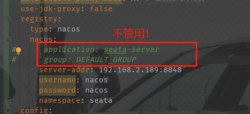
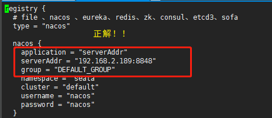

## 1. JWT无状态实现退出登录

描述：jwt本身是无状态的，只能设置过期时间，在过期时间这段时间中无法对jwt进行操作。

解决：把jwt生成的时候往redis中存一份，然后做校验的时候校验redis中的是否一致。或者退出登录的时候把jwt的secret改了，下次登录的时候生成的secret就不一致了，达到退出登录的效果。参考链接：[退出登录1](https://blog.csdn.net/weixin_42970433/article/details/103170301 )  [退出登录2](https://blog.csdn.net/weixin_42970433/article/details/102526722)

## 2.动态数据源循环依赖问题

## 3.security自定义授权模式，栈溢出问题

## 4. shell脚本中执行命令过滤问题

​	

## 5.SecurityContextHolder.getContext().getAuthentication()获取用户信息有时候为空

#### [原理解析](https://blog.csdn.net/yanyundi/article/details/111984303)

首先是在rabbitmq的监听器中新增订单数据失败，然后发现是mybatis-plus自动填充属性获取当前用户为null，(`SecurityContextHolder.getContext().getAuthentication()`获取不到用户登录信息),.然后就想通过`((ServletRequestAttributes) RequestContextHolder.getRequestAttributes()).getResponse()`去获取request中的token信息，然后获取不到，[原因](https://blog.csdn.net/zzy7075/article/details/53559902/）是从threadLocal中获取的，但是rabbitmq监听到消息这个线程是获取不到request的，只能在主线程中获取

## 6.Feign远程调用鉴权失败

原因是feign远程调用会重新构造一个request对象导致请求头信息丢失，解决方法只需要创建一个feign的拦截器，在里面设置请求头信息即可

```java
@Component
public class FeignInterceptor implements RequestInterceptor {

    @Override
    public void apply(RequestTemplate requestTemplate) {
        HttpServletRequest request = WebUtils.getRequest();
        if (request != null) {
            String header = request.getHeader("Authorization");
            requestTemplate.header("Authorization", header);
        }
    }
}
```

## 7.Springboot + Seata出现的问题

1. #### 控制台一直输出nacos的心跳日志

   解决方案：

   1. 去除配置文件中的`namespace：public`配置，如果是public则不需要配置

   2. 调整nacos依赖的version，改成2.1.0

      ```xml
      <dependency>
          <groupId>com.alibaba.cloud</groupId>
          <artifactId>spring-cloud-starter-alibaba-nacos-discovery</artifactId>
          <version>2.1.0.RELEASE</version>
      </dependency>
      <!--服务的配置中心依赖-->
      <dependency>
          <groupId>com.alibaba.cloud</groupId>
          <artifactId>spring-cloud-starter-alibaba-nacos-config</artifactId>
          <version>2.1.0.RELEASE</version>
      </dependency>
      ```

2. #### 在控制台一直输出找不到合适的默认的服务no available service 'default' found, please make sure registry config correct

   [参考链接](https://blog.csdn.net/w1054993544/article/details/107793501)

   查看源码发现seata从nacos上拉取配置的时候，源码中写死了seata服务名和默认的group，两者分别为serverAddr和DEFAULT_GROUP，然后在registry.conf文件中配置的application为seata-server和SEATA_GROUP，所以找不到相应的配置就报错了。

   ​	解决方案：修改registry.conf的application和group即可==（另外: 在application.yml中配置这两项似乎不管用）==，如图：

   ​		 

   ​		 

   

## 8.Easy Excel导出文件在本地生效，在linux上以及Docker容器中失效

* 原因: 在linux和Docker上没有字体

* 解决方案：

  * linux:

    ```
    安装字体包：yum -y install fontconfig
    
    刷新内存中的字体缓存：fc-cache	
    
    查看字体是否安装成功(有一种即可)：fc-list 
    
    重启项目（不必重启服务器）
    ```

  * Docker:

    ```
    在Dockfile中添加
    RUN apk add --update font-adobe-100dpi ttf-dejavu fontconfig
    ```

## 9. 线程池中使用InheritableThreadLocal导致的问题

[参考链接](https://www.cnblogs.com/sweetchildomine/p/6575666.html)	

首先ThreadLocal和InheritableThreadLocal的区别就是，前者不能在子线程中使用，在子线程中获取不到threadLocalMap中的数据，使用后者则可以。因为后者是前者的子类，重写了前者的几个方法如下：

```java
public class InheritableThreadLocal<T> extends ThreadLocal<T> {

    protected T childValue(T parentValue) {
        return parentValue;
    }

    ThreadLocalMap getMap(Thread t) {
       return t.inheritableThreadLocals;
    }

    void createMap(Thread t, T firstValue) {
        t.inheritableThreadLocals = new ThreadLocalMap(this, firstValue);
    }
```

重点是在Thread类中，Thread的构造方法调用init()方法，而init()方法中会判断父线程的inheritableThreadLocals是否为空，不为空就复制一份放到子线程的inheritableThreadLocals中，就完成了在子线程也可以访问父线程的threadLocalMap，实际是复制了一份。

 

在线程池中不可用的原因是因为线程池的复用机制，线程池中线程创建的时候就会复制父线程的inheritableThreadLocals，假设线程池长度为2，此时创建两个线程交给线程池提交执行，这两个线程主要是输出threadLocal的值，然后在创建一个线程修改threadLocals的值并交给线程池执行，把这个操作放到while循环中多执行几次会发现，之前的t1，t2线程中可能会出现修改后的值。是因为线程池回收掉一个线程后，留下的两个线程中有一个是修改后的线程，因为线程的复用，所以执行方法的线程是修改后的，就会输出修改后的值。


