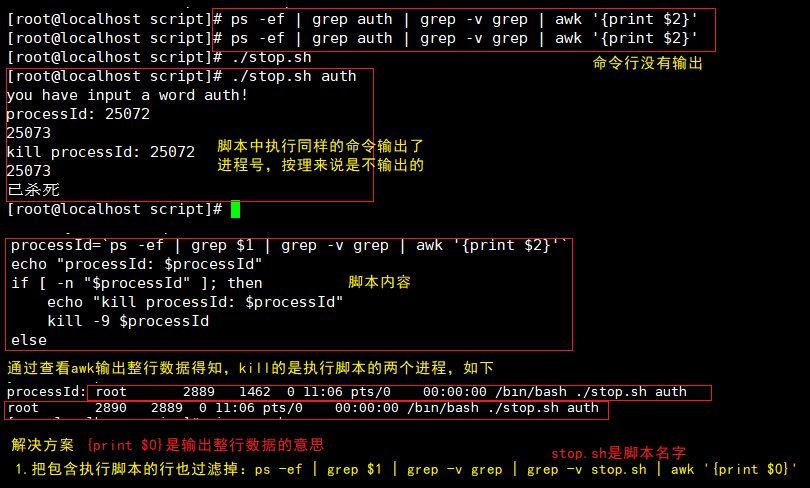

## 1. JWT无状态实现退出登录

#### 描述：jwt本身是无状态的，只能设置过期时间，在过期时间这段时间中无法对jwt进行操作。

#### 解决：把jwt生成的时候往redis中存一份，然后做校验的时候校验redis中的是否一致。或者退出登录的时候把jwt的secret改了，下次登录的时候生成的secret就不一致了，达到退出登录的效果。参考链接：[退出登录1](https://blog.csdn.net/weixin_42970433/article/details/103170301 )  [退出登录2](https://blog.csdn.net/weixin_42970433/article/details/102526722)

## 2.动态数据源循环依赖问题

## 3.security自定义授权模式，栈溢出问题

## 4. shell脚本中执行命令过滤问题

​	

