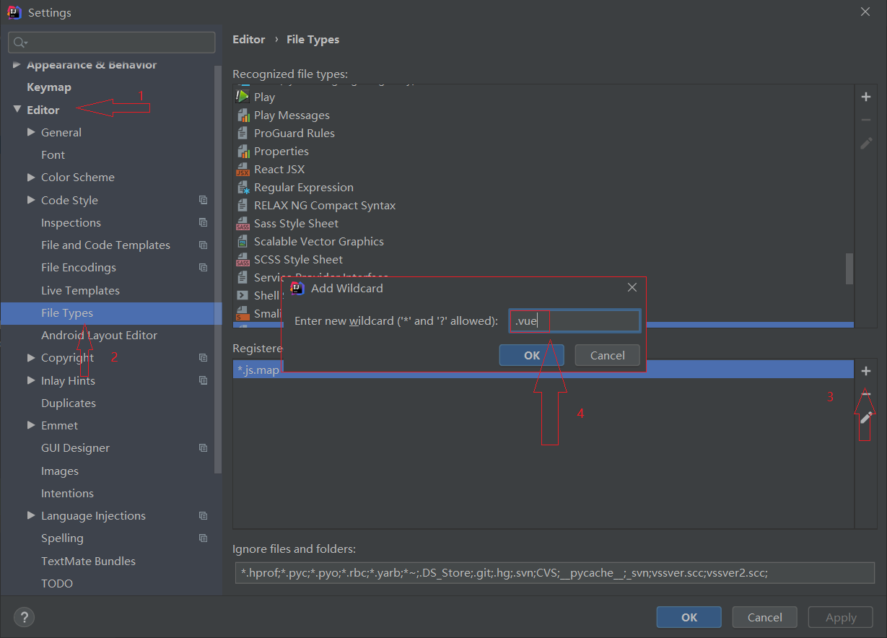
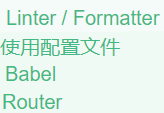
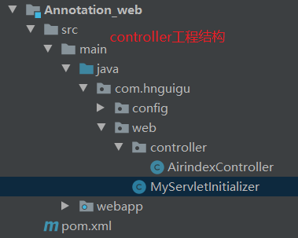
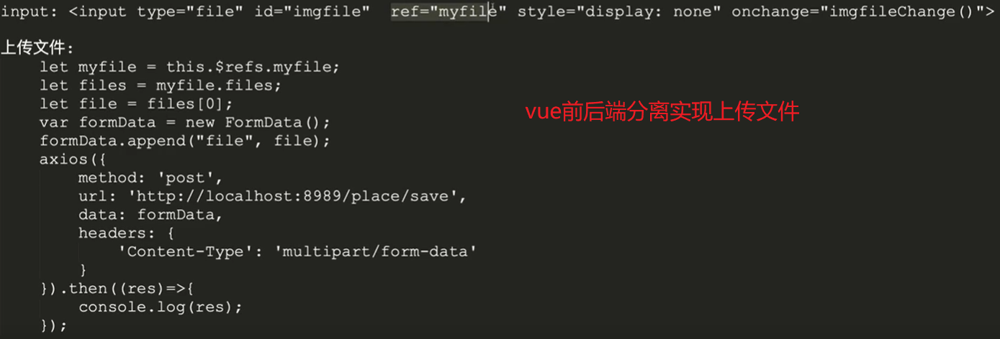
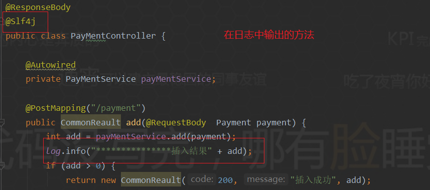

# 学习笔记
###1. SpringMVC设置编码和请求头

	    使用的是@RequestBody 和@RequestMapping这两个注解, 设置@RequestBody, 返回参数是json
	
	
		使用@RequestMapping，这是 springMVC的写法，@RequestMapping("aa"),这个aa就相当于servlet中的action， 在里面设置
		produces="application/json;charset=utf-8"可以把Content-Typeh设置成这个，解决前台拿数据 乱码问题
###2. maven项目clean或其他命令出错时，可能项目的名字是汉字导致的
###3. vue自定义验证规则之只能输入正整数
	1. 现在input输入框中绑定一个  值发生改变就出发的事件 @keyup.native = "aa"
	2.   
		
	   		methods: {
			//      验证只能输入正整数
	      	aa(){
		        this.single_bet_min.value=this.single_bet_min.value.replace(/[^\.\d]/g,'');
		        this.single_bet_min.value=this.single_bet_min.value.replace('.','');
			}

###4. springMVC处理跨域请求，在contorller类上加这个注解

		@CrossOrigin(origins = "*", maxAge = 3600)
###5.在idea上配置vue环境
1. 首先安装 node.js
	* 查看node版本号： **node -v**
	* 查看node安装路径： **where node**
2. 安装阿里镜像和vue-cli
	* 安装镜像： **npm i -g cnpm --registry=https:**
	* 安装cli： 
		
			npm i -g vue-cli  //这个是安装命令
			vue -V //测试是否安装成功：
3. 然后安装webpack打包工具： **cnpm install -g webpack**
4. 使用图形化界面创建vue-cli项目： **在命令行输入：vue ui**
5. 在idea中配置
	* 1.安装vue.js插件
	* 2.配置HTML支持.vue后缀的文件。
	* 
	* 3.配置ECMAScript6
	* 
	* 
	* 然后点击+号，找到npm
	* 
###6.vue图形化页面搭建vue-cli
* 1.打开命令行输入**vue ui**
* 2.这个是第一步要选择的 
* 
* 
* 安装element-ui：插件 => 添加插件 => 搜索element-ui => 点击安装
	* 
* 安装axios： 依赖 => 添加依赖 => 搜索axios => 点击安装
###7.vuex的简单使用
* 先安装vuex： **npm i vuex -S**
* 在mian.js入口函数中引入

		import Vuex from "vuex"
		Vue.use(Vuex)
* 然后建立一个仓库
	
		var store = new Vuex.Store({
			state: {    //用来存储数据
				totalconunt: 1
			},
			mutations: {  //这里面的放啊是用来修改上面属性中的数据的
				updateconunt(state, arg) {
					state.totalcount = arg
				}
			}
		});
* 然后要在vue对象中绑定

		var vue = new Vue({
			el: '#app',
			data: {},
			store: store   //可以简写成store
		})
* 可以通过**this.$store.store.totalcount**来使用state中的参数，通过**this.$store.commit("updateconunt",参数一)**来调用
###8.ssm聚合工程(注解方式)
####1.先建好工程，建好模块，把每一个工程的pom都依赖好，导入jar包，然后开始编写controller层
####2.编写controller
* 
* 1.在controller工程中建包：con.hnguigu.web和com.hnguigu.config
* 2.在web下建一个web工程的启动类MyServletInitializer，相当于disparcatchServlet

		//1.继承下面这个类，实现下面的三个方法
		public class MyServletInitializer extends AbstractAnnotationConfigDispatcherServletInitializer {
		    @Override
		    protected Class<?>[] getRootConfigClasses() {
				//这个相当于application.xml，是大容器
		        return new Class[]{MyRootConfig.class};
		    }
		
		    @Override
		    protected Class<?>[] getServletConfigClasses() {
				//这个相当于springmvc.xml，是小容器，	
		        return new Class[]{MyServletConfig.class};
		    }
		
		    @Override
		    protected String[] getServletMappings() {
				//这个就是拦截所有请求，相当于disparcatchServlet
		        return new String[]{"/"};
		    }
		}
####3.编写MyRootConfig类(大容器)
* 大容器需要的注解

		@Configuration  //标名这是一个配置类 
		@ComponentScan(basePackages = "com.hnguigu") //扫描这里的包
		@MapperScan(basePackages = "com.hnguigu.mapper")//扫描mapper
		@PropertySource(value = "classpath:jdbc.properties")//读jdbc配置文件
		@EnableTransactionManagement //事务相关
* 然后就是把数据源，MybatisSqlSessionFactoryBean， DataSourceTransactionManager加入ioc容器

		@Bean
	    public DataSource getDataSource() {
	        DruidDataSource dataSource = new DruidDataSource();
	        dataSource.setDriverClassName(driver);
	        dataSource.setUrl(url);
	        dataSource.setUsername(username);
	        dataSource.setPassword(password);
	        return  dataSource;
	    }
	
	    @Bean
	    public MybatisSqlSessionFactoryBean getMybatisSqlSessionFactoryBean(DataSource dataSource) {
	        Resource resource = new ClassPathResource("myBatis-config.xml");
	        MybatisSqlSessionFactoryBean factoryBean = new MybatisSqlSessionFactoryBean();
	        factoryBean.setDataSource(dataSource);
	        factoryBean.setConfigLocation(resource);
	        return  factoryBean;
	    }
	
	    @Bean
	    public DataSourceTransactionManager getDataSourceTransactionManager(DataSource dataSource) {
	        DataSourceTransactionManager transactionManager = new DataSourceTransactionManager();
	        transactionManager.setDataSource(dataSource);
	        return transactionManager;
	    }
####4.编写MyServletConfig类(小容器)
* 小容器需要的注解

		@Configuration
		@ComponentScan(basePackages = "com.hnguigu.web.controller")
		@EnableWebMvc
* 配置视图解析器，静态资源过滤器，拦截器， 异常处理解析器，文件上传解析器

		public class MyServletConfig extends WebMvcConfigurerAdapter {//先继承这个类
		//public class MyServletConfig implements WebMvcConfigurer {
		    //视图解析器
		    @Override
		    public void configureViewResolvers(ViewResolverRegistry registry) {
		        registry.jsp("/WEB-INF/pages", ".jsp");
		    }
		
		    //静态资源过滤器
		    @Override
		    public void addResourceHandlers(ResourceHandlerRegistry registry) {
		        registry.addResourceHandler("/js/**").addResourceLocations("/js/");
		        registry.addResourceHandler("/css/**").addResourceLocations("/css/");
		    }
		
			//拦截器
		    @Override
		    public void addInterceptors(InterceptorRegistry registry) {
		        registry.addInterceptor(new HandleInterceptor3())
		                .addPathPatterns("/**")
		                .excludePathPatterns("/Replydetail/*");
		    }
		
		    //异常处理解析器
		    @Override
		    public void configureHandlerExceptionResolvers(List<HandlerExceptionResolver> exceptionResolvers) {
		        exceptionResolvers.add(new CostomExceptionHandle());
		    }
		
		    //文件上传解析器
		    public CommonsMultipartResolver commonsMultipartResolver() {
		        CommonsMultipartResolver commonsMultipartResolver = new CommonsMultipartResolver();
		
		        commonsMultipartResolver.setDefaultEncoding("utf-8");
		        commonsMultipartResolver.setMaxUploadSize(8388608);
		        commonsMultipartResolver.setMaxUploadSizePerFile(3145728);
		
		        return commonsMultipartResolver;
		    }							
		}
###9.SpringBoot项目热部署
####方法1(SpringBoot项目)
####1.ctrl + shift + s 
* 
####2.ctrl + shift + alt + /，选择Registry
* 
####3.在pom文件中导入依赖即可

	<dependency>
        <groupId>org.springframework.boot</groupId>
        <artifactId>spring-boot-devtools</artifactId>
        <optional>true</optional>
    </dependency>
----
####方法2(聚合工程)
###1.在父工程的pom中引入

    <plugins>
      <plugin>
        <groupId>org.apache.maven.plugins</groupId>
        <artifactId>maven-site-plugin</artifactId>
        <configuration>
          <locales>en,fr</locales>
        </configuration>
      </plugin>
    </plugins>
###2.子工程中引入

    <dependency>
        <groupId>org.springframework.boot</groupId>
        <artifactId>spring-boot-devtools</artifactId>
        <scope>runtime</scope>
        <optional>true</optional>
    </dependency>
###3. ctrl + shift + s 
* 
###4. ctrl + shift + alt + /, 选择Registry
* 
###10.@ControllerAdvice的应用场景
####1.全局异常处理
* 使用 @ControllerAdvice 实现全局异常处理，只需要定义类，添加该注解即可定义方式如下：

		@ControllerAdvice
		public class MyGlobalExceptionHandler {
		    @ExceptionHandler(Exception.class)
		    public ModelAndView customException(Exception e) {
		        ModelAndView mv = new ModelAndView();
		        mv.addObject("message", e.getMessage());
		        mv.setViewName("myerror");
		        return mv;
		    }
		}
		@ExceptionHandler 注解用来指明异常的处理类型，即如果这里指定为 NullpointerException，则数组越界异常就不会进到这个方法中来。

####2.全局数据绑定
* 全局数据绑定功能可以用来做一些初始化的数据操作，我们可以将一些公共的数据定义在添加了 @ControllerAdvice 注解的类中，这样，在每一个 Controller 的接口中，就都能够访问导致这些数据。
* 使用步骤，首先定义全局数据，如下：

		@ControllerAdvice
		public class MyGlobalExceptionHandler {
		    @ModelAttribute(name = "md")
		    public Map<String,Object> mydata() {
		        HashMap<String, Object> map = new HashMap<>();
		        map.put("age", 99);
		        map.put("gender", "男");
		        return map;
		    }
		}
* 使用 @ModelAttribute 注解标记该方法的返回数据是一个全局数据，默认情况下，这个全局数据的 key 就是返回的变量名，value 就是方法返回值，当然开发者可以通过 @ModelAttribute 注解的 name 属性去重新指定 key。
* 定义完成后，在任何一个Controller 的接口中，都可以获取到这里定义的数据：

		@RestController
		public class HelloController {
		    @GetMapping("/hello")
		    public String hello(Model model) {
		        Map<String, Object> map = model.asMap();
		        System.out.println(map);
		        int i = 1 / 0;
		        return "hello controller advice";
		    }
		}
###11.CentO6.5不能上网的情况
* 可能是因为本机服务没有开，
* 
###12.ssm+shiro项目搭建过程
####步骤1：导入相关依赖和编写web.xml文件

		<web-app>
		  <!-- 这个参数名作为属性存在于ContextLoader类中，
		            这个类是ContextLoaderListener的父类 -->
		  <context-param>
		    <param-name>contextConfigLocation</param-name>
		    <param-value>classpath:applicationContext-*.xml</param-value>
		  </context-param>
		
		  <!--统一设置编码的过滤器-->
		  <filter>
		    <filter-name>characterEncodingFilter</filter-name>
		    <filter-class>org.springframework.web.filter.CharacterEncodingFilter</filter-class>
		    <init-param>
		      <param-name>encoding</param-name>
		      <param-value>UTF-8</param-value>
		    </init-param>
		    <!-- 无论客户端请求是否包含了编码，都用过滤器里的编码来解析请求 -->
		    <init-param>
		      <param-name>forceEncoding</param-name>
		      <param-value>true</param-value>
		    </init-param>
		  </filter>
		
		  <filter>
		    <filter-name>shiroFilter</filter-name>
		    <filter-class>org.springframework.web.filter.DelegatingFilterProxy</filter-class>
		
		    <!--为spring容器中的bean对象进行代理,可以省略不配置，那么会取filter-name的值-->
		    <init-param>
		      <param-name>targetBeanName</param-name>
		      <param-value>shiroFilter</param-value>
		    </init-param>
		
		    <!--targetFilterLifecycle设置为true，表示将当前过滤器交给web容器管理-->
		    <init-param>
		      <param-name>targetFilterLifecycle</param-name>
		      <param-value>true</param-value>
		    </init-param>
		  </filter>
		
		  <filter-mapping>
		    <filter-name>characterEncodingFilter</filter-name>
		    <url-pattern>/*</url-pattern>
		  </filter-mapping>
		
		  <filter-mapping>
		    <filter-name>shiroFilter</filter-name>
		    <url-pattern>/*</url-pattern>
		  </filter-mapping>
		
		  <!--利用监听器读取spring配置文件,启动Spring容器-->
		  <listener>
		    <listener-class>org.springframework.web.context.ContextLoaderListener</listener-class>
		  </listener>
		
		  <!-- 配置前端控制器，用于接收所有的的请求 -->
		  <servlet>
		    <servlet-name>springmvc</servlet-name>
		    <servlet-class>org.springframework.web.servlet.DispatcherServlet</servlet-class>
		    <init-param>
		      <param-name>contextConfigLocation</param-name>
		      <param-value>classpath:springmvc.xml</param-value>
		    </init-param>
		    <load-on-startup>3</load-on-startup>
		  </servlet>
		  <servlet-mapping>
		    <servlet-name>springmvc</servlet-name>
		    <!-- 千万不能写/*,不能匹配到/*.jsp这样的请求 -->
		    <url-pattern>/</url-pattern>
		  </servlet-mapping>
		</web-app>
####步骤2，编写配置文件applicationcontext-shiro.xml

	<bean id="shiroFilter" class="org.apache.shiro.spring.web.ShiroFilterFactoryBean">
        <property name="securityManager" ref="securityManager"></property>
        <!--1、在没有认证的情况，访问系统的资源，会跳转到此url
            2、如果认证失败了，会跳转到此url-->
        <property name="loginUrl" value="/user/login"></property>

        <property name="filters">
            <map>
                <entry key="authc">
                    <!--<bean class="org.apache.shiro.web.filter.authc.FormAuthenticationFilter"></bean>-->
                    <bean class="com.hnguigu.conpoment.filter.MyFormAuthenticationFilter">
                        <property name="usernameParam" value="userName"/>
                        <property name="passwordParam" value="userPwd"/>
                        <property name="successUrl" value="/index/list"/>
                    </bean>
                </entry>

                <entry key="logout">
                    <bean class="org.apache.shiro.web.filter.authc.LogoutFilter">
                        <property name="redirectUrl" value="/user/login"/>
                    </bean>
                </entry>
            </map>
        </property>

        <property name="filterChainDefinitions">
            <value>
                /js/** anon
                /css/** anon
                /images/** anon

                /user/logout=logout
                /** = authc
            </value>
        </property>

    </bean>

    <bean id="securityManager" class="org.apache.shiro.web.mgt.DefaultWebSecurityManager">
        <property name="realms">
            <list>
                <ref bean="customRealm"></ref>
            </list>
        </property>
    </bean>

    <bean id="customRealm" class="com.hnguigu.conpoment.realm.CustomRealm">
        <property name="credentialsMatcher" ref="credentialsMatcher"/>
	<!--        <property name="cacheManager" ref="ehCacheManager"></property>-->
    </bean>

	<!--    <bean id="ehCacheManager" class="org.apache.shiro.cache.ehcache.EhCacheManager">-->
	<!--        <property name="cacheManagerConfigFile" value="classpath:ehcache.xml"></property>-->
	<!--    </bean>-->

    <bean id="credentialsMatcher" class="org.apache.shiro.authc.credential.HashedCredentialsMatcher">
        <property name="hashAlgorithmName" value="md5"/>
        <property name="hashIterations" value="5"/>
    </bean>
####步骤3，编写domain,service,mapper代码

	@Data         doamin
	@TableName("t_user")
	public class User implements Serializable {
	
	    @TableId("user_id")
	    private Integer user_id;
	    @TableField("userName")
	    private String userName;
	    private String password;
	    private String salt;
	    private String email;
	    private Integer status;
	    private Date createTime;
	    
	}

####步骤4，编写filter,exception,自定义realm
* filter

		public class MyFormAuthenticationFilter extends FormAuthenticationFilter {
		    @Override
		    protected boolean onLoginSuccess(AuthenticationToken token, Subject subject, ServletRequest request, ServletResponse response) throws Exception {
		        //        清楚session中的请求信息
		        WebUtils.getAndClearSavedRequest(request);
		        //重定向到成功页面
		        WebUtils.redirectToSavedRequest(request,response, "/user/index");
		
		        return false;
		    }
		
		    @Override
		    protected boolean isAccessAllowed(ServletRequest request, ServletResponse response, Object mappedValue) {
		
		//        判断是不是访问登录页面
		        if (isLoginRequest(request,response)) {
		//            判断是不是提交登录请求
		            if (isLoginSubmission(request, response)) {
		//                获取当前登录的用户名
		                Subject subject = SecurityUtils.getSubject();
		                String principal = (String) subject.getPrincipal();
		//              获取发请求的信息里的用户名
		                String username = this.getUsername(request);
		                
		//                如果都不为空说明当前登录的用户，且发请求的用户名需要做验证
		                if (username != null && principal != null) {
		//                    把之前登录的账号退出
		                    subject.logout();
		                }
		            }
		        }
		        return super.isAccessAllowed(request, response, mappedValue);
		    }
		}
* exception

		@ControllerAdvice  //处理全局异常
		public class CustExceeptionHandler{
		
		    @ExceptionHandler(Exception.class) //只要有异常，就会被他捕获
		    public AjaxResponse exception(Exception e) {
		        AjaxResponse ajaxResponse = new AjaxResponse();
		        ajaxResponse.setCode(-1);
		        ajaxResponse.setMsg(e.getMessage());
		        return ajaxResponse;
		    }
		}
* 自定义realm

		//    认证
	    @Override
	    protected AuthenticationInfo doGetAuthenticationInfo(AuthenticationToken token) throws AuthenticationException {
	
	        String username = (String) token.getPrincipal();
	        String password = (String) token.getCredentials();
	
	        SimpleAuthenticationInfo authenticationInfo = null;
	        User user = userService.queryByName(username);
	        if (user != null) {
	            ByteSource bytes = ByteSource.Util.bytes(user.getSalt());
	            authenticationInfo = new SimpleAuthenticationInfo(username, password, bytes, getName());
	        }
	
	        return authenticationInfo;
	    }

		//    授权
		    @Override
		    protected AuthorizationInfo doGetAuthorizationInfo(PrincipalCollection principalCollection) {
		
		        String username = (String) principalCollection.getPrimaryPrincipal();
		
		        List<Privilege> privileges = privilegeMapper.queryByUaerName(username);
		
		        ArrayList<String> list = new ArrayList<>();
		        for (Privilege privilege : privileges) {
		            list.add(privilege.getPrivilege_name());
		        }
		
		        SimpleAuthorizationInfo authorizationInfo = new SimpleAuthorizationInfo();
		        authorizationInfo.addStringPermissions(list);
		        return authorizationInfo;
		    }
####步骤5.编写controller

###vue-cli3项目打包
####在项目根目录下创建vue.config.js文件，加入如下配置，然后在cmd窗口cd到项目目录，然后npm run build即可

	const path = require('path')
	const debug = process.env.NODE_ENV !== 'production'
	
	module.exports = {
	  publicPath: process.env.NODE_ENV === 'production' ? './' : '/', // 根域上下文目录
	  outputDir: 'dist', // 构建输出目录
	  assetsDir: 'assets', // 静态资源目录 (js, css, img, fonts)
	  lintOnSave: false, // 是否开启eslint保存检测，有效值：ture | false | error
	  runtimeCompiler: true, // 运行时版本是否需要编译
	  transpileDependencies: [], // 默认babel-loader忽略mode_modules，这里可增加例外的依赖包名
	  productionSourceMap: false, // 是否在构建生产包时生成 sourceMap 文件，false将提高构建速度
	  configureWebpack: config => { // webpack配置，值位对象时会合并配置，为方法时会改写配置
	    if (debug) { // 开发环境配置
	      config.devtool = 'cheap-module-eval-source-map'
	    } else { // 生产环境配置
	    }
	  },
	  devServer: {
	    open: true, //自动启动浏览器
	    host: '0.0.0.0',
	    port: 8081,
	    https: false,
	    hotOnly: false, //webpack已经默认开启，这里false
	    proxy: { // 配置跨域
	      '/api': {
	        target: 'http://127.0.0.1:8080/renewal',  //打包后接口地址
	        ws: true,
	        changOrigin: true,
	        pathRewrite: {
	          '^/api': ''
	        }
	      }
	    },
	    before: app => {}
	  }
	}
###把打包好的vue项目在nginx上跑起来
* 安装nginx，直接解压，然后双击nginx.exe即可启动nginx，
* 然后进入修改nginx的配置文件，/nginx/conf/nginx.conf
* 
* 然后重启nginx，nginx.exe -s reload，最后访问127.0.0.1：端口即可访问项目
###ssm+shiro+vue跨域问题
* 首先在vue项目中main.js中加一句axios.defaults.withCredentials = true，这句话的意思是允许前端携带cookie
* 然后再跨域过滤器中配置一段代码

	    HttpServletResponse  httpServletResponse = (HttpServletResponse) response;
	    HttpServletRequest httpServletRequest = (HttpServletRequest) request;
	
	    httpServletResponse.setHeader("Access-control-Allow-Origin", httpServletRequest.getHeader("Origin")); //标识允许哪个域到请求，直接修改成请求头的域
	    httpServletResponse.setHeader("Access-Control-Allow-Methods", "GET,POST,OPTIONS,PUT,DELETE");//标识允许的请求方法
	    // 响应首部 Access-Control-Allow-Headers 用于 preflight request （预检请求）中，列出了将会在正式请求的 Access-Control-Expose-Headers 字段中出现的首部信息。修改为请求首部
	    httpServletResponse.setHeader("Access-Control-Allow-Headers", httpServletRequest.getHeader("Access-Control-Request-Headers"));
	    httpServletResponse.setContentType("application/json;charset=utf-8");
		//这句是允许接受跨域cookie设置，因为shiro是根据jsessionid作为用户的唯一标识
	    httpServletResponse.setHeader("Access-Control-Allow-Credentials", "true");
	
	    chain.doFilter(request, httpServletResponse);
###nginx反向代理跨域
* nginx配置文件

		server {
	        listen       8082; //前端端口
	        server_name  localhost;
			charset    utf-8; #设置编码为utf-8
	
	        location / {
			
				add_header 'Access-Control-Allow-Origin' '*' always;
				add_header 'Access-Control-Allow-Credentials' 'true' always;
				add_header 'Access-Control-Allow-Methods' 'GET, POST, OPTIONS' always;
				add_header 'Access-Control-Allow-Headers' 'DNT,X-CustomHeader,Keep-Alive,User-Agent,X-Requested-With,If-Modified-Since,Cache-Control,Content-Type' always;
			
	            root   F:\idea-workspace\Shiro\ssm+shiro+vue\ssm+shiro_vue\shiro_vue\dist;
	            index  index.html index.htm;
	        }
			
			location /user/ {
			
				add_header 'Access-Control-Allow-Origin' '*' always;
				add_header 'Access-Control-Allow-Credentials' 'true' always;
				add_header 'Access-Control-Allow-Methods' 'GET, POST, OPTIONS' always;
				add_header 'Access-Control-Allow-Headers' 'DNT,X-CustomHeader,Keep-Alive,User-Agent,X-Requested-With,If-Modified-Since,Cache-Control,Content-Type' always;
			
	            proxy_pass   http://127.0.0.1:8080; # 后端接口 IP:port
	        }

	        error_page   500 502 503 504  /50x.html;
	        	location = /50x.html {
	            root   html;
	        }
	    }
###linux查看某个端口是否使用：lsof -i ：6379
###linux升级内核
	1.导入key
        rpm --import https://www.elrepo.org/RPM-GPG-KEY-elrepo.org, 如果报SSL错误, 则需要更新网络安全服务  yum update nss
	2.安装elrepo的yum源
        到该http://elrepo.org/tiki/tiki-index.php网址找到最新的包, 执行
        rpm -Uvh https://www.elrepo.org/elrepo-release-6-8.el6.elrepo.noarch.rpm
	3.安装内核    
		yum --enablerepo=elrepo-kernel  install  kernel-lt -y
	4. 最后修改引导文件,将默认引导改为0
		vim /etc/grub.conf 将default改成0, 如果原来是0,则改成1. 
	5 最最后 reboot一下, 然后再用uname -a 查看一下内核版本就可以了!!!!!!!!!!!!!!!!!
###docker安装时出现Cannot retrieve metalink for repository: epel. Please verify its path and try again

	解决方法： 一句话：把/etc/yum.repos.d/epel.repo，文件第3行注释去掉，把第四行注释掉。具体如下：
	
	打开/etc/yum.repos.d/epel.repo，将
	
	[epel]
	name=Extra Packages for Enterprise Linux 6 - $basearch
	#baseurl=http://download.fedoraproject.org/pub/epel/6/$basearch
	mirrorlist=https://mirrors.fedoraproject.org/metalink?repo=epel-6&arch=$basearch
	修改为
	
	[epel]
	name=Extra Packages for Enterprise Linux 6 - $basearch
	baseurl=http://download.fedoraproject.org/pub/epel/6/$basearch
	#mirrorlist=https://mirrors.fedoraproject.org/metalink?repo=epel-6&arch=$basearch
	再清理源，重新安装
	
	yum clean all
	yum install -y 需要的包
###centos6.5安装docker报错，docker 已死，但 pid 文件仍存
* 输入命令，然后重启

		命令：yum install device-mapper-event-libs

		重启：/etc/init.d/docker restart
###解决低版本的MySQL客户端的“error 2059: Authentication plugin ‘caching_sha2_password’ cannot be loaded”错误
* 
	1. 用高版本的 MySQL，或者进入该 Docker 容器，登录 MySQL 服务器
	2. 执行 MySQL shell 命令查看服务器的版本：
	
			命令：select version();
			执行结果：
			| version() |
			+-----------+
			| 8.0.16    |
			+-----------+
			1 row in set (0.00 sec)
	3. 查看当前默认的密码认证插件：
	
			命令： show variables like 'default_authentication_plugin';
			
			| Variable_name                 | Value                 |
			+-------------------------------+-----------------------+
			| default_authentication_plugin | caching_sha2_password |
			+-------------------------------+-----------------------+
			1 row in set (0.01 sec)

  	4. 查看当前所有用户绑定的认证插件：
  	
			命令 select host,user,plugin from mysql.user;
 
			+-----------+------------------+-----------------------+
			| host      | user             | plugin                |
			+-----------+------------------+-----------------------+
			| %         | root             | caching_sha2_password |
			| localhost | healthchecker    | caching_sha2_password |
			| localhost | mysql.infoschema | caching_sha2_password |
			| localhost | mysql.session    | caching_sha2_password |
			| localhost | mysql.sys        | caching_sha2_password |
			+-----------+------------------+-----------------------+
			5 rows in set (0.00 sec)
	5. 假如想更改 root 用户的认证方式

			# 修改加密规则
			> ALTER USER 'root'@'%' IDENTIFIED BY 'root' PASSWORD EXPIRE NEVER;
			# 更新用户密码
			> ALTER USER 'root'@'%' IDENTIFIED WITH mysql_native_password BY '123456';
			# 赋予 root 用户最高权限
			> grant all privileges on *.* to root@'%' with grant option;
			# 刷新权限
			> flush privileges;

		注意：在这之后，将不再支持以下的权限授予语句：

		>grant all privileges on *.* to root@'%' identified by '123456' with grant option;
###springboot根据sql脚本建表不成功
* 解决方法：
	* （1） 在application配置文件指定执行sql（静态资源）的地方加上initialization-mode:always即可
	* （2）如果你配置文件没有指定执行文件的名称而是使用默认的schema.sql或者schema-all.sql的话就在配置文件中加上
		>spring.datasource.initialization-mode=always
* 原理：
	* 因为SpringBoot在启动时，只有检测到spring.datasource.initialization-mode=ALWAYS配置，然后再检测spring.datasource.schema，且配置的sql角本命令不为空，才会去执行schema和spring.datasource.data。因此需要在scheme.sql中随便写一句sql语句。
	所以在application.properties/application.yml文件中必须配置spring.datasource.initialization-mode=ALWAYS
###vue前后端分离实现文件上传
* 
###idea将web项目打包成war包
* 
###在nginx上挂载本地文件和本地nginx.conf文件
* [参考文章](https://blog.csdn.net/qq_26614295/article/details/80505246)
* 主要命令

		docker run  --name mynginx -d -p 80:80 
		-v /data/nginx/html:/usr/share/nginx/html 
		-v /data/nginx/conf/nginx.conf:/etc/nginx/nginx.conf 
		-v /data/nginx/conf.d/default.conf:/etc/nginx/conf.d/default.conf  
		-v /data/nginx/logs:/var/log/nginx 
		nginx
		把本地的/data/nginx下的各个文件挂载到nginx上
###springboot整合mybatis-plus和mybatis

	server:
	  port: 8001 #端口号
	
	spring:
	  application:
	    name: cloud-payment-service # 服务名称
	  datasource:
	    type: com.alibaba.druid.pool.DruidDataSource
	    url: jdbc:mysql://localhost:3306/guigu?useUnicode=true&characterEncoding=UTF-8&useSSL=false&serverTimezone=GMT%2B8
	    password: root
	    username: root
	    driver-class-name: com.mysql.cj.jdbc.Driver
	
	整合mybatis(配置这个即可开始使用)
	#mybatis:
	#  mapper-locations: classpath:mapper/*.xml
	#  type-aliases-package: com.hnguigu.springcloud.domain # 实体类所在包名， 会用包名简单映射

	整合mybatis-plus()
	# mybatis-plus相关配置
	mybatis-plus:
	  # xml扫描，多个目录用逗号或者分号分隔（告诉 Mapper 所对应的 XML 文件位置）
	  mapper-locations: classpath:mapper/*.xml
	  # 以下配置均有默认值,可以不设置
	  global-config:
	    db-config:
	      #主键类型 AUTO:"数据库ID自增" INPUT:"用户输入ID",ID_WORKER:"全局唯一ID (数字类型唯一ID)", UUID:"全局唯一ID UUID";
	      id-type: auto
	      #字段策略 IGNORED:"忽略判断"  NOT_NULL:"非 NULL 判断")  NOT_EMPTY:"非空判断"
	      field-strategy: NOT_EMPTY
	      #数据库类型
	      db-type: MYSQL
	  configuration:
	    # 是否开启自动驼峰命名规则映射:从数据库列名到Java属性驼峰命名的类似映射
	    map-underscore-to-camel-case: true
	    # 如果查询结果中包含空值的列，则 MyBatis 在映射的时候，不会映射这个字段
	    call-setters-on-nulls: true
	    # 这个配置会将执行的sql打印出来，在开发或测试的时候可以用
	    log-impl: org.apache.ibatis.logging.stdout.StdOutImpl

2. 配置完yml文件后还需要在主启动类加个扫描注解
* 
3. 编写配置类

		@Configuration
		public class MybatisPlusConfig {
		
		    @Bean
		    public PaginationInterceptor paginationInterceptor() {
		        return new PaginationInterceptor();
		    }
		    
		}
###在日志中输出消息的方法
* 
###使用restTemplate进行远程调用
####1.导入spring相关依赖，
    <dependency>
        <groupId>org.springframework.boot</groupId>
        <artifactId>spring-boot-starter-web</artifactId>
    </dependency>
####2. 建立一个配置类

	@Configuration
	public class ApplicattionContextConfig {
	
	    @Bean
	    public RestTemplate getRestTemplate() {
	        return new RestTemplate();
	    }
	}
####3. 调用
    public static final String URL = "http://localhost:8001";

    @Resource
    private RestTemplate restTemplate;

    @GetMapping("/payment/add")
    public CommonReault<Payment> add(Payment payment) {
        // 三个参数分别是， 要远程调用的url地址， 第二个是参数， 第三个是返回值类型
        return restTemplate.postForObject(URL + "/payment/payment", payment, CommonReault.class);
    }
###centos7的ip是127.0.0.1解决

	vi /etc/sysconfig/network-scripts/ifcfg-ens33
	然后重启
	service network restart
###centos7.0 没有netstat 和 ifconfig, wget命令问题
> yum install net-tools 
> 
> (wget没有的话执行以下命令)
> 
>yum -y install wget
>
>yum -y install setup
>
>yum -y install perl

###Centos7安装docker
####查看内核版本, 要大于3.10
> uname -a
####把yum包更新到最新
> yum update
####安装需要的软件包,yum-util 提供yum-config-manager功能，另外两个是devicemapper驱动依赖的
> yum install -y yum-utils device-mapper-persistent-data lvm2
#### 设置yum源（选择其中一个）
> yum-config-manager --add-repo http://download.docker.com/linux/centos/docker-ce.repo（中央仓库）

> yum-config-manager --add-repo http://mirrors.aliyun.com/docker-ce/linux/centos/docker-ce.repo（阿里仓库）
####查看所有仓库中所有docker版本
> yum list docker-ce --showduplicates | sort -r
####安装docker
> yum install docker-ce-18.03.1.ce
####启动docker
> systemctl start docker
###解决git push时出现Failed to connect to github.com port 443: Timed out
* 把C:\Windows\System32\drivers\etc下的host文件中关于github的都注释掉就可以了
###安装ik分词器，[git地址](https://github.com/medcl/elasticsearch-analysis-ik)

	1. 下载好.zip后缀的文件后使用解压：
	unzip elasticsearch.zip -d ik
	2. 然后把ik文件夹传到容器内部
	docker cp ik 容器名:地址(例如: docker cp ik elasticsearch:/usr/share/elasticsearch/plugins)
	3. 重启elasticsearch容器，然后在kibana中测试，ik分词器中包括了ik_smart和ik_max_word两种
	GET _analyze
	{
	  "analyzer": "ik_smart",
	  "text": "这是一个对分词器的测试"
	}
	区别：
		ik_max_word：这是/一个/一/个/对分/分词器/分词/词/器/测试
		ik_smart：这是/一个/分词器/测试
		standard：这/是/一/个/对/分/词/器/的/测/试
###解决mybatis一级缓存导致数据不显示，前端显示ref问题
* 
* 解决方法： 

		IPage<InsuranceServiceApplyInfoVo> insuranceServiceApplyInfoVoIPage = provider.selectPageVo(pageVo);
        insuranceServiceApplyInfoVoIPage.getRecords().stream().forEach(item -> {
            if (null != item.getInsuranceProductInfoVo()) {
                item.setInsuranceProductInfoVo(new InsuranceProductInfoVo(item.getInsuranceProductInfoVo()));
            }
        });
        return provider.selectPageVo(pageVo);
		把可能会出现重复对象的对象重新new一遍，就不会使它们的引用地址指向同一个对象了，然后再vo类中添加一个新的构造方法即可

###[安装jenkins离线问题](https://blog.csdn.net/qq_34395857/article/details/94635653?utm_medium=distribute.pc_relevant.none-task-blog-BlogCommendFromMachineLearnPai2-3.control&depth_1-utm_source=distribute.pc_relevant.none-task-blog-BlogCommendFromMachineLearnPai2-3.control)
###Nginx配置下载服务器和图片服务器
####图片服务器
	location ~ .*\.(gif|jpg|jpeg|png)$ {  
	    expires 24h;  
	      root /home/hy/nginx_download/user/img;#指定图片存放路径  
	      access_log /home/hy/nginx_download/logs/images.log;#日志存放路径  
	      proxy_store on;  
	      proxy_store_access user:rw group:rw all:rw;  
	      proxy_temp_path     /home/hy/nginx_download/user/img;#图片访问路径  
	      proxy_redirect     off;  
	      proxy_set_header    Host 127.0.0.1;  
	      client_max_body_size  10m;  
	      client_body_buffer_size 1280k;  
	      proxy_connect_timeout  900;  
	      proxy_send_timeout   900;  
	      proxy_read_timeout   900;  
	      proxy_buffer_size    40k;  
	      proxy_buffers      40 320k;  
	      proxy_busy_buffers_size 640k;  
	      proxy_temp_file_write_size 640k;  
	      if ( !-e $request_filename)  
	      {  
	         proxy_pass http://127.0.0.1;#默认80端口  
	      }  
	  }
####下载服务器
	
	location /model {
        charset  utf-8;
        root /home/hy/nginx_download/user; #配置下载文件的路径
    	#alias /data/download/;

		// 下载文件后缀为txt的
        if ($request_filename ~* ^.*?\.(txt)$){
        	add_header Content-Disposition 'attachment';
        	add_header Content-Type: 'APPLICATION/OCTET-STREAM';
		}

        autoindex on; // 打开目录浏览功能，为on则会显示文件列表，为off就显示403
        autoindex_exact_size   off; // 显示文件大小
        autoindex_localtime    on; // 显示文件时间
		// 记录日志的地方，main表示使用默认的日志模板，可以使用log_format自定义模板
    	access_log  /home/hy/nginx_download/logs/download.log  main; 
    }
	
* 

